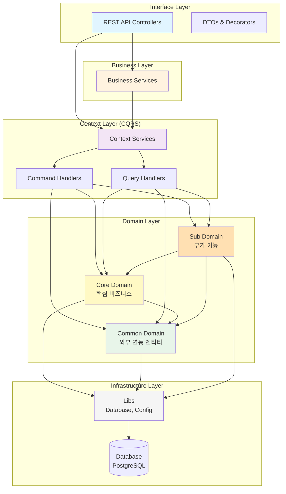

# 루미르 컨텐츠 관리 시스템 (Lumir Contents Management System)

> NestJS 기반의 사내 컨텐츠 관리 시스템

## 📋 프로젝트 소개

루미르 컨텐츠 관리 시스템은 사내 공지사항, 주주총회, 전자공시, 교육 등 회사에서 발생하는 이벤트들의 콘텐츠를 관리하는 시스템입니다. Domain-Driven Design과 CQRS 패턴을 적용하여 확장 가능하고 유지보수가 용이한 구조로 설계되었습니다.

### 주요 기능

(추가 예정)

## 🏗️ 아키텍처

### 레이어드 아키텍처



### 의존성 규칙

```
Interface → Business → Context → Domain → Infrastructure
    ↓          ↓          ↓          ↓
   DTO      조합 로직   CQRS      엔티티      Database
```

**도메인 간 의존성:**

- ✅ Core Domain → Common Domain
- ✅ Sub Domain → Core Domain, Common Domain
- ❌ Common Domain → Core/Sub Domain
