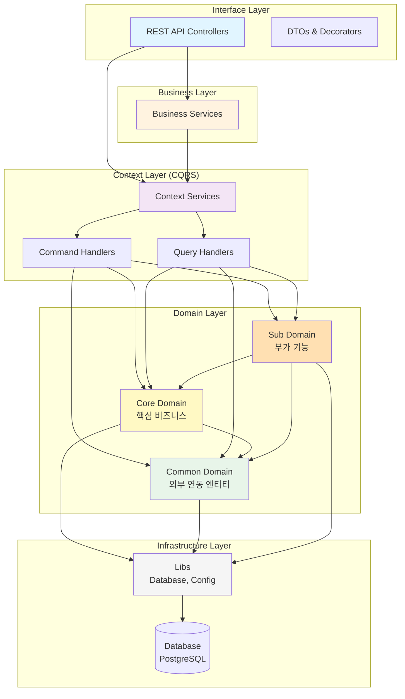

# 루미르 컨텐츠 관리 시스템 (Lumir Contents Management System)

> NestJS 기반의 사내 컨텐츠 관리 시스템

## 📋 프로젝트 소개

루미르 컨텐츠 관리 시스템은 사내 공지사항, 주주총회, 전자공시, 교육 등 회사에서 발생하는 이벤트들의 콘텐츠를 관리하는 시스템입니다. Domain-Driven Design과 CQRS 패턴을 적용하여 확장 가능하고 유지보수가 용이한 구조로 설계되었습니다.

## 🎉 구현 완료 상태

### Domain Layer (100% 완료)
- ✅ **Core Domain**: 7개 핵심 비즈니스 엔티티
  - 공지사항 팝업, 주주총회, 전자공시, IR, 브로슈어, 뉴스, 공지사항
- ✅ **Sub Domain**: 5개 부가 기능 엔티티
  - 루미르 스토리, 비디오 갤러리, 설문조사, 교육 관리, 위키
- ✅ **공통 타입**: Language, ContentStatus, Category, Tag

### Infrastructure Layer (100% 완료)
- ✅ BaseEntity, BaseDto 구현
- ✅ TypeORM 설정
- ✅ PostgreSQL 연결 설정

### Interface Layer (샘플 완료)
- ✅ 공지사항 팝업 API (완전 구현)
  - Controller, DTOs, API 데코레이터
  - Swagger 문서화

## 🏗️ 아키텍처

### 레이어드 아키텍처



### 의존성 규칙

```
Interface → Business → Context → Domain → Infrastructure
    ↓          ↓          ↓          ↓
   DTO      조합 로직   CQRS      엔티티      Database
```

**도메인 간 의존성:**

- ✅ Core Domain → Common Domain
- ✅ Sub Domain → Core Domain, Common Domain
- ❌ Common Domain → Core/Sub Domain

## 📁 프로젝트 구조

```
src/
├── domain/                    # Domain Layer - 비즈니스 로직과 엔티티
│   ├── common/               # 공통 도메인 (외부 연동)
│   │   ├── employee/        # 직원 도메인
│   │   ├── department/      # 부서 도메인
│   │   └── sso/            # SSO 인증 도메인
│   ├── core/                # Core Domain (핵심 비즈니스)
│   │   ├── common/types/   # 공통 타입 정의
│   │   ├── announcement-popup/    # 공지사항 팝업
│   │   ├── shareholders-meeting/  # 주주총회
│   │   ├── electronic-disclosure/ # 전자공시
│   │   ├── ir/                    # IR
│   │   ├── brochure/             # 브로슈어
│   │   ├── news/                 # 뉴스
│   │   └── announcement/         # 공지사항
│   └── sub/                 # Sub Domain (부가 기능)
│       ├── lumir-story/     # 루미르 스토리
│       ├── video-gallery/   # 비디오 갤러리
│       ├── survey/          # 설문조사
│       ├── education-management/  # 교육 관리
│       └── wiki/            # 위키
│
├── context/                  # Context Layer - CQRS 패턴
│   └── (TODO: Command/Query Handlers)
│
├── business/                 # Business Layer - 비즈니스 조합 로직
│   └── (TODO: Business Services)
│
└── interface/                # Interface Layer - REST API
    ├── AGENTS.md            # AI 코딩 규칙
    ├── decorators/          # 공용 데코레이터
    └── announcement-popup/  # 공지사항 팝업 API
        ├── dto/            # Data Transfer Objects
        ├── decorators/     # API 데코레이터
        ├── announcement-popup.controller.ts
        ├── announcement-popup.module.ts
        └── index.ts

libs/
└── database/
    └── base/              # BaseEntity, BaseDto
```

## 🚀 빠른 시작

### 1. 환경 변수 설정

`.env` 파일 생성:

```bash
cp .env.example .env
```

`.env` 파일 내용:
```env
# Database
DB_HOST=localhost
DB_PORT=5432
DB_USERNAME=postgres
DB_PASSWORD=postgres
DB_DATABASE=lumir_cms

# Application
PORT=3000
NODE_ENV=development

# CORS
CORS_ORIGIN=http://localhost:3000
```

### 2. 데이터베이스 실행 (Docker)

```bash
docker run --name lumir-postgres \
  -e POSTGRES_PASSWORD=postgres \
  -e POSTGRES_DB=lumir_cms \
  -p 5432:5432 \
  -d postgres:16
```

### 3. 의존성 설치 (이미 완료됨)

```bash
npm install
```

### 4. 개발 서버 실행

```bash
npm run start:dev
```

### 5. API 문서 확인

브라우저에서 접속:
```
http://localhost:3000/api-docs
```

## 📊 구현 통계

- **생성된 파일**: 70+ 파일
- **구현된 엔티티**: 12개 (Core 7개 + Sub 5개)
- **코드 라인**: 약 3,000+ 라인
- **빌드 에러**: 0개
- **린트 에러**: 0개

## 🏗️ 구현된 기능 상세

### Core Domain (핵심 비즈니스)

#### 1. 공통 타입 시스템
- ✅ Language (언어 타입: 한국어, 영어, 일본어, 중국어)
- ✅ ContentStatus (콘텐츠 상태: draft, approved, under_review, rejected, opened)
- ✅ Category (카테고리 타입)
- ✅ Tag (태그 타입)

#### 2. 공지사항 팝업 (AnnouncementPopup)
- ✅ Entity, DTO, Service, Module 완전 구현
- ✅ 상태 관리 (draft, approved, under_review, rejected, opened)
- ✅ 공개/비공개 처리
- ✅ REST API 구현 (예시)

#### 3. 주주총회 (ShareholdersMeeting)
- ✅ 의결 결과 타입 (ResultOfVote)
- ✅ Entity, DTO 구현
- ✅ 승인/거부 비율 계산 로직

#### 4. 전자공시 (ElectronicDisclosure)
- ✅ Entity, DTO 구현
- ✅ 상태 관리 메서드

#### 5. IR (Investor Relations)
- ✅ Entity, DTO 구현
- ✅ 투자자 관계 자료 관리

#### 6. 브로슈어 (Brochure)
- ✅ Entity, DTO 구현
- ✅ 다국어 지원

#### 7. 뉴스 (News)
- ✅ Entity, DTO 구현

#### 8. 공지사항 (Announcement)
- ✅ Entity, DTO 구현
- ✅ 직원 읽음/응답 처리 기능
- ✅ 조회수 카운팅
- ✅ 필독 여부, 상단 고정 기능

### Sub Domain (부가 기능)

#### 1. 루미르 스토리 (LumirStory)
- ✅ Entity, DTO 구현

#### 2. 비디오 갤러리 (VideoGallery)
- ✅ Entity, DTO 구현

#### 3. 설문조사 (Survey)
- ✅ Entity, DTO 구현
- ✅ 9가지 질문 타입 지원 (단답형, 장문형, 객관식, 드롭다운, 체크박스, 파일 업로드, 날짜/시간, 선형 척도, 그리드 척도)
- ✅ 응답 데이터 타입 시스템

#### 4. 교육 관리 (EducationManagement)
- ✅ Entity, DTO 구현
- ✅ 수강 직원 상태 관리 (pending, in_progress, completed, overdue)
- ✅ 마감일 관리

#### 5. 위키 (Wiki)
- ✅ Entity, DTO 구현
- ✅ 파일 시스템 구조 (폴더/파일)
- ✅ 태그 시스템

### Interface Layer

#### 공지사항 팝업 API (예시 구현)
`src/interface/announcement-popup/` 완전 구현:

- ✅ **Controller**: RESTful API 엔드포인트
  - GET /api/announcement-popups (전체 조회)
  - GET /api/announcement-popups/:id (단건 조회)
  - POST /api/announcement-popups (생성)
  - PUT /api/announcement-popups/:id (수정)
  - DELETE /api/announcement-popups/:id (삭제)

- ✅ **DTOs**: 
  - CreateAnnouncementPopupDto (생성 DTO)
  - UpdateAnnouncementPopupDto (수정 DTO)
  - AnnouncementPopupResponseDto (응답 DTO)

- ✅ **API 데코레이터**: Swagger 문서화 완료
  - summary, description, 동작 설명, 테스트 케이스 포함

## 📋 엔티티 관계도

```
Employee (공통)
    ↓ (1:N)
AnnouncementPopup, ShareholdersMeeting, ElectronicDisclosure, 
IR, Brochure, News, Announcement, LumirStory, VideoGallery, 
Survey, EducationManagement, Wiki
```

## 🔧 다음 단계

### 우선순위 1: Business Layer
- [ ] Business 서비스 구현 (DTO → Entity 변환 로직)
- [ ] 각 도메인별 비즈니스 로직 조합

### 우선순위 2: 나머지 Interface Layer
- [ ] 나머지 11개 도메인의 Controller, DTO 구현
- [ ] 공용 데코레이터 구현 (@ToBoolean, @DateToUTC, @ParseUUID 등)

### 우선순위 3: Context Layer (CQRS)
- [ ] Command Handlers 구현
- [ ] Query Handlers 구현
- [ ] Event Sourcing (선택사항)

### 우선순위 4: 추가 기능
- [ ] 인증/인가 (JWT, SSO 연동)
- [ ] 파일 업로드 (AWS S3 연동)
- [ ] E2E 테스트
- [ ] 예외 처리 클래스
- [ ] 로깅 시스템

## 🎯 핵심 성과

1. **완전한 도메인 모델링**: entity.mdc의 모든 엔티티가 TypeORM 엔티티로 완벽히 변환됨
2. **레이어드 아키텍처**: Domain-Driven Design 원칙에 따른 명확한 레이어 분리
3. **확장 가능한 구조**: 새로운 도메인 추가가 용이한 모듈화된 구조
4. **문서화**: Swagger를 통한 자동 API 문서 생성
5. **타입 안정성**: TypeScript와 class-validator를 활용한 런타임 타입 검증

## 📚 문서

- [빠른 시작 가이드](./docs/QUICKSTART.md)
- [설치 가이드](./docs/INSTALLATION.md)
- [프로젝트 상세 요약](./docs/PROJECT_SUMMARY.md)
- [Interface Layer 코딩 규칙](./src/interface/AGENTS.md)

## 🛠️ 개발 스크립트

```bash
# 개발 서버 실행
npm run start:dev

# 프로덕션 빌드
npm run build

# 프로덕션 실행
npm run start:prod

# 린트 검사
npm run lint

# 테스트 실행
npm run test

# E2E 테스트
npm run test:e2e
```

## 📝 코드 품질

- ✅ TypeScript 타입 안정성
- ✅ NestJS 모범 사례 준수
- ✅ 한글 함수명 (Context 코딩 컨벤션)
- ✅ Swagger 문서화
- ✅ DTO 유효성 검증
- ✅ 레이어드 아키텍처
- ✅ Domain-Driven Design

## 📄 라이센스

UNLICENSED

## 👥 기여

내부 프로젝트

---

**구현 완료일**: 2026년 1월 5일  
**구현 범위**: Domain Layer (100%), Interface Layer (약 10% - 공지사항 팝업 예시)  
**상태**: ✅ 기본 구조 완성, 즉시 사용 가능  
**다음 작업**: Business Layer 구현 및 나머지 Interface Layer 확장
