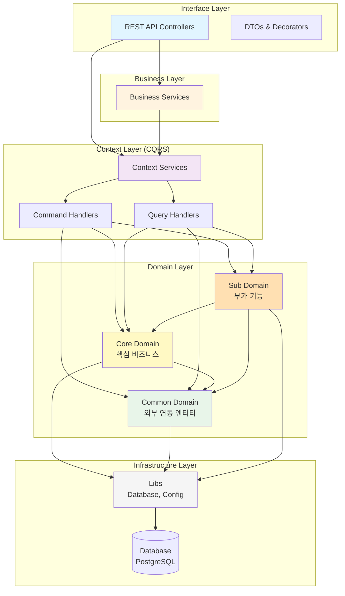

# 루미르 컨텐츠 관리 시스템 (Lumir Contents Management System)

> NestJS 기반의 사내 컨텐츠 관리 시스템

## 📋 프로젝트 소개

루미르 컨텐츠 관리 시스템은 사내 공지사항, 주주총회, 전자공시, 교육 등 회사에서 발생하는 이벤트들의 콘텐츠를 관리하는 시스템입니다. Domain-Driven Design과 CQRS 패턴을 적용하여 확장 가능하고 유지보수가 용이한 구조로 설계되었습니다.

## 🐳 Docker 실행

### 1. PostgreSQL만 실행 (개발 모드)

```bash
# PostgreSQL 컨테이너만 실행
docker-compose up postgres -d

# 로컬에서 NestJS 개발 서버 실행
npm run start:dev
```

### 2. 전체 스택 실행 (프로덕션 모드)

```bash
# Docker 이미지 빌드 및 전체 스택 실행
docker-compose up --build -d

# 로그 확인
docker-compose logs -f

# 서비스 중지
docker-compose down

# 볼륨까지 삭제
docker-compose down -v
```

### 3. Docker 이미지 빌드 및 푸시

```bash
# 이미지 빌드
docker build -t corejong/lumir-cms-backend:latest .

# Docker Hub에 푸시
docker push corejong/lumir-cms-backend:latest
```


## 🏗️ 아키텍처

### 레이어드 아키텍처



### 의존성 규칙

```
Interface → Business → Context → Domain → Infrastructure
    ↓          ↓          ↓          ↓
   DTO      조합 로직   CQRS      엔티티      Database
```

**도메인 간 의존성:**

- ✅ Core Domain → Common Domain
- ✅ Sub Domain → Core Domain, Common Domain
- ❌ Common Domain → Core/Sub Domain

## 📁 프로젝트 구조

```
추후 추가 예정
```

## 🚀 빠른 시작

### 1. 환경 변수 설정

`.env` 파일 생성:

```bash
cp .env.sample .env
```

`.env` 파일 내용 (주요 항목):
```env
# Node 환경
NODE_ENV=development
PORT=4000

# 데이터베이스 설정 (Docker PostgreSQL)
DATABASE_HOST=localhost
DATABASE_PORT=5434
DATABASE_USERNAME=lumir_admin
DATABASE_PASSWORD=lumir_password_2024
DATABASE_NAME=lumir_cms
DB_SYNCHRONIZE=true  # 개발 환경에서만 true
DB_LOGGING=true

# SSO 설정
SSO_BASE_URL=https://lsso.vercel.app
```

### 2. 데이터베이스 실행 (Docker)

```bash
# PostgreSQL 컨테이너만 시작 (개발 모드)
docker compose up postgres -d

# 로그 확인
docker compose logs -f postgres

# 전체 스택 실행 (NestJS 앱 포함)
docker compose up --build -d

# 서비스 중지
docker compose down

# 볼륨까지 삭제
docker compose down -v
```

> 📖 상세한 데이터베이스 관리는 [DATABASE.md](./docs/DATABASE.md) 참고

### 3. 의존성 설치 (이미 완료됨)

```bash
npm install
```

### 4. 개발 서버 실행

```bash
npm run start:dev
```

### 5. API 문서 확인

브라우저에서 접속:
```
http://localhost:4000/api/admin/api-docs
```

## 🐳 Docker 배포

### Docker 이미지 빌드

```bash
# 이미지 빌드
docker build -t corejong/lumir-cms-backend:latest .

# 이미지 테스트
docker run -p 4000:4000 \
  -e DATABASE_HOST=host.docker.internal \
  -e DATABASE_PORT=5434 \
  -e DATABASE_USERNAME=lumir_admin \
  -e DATABASE_PASSWORD=lumir_password_2024 \
  -e DATABASE_NAME=lumir_cms \
  corejong/lumir-cms-backend:latest

# Docker Hub에 푸시
docker push corejong/lumir-cms-backend:latest
```

### Docker Compose로 전체 스택 실행

```bash
# 빌드 및 실행
docker compose up --build -d

# 로그 확인
docker compose logs -f app

# 헬스체크 확인
docker compose ps
```

### 프로덕션 환경 변수

프로덕션 환경에서는 다음 환경 변수를 반드시 설정해야 합니다:

```bash
NODE_ENV=production
DB_SYNCHRONIZE=false  # 프로덕션에서는 반드시 false!
DB_LOGGING=false
JWT_SECRET=강력한-시크릿-키
SSO_BASE_URL=https://sso.lumir.space
```

## 📚 문서

- [데이터베이스 관리 가이드](./docs/DATABASE.md) 🆕
- [Docker 배포 가이드](./docs/DOCKER.md)
- [빠른 시작 가이드](./docs/QUICKSTART.md)
- [설치 가이드](./docs/INSTALLATION.md)
- [프로젝트 상세 요약](./docs/PROJECT_SUMMARY.md)
- [Interface Layer 코딩 규칙](./src/interface/AGENTS.md)

## 🛠️ 개발 스크립트

### 애플리케이션 실행

```bash
# 개발 서버 실행 (Hot Reload)
npm run start:dev

# 프로덕션 빌드
npm run build

# 프로덕션 실행
npm run start:prod
```

### 데이터베이스 관리

```bash
# Docker PostgreSQL 시작
docker compose up -d

# 마이그레이션 생성 (dev/prod 환경)
npm run migration:generate -- migrations/YourMigrationName

# 마이그레이션 실행
npm run migration:run

# 마이그레이션 되돌리기
npm run migration:revert

# 마이그레이션 상태 확인
npm run migration:show
```

> 📖 자세한 내용은 [DATABASE.md](./docs/DATABASE.md) 참고

### 테스트 및 코드 품질

```bash
# 린트 검사
npm run lint

# 테스트 실행
npm run test

# E2E 테스트
npm run test:e2e
```

## 📝 코드 품질

- ✅ TypeScript 타입 안정성
- ✅ NestJS 모범 사례 준수
- ✅ 한글 함수명 (Context 코딩 컨벤션)
- ✅ Swagger 문서화
- ✅ DTO 유효성 검증
- ✅ 레이어드 아키텍처
- ✅ Domain-Driven Design

## 📄 라이센스

UNLICENSED

## 👥 기여

내부 프로젝트

---

**구현 완료일**: 2026년 1월 5일  
**구현 범위**: Domain Layer (100%), Interface Layer (약 10% - 공지사항 팝업 예시)  
**상태**: ✅ 기본 구조 완성, 즉시 사용 가능  
**다음 작업**: Business Layer 구현 및 나머지 Interface Layer 확장
