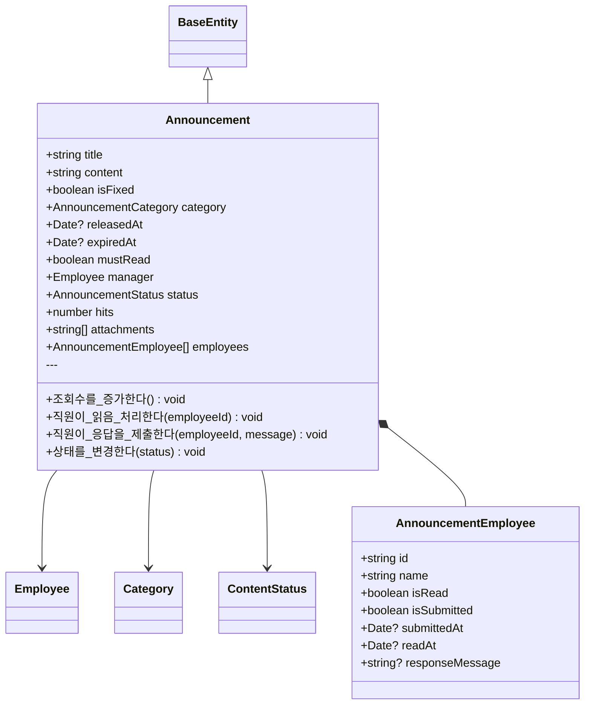

# 루미르 CMS 엔티티 다이어그램

> 작성일: 2025-01-06  
> 버전: 1.0.0

## 목차

1. [개요](#개요)
2. [공통 타입 (Common Types)](#공통-타입-common-types)
3. [공통 도메인 (Common Domain)](#공통-도메인-common-domain)
4. [핵심 도메인 (Core Domain)](#핵심-도메인-core-domain)
5. [부가 도메인 (Sub Domain)](#부가-도메인-sub-domain)
6. [관계 다이어그램](#관계-다이어그램)
7. [데이터베이스 스키마](#데이터베이스-스키마)

---

## 개요

루미르 CMS 백엔드의 도메인 엔티티 구조를 시각화한 문서입니다.

### 도메인 구조

```
src/domain/
├── common/          # 공통 도메인 (직원, 부서, SSO, 알림 등)
├── core/            # 핵심 비즈니스 도메인
│   ├── common/      # 공통 타입 (Language, Category, Status, Tag)
│   ├── announcement-popup/
│   ├── announcement/
│   ├── shareholders-meeting/
│   ├── electronic-disclosure/
│   ├── ir/
│   ├── brochure/
│   └── news/
└── sub/             # 부가 기능 도메인
    ├── education-management/
    ├── lumir-story/
    ├── survey/
    ├── video-gallery/
    └── wiki/
```

---

## 공통 타입 (Common Types)

### Language (언어)


### ContentStatus (콘텐츠 상태)


**사용처**: Announcement, ElectronicDisclosure, IR, Brochure, LumirStory, VideoGallery, News, Survey

### Category (카테고리)


**별칭 타입**:
- `AnnouncementCategory`
- `ShareholdersMeetingCategory`
- `ElectronicDisclosureCategory`
- `IRCategory`
- `BrochureCategory`
- `LumirStoryCategory`
- `VideoGalleryCategory`
- `NewsCategory`
- `SurveyCategory`

### Tag (태그)


### BaseEntity (기본 엔티티)


---

## 공통 도메인 (Common Domain)

### Employee (직원)


### Department (부서)


---

## 핵심 도메인 (Core Domain)

### AnnouncementPopup (공지사항 팝업)


### Announcement (공지사항)



### ShareholdersMeeting (주주총회)


### ElectronicDisclosure (전자공시)


### IR (투자자 관계)


### Brochure (브로슈어)


### News (뉴스)


---

## 부가 도메인 (Sub Domain)

### LumirStory (루미르 스토리)


### VideoGallery (비디오 갤러리)


### Survey (설문조사)


### EducationManagement (교육 관리)


### Wiki (위키)


---

## 관계 다이어그램

### 전체 엔티티 관계도 (ERD)


### 공통 타입 사용 관계

```mermaid
graph TD
    Language[Language 언어]
    Category[Category 카테고리]
    Tag[Tag 태그]
    Status[ContentStatus 상태]
    
    Language --> AnnouncementPopup
    Language --> ShareholdersMeeting
    Language --> ElectronicDisclosure
    Language --> IR
    Language --> Brochure
    
    Category --> AnnouncementPopup
    Category --> Announcement
    Category --> ShareholdersMeeting
    Category --> ElectronicDisclosure
    Category --> IR
    Category --> Brochure
    Category --> News
    Category --> LumirStory
    Category --> VideoGallery
    Category --> Survey
    
    Tag --> AnnouncementPopup
    Tag --> ShareholdersMeeting
    Tag --> ElectronicDisclosure
    Tag --> IR
    Tag --> Brochure
    Tag --> News
    Tag --> LumirStory
    Tag --> VideoGallery
    
    Status --> AnnouncementPopup
    Status --> Announcement
    Status --> ElectronicDisclosure
    Status --> IR
    Status --> Brochure
    Status --> News
    Status --> LumirStory
    Status --> VideoGallery
    Status --> Survey
```

---

## 데이터베이스 스키마

### 공통 필드 (모든 테이블)

모든 엔티티는 `BaseEntity`를 상속받아 다음 필드를 공통으로 포함합니다:

| 필드명 | 타입 | NULL | 설명 |
|--------|------|------|------|
| id | UUID | NO | 기본키 |
| created_at | TIMESTAMP | NO | 생성 일시 |
| updated_at | TIMESTAMP | NO | 수정 일시 |
| deleted_at | TIMESTAMP | YES | 삭제 일시 (Soft Delete) |
| created_by | VARCHAR | YES | 생성자 ID |
| updated_by | VARCHAR | YES | 수정자 ID |
| version | INTEGER | NO | 낙관적 락 버전 |

### 테이블 목록

#### Common Domain
- `employee` - 직원
- `department` - 부서

#### Core Domain
- `announcement_popup` - 공지사항 팝업
- `announcement` - 공지사항
- `shareholders_meeting` - 주주총회
- `electronic_disclosure` - 전자공시
- `ir` - 투자자 관계
- `brochure` - 브로슈어
- `news` - 뉴스

#### Sub Domain
- `lumir_story` - 루미르 스토리
- `video_gallery` - 비디오 갤러리
- `survey` - 설문조사
- `education_management` - 교육 관리
- `wiki` - 위키

### JSONB 필드 사용

다음 필드들은 PostgreSQL의 JSONB 타입으로 저장됩니다:

- `category` (Category)
- `language` (Language)
- `tags` (Tag[])
- `resultOfVote` (ResultOfVote)
- `employees` (AnnouncementEmployee[])
- `inqueries` (Inquery[])
- `attendees` (Attendee[])
- `fileSystem` (WikiFileSystem)

### 외래키 관계

```sql
-- 대부분의 엔티티가 Employee를 참조
ALTER TABLE announcement_popup 
  ADD CONSTRAINT fk_announcement_popup_manager 
  FOREIGN KEY (manager_id) REFERENCES employee(id);

ALTER TABLE announcement 
  ADD CONSTRAINT fk_announcement_manager 
  FOREIGN KEY (manager_id) REFERENCES employee(id);

-- Department의 자기 참조
ALTER TABLE department 
  ADD CONSTRAINT fk_department_parent 
  FOREIGN KEY (parent_department_id) REFERENCES department(external_id);
```

### 인덱스

```sql
-- Employee 고유 인덱스
CREATE UNIQUE INDEX idx_employee_external_id ON employee(external_id);
CREATE UNIQUE INDEX idx_employee_number ON employee(employee_number);
CREATE UNIQUE INDEX idx_employee_email ON employee(email);

-- Department 고유 인덱스
CREATE UNIQUE INDEX idx_department_external_id ON department(external_id);

-- 성능 최적화 인덱스
CREATE INDEX idx_announcement_status ON announcement(status);
CREATE INDEX idx_announcement_released_at ON announcement(released_at);
CREATE INDEX idx_employee_department_id ON employee(department_id);
CREATE INDEX idx_department_parent_id ON department(parent_department_id);
```

---

## 엔티티 특성 요약

### 공통 패턴

1. **BaseEntity 상속**
   - 모든 엔티티는 `BaseEntity<T>`를 상속
   - 공통 메타데이터 필드 포함
   - `DTO로_변환한다()` 메서드 구현

2. **Employee 참조**
   - 대부분의 엔티티가 `manager: Employee` 필드 보유
   - ManyToOne 관계로 매핑

3. **JSONB 활용**
   - Category, Language, Tag 등은 JSONB로 저장
   - 유연한 구조 변경 가능
   - PostgreSQL의 JSONB 인덱싱 활용

4. **Soft Delete**
   - `deletedAt` 필드로 소프트 삭제 지원
   - 물리적 삭제 대신 논리적 삭제

5. **낙관적 락**
   - `version` 필드로 동시성 제어
   - TypeORM의 @VersionColumn 사용

### 도메인별 특징

#### Core Domain (핵심 비즈니스)
- 다국어 지원 (Language)
- 카테고리 분류 (Category)
- 태그 시스템 (Tag)
- 상태 관리 (ContentStatus)
- 공개/비공개 제어 (isPublic)
- 첨부파일 지원 (attachments)

#### Sub Domain (부가 기능)
- Survey: 복잡한 질문-응답 구조
- Wiki: 계층적 파일 시스템
- EducationManagement: 진행률 추적
- 상태 관리는 선택적

---

## 향후 확장 고려사항

### 다국어 지원 강화
- Translation 테이블 분리
- 각 언어별 번역 데이터 관리

### 파일 관리
- Attachment 엔티티 분리
- S3 메타데이터 관리
- 파일 버전 관리

### 권한 관리
- Role Based Access Control (RBAC)
- Permission 엔티티 추가
- Employee-Role-Permission 관계

### 이력 관리
- Audit Log 테이블
- 변경 이력 추적
- 버전 관리 시스템

### 검색 최적화
- Full-Text Search 인덱스
- Elasticsearch 연동
- 태그 기반 검색 강화

---

**문서 작성**: 2025-01-06  
**작성자**: Lumir CMS Backend Team  
**버전**: 1.0.0
