# 루미르 CMS ER 다이어그램

## 전체 시스템 ERD

```mermaid
erDiagram
    %% 공통 엔티티 - Language (최상단 배치)
    Language {
        uuid id PK
        varchar code "ko|en|ja|zh"
        varchar name "예: 한국어, English"
        boolean isActive
        timestamp createdAt
        timestamp updatedAt
        timestamp deletedAt "nullable"
        varchar createdBy "nullable"
        varchar updatedBy "nullable"
        int version
    }

    %% 공통 엔티티 - Attachment (최상단 배치)
    Attachment {
        uuid id PK
        varchar entityType "announcement_popup|shareholders_meeting|announcement|education_management"
        uuid entityId "참조할 엔티티 ID"
        varchar fileName "원본 파일명"
        bigint fileSize "파일 크기(bytes)"
        varchar mimeType "MIME 타입"
        varchar url "AWS S3 URL"
        int order "순서"
        timestamp createdAt
        timestamp updatedAt
        timestamp deletedAt "nullable"
        varchar createdBy "nullable"
        varchar updatedBy "nullable"
        int version
    }

    %% 카테고리 엔티티 (통합)
    Category {
        uuid id PK
        varchar entityType "announcement|announcement_popup|shareholders_meeting|electronic_disclosure|ir|brochure|lumir_story|video_gallery|news|survey"
        varchar name
        text description
        boolean isActive
        int order
        timestamp createdAt
        timestamp updatedAt
        timestamp deletedAt "nullable"
        varchar createdBy "nullable"
        varchar updatedBy "nullable"
        int version
    }

    %% Core Domain
    AnnouncementPopup {
        uuid id PK
        varchar status "draft|approved|under_review|rejected|opened"
        varchar title
        boolean isPublic
        jsonb categoryIds "uuid[] - Many-to-Many"
        uuid languageId FK
        varchar managerId "외부 시스템 ID (SSO)"
        timestamp releasedAt "nullable"
        int order
        timestamp createdAt
        timestamp updatedAt
        timestamp deletedAt "nullable"
        varchar createdBy "nullable"
        varchar updatedBy "nullable"
        int version
    }

    ShareholdersMeeting {
        uuid id PK
        jsonb resultOfVote "ResultOfVote"
        varchar title
        text resultText
        text summary
        uuid languageId FK
        jsonb categoryIds "uuid[] - Many-to-Many"
        boolean isPublic
        varchar location
        date meetingDate
        varchar managerId "외부 시스템 ID (SSO)"
        timestamp releasedAt "nullable"
        int order
        timestamp createdAt
        timestamp updatedAt
        timestamp deletedAt "nullable"
        varchar createdBy "nullable"
        varchar updatedBy "nullable"
        int version
    }

    ElectronicDisclosure {
        uuid id PK
        varchar title
        varchar managerId "외부 시스템 ID (SSO)"
        uuid languageId FK
        jsonb categoryIds "uuid[] - Many-to-Many"
        boolean isPublic
        varchar status "draft|approved|under_review|rejected|opened"
        int order
        timestamp createdAt
        timestamp updatedAt
        timestamp deletedAt "nullable"
        varchar createdBy "nullable"
        varchar updatedBy "nullable"
        int version
    }

    IR {
        uuid id PK
        varchar title
        varchar managerId "외부 시스템 ID (SSO)"
        uuid languageId FK
        jsonb categoryIds "uuid[] - Many-to-Many"
        boolean isPublic
        varchar status "draft|approved|under_review|rejected|opened"
        int order
        timestamp createdAt
        timestamp updatedAt
        timestamp deletedAt "nullable"
        varchar createdBy "nullable"
        varchar updatedBy "nullable"
        int version
    }

    Brochure {
        uuid id PK
        varchar title
        varchar managerId "외부 시스템 ID (SSO)"
        uuid languageId FK
        jsonb categoryIds "uuid[] - Many-to-Many"
        boolean isPublic
        varchar status "draft|approved|under_review|rejected|opened"
        int order
        timestamp createdAt
        timestamp updatedAt
        timestamp deletedAt "nullable"
        varchar createdBy "nullable"
        varchar updatedBy "nullable"
        int version
    }

    News {
        uuid id PK
        varchar title
        varchar managerId "외부 시스템 ID (SSO)"
        jsonb categoryIds "uuid[] - Many-to-Many"
        boolean isPublic
        varchar status "draft|approved|under_review|rejected|opened"
        int order
        timestamp createdAt
        timestamp updatedAt
        timestamp deletedAt "nullable"
        varchar createdBy "nullable"
        varchar updatedBy "nullable"
        int version
    }

    Announcement {
        uuid id PK
        varchar title
        text content
        boolean isFixed
        jsonb categoryIds "uuid[] - Many-to-Many"
        timestamp releasedAt "nullable"
        timestamp expiredAt "nullable"
        boolean mustRead
        varchar managerId "외부 시스템 ID (SSO)"
        varchar status "draft|approved|under_review|rejected|opened"
        int hits
        int order
        timestamp createdAt
        timestamp updatedAt
        timestamp deletedAt "nullable"
        varchar createdBy "nullable"
        varchar updatedBy "nullable"
        int version
    }

    AnnouncementEmployee {
        uuid id PK
        uuid announcementId FK
        varchar employeeId "외부 시스템 ID (SSO)"
        boolean isRead
        boolean isSubmitted
        timestamp submittedAt "nullable"
        timestamp readAt "nullable"
        text responseMessage "nullable"
        timestamp createdAt
        timestamp updatedAt
        timestamp deletedAt "nullable"
        varchar createdBy "nullable"
        varchar updatedBy "nullable"
        int version
    }

    %% Sub Domain
    LumirStory {
        uuid id PK
        varchar title
        varchar managerId "외부 시스템 ID (SSO)"
        jsonb categoryIds "uuid[] - Many-to-Many"
        boolean isPublic
        varchar status "draft|approved|under_review|rejected|opened"
        int order
        timestamp createdAt
        timestamp updatedAt
        timestamp deletedAt "nullable"
        varchar createdBy "nullable"
        varchar updatedBy "nullable"
        int version
    }

    VideoGallery {
        uuid id PK
        varchar title
        varchar managerId "외부 시스템 ID (SSO)"
        jsonb categoryIds "uuid[] - Many-to-Many"
        boolean isPublic
        varchar status "draft|approved|under_review|rejected|opened"
        int order
        timestamp createdAt
        timestamp updatedAt
        timestamp deletedAt "nullable"
        varchar createdBy "nullable"
        varchar updatedBy "nullable"
        int version
    }

    Survey {
        uuid id PK
        varchar title
        jsonb categoryIds "uuid[] - Many-to-Many"
        varchar managerId "외부 시스템 ID (SSO)"
        text description
        varchar status "draft|approved|under_review|rejected|opened"
        date startDate "nullable"
        date endDate "nullable"
        int order
        timestamp createdAt
        timestamp updatedAt
        timestamp deletedAt "nullable"
        varchar createdBy "nullable"
        varchar updatedBy "nullable"
        int version
    }

    SurveyQuestion {
        uuid id PK
        uuid surveyId FK
        varchar title
        varchar type "short_answer|paragraph|multiple_choice|dropdown|checkboxes|file_upload|datetime|linear_scale|grid_scale"
        jsonb form "InqueryFormData"
        boolean isRequired
        int order
        timestamp createdAt
        timestamp updatedAt
        timestamp deletedAt "nullable"
        varchar createdBy "nullable"
        varchar updatedBy "nullable"
        int version
    }

    SurveyResponse {
        uuid id PK
        uuid questionId FK
        varchar employeeId "외부 시스템 ID (SSO)"
        jsonb response "InqueryResponseData"
        timestamp submittedAt
        timestamp createdAt
        timestamp updatedAt
        timestamp deletedAt "nullable"
        varchar createdBy "nullable"
        varchar updatedBy "nullable"
        int version
    }

    EducationManagement {
        uuid id PK
        varchar title
        text content
        boolean isPublic
        date deadline
        varchar managerId "외부 시스템 ID (SSO)"
        int order
        timestamp createdAt
        timestamp updatedAt
        timestamp deletedAt "nullable"
        varchar createdBy "nullable"
        varchar updatedBy "nullable"
        int version
    }

    Attendee {
        uuid id PK
        uuid educationManagementId FK
        varchar employeeId "외부 시스템 ID (SSO)"
        varchar status "pending|in_progress|completed|overdue"
        timestamp completedAt "nullable"
        date deadline
        timestamp createdAt
        timestamp updatedAt
        timestamp deletedAt "nullable"
        varchar createdBy "nullable"
        varchar updatedBy "nullable"
        int version
    }

    WikiFileSystem {
        uuid id PK
        varchar name
        varchar type "folder|file"
        uuid parentId "nullable, self-reference"
        text content "nullable - 텍스트 파일용"
        varchar fileUrl "nullable - AWS S3 URL"
        bigint fileSize "nullable - 파일 크기(bytes)"
        varchar mimeType "nullable - MIME 타입"
        boolean isPublic
        varchar ownerId "외부 시스템 ID (SSO)"
        int order
        timestamp createdAt
        timestamp updatedAt
        timestamp deletedAt "nullable"
        varchar createdBy "nullable"
        varchar updatedBy "nullable"
        int version
    }

    %% Relationships (Many-to-Many)
    AnnouncementPopup }o--o{ Category : "categoryIds"
    AnnouncementPopup }o--|| Language : "languageId"
    AnnouncementPopup ||--o{ Attachment : "has attachments"
    
    ShareholdersMeeting }o--o{ Category : "categoryIds"
    ShareholdersMeeting }o--|| Language : "languageId"
    ShareholdersMeeting ||--o{ Attachment : "has attachments"
    
    ElectronicDisclosure }o--o{ Category : "categoryIds"
    ElectronicDisclosure }o--|| Language : "languageId"
    
    IR }o--o{ Category : "categoryIds"
    IR }o--|| Language : "languageId"
    
    Brochure }o--o{ Category : "categoryIds"
    Brochure }o--|| Language : "languageId"
    
    News }o--o{ Category : "categoryIds"
    
    Announcement }o--o{ Category : "categoryIds"
    Announcement ||--o{ AnnouncementEmployee : "has many"
    Announcement ||--o{ Attachment : "has attachments"
    
    LumirStory }o--o{ Category : "categoryIds"
    
    VideoGallery }o--o{ Category : "categoryIds"
    
    Survey }o--o{ Category : "categoryIds"
    Survey ||--o{ SurveyQuestion : "has many"
    
    SurveyQuestion ||--o{ SurveyResponse : "has many"
    
    EducationManagement ||--o{ Attendee : "has many"
    EducationManagement ||--o{ Attachment : "has attachments"
    
    WikiFileSystem }o--o| WikiFileSystem : "parentId (self-reference)"
```



## Core Domain 상세

### 공지사항 팝업 (AnnouncementPopup)


### 주주총회 (ShareholdersMeeting)


### 공지사항 (Announcement)


## Sub Domain 상세

### 설문조사 (Survey)


### 교육 관리 (EducationManagement)


### 위키 파일 시스템 (WikiFileSystem)


**파일 저장 전략**:
- **folder**: 디렉토리 구조만, 파일 관련 필드는 모두 null
- **file (텍스트)**: `content` 필드에 직접 저장 (마크다운, 텍스트)
- **file (바이너리)**: AWS S3에 업로드 후 `fileUrl`, `fileSize`, `mimeType` 저장 (이미지, PDF, 문서 등)

## JSONB 필드 구조

### ResultOfVote (주주총회 의결 결과)
```json
{
  "title": "string",
  "totalVote": "number",
  "yesVote": "number",
  "noVote": "number",
  "approvalRating": "number",
  "result": "accepted | rejected"
}
```

### InqueryFormData (설문 질문 폼)
```json
// 객관식/드롭다운
{
  "options": ["옵션1", "옵션2", "옵션3"]
}

// 선형 척도
{
  "min": 1,
  "max": 5,
  "minLabel": "매우 불만족",
  "maxLabel": "매우 만족"
}

// 그리드
{
  "rows": ["항목1", "항목2"],
  "columns": ["열1", "열2", "열3"]
}
```

### InqueryResponseData (설문 응답 데이터)
```json
// 단답형/장문형/객관식/드롭다운
"응답 텍스트"

// 체크박스
["선택1", "선택2"]

// 선형 척도
3

// 그리드
{
  "항목1": "열1",
  "항목2": "열2"
}
```

## Enum 타입

### LanguageCode
- `ko` - 한국어
- `en` - 영어
- `ja` - 일본어
- `zh` - 중국어

### CategoryEntityType
- `announcement` - 공지사항
- `announcement_popup` - 공지사항 팝업
- `shareholders_meeting` - 주주총회
- `electronic_disclosure` - 전자공시
- `ir` - IR
- `brochure` - 브로슈어
- `lumir_story` - 루미르 스토리
- `video_gallery` - 비디오 갤러리
- `news` - 뉴스
- `survey` - 설문조사

### ContentStatus
- `draft` - 초안
- `approved` - 승인됨
- `under_review` - 검토중
- `rejected` - 거부됨
- `opened` - 공개됨

### InqueryType
- `short_answer` - 단답형
- `paragraph` - 장문형
- `multiple_choice` - 객관식
- `dropdown` - 드롭다운
- `checkboxes` - 체크박스
- `file_upload` - 파일 업로드
- `datetime` - 날짜/시간
- `linear_scale` - 선형 척도
- `grid_scale` - 그리드 척도

### AttendeeStatus
- `pending` - 대기중
- `in_progress` - 진행중
- `completed` - 완료
- `overdue` - 기한 초과

### WikiFileSystemType
- `folder` - 폴더
- `file` - 파일

### AttachmentEntityType
- `announcement_popup` - 공지사항 팝업
- `shareholders_meeting` - 주주총회
- `announcement` - 공지사항
- `education_management` - 교육 관리

## 외부 시스템 참조

다음 필드들은 외부 직원 관리 시스템의 ID를 참조합니다:
- `managerId` - 콘텐츠 관리자 ID
- `ownerId` - 위키 소유자 ID
- `employeeId` - 공지사항/설문/교육 대상 직원 ID
- `createdBy` - 생성자 ID (BaseEntity)
- `updatedBy` - 수정자 ID (BaseEntity)

## 데이터베이스 특징

### 카테고리 테이블 구조
**통합 Category 테이블**:
- 모든 도메인의 카테고리를 하나의 테이블로 관리
- `entityType` 필드로 도메인 구분 (announcement, announcement_popup, shareholders_meeting, etc.)
- 동일한 구조(`name`, `description`, `isActive`, `order`)를 공유
- 복합 인덱스: `(entityType, order)`, `(entityType, isActive)`

**지원 도메인**:
- AnnouncementPopup
- ShareholdersMeeting
- ElectronicDisclosure
- IR
- Brochure
- News
- Announcement
- LumirStory
- VideoGallery
- Survey

### 독립 테이블로 분리된 구조
다음 엔티티들은 JSONB에서 독립 테이블로 분리되었습니다:
- **AnnouncementEmployee**: 공지사항 직원 응답 관리
  - 개별 직원의 읽음/제출 상태 추적
  - 공지사항과 1:N 관계
- **Attendee**: 교육 수강 직원 관리
  - 개별 직원의 수강 진행 상태 추적
  - 교육 관리와 1:N 관계
- **WikiFileSystem**: 파일/폴더 계층 구조
  - 자기 참조(Self-reference)를 통한 트리 구조
  - 폴더와 파일을 하나의 테이블로 통합 관리
  - 텍스트 파일은 `content` 필드에 직접 저장
  - 바이너리 파일은 AWS S3에 업로드 후 URL 참조 (`fileUrl`, `fileSize`, `mimeType`)
- **SurveyQuestion**: 설문 질문 관리
  - 개별 질문의 속성 및 순서 관리
  - 설문과 1:N 관계
- **SurveyResponse**: 설문 응답 관리
  - 개별 직원의 질문별 응답 추적
  - 질문과 1:N 관계
- **Attachment**: 첨부파일 메타데이터 관리
  - 파일명, 크기, MIME 타입 등의 메타데이터
  - 여러 엔티티와 다형성 관계 (Polymorphic Association)

### 엔티티 정렬 기능
모든 콘텐츠 엔티티는 `order` 필드를 가집니다:
- **목적**: 관리자가 임의로 엔티티 표시 순서 변경 가능
- **범위**: 동일 도메인 내에서 정렬
- **타입**: `integer`
- **기본값**: 생성 순서에 따라 자동 할당
- **사용 예시**: 
  - 중요 공지사항을 상단에 고정
  - 인기 비디오를 먼저 표시
  - 시즌별 브로슈어 순서 조정

**order 필드 적용 엔티티**:
- AnnouncementPopup
- ShareholdersMeeting
- ElectronicDisclosure
- IR
- Brochure
- News
- Announcement
- LumirStory
- VideoGallery
- Survey
- EducationManagement
- WikiFileSystem

### Many-to-Many 관계
엔티티와 카테고리는 **다대다(Many-to-Many)** 관계입니다:
- 하나의 엔티티는 여러 개의 카테고리에 속할 수 있습니다
- 하나의 카테고리는 여러 개의 엔티티를 포함할 수 있습니다
- `categoryIds` 필드는 UUID 배열(JSONB)로 저장됩니다
- 예: 하나의 공지사항이 "인사", "복지", "교육" 카테고리에 동시에 속할 수 있습니다

### Soft Delete
모든 엔티티는 `deletedAt` 필드를 가지며, 삭제 시 물리적으로 삭제되지 않고 `deletedAt` 타임스탬프가 기록됩니다.

### Optimistic Locking
모든 엔티티는 `version` 필드를 가지며, 동시성 제어를 위해 낙관적 락을 사용합니다.

### Audit Fields
모든 엔티티는 다음 감사 필드를 포함합니다:
- `createdAt` - 생성 일시
- `updatedAt` - 수정 일시
- `createdBy` - 생성자 ID
- `updatedBy` - 수정자 ID

---

**문서 생성일**: 2026년 1월 6일  
**버전**: v5.0  
**기반 문서**: `.cursor/rules/entity.mdc`  
**주요 변경**: 
- Category 통합 테이블로 변경 (10개 → 1개, entityType으로 도메인 구분)
- 모든 콘텐츠 엔티티 및 WikiFileSystem에 order 필드 추가 (정렬 기능)
- JSONB → 독립 테이블 분리 (AnnouncementEmployee, Attendee, SurveyQuestion, SurveyResponse, Attachment)
- Wiki 제거, WikiFileSystem으로 통합 (파일/폴더 탐색기 구조, AWS S3 저장 지원)
