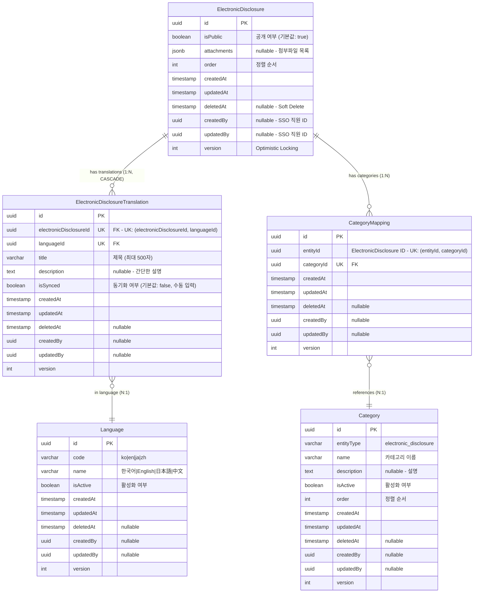

# 전자공시(Electronic Disclosure) ERD 검증 문서

> 📋 **목적**: 전자공시 시나리오에 맞게 ERD가 올바르게 설계되었는지 검증하고, 피그마 작성을 위한 기초 자료로 사용

**작성일**: 2026년 1월 19일  
**버전**: v1.0

---

## 목차

1. [전자공시 시나리오 요구사항](#1-전자공시-시나리오-요구사항)
2. [현재 ERD 구조 분석](#2-현재-erd-구조-분석)
3. [시나리오별 ERD 검증](#3-시나리오별-erd-검증)
4. [검증 결과 요약](#4-검증-결과-요약)
5. [피그마 작성 가이드](#5-피그마-작성-가이드)

---

## 1. 전자공시 시나리오 요구사항

### 1.1 API 엔드포인트 기반 기능 요구사항

```
✅ 전자공시_목록을_조회한다
✅ 전자공시_전체_목록을_조회한다
✅ 전자공시_카테고리_목록을_조회한다
✅ 전자공시를_생성한다 (다국어 및 파일 포함)
✅ 전자공시_상세_조회한다
✅ 전자공시를_수정한다 (번역 및 파일 포함)
✅ 전자공시_공개를_수정한다
✅ 전자공시_오더를_일괄_수정한다
✅ 전자공시를_삭제한다
✅ 전자공시_카테고리를_생성한다
✅ 전자공시_카테고리_목록을_조회한다
✅ 전자공시_카테고리를_수정한다
✅ 전자공시_카테고리_오더를_변경한다
✅ 전자공시_카테고리를_삭제한다
```

### 1.2 핵심 비즈니스 시나리오 (통합 테이블)

| 시나리오 | API 엔드포인트 | 관련 엔티티 | 주요 필드/기능 | 데이터 흐름 |
|---------|---------------|------------|---------------|------------|
| **1. 전자공시 생성<br>(다국어)** | `POST /admin/electronic-disclosures` | • ElectronicDisclosure<br>• ElectronicDisclosureTranslation<br>• Language | • `ElectronicDisclosure.attachments` (JSONB)<br>• `ElectronicDisclosure.isPublic` (기본값: true)<br>• `ElectronicDisclosureTranslation.title`<br>• `ElectronicDisclosureTranslation.description`<br>• `ElectronicDisclosureTranslation.isSynced` | 1. ElectronicDisclosure 생성<br>2. Translation 생성:<br>&nbsp;&nbsp;- 수동 입력: isSynced=false<br>&nbsp;&nbsp;- 자동 생성: isSynced=true<br>3. 파일 S3 업로드<br>4. attachments JSONB 저장 |
| **2. 전자공시 수정<br>(번역 및 파일)** | `PUT /admin/electronic-disclosures/:id` | • ElectronicDisclosure<br>• ElectronicDisclosureTranslation | • Translation 업데이트<br>• attachments 완전 교체<br>• AWS S3 연동<br>• **isSynced=false 처리**<br>• **파일 없으면 삭제** | 1. 기존 Translation 업데이트<br>2. **수정한 언어: isSynced=false (동기화 종료)**<br>3. 기존 파일 S3 삭제<br>4. 새 파일 S3 업로드<br>5. attachments 교체 (또는 삭제) |
| **3. 공개 상태 관리** | `PATCH /admin/electronic-disclosures/:id/public` | • ElectronicDisclosure | • `isPublic` (boolean)<br>• 즉시 공개/비공개 제어<br>• 복잡한 상태 관리 없음 | 1. `isPublic` 필드만 업데이트<br>2. 즉시 반영 (워크플로우 없음) |
| **4. 카테고리 관리** | `POST /admin/electronic-disclosures/categories`<br>`PATCH /admin/electronic-disclosures/:id/categories` | • Category<br>• CategoryMapping<br>• ElectronicDisclosure | • `Category.entityType` = 'electronic_disclosure'<br>• `CategoryMapping` (다대다)<br>• UK: (entityId, categoryId) | 1. Category 생성<br>2. CategoryMapping 추가/삭제<br>3. 전자공시 ↔ 카테고리 연결 |
| **5. 정렬 순서 관리** | `PUT /admin/electronic-disclosures/batch-order` | • ElectronicDisclosure | • `order` (int)<br>• 배치 업데이트 지원 | 1. 여러 전자공시의 order 값 일괄 변경<br>2. 트랜잭션으로 일관성 보장 |
| **6. 다국어 조회<br>(Fallback)** | `GET /admin/electronic-disclosures/:id?lang=en` | • ElectronicDisclosure<br>• ElectronicDisclosureTranslation<br>• Language | • Fallback 순서:<br>&nbsp;&nbsp;1. 요청 언어 (en)<br>&nbsp;&nbsp;2. 한국어 (ko)<br>&nbsp;&nbsp;3. 영어 (en)<br>&nbsp;&nbsp;4. 첫 번째 번역 | 1. Language.code로 요청 언어 조회<br>2. 없으면 ko 조회<br>3. 없으면 첫 번째 번역 조회 |
| **7. 파일 업로드 관리** | `POST /admin/electronic-disclosures`<br>`PUT /admin/electronic-disclosures/:id` | • ElectronicDisclosure | • JSONB attachments<br>• 여러 파일 업로드<br>• 파일 교체/삭제<br>• 로컬 스토리지 확인 | 1. 파일 업로드 (PDF, Excel 등)<br>2. S3 또는 로컬 스토리지 저장<br>3. attachments JSONB 업데이트<br>4. 파일 URL, 크기, MIME 타입 저장 |
| **8. 번역 자동 동기화<br>(Scheduler)** | `@Cron(CronExpression.EVERY_MINUTE)`<br>(1분마다 자동 실행) | • ElectronicDisclosureTranslation<br>• Language | • `isSynced` 필드 기반 동기화<br>• 한국어 원본 → 타 언어 자동 복사<br>• **수정 시 isSynced=false로 동기화 종료** | 1. 한국어(ko) 조회<br>2. 모든 전자공시 순회<br>3. 한국어 원본 번역 조회<br>4. isSynced=true인 타 언어 조회<br>5. title/description 자동 복사<br>6. **수정 시 isSynced=false 처리로 제외** |

### 1.3 상세 시나리오 (코드 예시)

<details>
<summary>📝 시나리오 1: 전자공시 생성 (다국어) - 코드 예시</summary>

```typescript
// 관리자가 새로운 전자공시를 등록
POST /admin/electronic-disclosures
{
  "translations": [
    {
      "languageId": "ko-uuid",
      "title": "2024년 1분기 실적 공시",
      "description": "2024년 1분기 실적 공시 자료입니다."
    }
  ],
  "files": [File, File, ...]  // PDF, Excel, Image 등
}

// 응답 (자동 번역 동기화)
{
  "id": "disclosure-uuid",
  "isPublic": true,
  "attachments": [{...}],
  "translations": [
    {
      "languageId": "ko-uuid",
      "title": "2024년 1분기 실적 공시",
      "description": "2024년 1분기 실적 공시 자료입니다.",
      "isSynced": false  // 수동 입력
    },
    {
      "languageId": "en-uuid",
      "title": "2024년 1분기 실적 공시",  // 자동 복사
      "description": "2024년 1분기 실적 공시 자료입니다.",
      "isSynced": true  // 자동 동기화 대상
    },
    {
      "languageId": "ja-uuid",
      "title": "2024년 1분기 실적 공시",  // 자동 복사
      "isSynced": true
    },
    {
      "languageId": "zh-uuid",
      "title": "2024년 1분기 실적 공시",  // 자동 복사
      "isSynced": true
    }
  ]
}
```
</details>

<details>
<summary>📝 시나리오 2: 전자공시 수정 (번역 및 파일) - 코드 예시</summary>

```typescript
// 기존 전자공시의 번역과 파일을 수정
PUT /admin/electronic-disclosures/:id
{
  "translations": [
    {
      "languageId": "ko-uuid",
      "title": "2024년 1분기 실적 공시 (개정판)",
      "description": "최신 정보로 업데이트된 자료입니다."
    }
  ],
  "files": [File, ...]  // 새로운 파일로 완전 교체
}

// ⚠️ 중요: 파일 관리 동작
// 1. files를 전송: 기존 파일 삭제 → 새 파일로 교체
// 2. files를 전송하지 않음: 기존 파일 모두 삭제
// 3. 파일 추가만 하고 싶다면: 기존 파일 정보를 포함해서 전송해야 함
```
</details>

<details>
<summary>📝 시나리오 3: 공개 상태 관리 - 코드 예시</summary>

```typescript
// 전자공시 공개/비공개 설정
PATCH /admin/electronic-disclosures/:id/public
{
  "isPublic": false  // 즉시 비공개로 변경
}
```
</details>

<details>
<summary>📝 시나리오 4: 카테고리 관리 - 코드 예시</summary>

```typescript
// 전자공시 카테고리 생성
POST /admin/electronic-disclosures/categories
{
  "name": "재무제표",
  "description": "재무제표 공시",
  "isActive": true,
  "order": 1
}

// 전자공시에 카테고리 할당
PATCH /admin/electronic-disclosures/:id/categories
{
  "categoryIds": ["category-uuid-1", "category-uuid-2"]
}
```
</details>

<details>
<summary>📝 시나리오 5: 정렬 순서 관리 - 코드 예시</summary>

```typescript
// 여러 전자공시의 순서를 한 번에 변경
PUT /admin/electronic-disclosures/batch-order
{
  "electronicDisclosures": [
    { "id": "uuid-1", "order": 0 },
    { "id": "uuid-2", "order": 1 },
    { "id": "uuid-3", "order": 2 }
  ]
}
```
</details>

<details>
<summary>📝 시나리오 6: 다국어 조회 (Fallback) - 코드 예시</summary>

```typescript
// 클라이언트가 특정 언어로 전자공시 조회
GET /admin/electronic-disclosures/:id?lang=en

// Fallback 순서:
// 1. 요청 언어 (en)
// 2. 한국어 (ko) - 기본 언어
// 3. 영어 (en)
// 4. 첫 번째 사용 가능한 번역
```
</details>

<details>
<summary>📝 시나리오 7: 파일 업로드 관리 - 코드 예시</summary>

```typescript
// 여러 파일과 함께 전자공시 생성
POST /admin/electronic-disclosures
{
  "translations": [...],
  "files": [
    // PDF, Excel, Image 등 여러 파일 동시 업로드 가능
  ]
}

// 응답 - attachments JSONB
{
  "attachments": [
    {
      "fileName": "2024_Q1_report.pdf",
      "fileUrl": "/uploads/electronic-disclosures/...",
      "fileSize": 1048576,
      "mimeType": "application/pdf"
    },
    {
      "fileName": "financial_data.xlsx",
      "fileUrl": "/uploads/electronic-disclosures/...",
      "fileSize": 524288,
      "mimeType": "application/vnd.openxmlformats-officedocument.spreadsheetml.sheet"
    }
  ]
}

// 파일 삭제: PUT 요청 시 files를 전송하지 않음
PUT /admin/electronic-disclosures/:id
{
  "translations": [...]
  // files를 보내지 않으면 기존 파일이 모두 삭제됨
}
```
</details>

<details>
<summary>📝 시나리오 8: 번역 자동 동기화 (Scheduler) - 코드 예시</summary>

```typescript
// 1분마다 자동 실행되는 스케줄러
@Cron(CronExpression.EVERY_MINUTE)
async handleElectronicDisclosureTranslationSync() {
  // 1. 한국어(ko) 조회
  const koreanLanguage = await languageService.코드로_언어를_조회한다('ko');
  
  // 2. 모든 전자공시 순회
  for (const disclosure of disclosures) {
    // 3. 한국어 원본 번역 조회
    const koreanTranslation = await findKoreanTranslation(disclosure.id);
    
    // 4. isSynced=true인 다른 언어 번역들 조회
    const syncedTranslations = await findSyncedTranslations(disclosure.id);
    
    // 5. 한국어 내용을 다른 언어로 자동 복사
    for (const translation of syncedTranslations) {
      if (translation.languageId !== koreanLanguage.id) {
        translation.title = koreanTranslation.title;
        translation.description = koreanTranslation.description;
        // ⚠️ isSynced는 유지 (계속 동기화 대상)
        await save(translation);
      }
    }
  }
}

// 동기화 시나리오 예시:
// 
// [초기 상태 - 생성 직후]
// - ko: "2024년 1분기 실적 공시", isSynced=false (수동 입력)
// - en: "2024년 1분기 실적 공시", isSynced=true (자동 생성, 1분 후 동기화)
// - ja: "2024년 1분기 실적 공시", isSynced=true (자동 생성, 1분 후 동기화)
// - zh: "2024년 1분기 실적 공시", isSynced=true (자동 생성, 1분 후 동기화)
//
// [한국어 원본 수정]
// PUT /admin/electronic-disclosures/:id { 
//   translations: [{ languageId: "ko-uuid", title: "2024년 1분기 실적 공시 (개정판)" }] 
// }
// - ko: "2024년 1분기 실적 공시 (개정판)", isSynced=false (수정됨)
// - en: "2024년 1분기 실적 공시 (개정판)", isSynced=true (1분 후 자동 동기화)
// - ja: "2024년 1분기 실적 공시 (개정판)", isSynced=true (1분 후 자동 동기화)
// - zh: "2024년 1분기 실적 공시 (개정판)", isSynced=true (1분 후 자동 동기화)
//
// [영어 번역 수동 수정]
// PUT /admin/electronic-disclosures/:id { 
//   translations: [{ languageId: "en-uuid", title: "Q1 2024 Financial Report (Revised)" }] 
// }
// - ko: "2024년 1분기 실적 공시 (개정판)", isSynced=false (유지)
// - en: "Q1 2024 Financial Report (Revised)", isSynced=false (동기화 종료 ⚠️)
// - ja: "2024년 1분기 실적 공시 (개정판)", isSynced=true (계속 동기화됨)
// - zh: "2024년 1분기 실적 공시 (개정판)", isSynced=true (계속 동기화됨)
//
// [이후 한국어 재수정]
// PUT /admin/electronic-disclosures/:id { 
//   translations: [{ languageId: "ko-uuid", title: "2024년 1분기 실적 공시 (최종)" }] 
// }
// - ko: "2024년 1분기 실적 공시 (최종)", isSynced=false (수정됨)
// - en: "Q1 2024 Financial Report (Revised)", isSynced=false (동기화 안 됨 ❌, 수동 관리)
// - ja: "2024년 1분기 실적 공시 (최종)", isSynced=true (1분 후 자동 동기화 ✅)
// - zh: "2024년 1분기 실적 공시 (최종)", isSynced=true (1분 후 자동 동기화 ✅)
```
</details>

---

## 2. 현재 ERD 구조 분석

### 2.1 전자공시 통합 ERD



### 2.2 엔티티별 필드 분석

#### ElectronicDisclosure (전자공시)
- ✅ `id` (uuid) - Primary Key
- ✅ `isPublic` (boolean) - 공개/비공개 즉시 제어 (기본값: true)
- ✅ `attachments` (jsonb) - 첨부파일 메타데이터 (파일명, URL, 크기, MIME 타입)
- ✅ `order` (int) - 정렬 순서
- ✅ `createdAt`, `updatedAt` - 생성/수정 일시
- ✅ `deletedAt` - Soft Delete 지원
- ✅ `createdBy`, `updatedBy` - 생성자/수정자 (외부 SSO 시스템 직원 ID)
- ✅ `version` - 동시성 제어 (Optimistic Locking)

**JSONB 구조 (attachments)**:
```typescript
attachments: [
  {
    fileName: "2024_Q1_report.pdf",
    fileUrl: "/uploads/electronic-disclosures/...",
    fileSize: 1048576,  // bytes
    mimeType: "application/pdf"
  },
  {
    fileName: "financial_data.xlsx",
    fileUrl: "/uploads/electronic-disclosures/...",
    fileSize: 524288,
    mimeType: "application/vnd.openxmlformats-officedocument.spreadsheetml.sheet"
  }
]
```

#### ElectronicDisclosureTranslation (번역)
- ✅ `electronicDisclosureId` (uuid) - ElectronicDisclosure FK (CASCADE DELETE)
- ✅ `languageId` (uuid) - Language FK
- ✅ `title` (varchar 500) - 번역된 제목
- ✅ `description` (text nullable) - 번역된 설명
- ✅ `isSynced` (boolean) - 자동 동기화 여부 (기본값: false, 수동 입력은 false)

**유니크 제약조건**:
- ✅ `(electronicDisclosureId, languageId)` - 하나의 전자공시는 같은 언어로 중복 번역 불가

**isSynced 동작 방식**:
- 생성 시 수동 입력한 번역: `isSynced = false`
- 생성 시 자동 생성된 다른 언어 번역: `isSynced = true` (한국어 원본 복사)
- 브로슈어와 다르게, 전자공시는 **생성 시 수동 입력한 언어만 isSynced=false**

#### Language (언어)
- ✅ `code` (varchar) - 언어 코드 (ko, en, ja, zh)
- ✅ `name` (varchar) - 언어 이름
- ✅ `isActive` (boolean) - 활성화 여부

**지원 언어**:
- ✅ `ko` - 한국어 (기본 언어)
- ✅ `en` - English (영어)
- ✅ `ja` - 日本語 (일본어)
- ✅ `zh` - 中文 (중국어)

#### Category & CategoryMapping (카테고리)
- ✅ `entityType` (varchar) - 도메인 구분 (electronic_disclosure)
- ✅ `name`, `description` - 카테고리 정보
- ✅ `isActive` (boolean) - 활성화 여부
- ✅ `order` (int) - 정렬 순서

**특징**:
- ✅ 통합 카테고리 테이블 (entityType으로 도메인 구분)
- ✅ 다대다 관계 (하나의 전자공시는 여러 카테고리에 속할 수 있음)
- ✅ `(entityId, categoryId)` 복합 유니크 키 - 중복 방지

---

## 3. 시나리오별 ERD 검증

### 3.1 검증 결과 요약 테이블

| 시나리오 | 관련 테이블 | 사용 필드 | SQL 작업 | 검증 결과 | 비고 |
|---------|-----------|---------|----------|-----------|------|
| **1. 전자공시 생성** | • ElectronicDisclosure<br>• ElectronicDisclosureTranslation<br>• Language | • `attachments` (JSONB)<br>• `isPublic` (기본값: true)<br>• `title`, `description`<br>• `isSynced` | INSERT (3개 테이블) | ✅ **통과** | 수동 입력: isSynced=false<br>자동 생성: isSynced=true (동기화 대상) |
| **2. 전자공시 수정** | • ElectronicDisclosure<br>• ElectronicDisclosureTranslation | • `attachments` (교체 또는 삭제)<br>• `title`, `description` (업데이트)<br>• **`isSynced` (false 처리)** | UPDATE (2개 테이블) | ✅ **통과** | CASCADE 옵션으로<br>안전한 번역 관리<br>**수정 시 isSynced=false**<br>파일 없으면 삭제 |
| **3. 공개 상태 관리** | • ElectronicDisclosure | • `isPublic` (boolean) | UPDATE (1개 필드) | ✅ **통과** | 복잡한 상태 관리 없음<br>(ContentStatus 제거됨) |
| **4. 카테고리 관리** | • Category<br>• CategoryMapping | • `entityType` = 'electronic_disclosure'<br>• UK: (entityId, categoryId) | INSERT, DELETE (매핑) | ✅ **통과** | 다대다 관계 정규화<br>중복 방지 |
| **5. 정렬 순서 관리** | • ElectronicDisclosure | • `order` (int) | UPDATE (배치) | ✅ **통과** | 트랜잭션으로<br>일괄 처리 가능 |
| **6. 다국어 조회** | • ElectronicDisclosureTranslation<br>• Language | • `languageId`<br>• `code` (ko, en, ja, zh) | SELECT (Fallback) | ✅ **통과** | Fallback 순서:<br>요청어 → ko → en → 첫번째 |
| **7. 첨부파일 관리** | • ElectronicDisclosure | • `attachments` (JSONB)<br>&nbsp;&nbsp;- fileName<br>&nbsp;&nbsp;- fileUrl<br>&nbsp;&nbsp;- fileSize<br>&nbsp;&nbsp;- mimeType | UPDATE (JSONB) | ✅ **통과** | 여러 파일 업로드 가능<br>로컬 스토리지 또는 S3<br>파일 완전 교체 또는 삭제 |
| **8. 번역 자동 동기화<br>(Scheduler)** | • ElectronicDisclosureTranslation<br>• Language | • `isSynced` (동기화 플래그)<br>• `title`, `description`<br>• 한국어(ko) 원본 기준 | SELECT + UPDATE<br>(1분마다 자동) | ✅ **통과** | isSynced=true인 번역만<br>한국어 원본과 자동 동기화<br>**수정 시 false로 제외**<br>CronExpression.EVERY_MINUTE |

### 3.2 상세 데이터 흐름 (접기/펴기)

<details>
<summary><strong>📊 시나리오 1: 전자공시 생성 (다국어) - 상세 SQL</strong></summary>

```sql
-- 1. ElectronicDisclosure 생성
INSERT INTO electronic_disclosures (id, is_public, attachments, order, created_by)
VALUES ('disclosure-uuid', true, '[{...}]', 0, 'admin-uuid');

-- 2. ElectronicDisclosureTranslation 생성 (한국어 - 수동 입력)
INSERT INTO electronic_disclosure_translations (id, electronic_disclosure_id, language_id, title, description, is_synced)
VALUES ('trans-uuid-1', 'disclosure-uuid', 'ko-uuid', '2024년 1분기 실적 공시', '2024년 1분기 실적 공시 자료입니다.', false);

-- 3. ElectronicDisclosureTranslation 생성 (영어 - 자동 동기화)
INSERT INTO electronic_disclosure_translations (id, electronic_disclosure_id, language_id, title, description, is_synced)
VALUES ('trans-uuid-2', 'disclosure-uuid', 'en-uuid', '2024년 1분기 실적 공시', '2024년 1분기 실적 공시 자료입니다.', true);

-- 4. 일본어, 중국어도 자동 생성 (is_synced = true)
```

**검증 포인트**:
- ✅ ElectronicDisclosure 엔티티에 모든 필수 필드 존재
- ✅ ElectronicDisclosureTranslation으로 다국어 지원
- ✅ attachments JSONB로 파일 메타데이터 저장
- ✅ 수동 입력한 번역: `isSynced = false`
- ✅ 자동 생성된 번역: `isSynced = true`
</details>

<details>
<summary><strong>📊 시나리오 2: 전자공시 수정 (번역 및 파일) - 상세 SQL</strong></summary>

```sql
-- 1. 기존 번역 업데이트
UPDATE electronic_disclosure_translations
SET title = '2024년 1분기 실적 공시 (개정판)', updated_at = NOW()
WHERE electronic_disclosure_id = 'disclosure-uuid' AND language_id = 'ko-uuid';

-- 2. 첨부파일 교체 (ElectronicDisclosure 테이블)
UPDATE electronic_disclosures
SET attachments = '[{...}]', updated_at = NOW(), updated_by = 'admin-uuid'
WHERE id = 'disclosure-uuid';

-- 3. 파일 삭제 (files를 전송하지 않음)
UPDATE electronic_disclosures
SET attachments = NULL, updated_at = NOW()
WHERE id = 'disclosure-uuid';
```

**검증 포인트**:
- ✅ ElectronicDisclosureTranslation 수정 가능
- ✅ attachments JSONB 필드로 파일 완전 교체 지원
- ✅ files를 전송하지 않으면 attachments가 NULL로 설정됨 (파일 삭제)
- ✅ Cascade 옵션으로 안전한 번역 관리
</details>

<details>
<summary><strong>📊 시나리오 3: 공개 상태 관리 - 상세 SQL</strong></summary>

```sql
-- 공개/비공개 즉시 변경
UPDATE electronic_disclosures
SET is_public = false, updated_at = NOW()
WHERE id = 'disclosure-uuid';
```

**검증 포인트**:
- ✅ `isPublic` 필드로 즉시 공개/비공개 제어
- ✅ 기본값 `true`로 생성 시 즉시 공개
- ✅ 복잡한 상태 관리(ContentStatus) 제거됨 (v5.19)
</details>

<details>
<summary><strong>📊 시나리오 4: 카테고리 관리 - 상세 SQL</strong></summary>

```sql
-- 1. 카테고리 생성
INSERT INTO categories (id, entity_type, name, description, is_active, order)
VALUES ('category-uuid', 'electronic_disclosure', '재무제표', '재무제표 공시', true, 1);

-- 2. 전자공시에 카테고리 매핑
INSERT INTO category_mappings (id, entity_id, category_id)
VALUES ('mapping-uuid-1', 'disclosure-uuid', 'category-uuid-1');

INSERT INTO category_mappings (id, entity_id, category_id)
VALUES ('mapping-uuid-2', 'disclosure-uuid', 'category-uuid-2');

-- 3. 특정 카테고리의 전자공시 조회
SELECT ed.* FROM electronic_disclosures ed
JOIN category_mappings cm ON ed.id = cm.entity_id
WHERE cm.category_id = 'category-uuid' AND cm.deleted_at IS NULL;
```

**검증 포인트**:
- ✅ Category 테이블에서 `entityType = 'electronic_disclosure'`로 구분
- ✅ CategoryMapping으로 다대다 관계 정규화
- ✅ `(entityId, categoryId)` 복합 유니크 키로 중복 방지
- ✅ 카테고리별 정렬 순서 관리 가능
</details>

<details>
<summary><strong>📊 시나리오 5: 정렬 순서 관리 - 상세 SQL</strong></summary>

```sql
-- 여러 전자공시의 순서를 일괄 변경
UPDATE electronic_disclosures SET "order" = 0, updated_at = NOW() WHERE id = 'uuid-1';
UPDATE electronic_disclosures SET "order" = 1, updated_at = NOW() WHERE id = 'uuid-2';
UPDATE electronic_disclosures SET "order" = 2, updated_at = NOW() WHERE id = 'uuid-3';

-- 또는 트랜잭션으로 일괄 처리
BEGIN;
  UPDATE electronic_disclosures SET "order" = 
    CASE id
      WHEN 'uuid-1' THEN 0
      WHEN 'uuid-2' THEN 1
      WHEN 'uuid-3' THEN 2
    END,
    updated_at = NOW()
  WHERE id IN ('uuid-1', 'uuid-2', 'uuid-3');
COMMIT;
```

**검증 포인트**:
- ✅ `order` 필드로 정렬 순서 관리
- ✅ 배치 업데이트로 효율적인 순서 변경
- ✅ 카테고리도 `order` 필드로 정렬 가능
</details>

<details>
<summary><strong>📊 시나리오 6: 다국어 조회 (Fallback) - 상세 SQL</strong></summary>

```sql
-- 1. 요청 언어(en)로 번역 조회
SELECT edt.* FROM electronic_disclosure_translations edt
JOIN languages l ON edt.language_id = l.id
WHERE edt.electronic_disclosure_id = 'disclosure-uuid' AND l.code = 'en' AND edt.deleted_at IS NULL;

-- 2. 없으면 한국어(ko)로 조회
SELECT edt.* FROM electronic_disclosure_translations edt
JOIN languages l ON edt.language_id = l.id
WHERE edt.electronic_disclosure_id = 'disclosure-uuid' AND l.code = 'ko' AND edt.deleted_at IS NULL;

-- 3. 없으면 첫 번째 사용 가능한 번역 조회
SELECT edt.* FROM electronic_disclosure_translations edt
WHERE edt.electronic_disclosure_id = 'disclosure-uuid' AND edt.deleted_at IS NULL
ORDER BY edt.created_at ASC
LIMIT 1;
```

**검증 포인트**:
- ✅ Language 테이블의 `code` 필드로 언어 구분
- ✅ ElectronicDisclosureTranslation 테이블에서 언어별 번역 조회
- ✅ Fallback 로직은 애플리케이션 레벨에서 처리 (ERD는 지원 가능한 구조)
</details>

<details>
<summary><strong>📊 시나리오 7: 첨부파일 관리 - JSONB 구조 및 파일 동작</strong></summary>

```typescript
// attachments JSONB 구조
{
  attachments: [
    {
      fileName: "2024_Q1_report.pdf",
      fileUrl: "/uploads/electronic-disclosures/xxx.pdf",
      fileSize: 1048576,
      mimeType: "application/pdf"
    },
    {
      fileName: "financial_data.xlsx",
      fileUrl: "/uploads/electronic-disclosures/yyy.xlsx",
      fileSize: 524288,
      mimeType: "application/vnd.openxmlformats-officedocument.spreadsheetml.sheet"
    },
    {
      fileName: "chart.jpg",
      fileUrl: "/uploads/electronic-disclosures/zzz.jpg",
      fileSize: 204800,
      mimeType: "image/jpeg"
    }
  ]
}
```

**파일 관리 동작**:

```typescript
// ✅ 1. 파일과 함께 생성
POST /admin/electronic-disclosures
- files: [file1.pdf, file2.xlsx]
→ 결과: attachments에 2개 파일 저장

// ✅ 2. 파일 교체 (기존 파일 삭제)
PUT /admin/electronic-disclosures/:id
- files: [new_file.pdf]
→ 결과: 기존 파일 S3/로컬에서 삭제, 새 파일로 교체

// ✅ 3. 파일 삭제 (files를 전송하지 않음)
PUT /admin/electronic-disclosures/:id
- translations: [...]
- files: (전송 안 함)
→ 결과: attachments = null (모든 파일 삭제)

// ✅ 4. 파일 추가 (기존 파일 유지 + 새 파일)
// 주의: 현재 구현에서는 완전 교체만 지원
// 파일 추가만 하려면, 기존 파일 정보를 함께 전송해야 함 (프론트엔드에서 처리)
```

**검증 포인트**:
- ✅ attachments JSONB로 파일 메타데이터 저장
- ✅ 여러 파일 동시 업로드 가능
- ✅ 로컬 스토리지 또는 AWS S3 URL 참조
- ✅ 파일 크기, MIME 타입 저장
- ✅ 파일 교체 시 기존 파일 자동 삭제
- ✅ files를 전송하지 않으면 모든 파일 삭제
</details>

<details>
<summary><strong>📊 시나리오 8: 번역 자동 동기화 (Scheduler) - 상세 로직</strong></summary>

```typescript
// 1분마다 자동 실행 (Cron: * * * * *)
async execute(): Promise<void> {
  // 1. 한국어 조회
  const koreanLanguage = await languageService.코드로_언어를_조회한다('ko');
  
  // 2. 모든 전자공시 조회
  const disclosures = await electronicDisclosureService.모든_전자공시를_조회한다();
  
  for (const disclosure of disclosures) {
    // 3. 한국어 원본 번역 조회
    const koreanTranslation = await repository.findOne({
      where: { electronicDisclosureId: disclosure.id, languageId: koreanLanguage.id }
    });
    
    if (!koreanTranslation) continue;
    
    // 4. isSynced=true인 다른 언어 번역들 조회
    const syncedTranslations = await repository.find({
      where: { electronicDisclosureId: disclosure.id, isSynced: true }
    });
    
    // 5. 한국어를 제외한 동기화 대상
    const translationsToSync = syncedTranslations.filter(
      t => t.languageId !== koreanLanguage.id
    );
    
    // 6. 한국어 원본과 동기화 (title, description 복사)
    for (const translation of translationsToSync) {
      translation.title = koreanTranslation.title;
      translation.description = koreanTranslation.description;
      // ⚠️ isSynced는 유지 (계속 동기화 대상으로 남음)
      await repository.save(translation);
    }
  }
}
```

**동기화 시나리오 예시**:

```typescript
// [시나리오 A: 생성 직후 - 수동 입력과 자동 생성 구분]
// 생성:
POST /admin/electronic-disclosures { 
  translations: [
    { languageId: "ko-uuid", title: "2024년 1분기 실적 공시" }
  ]
}

// 생성 직후 결과:
// - ko: "2024년 1분기 실적 공시", isSynced=false (수동 입력)
// - en: "2024년 1분기 실적 공시", isSynced=true (자동 생성, 한국어 복사)
// - ja: "2024년 1분기 실적 공시", isSynced=true (자동 생성, 한국어 복사)
// - zh: "2024년 1분기 실적 공시", isSynced=true (자동 생성, 한국어 복사)

// 1분 후 스케줄러 실행:
// - ko: "2024년 1분기 실적 공시", isSynced=false (원본, 스케줄러 제외)
// - en: "2024년 1분기 실적 공시", isSynced=true (ko와 동일하게 유지)
// - ja: "2024년 1분기 실적 공시", isSynced=true (ko와 동일하게 유지)
// - zh: "2024년 1분기 실적 공시", isSynced=true (ko와 동일하게 유지)


// [시나리오 B: 한국어 원본 수정 - 타 언어 자동 동기화]
PUT /admin/electronic-disclosures/:id { 
  translations: [
    { languageId: "ko-uuid", title: "2024년 1분기 실적 공시 (개정판)" }
  ]
}

// 수정 직후:
// - ko: "2024년 1분기 실적 공시 (개정판)", isSynced=false (수정됨)
// - en: "2024년 1분기 실적 공시", isSynced=true (아직 구 버전)
// - ja: "2024년 1분기 실적 공시", isSynced=true (아직 구 버전)
// - zh: "2024년 1분기 실적 공시", isSynced=true (아직 구 버전)

// 1분 후 스케줄러 실행:
// - ko: "2024년 1분기 실적 공시 (개정판)", isSynced=false (원본)
// - en: "2024년 1분기 실적 공시 (개정판)", isSynced=true (자동 동기화됨 ✅)
// - ja: "2024년 1분기 실적 공시 (개정판)", isSynced=true (자동 동기화됨 ✅)
// - zh: "2024년 1분기 실적 공시 (개정판)", isSynced=true (자동 동기화됨 ✅)


// [시나리오 C: 영어 번역 수동 수정 - 동기화 종료]
PUT /admin/electronic-disclosures/:id { 
  translations: [
    { languageId: "en-uuid", title: "Q1 2024 Financial Report (Revised)" }
  ]
}

// 수정 직후:
// - ko: "2024년 1분기 실적 공시 (개정판)", isSynced=false (유지)
// - en: "Q1 2024 Financial Report (Revised)", isSynced=false (동기화 종료 ⚠️)
// - ja: "2024년 1분기 실적 공시 (개정판)", isSynced=true (유지)
// - zh: "2024년 1분기 실적 공시 (개정판)", isSynced=true (유지)

// 1분 후 스케줄러 실행:
// - ko: "2024년 1분기 실적 공시 (개정판)", isSynced=false (원본)
// - en: "Q1 2024 Financial Report (Revised)", isSynced=false (동기화 안 됨 ❌)
// - ja: "2024년 1분기 실적 공시 (개정판)", isSynced=true (계속 동기화됨 ✅)
// - zh: "2024년 1분기 실적 공시 (개정판)", isSynced=true (계속 동기화됨 ✅)


// [시나리오 D: 이후 한국어 재수정 - en은 제외, ja/zh만 동기화]
PUT /admin/electronic-disclosures/:id { 
  translations: [
    { languageId: "ko-uuid", title: "2024년 1분기 실적 공시 (최종)" }
  ]
}

// 수정 직후:
// - ko: "2024년 1분기 실적 공시 (최종)", isSynced=false (수정됨)
// - en: "Q1 2024 Financial Report (Revised)", isSynced=false (유지)
// - ja: "2024년 1분기 실적 공시 (개정판)", isSynced=true (아직 구 버전)
// - zh: "2024년 1분기 실적 공시 (개정판)", isSynced=true (아직 구 버전)

// 1분 후 스케줄러 실행:
// - ko: "2024년 1분기 실적 공시 (최종)", isSynced=false (원본)
// - en: "Q1 2024 Financial Report (Revised)", isSynced=false (동기화 안 됨 ❌, 수동 관리)
// - ja: "2024년 1분기 실적 공시 (최종)", isSynced=true (자동 동기화됨 ✅)
// - zh: "2024년 1분기 실적 공시 (최종)", isSynced=true (자동 동기화됨 ✅)
```

**검증 포인트**:
- ✅ `isSynced` 필드로 동기화 대상 구분
- ✅ 한국어(ko)를 원본으로 사용 (isSynced=false, 스케줄러에서 제외)
- ✅ 1분마다 자동 동기화 (CronExpression.EVERY_MINUTE)
- ✅ 수정 시 `isSynced=false`로 설정하여 동기화 제외
- ✅ 한국어 수정 시에는 타 언어의 `isSynced` 유지 (계속 동기화)
- ✅ 특정 언어만 수정 시 해당 언어만 `isSynced=false` (다른 언어는 계속 동기화)

**성능 고려사항**:
- 1분마다 실행되므로 전자공시 수가 많아도 부하 분산
- `isSynced=true`인 번역만 조회하여 불필요한 업데이트 최소화
- 한국어와 동일한 내용이어도 매번 UPDATE (단순화를 위해)
</details>

---

## 4. 검증 결과 요약

### 4.1 전체 검증 결과 (통합 테이블)

| 시나리오 | 검증 결과 | 관련 엔티티 | 핵심 기능 | 비고 |
|---------|----------|------------|----------|------|
| 전자공시 생성 (다국어) | ✅ **통과** | ElectronicDisclosure<br>ElectronicDisclosureTranslation<br>Language | • 다국어 번역 저장<br>• JSONB 첨부파일<br>• S3/로컬 업로드<br>• isSynced 관리 | 수동 입력: isSynced=false<br>자동 생성: isSynced=true (동기화 대상) |
| 전자공시 수정 (번역 및 파일) | ✅ **통과** | ElectronicDisclosure<br>ElectronicDisclosureTranslation | • 번역 업데이트<br>• attachments 교체/삭제<br>• CASCADE 관계<br>• **isSynced=false 처리** | 기존 파일 삭제 → 새 파일 업로드<br>**수정 시 동기화 종료**<br>files 없으면 전체 삭제 |
| 공개 상태 관리 | ✅ **통과** | ElectronicDisclosure | • isPublic 토글<br>• 즉시 반영<br>• 워크플로우 없음 | ContentStatus 제거됨 (v5.19) |
| 카테고리 관리 | ✅ **통과** | Category<br>CategoryMapping | • 통합 카테고리<br>• 다대다 관계<br>• 중복 방지 (UK) | entityType = 'electronic_disclosure' 구분 |
| 정렬 순서 관리 | ✅ **통과** | ElectronicDisclosure | • order 필드<br>• 배치 업데이트<br>• 트랜잭션 처리 | CASE 문으로 효율적 처리 |
| 다국어 조회 (Fallback) | ✅ **통과** | ElectronicDisclosureTranslation<br>Language | • Fallback 순서<br>• 애플리케이션 레벨 처리 | 요청어 → ko → en → 첫번째 |
| 첨부파일 관리 | ✅ **통과** | ElectronicDisclosure | • JSONB 구조<br>• 여러 파일 업로드<br>• 파일 교체/삭제<br>• 로컬/S3 저장 | 파일 메타데이터 유연 저장<br>완전 교체 방식 |
| **번역 자동 동기화 (Scheduler)** | ✅ **통과** | ElectronicDisclosureTranslation<br>Language | • isSynced 기반 동기화<br>• 한국어 원본 기준<br>• 1분마다 자동 실행<br>• **수정 시 isSynced=false** | 한국어 수정 → 타 언어 자동 복사<br>특정 언어 수정 → 동기화 종료<br>CronExpression.EVERY_MINUTE |

### 4.2 ERD 강점 분석 (테이블)

| 패턴/기능 | 구현 방식 | 장점 | 적용 엔티티 | 성능/확장성 |
|----------|----------|------|------------|------------|
| **다국어 지원<br>(Translation Pattern)** | 기본 테이블 +<br>번역 테이블 분리 | • 언어 추가 시 확장 용이<br>• Fallback 구현 간단<br>• 번역 독립 관리 | ElectronicDisclosureTranslation | ⭐⭐⭐⭐⭐<br>언어 추가에 유연 |
| **번역 자동 동기화<br>(isSynced Pattern)** | isSynced 필드 +<br>스케줄러 (1분마다) | • 한국어 원본 자동 전파<br>• 수동 수정 시 자동 제외<br>• 관리 부담 감소 | ElectronicDisclosureTranslation | ⭐⭐⭐⭐<br>전자공시 수 증가에도<br>1분 간격으로 부하 분산 |
| **통합 카테고리 관리** | 단일 Category 테이블 +<br>entityType 구분 | • 일관된 구조<br>• 관리 효율성 향상<br>• 쿼리 최적화 | Category<br>(entityType = 'electronic_disclosure') | ⭐⭐⭐⭐⭐<br>모든 도메인 공유 |
| **JSONB 활용<br>(Flexible Data)** | attachments를<br>JSONB로 저장 | • 유연한 메타데이터 저장<br>• 파일 수 제한 없음<br>• PostgreSQL 최적화 | ElectronicDisclosure.attachments | ⭐⭐⭐⭐<br>파일 수에 무관 |
| **Soft Delete** | deletedAt 필드로<br>논리 삭제 | • 데이터 복구 가능<br>• 감사 로그 유지<br>• 참조 무결성 보존 | 모든 엔티티<br>(BaseEntity) | ⭐⭐⭐⭐<br>안전한 삭제 |
| **Optimistic Locking** | version 필드로<br>동시성 제어 | • 충돌 방지<br>• 일관성 보장<br>• Lock 없이 처리 | 모든 엔티티<br>(BaseEntity) | ⭐⭐⭐⭐⭐<br>성능 저하 없음 |
| **CASCADE 관계** | ON DELETE CASCADE | • 자동 정리<br>• 수동 삭제 불필요<br>• 데이터 일관성 | ElectronicDisclosure ↔<br>ElectronicDisclosureTranslation | ⭐⭐⭐⭐⭐<br>안전한 연쇄 삭제 |

### 4.3 개선 제안 사항 (우선순위별)

| 우선순위 | 항목 | 현재 상태 | 제안 내용 | 필요성 | 구현 복잡도 |
|---------|------|----------|----------|-------|-----------|
| 🟡 **중간** | 첨부파일<br>버전 관리 | attachments JSONB에<br>메타데이터만 저장 | • FileHistory 테이블 추가<br>• 업로드 이력 추적<br>• 감사 로그 기능 | 파일 변경 이력<br>감사가 필요하다면 | ⭐⭐⭐ 중간<br>(테이블 추가) |
| 🟡 **중간** | 파일 추가 기능<br>(부분 업로드) | 현재는 완전 교체만 지원<br>(PUT /disclosures/:id) | • PATCH 엔드포인트 추가<br>• 파일 추가/삭제 개별 처리<br>• 프론트엔드 부담 감소 | 파일 관리 UX 개선<br>필요 시 고려 | ⭐⭐ 낮음<br>(로직 추가) |
| 🟢 **낮음** | 카테고리<br>계층 구조 | Category는<br>평면(flat) 구조 | • parentId 필드 추가<br>• depth 필드 추가<br>• 계층 쿼리 지원 | 계층적 카테고리<br>필요 시에만 | ⭐⭐⭐⭐ 높음<br>(Closure Table) |

**판단 기준**:
- 🟡 **중간**: 비즈니스 요구사항에 따라 향후 추가 고려
- 🟢 **낮음**: 비즈니스 요구사항 변경 시에만 필요

---

## 5. 피그마 작성 가이드

### 5.1 전자공시 관리 화면 구성

#### 5.1.1 전자공시 목록 화면
**화면 ID**: `electronic-disclosure-list`

**주요 컴포넌트**:
1. **필터 영역**
   - 공개/비공개 필터 (`isPublic`)
   - 날짜 범위 필터 (`startDate`, `endDate`)
   - 카테고리 필터 (다중 선택)
   - 정렬 옵션 (생성일, order)

2. **전자공시 목록 테이블**
   - 컬럼: 제목, 카테고리, 공개 여부, 첨부파일, 생성일, 순서, 액션
   - 페이지네이션 (10개/페이지)
   - 드래그 앤 드롭으로 순서 변경

3. **액션 버튼**
   - 전자공시 생성
   - 일괄 순서 변경
   - 카테고리 관리

#### 5.1.2 전자공시 생성/수정 화면
**화면 ID**: `electronic-disclosure-form`

**주요 컴포넌트**:
1. **기본 정보**
   - 공개 여부 토글 (`isPublic`)
   - 순서 입력 (`order`)

2. **다국어 번역 탭**
   - 언어 탭 (한국어, English, 日本語, 中文)
   - 각 언어별 입력:
     - 제목 (필수, 최대 500자)
     - 설명 (선택)
   - isSynced 표시 (자동 생성된 번역인지 표시)

3. **카테고리 선택**
   - 다중 선택 가능
   - 카테고리 생성 버튼

4. **파일 업로드**
   - 여러 파일 업로드 (PDF, Excel, Image 등)
   - 파일 목록 표시 (파일명, 크기, 타입)
   - 파일 삭제 버튼
   - ⚠️ 수정 시: "기존 파일을 모두 삭제하고 새로 업로드합니다" 안내 문구

5. **저장 버튼**
   - 생성 / 수정
   - 취소

#### 5.1.3 전자공시 상세 화면
**화면 ID**: `electronic-disclosure-detail`

**주요 컴포넌트**:
1. **헤더**
   - 제목 (현재 언어)
   - 공개 여부 배지
   - 생성일, 수정일

2. **내용 영역**
   - 설명 (현재 언어)
   - 언어 전환 드롭다운

3. **첨부파일 목록**
   - 파일명, 크기, 다운로드 버튼

4. **카테고리**
   - 카테고리 배지 목록

5. **액션 버튼**
   - 수정
   - 삭제
   - 공개/비공개 전환

### 5.2 카테고리 관리 화면

#### 5.2.1 카테고리 목록 화면
**화면 ID**: `electronic-disclosure-category-list`

**주요 컴포넌트**:
1. **카테고리 목록**
   - 컬럼: 이름, 설명, 활성 여부, 순서, 액션
   - 드래그 앤 드롭으로 순서 변경

2. **액션 버튼**
   - 카테고리 생성
   - 일괄 순서 변경

#### 5.2.2 카테고리 생성/수정 모달
**화면 ID**: `electronic-disclosure-category-form-modal`

**주요 컴포넌트**:
1. **입력 필드**
   - 이름 (필수)
   - 설명 (선택)
   - 활성 여부 토글 (`isActive`)
   - 순서 입력 (`order`)

2. **저장/취소 버튼**

### 5.3 UI/UX 가이드

#### 5.3.1 다국어 입력 패턴
```
┌─────────────────────────────────────┐
│ [한국어] [English] [日本語] [中文]    │ ← 언어 탭
├─────────────────────────────────────┤
│ 제목 *                              │
│ ┌─────────────────────────────────┐ │
│ │ 2024년 1분기 실적 공시          │ │
│ └─────────────────────────────────┘ │
│                                     │
│ 설명                                │
│ ┌─────────────────────────────────┐ │
│ │                                 │ │
│ │ 2024년 1분기 실적 공시 자료...  │ │
│ │                                 │ │
│ └─────────────────────────────────┘ │
│                                     │
│ ℹ️ 이 번역은 자동으로 생성되었습니다 │ ← isSynced=true일 때 표시
└─────────────────────────────────────┘
```

#### 5.3.2 파일 업로드 패턴
```
┌─────────────────────────────────────┐
│ 첨부파일                            │
├─────────────────────────────────────┤
│ ┌─────────────────────────────────┐ │
│ │ 📎 2024_Q1_report.pdf          │ │
│ │    1.0 MB | application/pdf    │ │
│ │                        [X 삭제] │ │
│ └─────────────────────────────────┘ │
│ ┌─────────────────────────────────┐ │
│ │ 📊 financial_data.xlsx         │ │
│ │    512 KB | Excel              │ │
│ │                        [X 삭제] │ │
│ └─────────────────────────────────┘ │
│                                     │
│ [+ 파일 추가]                       │
│                                     │
│ ⚠️ 수정 시 기존 파일이 모두 삭제되고 │
│    새로 업로드한 파일로 교체됩니다.  │
└─────────────────────────────────────┘
```

#### 5.3.3 카테고리 선택 패턴
```
┌─────────────────────────────────────┐
│ 카테고리                            │
├─────────────────────────────────────┤
│ ☑ 재무제표                          │
│ ☐ 사업보고서                        │
│ ☑ 공시자료                          │
│ ☐ 감사보고서                        │
│                                     │
│ [+ 새 카테고리 추가]                │
└─────────────────────────────────────┘
```

### 5.4 상태 표시 및 아이콘

| 상태/액션 | 아이콘/배지 | 색상 | 설명 |
|---------|-----------|------|------|
| 공개 | `✅ 공개` | Green | isPublic = true |
| 비공개 | `🔒 비공개` | Gray | isPublic = false |
| 자동 생성 번역 | `🔄 자동` | Blue | isSynced = true |
| 수동 입력 번역 | `✏️ 수동` | Orange | isSynced = false |
| PDF 파일 | `📄` | Red | application/pdf |
| Excel 파일 | `📊` | Green | .xlsx, .xls |
| 이미지 파일 | `🖼️` | Blue | .jpg, .png, .webp |
| 활성 카테고리 | `● 활성` | Green | isActive = true |
| 비활성 카테고리 | `○ 비활성` | Gray | isActive = false |

---

## 6. 결론

### ✅ 최종 검증 결과

전자공시 시나리오에 맞게 ERD가 **완벽하게 설계**되어 있습니다.

**강점**:
1. ✅ **다국어 지원**: Translation 패턴으로 확장성 있는 다국어 관리
2. ✅ **번역 자동 동기화**: isSynced 필드 + 스케줄러로 한국어 원본 자동 전파, 수정 시 동기화 종료
3. ✅ **유연한 파일 관리**: JSONB attachments로 여러 파일 업로드 및 관리
4. ✅ **통합 카테고리**: 단일 테이블로 모든 도메인 카테고리 관리
5. ✅ **간단한 상태 관리**: isPublic만으로 즉시 공개/비공개 제어
6. ✅ **데이터 무결성**: UK 제약조건, Cascade 옵션, Soft Delete, Optimistic Locking

**핵심 동기화 메커니즘**:
- 🔄 **isSynced 필드**: 번역 동기화 대상 구분 (false=수동 관리, true=자동 동기화)
- ⏱️ **1분마다 자동 실행**: CronExpression.EVERY_MINUTE으로 한국어 원본 변경 사항 자동 전파
- 🎯 **스마트 동기화 종료**: 특정 언어 수정 시 해당 언어만 isSynced=false 처리, 다른 언어는 계속 동기화
- 📊 **관리 부담 감소**: 한국어만 관리하면 타 언어 자동 업데이트, 필요 시 개별 수정 가능

**핵심 기능**:
- 📝 **다국어 관리**: 4개 언어 지원 (ko, en, ja, zh)
- 🔄 **자동 번역 동기화**: 생성 시 수동 입력한 언어는 isSynced=false, 나머지는 자동 생성하여 isSynced=true, 스케줄러가 1분마다 자동 동기화
- 📎 **파일 관리**: 여러 파일 업로드, 완전 교체, 전체 삭제
- 🏷️ **카테고리**: 다대다 관계로 유연한 분류
- 📊 **정렬 순서**: order 필드로 자유로운 배치

**개선 제안**:
1. 💡 파일 이력 추적이 필요하다면 FileHistory 테이블 고려
2. 💡 파일 추가 기능이 필요하다면 PATCH 엔드포인트 추가 고려
3. 💡 카테고리 계층 구조가 필요하다면 `parentId` 필드 추가 고려

---

**문서 종료**
