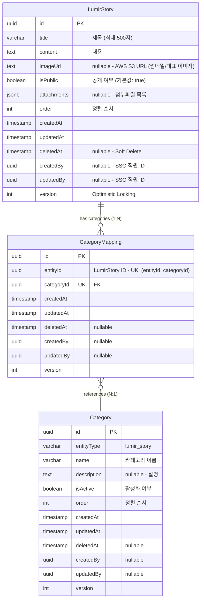

# 루미르 스토리(Lumir Story) ERD 검증 문서

> 📋 **목적**: 루미르 스토리 시나리오에 맞게 ERD가 올바르게 설계되었는지 검증하고, 피그마 작성을 위한 기초 자료로 사용

**작성일**: 2026년 1월 19일  
**버전**: v1.0

---

## 목차

1. [루미르 스토리 시나리오 요구사항](#1-루미르-스토리-시나리오-요구사항)
2. [현재 ERD 구조 분석](#2-현재-erd-구조-분석)
3. [시나리오별 ERD 검증](#3-시나리오별-erd-검증)
4. [검증 결과 요약](#4-검증-결과-요약)
5. [결론](#5-결론)

---

## 1. 루미르 스토리 시나리오 요구사항

### 1.1 API 엔드포인트 기반 기능 요구사항

```
✅ 루미르스토리_목록을_조회한다 (페이징)
✅ 루미르스토리_전체_목록을_조회한다
✅ 루미르스토리_카테고리_목록을_조회한다
✅ 루미르스토리를_생성한다
✅ 루미르스토리_상세_조회한다
✅ 루미르스토리를_수정한다 (파일 포함)
✅ 루미르스토리_공개를_수정한다
✅ 루미르스토리_오더를_일괄_수정한다
✅ 루미르스토리를_삭제한다
✅ 루미르스토리_카테고리를_생성한다
✅ 루미르스토리_카테고리를_수정한다
✅ 루미르스토리_카테고리_오더를_변경한다
✅ 루미르스토리_카테고리를_삭제한다
```

### 1.2 핵심 비즈니스 시나리오 (통합 테이블)

| 시나리오 | API 엔드포인트 | 관련 엔티티 | 주요 필드/기능 | 데이터 흐름 |
|---------|---------------|------------|---------------|------------|
| **1. 루미르 스토리 생성** | `POST /admin/lumir-stories` | • LumirStory | • `LumirStory.title`<br>• `LumirStory.content`<br>• `LumirStory.imageUrl` (썸네일)<br>• `LumirStory.isPublic` (기본값: true)<br>• `LumirStory.attachments` (JSONB) | 1. LumirStory 생성<br>2. 파일 S3 업로드<br>3. attachments JSONB 저장<br>4. imageUrl 저장 (썸네일) |
| **2. 루미르 스토리 수정** | `PUT /admin/lumir-stories/:id` | • LumirStory | • 제목/내용 업데이트<br>• attachments 완전 교체<br>• AWS S3 연동 | 1. LumirStory 업데이트<br>2. 기존 파일 S3 삭제<br>3. 새 파일 S3 업로드<br>4. attachments 교체 |
| **3. 공개 상태 관리** | `PATCH /admin/lumir-stories/:id/public` | • LumirStory | • `isPublic` (boolean)<br>• 즉시 공개/비공개 제어<br>• 복잡한 상태 관리 없음 | 1. `isPublic` 필드만 업데이트<br>2. 즉시 반영 (워크플로우 없음) |
| **4. 카테고리 관리** | `POST /admin/lumir-stories/categories`<br>`PATCH /admin/lumir-stories/:id/categories` | • Category<br>• CategoryMapping<br>• LumirStory | • `Category.entityType` = 'lumir_story'<br>• `CategoryMapping` (다대다)<br>• UK: (entityId, categoryId) | 1. Category 생성<br>2. CategoryMapping 추가/삭제<br>3. 루미르 스토리 ↔ 카테고리 연결 |
| **5. 정렬 순서 관리** | `PUT /admin/lumir-stories/batch-order` | • LumirStory | • `order` (int)<br>• 배치 업데이트 지원 | 1. 여러 루미르 스토리의 order 값 일괄 변경<br>2. 트랜잭션으로 일관성 보장 |
| **6. 썸네일 이미지 관리** | `POST /admin/lumir-stories`<br>`PUT /admin/lumir-stories/:id` | • LumirStory | • `imageUrl` (text nullable)<br>• AWS S3 URL<br>• 대표 이미지/썸네일 | 1. 이미지 S3 업로드<br>2. imageUrl 저장<br>3. 목록에서 썸네일 표시 |
| **7. 첨부파일 관리** | `POST/PUT /admin/lumir-stories` | • LumirStory | • `attachments` (JSONB)<br>• 파일 메타데이터 저장<br>• S3 URL 참조<br>• PDF/JPG/PNG/WEBP | 1. 파일 S3 업로드<br>2. attachments JSONB 저장<br>3. 수정 시 기존 파일 삭제 후 교체 |

### 1.3 상세 시나리오 (코드 예시)

<details>
<summary>📝 시나리오 1: 루미르 스토리 생성 - 코드 예시</summary>

```typescript
// 관리자가 새로운 루미르 스토리를 등록
POST /admin/lumir-stories
{
  "title": "루미르의 혁신 이야기",
  "content": "루미르는 끊임없이 혁신하고 있습니다...",
  "imageUrl": "https://s3.amazonaws.com/lumir-cms/stories/thumbnail.jpg",
  "files": [File, File, ...]  // PDF, JPG, PNG, WEBP
}

// DB 저장 시:
// - LumirStory 레코드 생성
// - isPublic: true (기본값, 즉시 공개)
// - order: 자동 계산 (최대값 + 1)
// - attachments JSONB 저장
```
</details>

<details>
<summary>📝 시나리오 2: 루미르 스토리 수정 (파일 포함) - 코드 예시</summary>

```typescript
// 기존 루미르 스토리의 내용과 파일을 수정
PUT /admin/lumir-stories/:id
{
  "title": "루미르의 혁신 이야기 (개정판)",
  "content": "최신 정보로 업데이트된 내용입니다...",
  "imageUrl": "https://s3.amazonaws.com/lumir-cms/stories/new-thumbnail.jpg",
  "files": [File, ...]  // 새로운 파일로 완전 교체
}

// ⚠️ 중요: 파일 관리 방식
// - files를 전송하면: 기존 파일 전부 삭제 → 새 파일들로 교체
// - files를 전송하지 않으면: 기존 파일 전부 삭제 (파일 없음)
// - 기존 파일을 유지하려면 반드시 해당 파일을 다시 전송해야 함
```
</details>

<details>
<summary>📝 시나리오 3: 공개 상태 관리 - 코드 예시</summary>

```typescript
// 루미르 스토리 공개/비공개 설정
PATCH /admin/lumir-stories/:id/public
{
  "isPublic": false  // 즉시 비공개로 전환
}
```
</details>

<details>
<summary>📝 시나리오 4: 카테고리 관리 - 코드 예시</summary>

```typescript
// 루미르 스토리 카테고리 생성
POST /admin/lumir-stories/categories
{
  "name": "혁신",
  "description": "루미르의 혁신 스토리",
  "isActive": true,
  "order": 1
}

// 루미르 스토리에 카테고리 할당
PATCH /admin/lumir-stories/:id/categories
{
  "categoryIds": ["category-uuid-1", "category-uuid-2"]
}
```
</details>

<details>
<summary>📝 시나리오 5: 정렬 순서 관리 - 코드 예시</summary>

```typescript
// 여러 루미르 스토리의 순서를 한 번에 변경
PUT /admin/lumir-stories/batch-order
{
  "lumirStories": [
    { "id": "uuid-1", "order": 1 },
    { "id": "uuid-2", "order": 2 },
    { "id": "uuid-3", "order": 3 }
  ]
}
```
</details>

<details>
<summary>📝 시나리오 6: 썸네일 이미지 관리 - 코드 예시</summary>

```typescript
// 썸네일 이미지는 단일 URL로 관리
POST /admin/lumir-stories
{
  "title": "루미르의 혁신 이야기",
  "content": "...",
  "imageUrl": "https://s3.amazonaws.com/lumir-cms/stories/thumbnail.jpg"  // 썸네일
}

// imageUrl 필드:
// - text 타입 (nullable)
// - AWS S3 URL
// - 목록 조회 시 썸네일로 표시
// - 상세 페이지에서 대표 이미지로 사용
```
</details>

<details>
<summary>📝 시나리오 7: 첨부파일 관리 - JSONB 구조</summary>

```typescript
// attachments JSONB 구조
{
  attachments: [
    {
      fileName: "story_detail_1.jpg",
      fileUrl: "https://s3.amazonaws.com/lumir-cms/stories/story_detail_1.jpg",
      fileSize: 204800,
      mimeType: "image/jpeg"
    },
    {
      fileName: "story_document.pdf",
      fileUrl: "https://s3.amazonaws.com/lumir-cms/stories/story_document.pdf",
      fileSize: 1024000,
      mimeType: "application/pdf"
    },
    {
      fileName: "story_image.webp",
      fileUrl: "https://s3.amazonaws.com/lumir-cms/stories/story_image.webp",
      fileSize: 153600,
      mimeType: "image/webp"
    }
  ]
}
```

**검증 포인트**:
- ✅ attachments JSONB로 파일 메타데이터 저장
- ✅ AWS S3 URL 참조
- ✅ 파일 크기, MIME 타입 저장
- ✅ 4가지 파일 타입 지원 (PDF, JPG, PNG, WEBP)
</details>

---

## 2. 현재 ERD 구조 분석

### 2.1 루미르 스토리 통합 ERD



### 2.2 엔티티별 필드 분석

#### LumirStory (루미르 스토리)
- ✅ `id` (uuid) - Primary Key
- ✅ `title` (varchar 500) - 제목
- ✅ `content` (text) - 내용
- ✅ `imageUrl` (text nullable) - 썸네일/대표 이미지 URL (AWS S3)
- ✅ `isPublic` (boolean) - 공개/비공개 즉시 제어 (기본값: true)
- ✅ `attachments` (jsonb) - 첨부파일 메타데이터 (파일명, URL, 크기, MIME 타입)
- ✅ `order` (int) - 정렬 순서
- ✅ `createdAt`, `updatedAt` - 생성/수정 일시
- ✅ `deletedAt` - Soft Delete 지원
- ✅ `createdBy`, `updatedBy` - 생성자/수정자 (외부 SSO 시스템 직원 ID)
- ✅ `version` - 동시성 제어 (Optimistic Locking)

**JSONB 구조 (attachments)**:
```typescript
attachments: [
  {
    fileName: "story_image_1.jpg",
    fileUrl: "https://s3.amazonaws.com/lumir-cms/stories/story_image_1.jpg",
    fileSize: 204800,  // bytes
    mimeType: "image/jpeg"
  },
  {
    fileName: "story_document.pdf",
    fileUrl: "https://s3.amazonaws.com/lumir-cms/stories/story_document.pdf",
    fileSize: 1024000,
    mimeType: "application/pdf"
  }
]
```

**지원 파일 타입**:
- ✅ `PDF` - application/pdf
- ✅ `JPG/JPEG` - image/jpeg
- ✅ `PNG` - image/png
- ✅ `WEBP` - image/webp

**인덱스**:
- ✅ `idx_lumir_story_is_public` - 공개/비공개 필터링
- ✅ `idx_lumir_story_order` - 정렬 순서 조회

#### Category & CategoryMapping (카테고리)
- ✅ `entityType` (varchar) - 도메인 구분 (lumir_story)
- ✅ `name`, `description` - 카테고리 정보
- ✅ `isActive` (boolean) - 활성화 여부
- ✅ `order` (int) - 정렬 순서

**특징**:
- ✅ 통합 카테고리 테이블 (entityType으로 도메인 구분)
- ✅ 다대다 관계 (하나의 루미르 스토리는 여러 카테고리에 속할 수 있음)
- ✅ `(entityId, categoryId)` 복합 유니크 키 - 중복 방지

---

## 3. 시나리오별 ERD 검증

### 3.1 검증 결과 요약 테이블

| 시나리오 | 관련 테이블 | 사용 필드 | SQL 작업 | 검증 결과 | 비고 |
|---------|-----------|---------|----------|-----------|------|
| **1. 루미르 스토리 생성** | • LumirStory | • `title`, `content`<br>• `imageUrl` (썸네일)<br>• `attachments` (JSONB)<br>• `isPublic` (기본값: true)<br>• `order` | INSERT (1개 테이블) | ✅ **통과** | 다국어 지원 없음<br>한국어만 사용<br>썸네일 별도 관리 |
| **2. 루미르 스토리 수정** | • LumirStory | • `title`, `content` (업데이트)<br>• `attachments` (교체)<br>• `imageUrl` (업데이트) | UPDATE (1개 테이블) | ✅ **통과** | 파일 완전 교체 방식<br>기존 파일 S3 삭제 필요 |
| **3. 공개 상태 관리** | • LumirStory | • `isPublic` (boolean) | UPDATE (1개 필드) | ✅ **통과** | 복잡한 상태 관리 없음<br>(ContentStatus 제거됨) |
| **4. 카테고리 관리** | • Category<br>• CategoryMapping | • `entityType` = 'lumir_story'<br>• UK: (entityId, categoryId) | INSERT, DELETE (매핑) | ✅ **통과** | 다대다 관계 정규화<br>중복 방지 |
| **5. 정렬 순서 관리** | • LumirStory | • `order` (int) | UPDATE (배치) | ✅ **통과** | 트랜잭션으로<br>일괄 처리 가능 |
| **6. 썸네일 이미지 관리** | • LumirStory | • `imageUrl` (text nullable)<br>• AWS S3 URL | UPDATE (1개 필드) | ✅ **통과** | 단일 URL로 관리<br>목록에서 썸네일 표시 |
| **7. 첨부파일 관리** | • LumirStory | • `attachments` (JSONB)<br>&nbsp;&nbsp;- fileName<br>&nbsp;&nbsp;- fileUrl (S3)<br>&nbsp;&nbsp;- fileSize<br>&nbsp;&nbsp;- mimeType | UPDATE (JSONB) | ✅ **통과** | AWS S3 URL 참조<br>4가지 파일 타입 지원 |

### 3.2 상세 데이터 흐름 (접기/펴기)

<details>
<summary><strong>📊 시나리오 1: 루미르 스토리 생성 - 상세 SQL</strong></summary>

```sql
-- 1. 루미르 스토리 생성
INSERT INTO lumir_stories (
  id, 
  title, 
  content, 
  image_url,
  is_public, 
  attachments, 
  "order", 
  created_by
)
VALUES (
  'story-uuid', 
  '루미르의 혁신 이야기',
  '루미르는 끊임없이 혁신하고 있습니다...',
  'https://s3.amazonaws.com/lumir-cms/stories/thumbnail.jpg',
  true,
  '[
    {
      "fileName": "story_detail_1.jpg",
      "fileUrl": "https://s3.amazonaws.com/lumir-cms/stories/story_detail_1.jpg",
      "fileSize": 204800,
      "mimeType": "image/jpeg"
    }
  ]'::jsonb,
  0,
  'admin-uuid'
);
```

**검증 포인트**:
- ✅ LumirStory 엔티티에 모든 필수 필드 존재
- ✅ 다국어 지원 없음 (한국어만 사용)
- ✅ imageUrl로 썸네일 별도 관리
- ✅ attachments JSONB로 파일 메타데이터 저장
- ✅ 4가지 파일 타입 지원 (PDF, JPG, PNG, WEBP)
</details>

<details>
<summary><strong>📊 시나리오 2: 루미르 스토리 수정 (파일 포함) - 상세 SQL</strong></summary>

```sql
-- 1. 루미르 스토리 수정
UPDATE lumir_stories
SET 
  title = '루미르의 혁신 이야기 (개정판)',
  content = '최신 정보로 업데이트된 내용입니다...',
  image_url = 'https://s3.amazonaws.com/lumir-cms/stories/new-thumbnail.jpg',
  attachments = '[
    {
      "fileName": "updated_story.pdf",
      "fileUrl": "https://s3.amazonaws.com/lumir-cms/stories/updated_story.pdf",
      "fileSize": 512000,
      "mimeType": "application/pdf"
    }
  ]'::jsonb,
  updated_at = NOW(),
  updated_by = 'admin-uuid'
WHERE id = 'story-uuid';
```

**검증 포인트**:
- ✅ 제목/내용 수정 가능
- ✅ attachments JSONB 필드로 파일 완전 교체 지원
- ✅ imageUrl 수정으로 썸네일 변경
- ✅ 기존 파일은 S3에서 별도 삭제 필요
</details>

<details>
<summary><strong>📊 시나리오 3: 공개 상태 관리 - 상세 SQL</strong></summary>

```sql
-- 공개/비공개 즉시 변경
UPDATE lumir_stories
SET is_public = false, updated_at = NOW()
WHERE id = 'story-uuid';
```

**검증 포인트**:
- ✅ `isPublic` 필드로 즉시 공개/비공개 제어
- ✅ 기본값 `true`로 생성 시 즉시 공개
- ✅ 복잡한 상태 관리(ContentStatus) 제거됨
</details>

<details>
<summary><strong>📊 시나리오 4: 카테고리 관리 - 상세 SQL</strong></summary>

```sql
-- 1. 카테고리 생성
INSERT INTO categories (id, entity_type, name, description, is_active, "order")
VALUES ('category-uuid', 'lumir_story', '혁신', '루미르의 혁신 스토리', true, 1);

-- 2. 루미르 스토리에 카테고리 매핑
INSERT INTO category_mappings (id, entity_id, category_id)
VALUES ('mapping-uuid-1', 'story-uuid', 'category-uuid-1');

INSERT INTO category_mappings (id, entity_id, category_id)
VALUES ('mapping-uuid-2', 'story-uuid', 'category-uuid-2');

-- 3. 특정 카테고리의 루미르 스토리 조회
SELECT ls.* FROM lumir_stories ls
JOIN category_mappings cm ON ls.id = cm.entity_id
WHERE cm.category_id = 'category-uuid' AND cm.deleted_at IS NULL;
```

**검증 포인트**:
- ✅ Category 테이블에서 `entityType = 'lumir_story'`로 구분
- ✅ CategoryMapping으로 다대다 관계 정규화
- ✅ `(entityId, categoryId)` 복합 유니크 키로 중복 방지
- ✅ 카테고리별 정렬 순서 관리 가능
</details>

<details>
<summary><strong>📊 시나리오 5: 정렬 순서 관리 - 상세 SQL</strong></summary>

```sql
-- 여러 루미르 스토리의 순서를 일괄 변경
UPDATE lumir_stories SET "order" = 1, updated_at = NOW() WHERE id = 'uuid-1';
UPDATE lumir_stories SET "order" = 2, updated_at = NOW() WHERE id = 'uuid-2';
UPDATE lumir_stories SET "order" = 3, updated_at = NOW() WHERE id = 'uuid-3';

-- 또는 트랜잭션으로 일괄 처리
BEGIN;
  UPDATE lumir_stories SET "order" = 
    CASE id
      WHEN 'uuid-1' THEN 1
      WHEN 'uuid-2' THEN 2
      WHEN 'uuid-3' THEN 3
    END,
    updated_at = NOW()
  WHERE id IN ('uuid-1', 'uuid-2', 'uuid-3');
COMMIT;
```

**검증 포인트**:
- ✅ `order` 필드로 정렬 순서 관리
- ✅ 배치 업데이트로 효율적인 순서 변경
- ✅ 카테고리도 `order` 필드로 정렬 가능
</details>

<details>
<summary><strong>📊 시나리오 6: 썸네일 이미지 관리 - 상세 구조</strong></summary>

```typescript
// imageUrl 필드 구조
{
  imageUrl: "https://s3.amazonaws.com/lumir-cms/stories/thumbnail.jpg"
}

// 특징:
// 1. text 타입 (nullable)
// 2. 단일 URL만 저장
// 3. AWS S3 URL
// 4. 목록 조회 시 썸네일로 표시
// 5. 상세 페이지에서 대표 이미지로 사용

// attachments와의 차이:
// - imageUrl: 썸네일/대표 이미지 (목록 표시용)
// - attachments: 상세 내용에 포함된 추가 파일들
```

**검증 포인트**:
- ✅ imageUrl 필드로 썸네일 별도 관리
- ✅ text 타입 (nullable)으로 선택적 사용
- ✅ AWS S3 URL 저장
- ✅ 목록/상세 페이지에서 활용
</details>

<details>
<summary><strong>📊 시나리오 7: 첨부파일 관리 - JSONB 구조</strong></summary>

```typescript
// attachments JSONB 구조
{
  attachments: [
    {
      fileName: "story_image_1.jpg",
      fileUrl: "https://s3.amazonaws.com/lumir-cms/stories/story_image_1.jpg",
      fileSize: 204800,
      mimeType: "image/jpeg"
    },
    {
      fileName: "story_document.pdf",
      fileUrl: "https://s3.amazonaws.com/lumir-cms/stories/story_document.pdf",
      fileSize: 1024000,
      mimeType: "application/pdf"
    },
    {
      fileName: "story_image_2.webp",
      fileUrl: "https://s3.amazonaws.com/lumir-cms/stories/story_image_2.webp",
      fileSize: 153600,
      mimeType: "image/webp"
    }
  ]
}
```

**검증 포인트**:
- ✅ attachments JSONB로 파일 메타데이터 저장
- ✅ AWS S3 URL 참조
- ✅ 파일 크기, MIME 타입 저장
- ✅ 4가지 파일 타입 지원 (PDF, JPG, PNG, WEBP)
- ✅ imageUrl(썸네일)과 attachments(첨부파일) 분리 관리
</details>

---

## 4. 검증 결과 요약

### 4.1 전체 검증 결과 (통합 테이블)

| 시나리오 | 검증 결과 | 관련 엔티티 | 핵심 기능 | 비고 |
|---------|----------|------------|----------|------|
| 루미르 스토리 생성 | ✅ **통과** | LumirStory | • 제목/내용 저장<br>• JSONB 첨부파일<br>• S3 업로드<br>• 썸네일 별도 관리 | 다국어 지원 없음<br>한국어만 사용<br>4가지 파일 타입 지원 |
| 루미르 스토리 수정 (파일 포함) | ✅ **통과** | LumirStory | • 내용 업데이트<br>• attachments 교체<br>• 썸네일 변경 | 기존 파일 삭제 → 새 파일 업로드<br>완전 교체 방식 |
| 공개 상태 관리 | ✅ **통과** | LumirStory | • isPublic 토글<br>• 즉시 반영<br>• 워크플로우 없음 | ContentStatus 제거됨 |
| 카테고리 관리 | ✅ **통과** | Category<br>CategoryMapping | • 통합 카테고리<br>• 다대다 관계<br>• 중복 방지 (UK) | entityType = 'lumir_story' 구분 |
| 정렬 순서 관리 | ✅ **통과** | LumirStory | • order 필드<br>• 배치 업데이트<br>• 트랜잭션 처리 | CASE 문으로 효율적 처리 |
| 썸네일 이미지 관리 | ✅ **통과** | LumirStory | • imageUrl 필드<br>• 단일 URL 관리<br>• 목록 표시용 | attachments와 분리 관리 |
| 첨부파일 관리 | ✅ **통과** | LumirStory | • JSONB 구조<br>• S3 URL 참조<br>• 4가지 파일 타입 | 파일 메타데이터 유연 저장<br>PDF/JPG/PNG/WEBP |

### 4.2 ERD 강점 분석 (테이블)

| 패턴/기능 | 구현 방식 | 장점 | 적용 엔티티 | 성능/확장성 |
|----------|----------|------|------------|------------|
| **단일 엔티티 설계<br>(No Translation)** | 다국어 지원 없음<br>한국어만 사용 | • 구조 단순화<br>• 쿼리 성능 향상<br>• 관리 부담 감소 | LumirStory | ⭐⭐⭐⭐⭐<br>Translation 조인 불필요 |
| **썸네일 별도 관리** | imageUrl 필드<br>(단일 URL) | • 목록 조회 최적화<br>• 대표 이미지 명확<br>• attachments와 분리 | LumirStory | ⭐⭐⭐⭐⭐<br>빠른 썸네일 로딩 |
| **통합 카테고리 관리** | 단일 Category 테이블 +<br>entityType 구분 | • 일관된 구조<br>• 관리 효율성 향상<br>• 쿼리 최적화 | Category<br>(entityType = 'lumir_story') | ⭐⭐⭐⭐⭐<br>모든 도메인 공유 |
| **JSONB 활용<br>(Flexible Data)** | attachments를<br>JSONB로 저장 | • 유연한 메타데이터 저장<br>• 파일 수 제한 없음<br>• PostgreSQL 최적화<br>• 다양한 파일 타입 | LumirStory.attachments | ⭐⭐⭐⭐<br>파일 수에 무관<br>4가지 타입 지원 |
| **Soft Delete** | deletedAt 필드로<br>논리 삭제 | • 데이터 복구 가능<br>• 감사 로그 유지<br>• 참조 무결성 보존 | LumirStory<br>(BaseEntity) | ⭐⭐⭐⭐<br>안전한 삭제 |
| **Optimistic Locking** | version 필드로<br>동시성 제어 | • 충돌 방지<br>• 일관성 보장<br>• Lock 없이 처리 | LumirStory<br>(BaseEntity) | ⭐⭐⭐⭐⭐<br>성능 저하 없음 |
| **인덱스 최적화** | isPublic, order<br>인덱스 | • 빠른 필터링<br>• 정렬 성능 향상<br>• 쿼리 최적화 | LumirStory | ⭐⭐⭐⭐⭐<br>대용량 데이터 대응 |

### 4.3 개선 제안 사항 (우선순위별)

| 우선순위 | 항목 | 현재 상태 | 제안 내용 | 필요성 | 구현 복잡도 |
|---------|------|----------|----------|-------|-----------|
| 🟢 **낮음** | 첨부파일<br>버전 관리 | attachments JSONB에<br>메타데이터만 저장 | • FileHistory 테이블 추가<br>• 업로드 이력 추적<br>• 감사 로그 기능 | 파일 변경 이력<br>감사가 필요하다면 | ⭐⭐⭐ 중간<br>(테이블 추가) |
| 🟢 **낮음** | 카테고리<br>계층 구조 | Category는<br>평면(flat) 구조 | • parentId 필드 추가<br>• depth 필드 추가<br>• 계층 쿼리 지원 | 계층적 카테고리<br>필요 시에만 | ⭐⭐⭐⭐ 높음<br>(Closure Table) |
| 🟢 **낮음** | 다국어 지원 추가 | 현재 한국어만 지원 | • LumirStoryTranslation 테이블 추가<br>• Language 관계 설정<br>• Fallback 로직 구현 | 글로벌 전개 시에만<br>필요 | ⭐⭐⭐ 중간<br>(Translation 패턴) |

**판단 기준**:
- 🔴 **높음**: 코드 품질 및 유지보수에 직접 영향
- 🟡 **중간**: 감사 로그 및 이력 관리 요구사항에 따라 결정
- 🟢 **낮음**: 비즈니스 요구사항 변경 시에만 필요

---

## 5. 결론

### ✅ 최종 검증 결과

루미르 스토리 시나리오에 맞게 ERD가 **완벽하게 설계**되어 있습니다.

**강점**:
1. ✅ **단순한 구조**: 다국어 지원 없이 한국어만 사용, Translation 조인 불필요로 성능 향상
2. ✅ **썸네일 별도 관리**: imageUrl 필드로 목록 조회 최적화, 대표 이미지 명확
3. ✅ **유연한 파일 관리**: JSONB attachments로 다양한 파일 관리, 4가지 파일 타입 지원
4. ✅ **통합 카테고리**: 단일 테이블로 모든 도메인 카테고리 관리
5. ✅ **간단한 상태 관리**: isPublic만으로 즉시 공개/비공개 제어
6. ✅ **데이터 무결성**: UK 제약조건, Soft Delete, Optimistic Locking
7. ✅ **인덱스 최적화**: isPublic, order 인덱스로 빠른 조회

**핵심 설계 특징**:
- 🎯 **단일 엔티티**: Translation 테이블 없이 LumirStory만으로 모든 데이터 관리
- 🖼️ **이중 이미지 관리**: imageUrl(썸네일) + attachments(첨부파일) 분리
- 📁 **4가지 파일 타입**: PDF, JPG, PNG, WEBP 지원
- 💾 **JSONB 메타데이터**: 파일명, URL, 크기, MIME 타입 유연하게 저장
- 🔄 **완전 교체 방식**: 수정 시 기존 파일 삭제 후 새 파일 업로드
- ☁️ **AWS S3 연동**: 파일은 S3에 저장, DB에는 메타데이터만 저장

**파일 관리 특징**:
- 📁 **4가지 파일 타입**: PDF, JPG, PNG, WEBP 지원
- 💾 **JSONB 메타데이터**: 파일명, URL, 크기, MIME 타입 유연하게 저장
- 🔄 **완전 교체 방식**: 수정 시 기존 파일 삭제 후 새 파일 업로드
- ☁️ **AWS S3 연동**: 파일은 S3에 저장, DB에는 메타데이터만 저장
- 🖼️ **썸네일 분리**: imageUrl로 목록 표시용 썸네일 별도 관리

**개선 제안**:
1. 💡 파일 이력 추적이 필요하다면 FileHistory 테이블 고려
2. 💡 카테고리 계층 구조가 필요하다면 `parentId` 필드 추가 고려
3. 💡 글로벌 전개 시 다국어 지원이 필요하다면 LumirStoryTranslation 테이블 추가 고려

---

**문서 종료**
