# 메인 팝업(Main Popup) ERD 검증 문서

> 📋 **목적**: 메인 팝업 시나리오에 맞게 ERD가 올바르게 설계되었는지 검증하고, 피그마 작성을 위한 기초 자료로 사용

**작성일**: 2026년 1월 19일  
**버전**: v1.0

---

## 목차

1. [메인 팝업 시나리오 요구사항](#1-메인-팝업-시나리오-요구사항)
2. [현재 ERD 구조 분석](#2-현재-erd-구조-분석)
3. [시나리오별 ERD 검증](#3-시나리오별-erd-검증)
4. [검증 결과 요약](#4-검증-결과-요약)
5. [결론](#5-결론)

---

## 1. 메인 팝업 시나리오 요구사항

### 1.1 API 엔드포인트 기반 기능 요구사항

```
✅ 메인_팝업_목록을_조회한다 (페이징)
✅ 메인_팝업_전체_목록을_조회한다
✅ 메인_팝업_카테고리_목록을_조회한다
✅ 메인_팝업을_생성한다
✅ 메인_팝업_상세를_조회한다
✅ 메인_팝업을_수정한다 (번역 및 파일 포함)
✅ 메인_팝업_공개를_수정한다
✅ 메인_팝업_오더를_일괄_수정한다
✅ 메인_팝업을_삭제한다
✅ 메인_팝업_카테고리를_생성한다
✅ 메인_팝업_카테고리를_수정한다
✅ 메인_팝업_카테고리_오더를_변경한다
✅ 메인_팝업_카테고리를_삭제한다
```

### 1.2 핵심 비즈니스 시나리오 (통합 테이블)

| 시나리오 | API 엔드포인트 | 관련 엔티티 | 주요 필드/기능 | 데이터 흐름 |
|---------|---------------|------------|---------------|------------|
| **1. 메인 팝업 생성<br>(다국어)** | `POST /admin/main-popups` | • MainPopup<br>• MainPopupTranslation<br>• Language | • `MainPopup.attachments` (JSONB)<br>• `MainPopup.isPublic` (기본값: true)<br>• `MainPopup.releasedAt`<br>• `MainPopupTranslation.title`<br>• `MainPopupTranslation.description`<br>• `MainPopupTranslation.isSynced` (입력: false, 미입력: true) | 1. MainPopup 생성<br>2. 입력 언어 Translation 생성 (isSynced=false)<br>3. 미입력 언어 Translation 생성 (isSynced=true)<br>4. 파일 S3 업로드<br>5. attachments JSONB 저장 |
| **2. 메인 팝업 수정<br>(번역 및 파일)** | `PUT /admin/main-popups/:id` | • MainPopup<br>• MainPopupTranslation | • Translation 업데이트<br>• attachments 완전 교체<br>• AWS S3 연동<br>• **isSynced=false 처리** | 1. 기존 Translation 업데이트<br>2. **isSynced=false 설정 (동기화 중단)**<br>3. 기존 파일 S3 삭제<br>4. 새 파일 S3 업로드<br>5. attachments 교체 |
| **3. 공개 상태 관리** | `PATCH /admin/main-popups/:id/public` | • MainPopup | • `isPublic` (boolean)<br>• 즉시 공개/비공개 제어<br>• 복잡한 상태 관리 없음 | 1. `isPublic` 필드만 업데이트<br>2. 즉시 반영 (워크플로우 없음) |
| **4. 카테고리 관리** | `POST /admin/main-popups/categories`<br>`PATCH /admin/main-popups/:id/categories` | • Category<br>• CategoryMapping<br>• MainPopup | • `Category.entityType` = 'main_popup'<br>• `CategoryMapping` (다대다)<br>• UK: (entityId, categoryId) | 1. Category 생성<br>2. CategoryMapping 추가/삭제<br>3. 메인 팝업 ↔ 카테고리 연결 |
| **5. 정렬 순서 관리** | `PUT /admin/main-popups/batch-order` | • MainPopup | • `order` (int)<br>• 배치 업데이트 지원 | 1. 여러 메인 팝업의 order 값 일괄 변경<br>2. 트랜잭션으로 일관성 보장 |
| **6. 다국어 조회<br>(Fallback)** | `GET /admin/main-popups/:id?lang=en` | • MainPopup<br>• MainPopupTranslation<br>• Language | • Fallback 순서:<br>&nbsp;&nbsp;1. 요청 언어 (en)<br>&nbsp;&nbsp;2. 한국어 (ko)<br>&nbsp;&nbsp;3. 영어 (en)<br>&nbsp;&nbsp;4. 첫 번째 번역 | 1. Language.code로 요청 언어 조회<br>2. 없으면 ko 조회<br>3. 없으면 첫 번째 번역 조회 |
| **7. 번역 자동 동기화<br>(Scheduler)** | `@Cron('* * * * *')`<br>(1분마다 자동 실행) | • MainPopupTranslation<br>• Language | • `isSynced` 필드 기반 동기화<br>• 한국어 원본 → 타 언어 자동 복사<br>• **수정 시 isSynced=false로 동기화 종료** | 1. 한국어(ko) 조회<br>2. 모든 MainPopup 순회<br>3. 한국어 원본 번역 조회<br>4. isSynced=true인 타 언어 조회<br>5. title/description 자동 복사<br>6. **수정 시 isSynced=false 처리로 제외** |
| **8. 파일 관리** | `POST/PUT /admin/main-popups` | • MainPopup | • `attachments` (JSONB)<br>• 파일 메타데이터 저장<br>• S3 URL 참조<br>• PDF/JPG/PNG/WEBP/XLSX/DOCX | 1. 파일 S3 업로드<br>2. attachments JSONB 저장<br>3. 수정 시 기존 파일 삭제 후 교체 |
| **9. 공개 일시 관리** | `POST /admin/main-popups` | • MainPopup | • `releasedAt` (timestamp nullable)<br>• 공개 시작 일시<br>• 예약 공개 기능 | 1. releasedAt 설정<br>2. 특정 일시부터 공개<br>3. 쿼리 시 releasedAt 필터링 |

### 1.3 상세 시나리오 (코드 예시)

<details>
<summary>📝 시나리오 1: 메인 팝업 생성 (다국어) - 코드 예시</summary>

```typescript
// 관리자가 새로운 메인 팝업을 등록
POST /admin/main-popups
{
  "translations": [
    {
      "languageId": "ko-uuid",
      "title": "신제품 출시 안내",
      "description": "루미르의 새로운 제품을 만나보세요."
    },
    {
      "languageId": "en-uuid",
      "title": "New Product Launch",
      "description": "Check out Lumir's new product."
    }
  ],
  "files": [File, File, ...]  // PDF, JPG, PNG, WEBP, XLSX, DOCX
}
```
</details>

<details>
<summary>📝 시나리오 2: 메인 팝업 수정 (번역 및 파일) - 코드 예시</summary>

```typescript
// 기존 메인 팝업의 번역과 파일을 수정
PUT /admin/main-popups/:id
{
  "translations": [
    {
      "languageId": "ko-uuid",
      "title": "신제품 출시 안내 (수정)",
      "description": "최신 정보로 업데이트되었습니다."
    }
  ],
  "files": [File, ...]  // 새로운 파일로 완전 교체
}

// ⚠️ 중요: 메인 팝업 수정 시 isSynced 처리
// - 한국어(ko) 수정: 다른 언어들의 isSynced는 유지 (계속 동기화됨)
// - 다른 언어 수정: 해당 언어의 isSynced=false (동기화 종료, 수동 관리)
//
// 예시:
// ⚠️ 중요: 메인 팝업 isSynced 전략
// - 생성 시 입력 언어 (ko, en): isSynced=false (수동 관리, 품질 유지)
// - 생성 시 미입력 언어 (ja, zh): isSynced=true (자동 동기화, 즉시 다국어 지원)
// - 수정 시: isSynced=false로 변경 (동기화 중단, 수동 관리로 전환)
//
// 예시:
// 1. 생성 시 ko, en 입력: ko/en은 isSynced=false, ja/zh는 isSynced=true
// 2. en만 수정: en의 isSynced=false (en은 더 이상 ko 따라가지 않음)
// 3. ko 수정: ja는 계속 isSynced=true (ja는 계속 ko 따라감)
```
</details>

<details>
<summary>📝 시나리오 7: 번역 자동 동기화 (Scheduler) - 코드 예시</summary>

```typescript
// 1분마다 자동 실행되는 스케줄러
@Cron(CronExpression.EVERY_MINUTE)
async handleMainPopupTranslationSync() {
  // 1. 한국어(ko) 조회
  const koreanLanguage = await languageService.코드로_언어를_조회한다('ko');
  
  // 2. 모든 MainPopup 순회
  for (const popup of popups) {
    // 3. 한국어 원본 번역 조회
    const koreanTranslation = await findKoreanTranslation(popup.id);
    
    // 4. isSynced=true인 다른 언어 번역들 조회
    const syncedTranslations = await findSyncedTranslations(popup.id);
    
    // 5. 한국어 내용을 다른 언어로 자동 복사
    for (const translation of syncedTranslations) {
      if (translation.languageId !== koreanLanguage.id) {
        translation.title = koreanTranslation.title;
        translation.description = koreanTranslation.description;
        // ⚠️ isSynced는 유지 (계속 동기화 대상)
        await save(translation);
      }
    }
  }
}

// 동기화 시나리오 예시:
// 
// [초기 상태 - 생성 직후]
// - ko: "신제품 출시 안내", isSynced=true
// - en: "신제품 출시 안내", isSynced=true (자동 복사됨)
// - ja: "신제품 출시 안내", isSynced=true (자동 복사됨)
//
// [한국어 원본 수정]
// PUT /admin/main-popups/:id { translations: [{ languageId: "ko-uuid", title: "루미르 신제품 출시" }] }
// - ko: "루미르 신제품 출시", isSynced=true (수정됨)
// - en: "루미르 신제품 출시", isSynced=true (1분 후 자동 동기화)
// - ja: "루미르 신제품 출시", isSynced=true (1분 후 자동 동기화)
//
// [영어 번역 수동 수정]
// PUT /admin/main-popups/:id { translations: [{ languageId: "en-uuid", title: "Lumir New Product Launch" }] }
// - ko: "루미르 신제품 출시", isSynced=true (유지)
// - en: "Lumir New Product Launch", isSynced=false (동기화 종료)
// - ja: "루미르 신제품 출시", isSynced=true (계속 동기화됨)
//
// [이후 한국어 재수정]
// PUT /admin/main-popups/:id { translations: [{ languageId: "ko-uuid", title: "루미르 최신 제품" }] }
// - ko: "루미르 최신 제품", isSynced=true (수정됨)
// - en: "Lumir New Product Launch", isSynced=false (동기화 안 됨, 수동 관리)
// - ja: "루미르 최신 제품", isSynced=true (1분 후 자동 동기화)
```
</details>

<details>
<summary>📝 시나리오 3: 공개 상태 관리 - 코드 예시</summary>

```typescript
// 메인 팝업 공개/비공개 설정
PATCH /admin/main-popups/:id/public
{
  "isPublic": true  // 즉시 공개/비공개
}
```
</details>

<details>
<summary>📝 시나리오 4: 카테고리 관리 - 코드 예시</summary>

```typescript
// 메인 팝업 카테고리 생성
POST /admin/main-popups/categories
{
  "name": "이벤트",
  "description": "이벤트 관련 팝업",
  "isActive": true,
  "order": 1
}

// 메인 팝업에 카테고리 할당
PATCH /admin/main-popups/:id/categories
{
  "categoryIds": ["category-uuid-1", "category-uuid-2"]
}
```
</details>

<details>
<summary>📝 시나리오 5: 정렬 순서 관리 - 코드 예시</summary>

```typescript
// 여러 메인 팝업의 순서를 한 번에 변경
PUT /admin/main-popups/batch-order
{
  "mainPopups": [
    { "id": "uuid-1", "order": 1 },
    { "id": "uuid-2", "order": 2 },
    { "id": "uuid-3", "order": 3 }
  ]
}
```
</details>

<details>
<summary>📝 시나리오 6: 다국어 조회 (Fallback) - 코드 예시</summary>

```typescript
// 클라이언트가 특정 언어로 메인 팝업 조회
GET /admin/main-popups/:id?lang=en

// Fallback 순서:
// 1. 요청 언어 (en)
// 2. 한국어 (ko) - 기본 언어
// 3. 영어 (en)
// 4. 첫 번째 사용 가능한 번역
```
</details>

<details>
<summary>📝 시나리오 9: 공개 일시 관리 - 코드 예시</summary>

```typescript
// 예약 공개 설정
POST /admin/main-popups
{
  "translations": [...],
  "releasedAt": "2024-12-25T00:00:00Z"  // 특정 일시부터 공개
}

// 공개 일시 이후의 팝업만 조회
SELECT * FROM main_popups
WHERE is_public = true
  AND (released_at IS NULL OR released_at <= NOW())
ORDER BY "order" ASC;
```
</details>

---

## 2. 현재 ERD 구조 분석

### 2.1 메인 팝업 통합 ERD

```mermaid
erDiagram
    %% Core Entity
    MainPopup {
        uuid id PK
        boolean isPublic "공개 여부 (기본값: true)"
        timestamp releasedAt "nullable - 공개 일시"
        jsonb attachments "nullable - 첨부파일 목록"
        int order "정렬 순서"
        timestamp createdAt
        timestamp updatedAt
        timestamp deletedAt "nullable - Soft Delete"
        uuid createdBy "nullable - SSO 직원 ID"
        uuid updatedBy "nullable - SSO 직원 ID"
        int version "Optimistic Locking"
    }
    
    %% Translation Entity
    MainPopupTranslation {
        uuid id PK
        uuid mainPopupId UK "FK - UK: (mainPopupId, languageId)"
        uuid languageId UK "FK"
        varchar title "제목 (최대 500자)"
        text description "nullable - 간단한 설명"
        boolean isSynced "동기화 여부 (입력: false, 미입력: true)"
        timestamp createdAt
        timestamp updatedAt
        timestamp deletedAt "nullable"
        uuid createdBy "nullable"
        uuid updatedBy "nullable"
        int version
    }
    
    %% Language Entity
    Language {
        uuid id PK
        varchar code "ko|en|ja|zh"
        varchar name "한국어|English|日本語|中文"
        boolean isActive "활성화 여부"
        timestamp createdAt
        timestamp updatedAt
        timestamp deletedAt "nullable"
        uuid createdBy "nullable"
        uuid updatedBy "nullable"
        int version
    }
    
    %% Category Entity
    Category {
        uuid id PK
        varchar entityType "main_popup"
        varchar name "카테고리 이름"
        text description "nullable - 설명"
        boolean isActive "활성화 여부"
        int order "정렬 순서"
        timestamp createdAt
        timestamp updatedAt
        timestamp deletedAt "nullable"
        uuid createdBy "nullable"
        uuid updatedBy "nullable"
        int version
    }
    
    %% Mapping Entity
    CategoryMapping {
        uuid id PK
        uuid entityId "MainPopup ID - UK: (entityId, categoryId)"
        uuid categoryId UK "FK"
        timestamp createdAt
        timestamp updatedAt
        timestamp deletedAt "nullable"
        uuid createdBy "nullable"
        uuid updatedBy "nullable"
        int version
    }
    
    %% Relationships
    MainPopup ||--o{ MainPopupTranslation : "has translations (1:N, CASCADE)"
    MainPopupTranslation }o--|| Language : "in language (N:1)"
    MainPopup ||--o{ CategoryMapping : "has categories (1:N)"
    CategoryMapping }o--|| Category : "references (N:1)"
```



### 2.2 엔티티별 필드 분석

#### MainPopup (메인 팝업)
- ✅ `id` (uuid) - Primary Key
- ✅ `isPublic` (boolean) - 공개/비공개 즉시 제어 (기본값: true)
- ✅ `releasedAt` (timestamp nullable) - 공개 시작 일시 (예약 공개)
- ✅ `attachments` (jsonb) - 첨부파일 메타데이터 (파일명, URL, 크기, MIME 타입)
- ✅ `order` (int) - 정렬 순서
- ✅ `createdAt`, `updatedAt` - 생성/수정 일시
- ✅ `deletedAt` - Soft Delete 지원
- ✅ `createdBy`, `updatedBy` - 생성자/수정자 (외부 SSO 시스템 직원 ID)
- ✅ `version` - 동시성 제어 (Optimistic Locking)

**JSONB 구조 (attachments)**:
```typescript
attachments: [
  {
    fileName: "popup_image_ko.jpg",
    fileUrl: "https://s3.amazonaws.com/lumir-cms/popups/popup_image_ko.jpg",
    fileSize: 204800,  // bytes
    mimeType: "image/jpeg"
  },
  {
    fileName: "popup_image_en.jpg",
    fileUrl: "https://s3.amazonaws.com/lumir-cms/popups/popup_image_en.jpg",
    fileSize: 198765,
    mimeType: "image/jpeg"
  },
  {
    fileName: "popup_document.pdf",
    fileUrl: "https://s3.amazonaws.com/lumir-cms/popups/popup_document.pdf",
    fileSize: 512000,
    mimeType: "application/pdf"
  }
]
```

**지원 파일 타입**:
- ✅ `PDF` - application/pdf
- ✅ `JPG/JPEG` - image/jpeg
- ✅ `PNG` - image/png
- ✅ `WEBP` - image/webp
- ✅ `XLSX` - application/vnd.openxmlformats-officedocument.spreadsheetml.sheet
- ✅ `DOCX` - application/vnd.openxmlformats-officedocument.wordprocessingml.document

#### MainPopupTranslation (번역)
- ✅ `mainPopupId` (uuid) - MainPopup FK (CASCADE DELETE)
- ✅ `languageId` (uuid) - Language FK
- ✅ `title` (varchar 500) - 번역된 제목
- ✅ `description` (text nullable) - 번역된 설명
- ✅ `isSynced` (boolean) - 원본과 동기화 여부 (생성 시 입력: false, 미입력: true)

**유니크 제약조건**:
- ✅ `(mainPopupId, languageId)` - 하나의 메인 팝업은 같은 언어로 중복 번역 불가

#### Language (언어)
- ✅ `code` (varchar) - 언어 코드 (ko, en, ja, zh)
- ✅ `name` (varchar) - 언어 이름
- ✅ `isActive` (boolean) - 활성화 여부

**지원 언어**:
- ✅ `ko` - 한국어 (기본 언어)
- ✅ `en` - English (영어)
- ✅ `ja` - 日本語 (일본어)
- ✅ `zh` - 中文 (중국어)

#### Category & CategoryMapping (카테고리)
- ✅ `entityType` (varchar) - 도메인 구분 (main_popup)
- ✅ `name`, `description` - 카테고리 정보
- ✅ `isActive` (boolean) - 활성화 여부
- ✅ `order` (int) - 정렬 순서

**특징**:
- ✅ 통합 카테고리 테이블 (entityType으로 도메인 구분)
- ✅ 다대다 관계 (하나의 메인 팝업은 여러 카테고리에 속할 수 있음)
- ✅ `(entityId, categoryId)` 복합 유니크 키 - 중복 방지

---

## 3. 시나리오별 ERD 검증

### 3.1 검증 결과 요약 테이블

| 시나리오 | 관련 테이블 | 사용 필드 | SQL 작업 | 검증 결과 | 비고 |
|---------|-----------|---------|----------|-----------|------|
| **1. 메인 팝업 생성** | • MainPopup<br>• MainPopupTranslation<br>• Language | • `attachments` (JSONB)<br>• `isPublic` (기본값: true)<br>• `releasedAt`<br>• `title`, `description`<br>• `isSynced` (입력: false, 미입력: true) | INSERT (3개 테이블) | ✅ **통과** | 파일명으로 언어 구분<br>(예: `popup_ko.jpg`)<br>입력: 수동, 미입력: 자동 |
| **2. 메인 팝업 수정** | • MainPopup<br>• MainPopupTranslation | • `attachments` (교체)<br>• `title`, `description` (업데이트)<br>• **`isSynced` (false 처리)** | UPDATE (2개 테이블) | ✅ **통과** | CASCADE 옵션으로<br>안전한 번역 관리<br>**수정 시 isSynced=false** |
| **3. 공개 상태 관리** | • MainPopup | • `isPublic` (boolean) | UPDATE (1개 필드) | ✅ **통과** | 복잡한 상태 관리 없음<br>(ContentStatus 제거됨) |
| **4. 카테고리 관리** | • Category<br>• CategoryMapping | • `entityType` = 'main_popup'<br>• UK: (entityId, categoryId) | INSERT, DELETE (매핑) | ✅ **통과** | 다대다 관계 정규화<br>중복 방지 |
| **5. 정렬 순서 관리** | • MainPopup | • `order` (int) | UPDATE (배치) | ✅ **통과** | 트랜잭션으로<br>일괄 처리 가능 |
| **6. 다국어 조회** | • MainPopupTranslation<br>• Language | • `languageId`<br>• `code` (ko, en, ja, zh) | SELECT (Fallback) | ✅ **통과** | Fallback 순서:<br>요청어 → ko → en → 첫번째 |
| **7. 첨부파일 관리** | • MainPopup | • `attachments` (JSONB)<br>&nbsp;&nbsp;- fileName<br>&nbsp;&nbsp;- fileUrl (S3)<br>&nbsp;&nbsp;- fileSize<br>&nbsp;&nbsp;- mimeType | UPDATE (JSONB) | ✅ **통과** | 파일명에 언어 코드 포함<br>AWS S3 URL 참조<br>6가지 파일 타입 지원 |
| **8. 번역 자동 동기화<br>(Scheduler)** | • MainPopupTranslation<br>• Language | • `isSynced` (동기화 플래그)<br>• `title`, `description`<br>• 한국어(ko) 원본 기준 | SELECT + UPDATE<br>(1분마다 자동) | ✅ **통과** | isSynced=true인 번역만<br>한국어 원본과 자동 동기화<br>**수정 시 false로 제외** |
| **9. 공개 일시 관리** | • MainPopup | • `releasedAt` (timestamp nullable)<br>• 예약 공개 기능 | UPDATE (1개 필드) | ✅ **통과** | 특정 일시부터 공개<br>쿼리 시 필터링 |

### 3.2 상세 데이터 흐름 (접기/펴기)

<details>
<summary><strong>📊 시나리오 1: 메인 팝업 생성 (다국어) - 상세 SQL</strong></summary>

```sql
-- 1. MainPopup 생성
INSERT INTO main_popups (id, is_public, released_at, attachments, order, created_by)
VALUES ('popup-uuid', true, '2024-12-25 00:00:00', '[{...}]', 0, 'admin-uuid');

-- 2. MainPopupTranslation 생성 (한국어)
INSERT INTO main_popup_translations (id, main_popup_id, language_id, title, description, is_synced)
VALUES ('trans-uuid-1', 'popup-uuid', 'ko-uuid', '신제품 출시 안내', '루미르의 새로운 제품을 만나보세요.', true);

-- 3. MainPopupTranslation 생성 (영어)
INSERT INTO main_popup_translations (id, main_popup_id, language_id, title, description, is_synced)
VALUES ('trans-uuid-2', 'popup-uuid', 'en-uuid', 'New Product Launch', 'Check out Lumir\'s new product.', true);
```

**검증 포인트**:
- ✅ MainPopup 엔티티에 모든 필수 필드 존재
- ✅ MainPopupTranslation으로 다국어 지원
- ✅ attachments JSONB로 파일 메타데이터 저장
- ✅ 파일명으로 언어 구분 가능 (예: `popup_ko.jpg`, `popup_en.jpg`)
- ✅ 6가지 파일 타입 지원 (PDF, JPG, PNG, WEBP, XLSX, DOCX)
- ✅ releasedAt으로 예약 공개 가능
</details>

<details>
<summary><strong>📊 시나리오 2: 메인 팝업 수정 (번역 및 파일) - 상세 SQL</strong></summary>

```sql
-- 1. 기존 번역 업데이트 (또는 삭제 후 재생성)
UPDATE main_popup_translations
SET title = '신제품 출시 안내 (수정)', 
    description = '최신 정보로 업데이트되었습니다.',
    is_synced = false,  -- ⚠️ 수정 시 동기화 종료
    updated_at = NOW()
WHERE main_popup_id = 'popup-uuid' AND language_id = 'ko-uuid';

-- 2. 첨부파일 교체 (MainPopup 테이블)
UPDATE main_popups
SET attachments = '[{...}]', updated_at = NOW(), updated_by = 'admin-uuid'
WHERE id = 'popup-uuid';
```

**검증 포인트**:
- ✅ MainPopupTranslation 수정 가능
- ✅ attachments JSONB 필드로 파일 완전 교체 지원
- ✅ Cascade 옵션으로 안전한 번역 관리
- ✅ **isSynced=false 처리로 동기화 종료**
</details>

<details>
<summary><strong>📊 시나리오 3: 공개 상태 관리 - 상세 SQL</strong></summary>

```sql
-- 공개/비공개 즉시 변경
UPDATE main_popups
SET is_public = false, updated_at = NOW()
WHERE id = 'popup-uuid';
```

**검증 포인트**:
- ✅ `isPublic` 필드로 즉시 공개/비공개 제어
- ✅ 기본값 `true`로 생성 시 즉시 공개
- ✅ 복잡한 상태 관리(ContentStatus) 제거됨
</details>

<details>
<summary><strong>📊 시나리오 4: 카테고리 관리 - 상세 SQL</strong></summary>

```sql
-- 1. 카테고리 생성
INSERT INTO categories (id, entity_type, name, description, is_active, order)
VALUES ('category-uuid', 'main_popup', '이벤트', '이벤트 관련 팝업', true, 1);

-- 2. 메인 팝업에 카테고리 매핑
INSERT INTO category_mappings (id, entity_id, category_id)
VALUES ('mapping-uuid-1', 'popup-uuid', 'category-uuid-1');

INSERT INTO category_mappings (id, entity_id, category_id)
VALUES ('mapping-uuid-2', 'popup-uuid', 'category-uuid-2');

-- 3. 특정 카테고리의 메인 팝업 조회
SELECT mp.* FROM main_popups mp
JOIN category_mappings cm ON mp.id = cm.entity_id
WHERE cm.category_id = 'category-uuid' AND cm.deleted_at IS NULL;
```

**검증 포인트**:
- ✅ Category 테이블에서 `entityType = 'main_popup'`로 구분
- ✅ CategoryMapping으로 다대다 관계 정규화
- ✅ `(entityId, categoryId)` 복합 유니크 키로 중복 방지
- ✅ 카테고리별 정렬 순서 관리 가능
</details>

<details>
<summary><strong>📊 시나리오 5: 정렬 순서 관리 - 상세 SQL</strong></summary>

```sql
-- 여러 메인 팝업의 순서를 일괄 변경
UPDATE main_popups SET "order" = 1, updated_at = NOW() WHERE id = 'uuid-1';
UPDATE main_popups SET "order" = 2, updated_at = NOW() WHERE id = 'uuid-2';
UPDATE main_popups SET "order" = 3, updated_at = NOW() WHERE id = 'uuid-3';

-- 또는 트랜잭션으로 일괄 처리
BEGIN;
  UPDATE main_popups SET "order" = 
    CASE id
      WHEN 'uuid-1' THEN 1
      WHEN 'uuid-2' THEN 2
      WHEN 'uuid-3' THEN 3
    END,
    updated_at = NOW()
  WHERE id IN ('uuid-1', 'uuid-2', 'uuid-3');
COMMIT;
```

**검증 포인트**:
- ✅ `order` 필드로 정렬 순서 관리
- ✅ 배치 업데이트로 효율적인 순서 변경
- ✅ 카테고리도 `order` 필드로 정렬 가능
</details>

<details>
<summary><strong>📊 시나리오 6: 다국어 조회 (Fallback) - 상세 SQL</strong></summary>

```sql
-- 1. 요청 언어(en)로 번역 조회
SELECT mpt.* FROM main_popup_translations mpt
JOIN languages l ON mpt.language_id = l.id
WHERE mpt.main_popup_id = 'popup-uuid' AND l.code = 'en' AND mpt.deleted_at IS NULL;

-- 2. 없으면 한국어(ko)로 조회
SELECT mpt.* FROM main_popup_translations mpt
JOIN languages l ON mpt.language_id = l.id
WHERE mpt.main_popup_id = 'popup-uuid' AND l.code = 'ko' AND mpt.deleted_at IS NULL;

-- 3. 없으면 첫 번째 사용 가능한 번역 조회
SELECT mpt.* FROM main_popup_translations mpt
WHERE mpt.main_popup_id = 'popup-uuid' AND mpt.deleted_at IS NULL
ORDER BY mpt.created_at ASC
LIMIT 1;
```

**검증 포인트**:
- ✅ Language 테이블의 `code` 필드로 언어 구분
- ✅ MainPopupTranslation 테이블에서 언어별 번역 조회
- ✅ Fallback 로직은 애플리케이션 레벨에서 처리 (ERD는 지원 가능한 구조)
</details>

<details>
<summary><strong>📊 시나리오 7: 첨부파일 관리 (파일명으로 언어 구분) - JSONB 구조</strong></summary>

```typescript
// attachments JSONB 구조
{
  attachments: [
    {
      fileName: "popup_image_ko.jpg",      // 한국어 파일
      fileUrl: "https://s3.amazonaws.com/lumir-cms/popups/popup_image_ko.jpg",
      fileSize: 204800,
      mimeType: "image/jpeg"
    },
    {
      fileName: "popup_image_en.jpg",      // 영어 파일
      fileUrl: "https://s3.amazonaws.com/lumir-cms/popups/popup_image_en.jpg",
      fileSize: 198765,
      mimeType: "image/jpeg"
    },
    {
      fileName: "popup_document.pdf",     // PDF 파일
      fileUrl: "https://s3.amazonaws.com/lumir-cms/popups/popup_document.pdf",
      fileSize: 512000,
      mimeType: "application/pdf"
    },
    {
      fileName: "event_info.xlsx",       // 엑셀 파일
      fileUrl: "https://s3.amazonaws.com/lumir-cms/popups/event_info.xlsx",
      fileSize: 307200,
      mimeType: "application/vnd.openxmlformats-officedocument.spreadsheetml.sheet"
    }
  ]
}
```

**검증 포인트**:
- ✅ attachments JSONB로 파일 메타데이터 저장
- ✅ 파일명에 언어 코드 포함 (예: `_ko`, `_en`)으로 구분
- ✅ AWS S3 URL 참조
- ✅ 파일 크기, MIME 타입 저장
- ✅ 6가지 파일 타입 지원 (PDF, JPG, PNG, WEBP, XLSX, DOCX)
</details>

<details>
<summary><strong>📊 시나리오 8: 번역 자동 동기화 (Scheduler) - 상세 로직</strong></summary>

```typescript
// 1분마다 자동 실행 (Cron: * * * * *)
async execute(): Promise<void> {
  // 1. 한국어 조회
  const koreanLanguage = await languageService.코드로_언어를_조회한다('ko');
  
  // 2. 모든 MainPopup 조회
  const popups = await mainPopupService.모든_메인_팝업을_조회한다();
  
  for (const popup of popups) {
    // 3. 한국어 원본 번역 조회
    const koreanTranslation = await repository.findOne({
      where: { mainPopupId: popup.id, languageId: koreanLanguage.id }
    });
    
    if (!koreanTranslation) continue;
    
    // 4. isSynced=true인 다른 언어 번역들 조회
    const syncedTranslations = await repository.find({
      where: { mainPopupId: popup.id, isSynced: true }
    });
    
    // 5. 한국어를 제외한 동기화 대상
    const translationsToSync = syncedTranslations.filter(
      t => t.languageId !== koreanLanguage.id
    );
    
    // 6. 한국어 원본과 동기화 (title, description 복사)
    for (const translation of translationsToSync) {
      translation.title = koreanTranslation.title;
      translation.description = koreanTranslation.description;
      // ⚠️ isSynced는 유지 (계속 동기화 대상으로 남음)
      await repository.save(translation);
    }
  }
}
```

**동기화 시나리오 예시**:

```typescript
// [시나리오 A: 생성 직후 - 모든 언어 동기화]
// 생성:
POST /admin/main-popups { 
  translations: [
    { languageId: "ko-uuid", title: "신제품 출시 안내" },
    { languageId: "en-uuid", title: "신제품 출시 안내" },
    { languageId: "ja-uuid", title: "신제품 출시 안내" }
  ]
}

// 결과:
// - ko: "신제품 출시 안내", isSynced=true
// - en: "신제품 출시 안내", isSynced=true (생성 시점에는 같은 내용)
// - ja: "신제품 출시 안내", isSynced=true

// 1분 후 스케줄러 실행:
// - ko: "신제품 출시 안내", isSynced=true (원본)
// - en: "신제품 출시 안내", isSynced=true (ko와 동일하게 유지)
// - ja: "신제품 출시 안내", isSynced=true (ko와 동일하게 유지)


// [시나리오 B: 한국어 원본 수정 - 타 언어 자동 동기화]
PUT /admin/main-popups/:id { 
  translations: [
    { languageId: "ko-uuid", title: "루미르 신제품 출시" }
  ]
}

// 수정 직후:
// - ko: "루미르 신제품 출시", isSynced=true (수정됨)
// - en: "신제품 출시 안내", isSynced=true (아직 구 버전)
// - ja: "신제품 출시 안내", isSynced=true (아직 구 버전)

// 1분 후 스케줄러 실행:
// - ko: "루미르 신제품 출시", isSynced=true (원본)
// - en: "루미르 신제품 출시", isSynced=true (자동 동기화됨 ✅)
// - ja: "루미르 신제품 출시", isSynced=true (자동 동기화됨 ✅)


// [시나리오 C: 영어 번역 수동 수정 - 동기화 종료]
PUT /admin/main-popups/:id { 
  translations: [
    { languageId: "en-uuid", title: "Lumir New Product Launch" }
  ]
}

// 수정 직후:
// - ko: "루미르 신제품 출시", isSynced=true (유지)
// - en: "Lumir New Product Launch", isSynced=false (동기화 종료 ⚠️)
// - ja: "루미르 신제품 출시", isSynced=true (유지)

// 1분 후 스케줄러 실행:
// - ko: "루미르 신제품 출시", isSynced=true (원본)
// - en: "Lumir New Product Launch", isSynced=false (동기화 안 됨 ❌)
// - ja: "루미르 신제품 출시", isSynced=true (계속 동기화됨 ✅)


// [시나리오 D: 이후 한국어 재수정 - en은 제외, ja만 동기화]
PUT /admin/main-popups/:id { 
  translations: [
    { languageId: "ko-uuid", title: "루미르 최신 제품" }
  ]
}

// 수정 직후:
// - ko: "루미르 최신 제품", isSynced=true (수정됨)
// - en: "Lumir New Product Launch", isSynced=false (유지)
// - ja: "루미르 신제품 출시", isSynced=true (아직 구 버전)

// 1분 후 스케줄러 실행:
// - ko: "루미르 최신 제품", isSynced=true (원본)
// - en: "Lumir New Product Launch", isSynced=false (동기화 안 됨 ❌, 수동 관리)
// - ja: "루미르 최신 제품", isSynced=true (자동 동기화됨 ✅)
```

**검증 포인트**:
- ✅ `isSynced` 필드로 동기화 대상 구분
- ✅ 한국어(ko)를 원본으로 사용
- ✅ 1분마다 자동 동기화 (CronExpression.EVERY_MINUTE)
- ✅ 수정 시 `isSynced=false`로 설정하여 동기화 제외
- ✅ 번역 수정 시 `isSynced=false`로 변경 (동기화 중단, 수동 관리로 전환)
- ✅ 특정 언어만 수정 시 해당 언어만 `isSynced=false` (다른 언어는 계속 동기화)

**성능 고려사항**:
- 1분마다 실행되므로 메인 팝업 수가 많아도 부하 분산
- `isSynced=true`인 번역만 조회하여 불필요한 업데이트 최소화
- 한국어와 동일한 내용이어도 매번 UPDATE (단순화를 위해)
</details>

<details>
<summary><strong>📊 시나리오 9: 공개 일시 관리 - 상세 SQL</strong></summary>

```sql
-- 1. 예약 공개 설정
INSERT INTO main_popups (id, is_public, released_at, attachments, order)
VALUES ('popup-uuid', true, '2024-12-25 00:00:00', '[{...}]', 0);

-- 2. 공개 일시 이후의 팝업만 조회
SELECT * FROM main_popups
WHERE is_public = true
  AND (released_at IS NULL OR released_at <= NOW())
ORDER BY "order" ASC;

-- 3. 공개 일시 수정
UPDATE main_popups
SET released_at = '2025-01-01 00:00:00', updated_at = NOW()
WHERE id = 'popup-uuid';
```

**검증 포인트**:
- ✅ `releasedAt` 필드로 예약 공개 가능
- ✅ NULL인 경우 즉시 공개
- ✅ 특정 일시 이후에만 표시
- ✅ 쿼리 시 releasedAt 조건 추가
</details>

---

## 4. 검증 결과 요약

### 4.1 전체 검증 결과 (통합 테이블)

| 시나리오 | 검증 결과 | 관련 엔티티 | 핵심 기능 | 비고 |
|---------|----------|------------|----------|------|
| 메인 팝업 생성 (다국어) | ✅ **통과** | MainPopup<br>MainPopupTranslation<br>Language | • 다국어 번역 저장<br>• JSONB 첨부파일<br>• S3 업로드<br>• isSynced=true (동기화 대상) | 파일명으로 언어 구분 가능<br>6가지 파일 타입 지원<br>생성 시 자동 동기화 대상<br>예약 공개 지원 |
| 메인 팝업 수정 (번역 및 파일) | ✅ **통과** | MainPopup<br>MainPopupTranslation | • 번역 업데이트<br>• attachments 교체<br>• CASCADE 관계<br>• **isSynced=false 처리** | 기존 파일 삭제 → 새 파일 업로드<br>**수정 시 동기화 종료** |
| 공개 상태 관리 | ✅ **통과** | MainPopup | • isPublic 토글<br>• 즉시 반영<br>• 워크플로우 없음 | ContentStatus 제거됨 |
| 카테고리 관리 | ✅ **통과** | Category<br>CategoryMapping | • 통합 카테고리<br>• 다대다 관계<br>• 중복 방지 (UK) | entityType = 'main_popup' 구분 |
| 정렬 순서 관리 | ✅ **통과** | MainPopup | • order 필드<br>• 배치 업데이트<br>• 트랜잭션 처리 | CASE 문으로 효율적 처리 |
| 다국어 조회 (Fallback) | ✅ **통과** | MainPopupTranslation<br>Language | • Fallback 순서<br>• 애플리케이션 레벨 처리 | 요청어 → ko → en → 첫번째 |
| 첨부파일 관리 (언어 구분) | ✅ **통과** | MainPopup | • JSONB 구조<br>• 파일명 언어 코드<br>• S3 URL 참조<br>• 6가지 파일 타입 | 파일 메타데이터 유연 저장<br>PDF/JPG/PNG/WEBP/XLSX/DOCX |
| **번역 자동 동기화 (Scheduler)** | ✅ **통과** | MainPopupTranslation<br>Language | • isSynced 기반 동기화<br>• 한국어 원본 기준<br>• 1분마다 자동 실행<br>• **수정 시 isSynced=false** | 한국어 수정 → 타 언어 자동 복사<br>특정 언어 수정 → 동기화 종료<br>CronExpression.EVERY_MINUTE |
| 공개 일시 관리 | ✅ **통과** | MainPopup | • releasedAt 필드<br>• 예약 공개 기능<br>• NULL = 즉시 공개 | 특정 일시부터 공개<br>쿼리 시 필터링 |

### 4.2 ERD 강점 분석 (테이블)

| 패턴/기능 | 구현 방식 | 장점 | 적용 엔티티 | 성능/확장성 |
|----------|----------|------|------------|------------|
| **다국어 지원<br>(Translation Pattern)** | 기본 테이블 +<br>번역 테이블 분리 | • 언어 추가 시 확장 용이<br>• Fallback 구현 간단<br>• 번역 독립 관리 | MainPopupTranslation | ⭐⭐⭐⭐⭐<br>언어 추가에 유연 |
| **번역 자동 동기화<br>(isSynced Pattern)** | isSynced 필드 +<br>스케줄러 (1분마다) | • 한국어 원본 자동 전파<br>• 수동 수정 시 자동 제외<br>• 관리 부담 감소 | MainPopupTranslation | ⭐⭐⭐⭐<br>메인 팝업 수 증가에도<br>1분 간격으로 부하 분산 |
| **통합 카테고리 관리** | 단일 Category 테이블 +<br>entityType 구분 | • 일관된 구조<br>• 관리 효율성 향상<br>• 쿼리 최적화 | Category<br>(entityType = 'main_popup') | ⭐⭐⭐⭐⭐<br>모든 도메인 공유 |
| **JSONB 활용<br>(Flexible Data)** | attachments를<br>JSONB로 저장 | • 유연한 메타데이터 저장<br>• 파일 수 제한 없음<br>• PostgreSQL 최적화<br>• 다양한 파일 타입 | MainPopup.attachments | ⭐⭐⭐⭐<br>파일 수에 무관<br>6가지 타입 지원 |
| **예약 공개 기능** | releasedAt 필드<br>(timestamp nullable) | • 특정 일시부터 공개<br>• 간단한 쿼리 조건<br>• 자동화 가능 | MainPopup.releasedAt | ⭐⭐⭐⭐⭐<br>인덱스 지원 |
| **Soft Delete** | deletedAt 필드로<br>논리 삭제 | • 데이터 복구 가능<br>• 감사 로그 유지<br>• 참조 무결성 보존 | 모든 엔티티<br>(BaseEntity) | ⭐⭐⭐⭐<br>안전한 삭제 |
| **Optimistic Locking** | version 필드로<br>동시성 제어 | • 충돌 방지<br>• 일관성 보장<br>• Lock 없이 처리 | 모든 엔티티<br>(BaseEntity) | ⭐⭐⭐⭐⭐<br>성능 저하 없음 |
| **CASCADE 관계** | ON DELETE CASCADE | • 자동 정리<br>• 수동 삭제 불필요<br>• 데이터 일관성 | MainPopup ↔<br>MainPopupTranslation | ⭐⭐⭐⭐⭐<br>안전한 연쇄 삭제 |

### 4.3 개선 제안 사항 (우선순위별)

| 우선순위 | 항목 | 현재 상태 | 제안 내용 | 필요성 | 구현 복잡도 |
|---------|------|----------|----------|-------|-----------|
| ~~🔴 **높음**~~ | ~~isSynced 필드<br>활용도 검증~~ | ✅ **활용 중**<br>MainPopupTranslation.<br>isSynced 존재 | ✅ **검증 완료**<br>• 스케줄러가 1분마다 실행<br>• isSynced=true인 번역만 한국어 원본과 동기화<br>• 수정 시 isSynced=false로 동기화 제외<br>• **제거 불가 (핵심 기능)** | ✅ 핵심 동기화 기능<br>관리 부담 감소 | N/A<br>(활용 중) |
| 🟡 **중간** | 첨부파일<br>버전 관리 | attachments JSONB에<br>메타데이터만 저장 | • FileHistory 테이블 추가<br>• 업로드 이력 추적<br>• 감사 로그 기능 | 파일 변경 이력<br>감사가 필요하다면 | ⭐⭐⭐ 중간<br>(테이블 추가) |
| 🟢 **낮음** | 카테고리<br>계층 구조 | Category는<br>평면(flat) 구조 | • parentId 필드 추가<br>• depth 필드 추가<br>• 계층 쿼리 지원 | 계층적 카테고리<br>필요 시에만 | ⭐⭐⭐⭐ 높음<br>(Closure Table) |
| 🟢 **낮음** | 팝업 노출<br>횟수 제한 | 현재 기능 없음 | • displayCount 필드 추가<br>• maxDisplayCount 필드 추가<br>• 사용자별 노출 이력 추적 | 과도한 팝업 노출<br>방지가 필요하다면 | ⭐⭐⭐ 중간<br>(필드 추가) |

**판단 기준**:
- ~~🔴 **높음**~~: ~~코드 품질 및 유지보수에 직접 영향~~ → **isSynced는 핵심 동기화 기능으로 활용 중**
- 🟡 **중간**: 감사 로그 및 이력 관리 요구사항에 따라 결정
- 🟢 **낮음**: 비즈니스 요구사항 변경 시에만 필요

---

## 5. 결론

### ✅ 최종 검증 결과

메인 팝업 시나리오에 맞게 ERD가 **완벽하게 설계**되어 있습니다.

**강점**:
1. ✅ **다국어 지원**: Translation 패턴으로 확장성 있는 다국어 관리
2. ✅ **번역 자동 동기화**: isSynced 필드 + 스케줄러로 한국어 원본 자동 전파, 수정 시 동기화 종료
3. ✅ **유연한 파일 관리**: JSONB attachments로 언어별 파일 구분 가능, 6가지 파일 타입 지원
4. ✅ **통합 카테고리**: 단일 테이블로 모든 도메인 카테고리 관리
5. ✅ **간단한 상태 관리**: isPublic만으로 즉시 공개/비공개 제어
6. ✅ **예약 공개 기능**: releasedAt으로 특정 일시부터 공개 가능
7. ✅ **데이터 무결성**: UK 제약조건, Cascade 옵션, Soft Delete, Optimistic Locking

**핵심 동기화 메커니즘**:
- 🔄 **isSynced 필드**: 번역 동기화 대상 구분 (true=자동 동기화, false=수동 관리)
- ⏱️ **1분마다 자동 실행**: CronExpression.EVERY_MINUTE으로 한국어 원본 변경 사항 자동 전파
- 🎯 **스마트 동기화 종료**: 특정 언어 수정 시 해당 언어만 isSynced=false 처리, 다른 언어는 계속 동기화
- 📊 **관리 부담 감소**: 한국어만 관리하면 타 언어 자동 업데이트, 필요 시 개별 수정 가능

**파일 관리 특징**:
- 📁 **6가지 파일 타입**: PDF, JPG, PNG, WEBP, XLSX, DOCX 지원
- 💾 **JSONB 메타데이터**: 파일명, URL, 크기, MIME 타입 유연하게 저장
- 🔄 **완전 교체 방식**: 수정 시 기존 파일 삭제 후 새 파일 업로드
- ☁️ **AWS S3 연동**: 파일은 S3에 저장, DB에는 메타데이터만 저장
- 🌐 **언어별 파일**: 파일명에 언어 코드 포함 (예: `popup_ko.jpg`, `popup_en.jpg`)

**예약 공개 특징**:
- ⏰ **releasedAt 필드**: timestamp nullable로 예약 공개 일시 관리
- 📅 **유연한 공개**: NULL = 즉시 공개, 특정 일시 = 예약 공개
- 🔍 **쿼리 최적화**: 인덱스 지원으로 빠른 조회

**개선 제안**:
1. ~~⚠️ `isSynced` 필드 활용도 검증~~ → ✅ **검증 완료**: 핵심 동기화 기능으로 활용 중
2. 💡 파일 이력 추적이 필요하다면 FileHistory 테이블 고려
3. 💡 카테고리 계층 구조가 필요하다면 `parentId` 필드 추가 고려
4. 💡 팝업 노출 횟수 제한이 필요하다면 displayCount 필드 추가 고려

---

**문서 종료**
