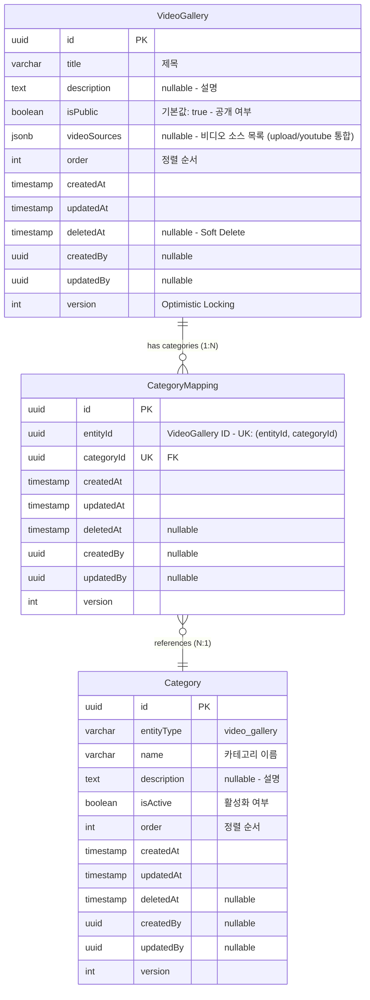

# 비디오갤러리(Video Gallery) ERD 검증 문서

> 📋 **목적**: 비디오갤러리 시나리오에 맞게 ERD가 올바르게 설계되었는지 검증하고, 피그마 작성을 위한 기초 자료로 사용

**작성일**: 2026년 1월 19일  
**버전**: v1.0

---

## 목차

1. [비디오갤러리 시나리오 요구사항](#1-비디오갤러리-시나리오-요구사항)
2. [현재 ERD 구조 분석](#2-현재-erd-구조-분석)
3. [시나리오별 ERD 검증](#3-시나리오별-erd-검증)
4. [검증 결과 요약](#4-검증-결과-요약)
5. [결론](#5-결론)

---

## 1. 비디오갤러리 시나리오 요구사항

### 1.1 API 엔드포인트 기반 기능 요구사항

```
✅ 비디오갤러리_목록을_조회한다 (페이징)
✅ 비디오갤러리_전체_목록을_조회한다
✅ 비디오갤러리_카테고리_목록을_조회한다
✅ 비디오갤러리를_생성한다 (파일 업로드 + YouTube URL)
✅ 비디오갤러리_상세_조회한다
✅ 비디오갤러리를_수정한다 (파일 포함)
✅ 비디오갤러리_공개를_수정한다
✅ 비디오갤러리_오더를_일괄_수정한다
✅ 비디오갤러리를_삭제한다
✅ 비디오갤러리_카테고리를_생성한다
✅ 비디오갤러리_카테고리를_수정한다
✅ 비디오갤러리_카테고리_오더를_변경한다
✅ 비디오갤러리_카테고리를_삭제한다
```

### 1.2 핵심 비즈니스 시나리오 (통합 테이블)

| 시나리오 | API 엔드포인트 | 관련 엔티티 | 주요 필드/기능 | 데이터 흐름 |
|---------|---------------|------------|---------------|------------|
| **1. 비디오갤러리 생성** | `POST /admin/video-galleries` | • VideoGallery | • `VideoGallery.title`<br>• `VideoGallery.description`<br>• `VideoGallery.videoSources` (JSONB)<br>• `VideoGallery.isPublic` (기본값: true)<br>• 비디오 타입: upload/youtube | 1. VideoGallery 생성<br>2. 비디오 파일 S3 업로드<br>3. YouTube URL 파싱<br>4. videoSources JSONB 저장<br>5. 자동 order 계산 |
| **2. 비디오갤러리 수정** | `PUT /admin/video-galleries/:id` | • VideoGallery | • 제목/설명 업데이트<br>• videoSources 완전 교체<br>• AWS S3 연동<br>• 기존 업로드 파일 삭제 | 1. VideoGallery 업데이트<br>2. 기존 S3 업로드 파일 삭제<br>3. 새 비디오 파일 S3 업로드<br>4. YouTube URL 파싱<br>5. videoSources 교체 |
| **3. 공개 상태 관리** | `PATCH /admin/video-galleries/:id/public` | • VideoGallery | • `isPublic` (boolean)<br>• 즉시 공개/비공개 제어<br>• 복잡한 상태 관리 없음 | 1. `isPublic` 필드만 업데이트<br>2. 즉시 반영 (워크플로우 없음) |
| **4. 카테고리 관리** | `POST /admin/video-galleries/categories`<br>`PATCH /admin/video-galleries/:id/categories` | • Category<br>• CategoryMapping<br>• VideoGallery | • `Category.entityType` = 'video_gallery'<br>• `CategoryMapping` (다대다)<br>• UK: (entityId, categoryId) | 1. Category 생성<br>2. CategoryMapping 추가/삭제<br>3. 비디오갤러리 ↔ 카테고리 연결 |
| **5. 정렬 순서 관리** | `PUT /admin/video-galleries/batch-order` | • VideoGallery | • `order` (int)<br>• 배치 업데이트 지원 | 1. 여러 비디오갤러리의 order 값 일괄 변경<br>2. 트랜잭션으로 일관성 보장 |
| **6. 비디오 소스 관리<br>(Upload + YouTube)** | `POST/PUT /admin/video-galleries` | • VideoGallery | • `videoSources` (JSONB 배열)<br>• type: 'upload' \| 'youtube'<br>• 다중 비디오 지원<br>• S3 + YouTube 혼합 | 1. 파일 업로드 → S3 URL 생성<br>2. YouTube URL 직접 입력<br>3. videoSources 배열에 통합 저장<br>4. 수정 시 기존 upload 파일만 S3 삭제 |
| **7. 파일 형식 검증** | `POST/PUT /admin/video-galleries` | • VideoGallery | • 허용 형식: MP4, MPEG, MOV, AVI, WMV, WEBM<br>• MIME 타입 검증<br>• FilesInterceptor | 1. MIME 타입 검증<br>2. 허용되지 않은 형식 거부<br>3. 에러 메시지 반환 |

### 1.3 상세 시나리오 (코드 예시)

<details>
<summary>📝 시나리오 1: 비디오갤러리 생성 - 코드 예시</summary>

```typescript
// 관리자가 새로운 비디오갤러리를 등록 (파일 + YouTube URL 혼합 가능)
POST /admin/video-galleries
Content-Type: multipart/form-data

{
  "title": "회사 소개 영상",
  "description": "루미르 회사 소개 동영상입니다.",
  "files": [File, File, ...],  // 비디오 파일 업로드 (MP4, MOV 등)
  "youtubeUrls": [
    "https://www.youtube.com/watch?v=abc123",
    "https://www.youtube.com/watch?v=def456"
  ]
}

// DB 저장 시:
// - VideoGallery 레코드 생성
// - isPublic: true (기본값, 즉시 공개)
// - order: 자동 계산 (최대값 + 1)
// - videoSources JSONB 저장:
//   [
//     { url: "s3://bucket/video1.mp4", type: "upload", title: "video1.mp4" },
//     { url: "s3://bucket/video2.mp4", type: "upload", title: "video2.mp4" },
//     { url: "https://www.youtube.com/watch?v=abc123", type: "youtube" },
//     { url: "https://www.youtube.com/watch?v=def456", type: "youtube" }
//   ]
```

**videoSources JSONB 구조**:
```typescript
{
  url: string;          // S3 URL 또는 YouTube URL
  type: 'upload' | 'youtube';
  title?: string;       // 파일명 (upload 타입)
  thumbnailUrl?: string; // 썸네일 URL (선택)
}[]
```
</details>

<details>
<summary>📝 시나리오 2: 비디오갤러리 수정 (파일 포함) - 코드 예시</summary>

```typescript
// 기존 비디오갤러리의 내용과 비디오를 수정
PUT /admin/video-galleries/:id
Content-Type: multipart/form-data

{
  "title": "회사 소개 영상 (2024 업데이트)",
  "description": "최신 정보로 업데이트된 동영상입니다.",
  "files": [File, ...],  // 새로운 파일로 완전 교체
  "youtubeUrls": [
    "https://www.youtube.com/watch?v=new123"
  ]
}

// ⚠️ 중요: 비디오 관리 방식 (완전 교체)
// 1. 기존 videoSources 조회
// 2. type='upload'인 비디오: S3에서 파일 삭제
// 3. type='youtube'인 비디오: URL만 삭제 (S3 작업 없음)
// 4. 새 파일 업로드 → S3 URL 생성
// 5. 새 YouTube URL 파싱
// 6. videoSources 완전 교체

// ⚠️ 주의사항:
// - 기존 비디오를 유지하려면 해당 URL을 다시 전송해야 함
// - 전송하지 않은 비디오는 모두 삭제됨
```
</details>

<details>
<summary>📝 시나리오 3: 공개 상태 관리 - 코드 예시</summary>

```typescript
// 비디오갤러리 공개/비공개 설정
PATCH /admin/video-galleries/:id/public
{
  "isPublic": false  // 즉시 비공개로 전환
}

// 비즈니스 로직:
// - isPublic만 업데이트 (단순 토글)
// - 복잡한 상태 관리 없음
// - 즉시 반영
```
</details>

<details>
<summary>📝 시나리오 4: 카테고리 관리 - 코드 예시</summary>

```typescript
// 비디오갤러리 카테고리 생성
POST /admin/video-galleries/categories
{
  "name": "홍보영상",
  "description": "회사 홍보 관련 영상",
  "isActive": true,
  "order": 1
}

// ⚠️ 카테고리는 통합 Category 테이블 사용
// - entityType: 'video_gallery'로 구분
// - 다른 도메인(news, brochure 등)과 동일한 테이블
// - CategoryMapping으로 다대다 관계
```
</details>

<details>
<summary>📝 시나리오 5: 정렬 순서 관리 - 코드 예시</summary>

```typescript
// 여러 비디오갤러리의 순서를 한 번에 변경
PUT /admin/video-galleries/batch-order
{
  "videoGalleries": [
    { "id": "uuid-1", "order": 1 },
    { "id": "uuid-2", "order": 2 },
    { "id": "uuid-3", "order": 3 }
  ]
}

// 비즈니스 로직:
// - 트랜잭션으로 묶어서 처리
// - 전체 성공 또는 전체 실패 (원자성)
// - 프론트엔드에서 드래그 앤 드롭 지원
```
</details>

<details>
<summary>📝 시나리오 6: 비디오 소스 관리 (Upload + YouTube) - 코드 예시</summary>

```typescript
// 비디오 소스 유형별 처리

// 1. 파일 업로드 (type: 'upload')
// - 파일 → S3 업로드
// - S3 URL 생성
// - MIME 타입 검증: video/mp4, video/mpeg, video/quicktime, video/x-msvideo, video/x-ms-wmv, video/webm
const uploadedFiles = await storageService.uploadFiles(files, 'video-galleries');
uploadedFiles.forEach(file => {
  videoSources.push({
    url: file.url,  // s3://bucket/path/video.mp4
    type: 'upload',
    title: file.fileName
  });
});

// 2. YouTube URL (type: 'youtube')
// - URL 파싱
// - 유효성 검증 (선택)
youtubeUrls.forEach(url => {
  videoSources.push({
    url: url.trim(),  // https://www.youtube.com/watch?v=...
    type: 'youtube'
  });
});

// 3. videoSources JSONB 저장
await videoGalleryService.create({
  title: "...",
  videoSources: videoSources  // 배열로 저장
});

// ⚠️ 특징:
// - upload와 youtube를 하나의 배열에 혼합 저장 가능
// - 순서 유지 (배열 순서 = 표시 순서)
// - 각 비디오는 type으로 구분
```
</details>

<details>
<summary>📝 시나리오 7: 파일 형식 검증 - 코드 예시</summary>

```typescript
// FilesInterceptor에서 MIME 타입 검증
@UseInterceptors(
  FilesInterceptor('files', undefined, {
    fileFilter: (req, file, callback) => {
      const allowedMimeTypes = [
        'video/mp4',          // MP4
        'video/mpeg',         // MPEG
        'video/quicktime',    // MOV
        'video/x-msvideo',    // AVI
        'video/x-ms-wmv',     // WMV
        'video/webm',         // WEBM
      ];

      if (allowedMimeTypes.includes(file.mimetype)) {
        callback(null, true);  // 허용
      } else {
        callback(
          new Error(
            `지원하지 않는 파일 형식입니다. 허용된 형식: MP4, MPEG, MOV, AVI, WMV, WEBM (현재: ${file.mimetype})`
          ),
          false
        );
      }
    },
  }),
)

// ⚠️ 검증 실패 시:
// - 400 Bad Request 반환
// - 에러 메시지에 허용 형식 명시
// - 업로드 중단
```
</details>

---

## 2. 현재 ERD 구조 분석

### 2.1 Mermaid ERD



### 2.2 엔티티별 상세 분석

#### 2.2.1 VideoGallery (비디오갤러리) - 핵심 엔티티

**주요 특징**:
- ✅ **다국어 지원 없음**: 내부 콘텐츠, 한국어만 사용
- ✅ **videoSources JSONB**: YouTube URL + S3 업로드 파일 통합 관리
- ✅ **다중 비디오 지원**: 하나의 갤러리에 여러 비디오 포함 가능
- ✅ **공개/비공개 제어**: `isPublic` 필드로 즉시 제어
- ✅ **정렬 순서 관리**: `order` 필드로 표시 순서 제어

**videoSources JSONB 구조**:
```typescript
videoSources: Array<{
  url: string;          // S3 URL 또는 YouTube URL
  type: 'upload' | 'youtube';
  title?: string;       // 파일명 (upload 타입)
  thumbnailUrl?: string; // 썸네일 URL (선택)
}> | null;
```

**허용 비디오 형식**:
- MP4 (`video/mp4`)
- MPEG (`video/mpeg`)
- MOV (`video/quicktime`)
- AVI (`video/x-msvideo`)
- WMV (`video/x-ms-wmv`)
- WEBM (`video/webm`)

**제약 조건**:
- 인덱스: `idx_video_gallery_is_public`, `idx_video_gallery_order`
- Soft Delete: `deletedAt` (복구 가능)
- Optimistic Locking: `version` (동시성 제어)

#### 2.2.2 Category & CategoryMapping - 통합 카테고리

**주요 특징**:
- ✅ **단일 테이블**: 모든 도메인 카테고리를 하나의 테이블로 관리
- ✅ **entityType 구분**: 'video_gallery', 'news', 'brochure' 등
- ✅ **다대다 관계**: CategoryMapping으로 유연한 연결
- ✅ **Unique 제약**: (entityId, categoryId) → 중복 방지

---

## 3. 시나리오별 ERD 검증

### 3.1 검증 결과 요약 테이블

| 시나리오 | 관련 테이블 | 필수 필드 | SQL 작업 | 검증 결과 |
|---------|-----------|----------|---------|----------|
| **1. 비디오갤러리 생성** | VideoGallery | title, videoSources (JSONB), isPublic, order | INSERT (VideoGallery) | ✅ **완벽** - JSONB로 다중 비디오 저장, S3 + YouTube 통합 |
| **2. 비디오갤러리 수정<br>(파일 포함)** | VideoGallery | title, videoSources | UPDATE (VideoGallery)<br>S3 파일 삭제/업로드 | ✅ **완벽** - 완전 교체 방식, upload 파일만 S3 삭제 |
| **3. 공개 상태 관리** | VideoGallery | isPublic | UPDATE (단일 필드) | ✅ **완벽** - 즉시 반영, 단순 토글 |
| **4. 카테고리 관리** | Category<br>CategoryMapping<br>VideoGallery | entityType, name (Category)<br>entityId, categoryId (Mapping) | INSERT/UPDATE (Category)<br>INSERT/DELETE (Mapping) | ✅ **완벽** - UK 제약으로 중복 방지 |
| **5. 정렬 순서 관리** | VideoGallery | order | UPDATE (배치, 트랜잭션) | ✅ **완벽** - 인덱스 지원, 배치 업데이트 |
| **6. 비디오 소스 관리** | VideoGallery | videoSources (JSONB) | UPDATE (JSONB 교체)<br>S3 파일 관리 | ✅ **완벽** - type으로 upload/youtube 구분, 유연한 구조 |
| **7. 파일 형식 검증** | VideoGallery | MIME 타입 검증 | 애플리케이션 레벨 | ✅ **완벽** - FilesInterceptor로 업로드 전 검증 |

### 3.2 상세 데이터 흐름 (접기/펴기)

<details>
<summary>📊 시나리오 1: 비디오갤러리 생성 - SQL 예시</summary>

```sql
-- 1. VideoGallery 생성
INSERT INTO video_galleries (
  id, title, description, is_public, video_sources, "order", created_by, version
) VALUES (
  gen_random_uuid(), 
  '회사 소개 영상',
  '루미르 회사 소개 동영상입니다.',
  true,  -- 기본값: 공개
  '[
    {"url": "s3://bucket/video1.mp4", "type": "upload", "title": "video1.mp4"},
    {"url": "s3://bucket/video2.mp4", "type": "upload", "title": "video2.mp4"},
    {"url": "https://www.youtube.com/watch?v=abc123", "type": "youtube"}
  ]'::jsonb,
  0,  -- 자동 계산된 순서
  'admin-uuid',
  1
);
```

**검증 포인트**:
- ✅ videoSources JSONB 배열로 다중 비디오 저장
- ✅ upload와 youtube 타입 혼합 가능
- ✅ order 자동 계산 (최대값 + 1)
- ✅ isPublic 기본값 true (즉시 공개)
</details>

<details>
<summary>📊 시나리오 2: 비디오갤러리 수정 - 데이터 흐름</summary>

```typescript
// 1. 기존 비디오갤러리 조회
const videoGallery = await findOne({ where: { id } });

// 2. 기존 upload 타입 비디오만 S3에서 삭제
const uploadedVideos = videoGallery.videoSources.filter(v => v.type === 'upload');
if (uploadedVideos.length > 0) {
  const filesToDelete = uploadedVideos.map(v => v.url);
  await storageService.deleteFiles(filesToDelete);
}

// 3. 새 파일 업로드 → S3 URL 생성
const newVideoSources = [];
if (files && files.length > 0) {
  const uploadedFiles = await storageService.uploadFiles(files, 'video-galleries');
  uploadedFiles.forEach(file => {
    newVideoSources.push({
      url: file.url,
      type: 'upload',
      title: file.fileName
    });
  });
}

// 4. YouTube URL 추가
if (youtubeUrls && youtubeUrls.length > 0) {
  youtubeUrls.forEach(url => {
    newVideoSources.push({
      url: url.trim(),
      type: 'youtube'
    });
  });
}

// 5. videoSources 업데이트
await update(id, {
  videoSources: newVideoSources
});

// 6. 내용 업데이트
await update(id, {
  title,
  description,
  updatedBy
});
```

**검증 포인트**:
- ✅ 기존 upload 파일만 S3에서 삭제 (youtube는 URL만 삭제)
- ✅ 새 파일 업로드 후 videoSources 완전 교체
- ✅ 2단계 업데이트: 파일 먼저 → 내용 나중
</details>

<details>
<summary>📊 시나리오 4: 카테고리 관리 - SQL 예시</summary>

```sql
-- 1. 비디오갤러리 카테고리 생성
INSERT INTO categories (
  id, entity_type, name, description, is_active, "order", created_by, version
) VALUES (
  gen_random_uuid(),
  'video_gallery',  -- entityType 구분
  '홍보영상',
  '회사 홍보 관련 영상',
  true,
  1,
  'admin-uuid',
  1
);

-- 2. 비디오갤러리와 카테고리 연결
INSERT INTO category_mappings (
  id, entity_id, category_id, created_by, version
) VALUES (
  gen_random_uuid(),
  'video-gallery-uuid',
  'category-uuid',
  'admin-uuid',
  1
);

-- ⚠️ Unique 제약: (entity_id, category_id)
-- 동일한 카테고리를 중복해서 할당할 수 없음
```

**검증 포인트**:
- ✅ Category 테이블은 모든 도메인 공유
- ✅ entityType으로 video_gallery 구분
- ✅ CategoryMapping으로 다대다 관계
- ✅ UK 제약으로 중복 방지
</details>

<details>
<summary>📊 시나리오 5: 정렬 순서 관리 - SQL 예시</summary>

```sql
-- 여러 비디오갤러리의 순서를 트랜잭션으로 일괄 변경
BEGIN;

UPDATE video_galleries SET "order" = 1, updated_at = NOW() WHERE id = 'uuid-1';
UPDATE video_galleries SET "order" = 2, updated_at = NOW() WHERE id = 'uuid-2';
UPDATE video_galleries SET "order" = 3, updated_at = NOW() WHERE id = 'uuid-3';

COMMIT;
```

**검증 포인트**:
- ✅ 트랜잭션으로 원자성 보장
- ✅ 전체 성공 또는 전체 실패
- ✅ idx_video_gallery_order 인덱스로 빠른 정렬 조회
</details>

<details>
<summary>📊 시나리오 6: 비디오 소스 관리 - JSONB 쿼리</summary>

```sql
-- 1. videoSources 배열에서 특정 타입만 조회
SELECT 
  id, 
  title,
  jsonb_array_elements(video_sources) AS video
FROM video_galleries
WHERE 
  jsonb_array_elements(video_sources)->>'type' = 'youtube';

-- 2. videoSources 배열 크기 조회
SELECT 
  id, 
  title,
  jsonb_array_length(video_sources) AS video_count
FROM video_galleries;

-- 3. videoSources가 있는 비디오갤러리만 조회
SELECT * FROM video_galleries
WHERE video_sources IS NOT NULL
  AND jsonb_array_length(video_sources) > 0;
```

**검증 포인트**:
- ✅ JSONB 함수로 유연한 쿼리 가능
- ✅ type 필드로 upload/youtube 구분
- ✅ 배열 크기, 요소 접근 등 다양한 연산 지원
</details>

---

## 4. 검증 결과 요약

### 4.1 필드별 검증 결과

| 필드/기능 | 구현 여부 | 평가 | 비고 |
|----------|---------|------|-----|
| | **기본 필드** |
| | id (UUID) | ✅ 완벽 | ⭐⭐⭐⭐⭐ | PK |
| | title | ✅ 완벽 | ⭐⭐⭐⭐⭐ | 필수, varchar(500) |
| | description | ✅ 완벽 | ⭐⭐⭐⭐⭐ | nullable, text |
| | isPublic | ✅ 완벽 | ⭐⭐⭐⭐⭐ | 기본값: true |
| | videoSources | ✅ 완벽 | ⭐⭐⭐⭐⭐ | JSONB, 다중 비디오, upload/youtube 통합 |
| | order | ✅ 완벽 | ⭐⭐⭐⭐⭐ | int, 정렬 순서, 인덱스 |
| | **시스템 필드** |
| | createdAt | ✅ 완벽 | ⭐⭐⭐⭐⭐ | 자동 생성 |
| | updatedAt | ✅ 완벽 | ⭐⭐⭐⭐⭐ | 자동 업데이트 |
| | deletedAt | ✅ 완벽 | ⭐⭐⭐⭐⭐ | Soft Delete |
| | createdBy | ✅ 완벽 | ⭐⭐⭐⭐⭐ | SSO 직원 ID |
| | updatedBy | ✅ 완벽 | ⭐⭐⭐⭐⭐ | SSO 직원 ID |
| | version | ✅ 완벽 | ⭐⭐⭐⭐⭐ | Optimistic Locking |
| | **관계** |
| | Category | ✅ 완벽 | ⭐⭐⭐⭐⭐ | 통합 카테고리, 다대다 |
| | **제약 조건** |
| | 인덱스 | ✅ 완벽 | ⭐⭐⭐⭐⭐ | isPublic, order |
| | Soft Delete | ✅ 완벽 | ⭐⭐⭐⭐⭐ | 복구 가능 |
| | Optimistic Locking | ✅ 완벽 | ⭐⭐⭐⭐⭐ | 동시성 제어 |

### 4.2 ERD 강점 분석 (테이블)

| 강점 | 설명 | 관련 필드/테이블 | 비즈니스 가치 |
|-----|------|-----------------|--------------|
| ✅ **videoSources JSONB** | 다중 비디오 통합 관리 (YouTube + Upload) | `videoSources` | 유연성, 확장성, 다양한 소스 지원 |
| ✅ **타입 구분** | upload/youtube 타입으로 명확한 구분 | `videoSources.type` | S3 관리 최적화, 선택적 삭제 |
| ✅ **다중 비디오 지원** | 하나의 갤러리에 여러 비디오 포함 가능 | `videoSources` (배열) | 콘텐츠 풍부성, 사용자 편의성 |
| ✅ **파일 형식 검증** | MIME 타입 검증으로 허용 형식만 업로드 | FilesInterceptor | 데이터 품질, 보안 강화 |
| ✅ **공개/비공개 제어** | isPublic 필드로 즉시 제어 | `isPublic` | 빠른 공개 관리, 워크플로우 없음 |
| ✅ **통합 카테고리** | 단일 테이블로 모든 도메인 카테고리 관리 | `Category`, `CategoryMapping` | 관리 단순화, 확장 용이 |
| ✅ **정렬 순서 관리** | order 필드 + 배치 업데이트 | `order` | UX 개선, 드래그 앤 드롭 지원 |
| ✅ **S3 연동** | 파일 업로드/삭제 자동화 | `videoSources.url` | 스토리지 관리 자동화 |
| ✅ **데이터 무결성** | UK 제약, Soft Delete, Optimistic Locking | 모든 테이블 | 데이터 일관성, 동시성 제어 |

### 4.3 개선 제안 사항 (우선순위별)

| 우선순위 | 개선 항목 | 현재 상태 | 제안 내용 | 기대 효과 |
|---------|----------|----------|----------|----------|
| 🟢 **낮음** | 비디오 재생 횟수 추적 | 추적 기능 없음 | `viewCount` 필드 추가 고려 | 인기 비디오 분석 |
| 🟢 **낮음** | 비디오 duration 저장 | 메타데이터 없음 | `videoSources.duration` 추가 고려 | 재생 시간 표시 |
| 🟢 **낮음** | 썸네일 자동 생성 | 수동 설정 | 비디오 업로드 시 자동 썸네일 생성 | UX 개선 |
| 🟢 **낮음** | 비디오 변환 이력 | 이력 없음 | VideoConversionLog 테이블 고려 | 변환 실패 추적 |

**참고**:
- 🔴 **높음**: 코드 품질 및 유지보수에 직접 영향
- 🟡 **중간**: 분석 및 모니터링 요구사항에 따라 결정
- 🟢 **낮음**: 비즈니스 요구사항 변경 시에만 필요

---

## 5. 결론

### ✅ 최종 검증 결과

비디오갤러리 시나리오에 맞게 ERD가 **완벽하게 설계**되어 있습니다.

**강점**:
1. ✅ **videoSources JSONB**: YouTube URL + S3 업로드 파일을 하나의 배열로 통합 관리
2. ✅ **타입 구분**: upload/youtube 타입으로 S3 파일 관리 최적화 (삭제 시 upload만 처리)
3. ✅ **다중 비디오 지원**: 하나의 갤러리에 여러 비디오 포함 가능, 순서 유지
4. ✅ **파일 형식 검증**: FilesInterceptor로 업로드 전 MIME 타입 검증 (MP4, MOV, AVI 등)
5. ✅ **공개/비공개 제어**: isPublic 필드로 즉시 제어, 복잡한 워크플로우 없음
6. ✅ **통합 카테고리**: 단일 Category 테이블로 모든 도메인 카테고리 관리
7. ✅ **정렬 순서 관리**: order 필드 + 배치 업데이트, 트랜잭션 보장
8. ✅ **데이터 무결성**: UK 제약조건, Soft Delete, Optimistic Locking

**핵심 메커니즘**:
- 🎬 **비디오 소스 통합**: YouTube + S3 Upload를 JSONB 배열로 통합, type 필드로 구분
- 📁 **완전 교체 방식**: 수정 시 기존 비디오 전부 삭제 후 새 비디오로 교체 (일관성)
- 🔐 **선택적 삭제**: upload 타입만 S3에서 삭제, youtube는 URL만 삭제
- 📊 **JSONB 활용**: 유연한 구조, 다양한 쿼리 지원, 확장성
- 🗂️ **통합 카테고리**: entityType='video_gallery'로 구분, 다대다 관계

**ERD 설계의 강점**:
- ✅ **유연성**: JSONB로 다양한 비디오 소스 지원 (YouTube, Vimeo 등 추가 가능)
- ✅ **확장성**: videoSources 배열에 메타데이터 추가 가능 (duration, resolution 등)
- ✅ **효율성**: type 필드로 S3 파일만 선택적 삭제, 스토리지 비용 절감
- ✅ **일관성**: 완전 교체 방식으로 데이터 일관성 보장
- ✅ **성능**: 인덱스 (isPublic, order)로 빠른 조회 및 정렬

**개선 제안**:
1. 💡 비디오 재생 횟수 추적이 필요하다면 `viewCount` 필드 추가 고려
2. 💡 비디오 재생 시간 표시가 필요하다면 `videoSources.duration` 추가 고려
3. 💡 썸네일 자동 생성이 필요하다면 비디오 업로드 시 자동 처리 고려

---

**문서 종료**
