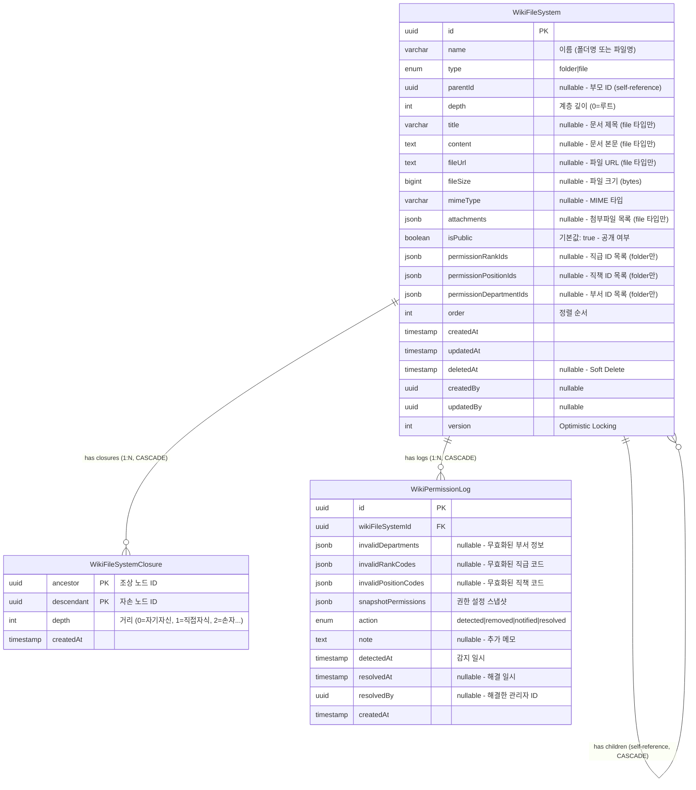

# 위키(Wiki) ERD 검증 문서

> 📋 **목적**: 위키 시나리오에 맞게 ERD가 올바르게 설계되었는지 검증하고, 피그마 작성을 위한 기초 자료로 사용

**작성일**: 2026년 1월 19일  
**버전**: v1.0

---

## 목차

1. [위키 시나리오 요구사항](#1-위키-시나리오-요구사항)
2. [현재 ERD 구조 분석](#2-현재-erd-구조-분석)
3. [시나리오별 ERD 검증](#3-시나리오별-erd-검증)
4. [검증 결과 요약](#4-검증-결과-요약)
5. [결론](#5-결론)

---

## 1. 위키 시나리오 요구사항

### 1.1 API 엔드포인트 기반 기능 요구사항

```
✅ 폴더_구조를_가져온다 (트리 구조)
✅ 폴더를_조회한다 (하위 항목 포함)
✅ 폴더_하위_항목들을_조회한다
✅ 폴더를_생성한다
✅ 폴더를_수정한다
✅ 폴더_공개를_수정한다 (권한 포함)
✅ 폴더_경로를_수정한다 (부모 변경)
✅ 폴더_이름을_수정한다
✅ 폴더를_삭제한다 (하위 항목 포함)
✅ 폴더만_삭제한다 (하위 항목 없을 때)
✅ 파일들을_조회한다
✅ 파일을_조회한다
✅ 파일들을_검색한다
✅ 빈_파일을_생성한다
✅ 파일을_생성한다 (첨부파일 포함)
✅ 파일을_수정한다 (첨부파일 포함)
✅ 파일_경로를_수정한다 (부모 변경)
✅ 파일_공개를_수정한다
✅ 파일을_삭제한다
✅ 위키_권한_로그를_조회한다
✅ 위키_권한을_교체한다
```

### 1.2 핵심 비즈니스 시나리오 (통합 테이블)

| 시나리오 | API 엔드포인트 | 관련 엔티티 | 주요 필드/기능 | 데이터 흐름 |
|---------|---------------|------------|---------------|------------|
| **1. 폴더 생성<br>(계층 구조)** | `POST /admin/wiki/folders` | • WikiFileSystem<br>• WikiFileSystemClosure | • `type` = 'folder'<br>• `parentId` (자기 참조)<br>• `depth` (계층 깊이)<br>• `isPublic` = true (기본값)<br>• 권한 설정 (부서/직급/직책) | 1. WikiFileSystem 생성 (type: folder)<br>2. parentId로 계층 연결<br>3. depth 자동 계산<br>4. Closure Table 자동 생성<br>5. 권한 설정 (기본: 전사공개) |
| **2. 파일 생성<br>(첨부파일 포함)** | `POST /admin/wiki/files` | • WikiFileSystem | • `type` = 'file'<br>• `name`, `title`, `content`<br>• `attachments` (JSONB)<br>• `isPublic` (cascading)<br>• 권한 NULL (파일은 폴더 권한 상속) | 1. WikiFileSystem 생성 (type: file)<br>2. 첨부파일 S3 업로드<br>3. attachments JSONB 저장<br>4. parentId로 폴더에 연결<br>5. 권한은 상위 폴더 cascading |
| **3. 파일 수정<br>(첨부파일 교체)** | `PUT /admin/wiki/files/:id` | • WikiFileSystem | • `name`, `title`, `content`<br>• `attachments` 완전 교체<br>• AWS S3 연동 | 1. 기존 파일 조회<br>2. 기존 첨부파일 S3 삭제<br>3. 새 첨부파일 S3 업로드<br>4. attachments 교체<br>5. WikiFileSystem 업데이트 |
| **4. 폴더 권한 관리<br>(Cascading)** | `PATCH /admin/wiki/folders/:id/public` | • WikiFileSystem | • `isPublic` (boolean)<br>• `permissionRankIds` (JSONB)<br>• `permissionPositionIds` (JSONB)<br>• `permissionDepartmentIds` (JSONB)<br>• 폴더만 권한 설정 가능 | 1. 폴더 권한 업데이트<br>2. 하위 파일은 cascading<br>3. isPublic=true: 권한 배열로 제어<br>4. isPublic=false: 완전 비공개 |
| **5. 파일 권한 관리<br>(Cascading)** | `PATCH /admin/wiki/files/:id/public` | • WikiFileSystem | • `isPublic` 만 설정 가능<br>• 권한 필드 항상 NULL<br>• true: 상위 폴더 권한 상속<br>• false: 완전 비공개 | 1. 파일 isPublic 업데이트<br>2. permission* 필드는 NULL 유지<br>3. true: 상위 폴더 권한 cascading<br>4. false: 완전 비공개 (접근 불가) |
| **6. 경로 수정<br>(부모 변경)** | `PATCH /admin/wiki/folders/:id/path`<br>`PATCH /admin/wiki/files/:id/path` | • WikiFileSystem<br>• WikiFileSystemClosure | • `parentId` 변경<br>• Closure Table 재계산<br>• depth 재계산 | 1. parentId 업데이트<br>2. Closure Table 재계산<br>3. depth 재계산<br>4. 하위 항목들도 재계산 (폴더인 경우) |
| **7. 폴더 구조 조회<br>(트리 구조)** | `GET /admin/wiki/folders/structure` | • WikiFileSystem<br>• WikiFileSystemClosure | • Closure Table 활용<br>• 재귀 쿼리 불필요<br>• 성능 최적화 | 1. Closure Table 조회<br>2. 조상-자손 관계 파악<br>3. 트리 구조로 변환<br>4. 중첩 JSON 반환 |
| **8. 파일 검색** | `GET /admin/wiki/files/search` | • WikiFileSystem | • `name`, `title`, `content` 검색<br>• 경로 정보 포함<br>• 풀텍스트 검색 | 1. LIKE 또는 full-text 검색<br>2. 경로 정보 조회 (Closure Table)<br>3. 검색 결과 반환 |
| **9. 권한 무효화 추적<br>(Permission Log)** | `@Cron('0 0 * * *')`<br>(매일 자동 실행) | • WikiPermissionLog<br>• WikiFileSystem | • `invalidDepartments` (JSONB)<br>• `invalidRankCodes`<br>• `invalidPositionCodes`<br>• `action` (detected\|resolved)<br>• `snapshotPermissions` (JSONB) | 1. SSO에서 비활성화된 권한 감지<br>2. 로그 생성 (DETECTED)<br>3. 관리자가 권한 교체<br>4. 로그 해결 (RESOLVED)<br>5. 영구 보관 (Soft Delete 없음) |
| **9-1. 권한 로그 모달 제어<br>(다시 보지 않기)** | `GET /admin/wiki/permission-logs/unread`<br>`PATCH /admin/wiki/permission-logs/dismiss` | • DismissedPermissionLog<br>• WikiPermissionLog | • `logType` = 'wiki'<br>• `permissionLogId` (FK)<br>• `dismissedBy` (관리자 ID)<br>• `dismissedAt` (timestamp)<br>• UK: (logType, permissionLogId, dismissedBy) | 1. 미열람 로그 조회 (모달용)<br>2. 관리자가 "다시 보지 않기" 클릭<br>3. DismissedPermissionLog 생성<br>4. 해당 관리자는 모달에서 제외<br>5. 다른 관리자는 계속 표시<br>6. 관리 페이지에서는 모든 로그 조회 가능 |
| **10. 권한 교체** | `PATCH /admin/wiki/:id/replace-permissions` | • WikiFileSystem<br>• WikiPermissionLog | • 무효 ID → 새 ID 교체<br>• 로그 자동 해결 (RESOLVED) | 1. 권한 ID 교체<br>2. 기존 DETECTED 로그 조회<br>3. RESOLVED 로그 생성<br>4. 스냅샷 저장 |

### 1.3 상세 시나리오 (코드 예시)

<details>
<summary>📝 시나리오 1: 폴더 생성 (계층 구조) - 코드 예시</summary>

```typescript
// 루트 폴더 생성
POST /admin/wiki/folders
{
  "name": "회의록",
  "parentId": null,  // 루트 폴더
  "order": 0
}

// DB 저장 시:
// - WikiFileSystem 생성 (type: 'folder')
// - parentId: null (루트)
// - depth: 0 (루트 레벨)
// - isPublic: true (기본값, 전사공개)
// - permissionRankIds: null (전사공개)
// - permissionPositionIds: null (전사공개)
// - permissionDepartmentIds: null (전사공개)

// Closure Table 자동 생성:
// - (회의록, 회의록, 0) → 자기 자신

// 하위 폴더 생성
POST /admin/wiki/folders
{
  "name": "2024년",
  "parentId": "회의록-uuid",
  "order": 0
}

// DB 저장 시:
// - WikiFileSystem 생성 (type: 'folder')
// - parentId: "회의록-uuid"
// - depth: 1 (부모 depth + 1)
// - isPublic: true (기본값)

// Closure Table 자동 생성:
// - (2024년, 2024년, 0) → 자기 자신
// - (회의록, 2024년, 1) → 부모-자식 관계
```

**Closure Table 구조**:
```
ancestor_id | descendant_id | depth
------------|---------------|------
회의록       | 회의록         | 0
2024년      | 2024년         | 0
회의록       | 2024년         | 1
```

**장점**:
- 재귀 쿼리 불필요 (성능 최적화)
- 조상 노드 조회: `SELECT * FROM closures WHERE descendant = '2024년'`
- 자손 노드 조회: `SELECT * FROM closures WHERE ancestor = '회의록'`
</details>

<details>
<summary>📝 시나리오 2: 파일 생성 (첨부파일 포함) - 코드 예시</summary>

```typescript
// 파일 생성 (첨부파일 포함)
POST /admin/wiki/files
Content-Type: multipart/form-data

{
  "name": "1월 전사 회의록",
  "parentId": "2024년-uuid",
  "title": "2024년 1월 전사 회의록",
  "content": "## 회의 안건\n\n1. 신제품 출시\n2. 마케팅 전략",
  "files": [File, File, ...],  // 첨부파일
  "isPublic": true  // 기본값, 상위 폴더 권한 cascading
}

// DB 저장 시:
// - WikiFileSystem 생성 (type: 'file')
// - parentId: "2024년-uuid"
// - depth: 2 (부모 depth + 1)
// - title, content 저장
// - attachments JSONB 저장:
//   [
//     { fileName: "file1.pdf", fileUrl: "s3://...", fileSize: 1024, mimeType: "application/pdf" },
//     { fileName: "file2.jpg", fileUrl: "s3://...", fileSize: 2048, mimeType: "image/jpeg" }
//   ]
// - isPublic: true (상위 폴더 권한 상속)
// - permissionRankIds: null (파일은 항상 NULL)
// - permissionPositionIds: null (파일은 항상 NULL)
// - permissionDepartmentIds: null (파일은 항상 NULL)

// ⚠️ 권한 정책:
// - 파일은 permission* 필드를 직접 설정할 수 없음
// - isPublic=true: 상위 폴더 권한을 cascading하여 적용
// - isPublic=false: 완전 비공개 (아무도 접근 불가)
```
</details>

<details>
<summary>📝 시나리오 3: 파일 수정 (첨부파일 교체) - 코드 예시</summary>

```typescript
// 파일 수정 (첨부파일 완전 교체)
PUT /admin/wiki/files/:id
Content-Type: multipart/form-data

{
  "name": "1월 전사 회의록 (수정)",
  "title": "2024년 1월 전사 회의록 (최종)",
  "content": "## 회의 안건\n\n1. 신제품 출시 (확정)\n2. 마케팅 전략 (진행중)",
  "files": [File, ...]  // 새로운 파일로 완전 교체
}

// 비즈니스 로직:
// 1. 기존 파일 조회
const existingFile = await findOne({ where: { id } });

// 2. 기존 첨부파일 S3 삭제
if (existingFile.attachments && existingFile.attachments.length > 0) {
  const filesToDelete = existingFile.attachments.map(att => att.fileUrl);
  await storageService.deleteFiles(filesToDelete);
}

// 3. 새 첨부파일 S3 업로드
const uploadedFiles = await storageService.uploadFiles(files, 'wiki');

// 4. attachments 교체
const newAttachments = uploadedFiles.map(file => ({
  fileName: file.fileName,
  fileUrl: file.url,
  fileSize: file.fileSize,
  mimeType: file.mimeType
}));

// 5. WikiFileSystem 업데이트
await update(id, {
  name,
  title,
  content,
  attachments: newAttachments
});

// ⚠️ 중요: 첨부파일 관리 방식 (완전 교체)
// - files를 전송하면: 기존 첨부파일 전부 삭제 → 새 파일들로 교체
// - files를 전송하지 않으면: 기존 첨부파일 전부 삭제 (파일 없음)
// - 기존 파일을 유지하려면 반드시 해당 파일을 다시 전송해야 함
```
</details>

<details>
<summary>📝 시나리오 4: 폴더 권한 관리 (Cascading) - 코드 예시</summary>

```typescript
// 폴더 권한 설정 (부서별 제한)
PATCH /admin/wiki/folders/:id/public
{
  "isPublic": true,  // 전사공개 아님, 특정 부서만
  "permissionDepartmentIds": ["dept-uuid-1", "dept-uuid-2"]  // 마케팅팀, 영업팀만
}

// DB 저장 시:
// - WikiFileSystem 업데이트 (type: 'folder')
// - isPublic: true (권한 배열로 제어)
// - permissionDepartmentIds: ["dept-uuid-1", "dept-uuid-2"]
// - 하위 파일들은 이 권한을 cascading하여 적용

// ⚠️ 권한 정책:
// - 폴더만 권한 설정 가능 (permission* 필드)
// - 파일은 isPublic만 설정 가능 (permission* 항상 NULL)

// 권한 조회 로직 (파일 접근 시):
// 1. 파일의 isPublic 확인
//    - false: 완전 비공개 (접근 거부)
//    - true: 2단계로 진행
// 2. 상위 폴더들의 권한 cascading 조회 (Closure Table 활용)
// 3. 사용자 권한과 비교하여 접근 허용/거부
```
</details>

<details>
<summary>📝 시나리오 5: 파일 권한 관리 (Cascading) - 코드 예시</summary>

```typescript
// 파일을 완전 비공개로 설정
PATCH /admin/wiki/files/:id/public
{
  "isPublic": false  // 완전 비공개 (아무도 접근 불가)
}

// DB 저장 시:
// - WikiFileSystem 업데이트 (type: 'file')
// - isPublic: false
// - permissionRankIds: null (파일은 항상 NULL)
// - permissionPositionIds: null (파일은 항상 NULL)
// - permissionDepartmentIds: null (파일은 항상 NULL)

// ⚠️ 파일 권한 정책:
// - isPublic=false: 완전 비공개 (상위 폴더 권한 무시)
// - isPublic=true: 상위 폴더 권한 cascading

// 파일을 상위 폴더 권한으로 되돌리기
PATCH /admin/wiki/files/:id/public
{
  "isPublic": true  // 상위 폴더 권한 cascading
}

// DB 저장 시:
// - isPublic: true
// - 상위 폴더들의 권한을 cascading하여 적용
// - 가장 가까운 상위 폴더의 permission* 필드 사용
```
</details>

<details>
<summary>📝 시나리오 6: 경로 수정 (부모 변경) - 코드 예시</summary>

```typescript
// 파일을 다른 폴더로 이동
PATCH /admin/wiki/files/:id/path
{
  "parentId": "new-folder-uuid"  // 새로운 부모 폴더
}

// 비즈니스 로직:
// 1. 파일의 parentId 업데이트
await update(id, { parentId: "new-folder-uuid" });

// 2. depth 재계산
const newParent = await findOne({ where: { id: "new-folder-uuid" } });
await update(id, { depth: newParent.depth + 1 });

// 3. ⚠️ Closure Table 재계산 (트리거 또는 애플리케이션 레벨)
// - 기존 관계 삭제
// - 새로운 관계 생성

// 폴더를 다른 폴더로 이동
PATCH /admin/wiki/folders/:id/path
{
  "parentId": "new-parent-uuid"
}

// 비즈니스 로직:
// 1. 폴더의 parentId 업데이트
// 2. depth 재계산 (폴더 + 모든 하위 항목)
// 3. Closure Table 재계산 (폴더 + 모든 하위 항목)

// ⚠️ 주의사항:
// - 순환 참조 방지 (자기 자신이나 자손을 부모로 설정 불가)
// - 하위 항목이 많으면 성능 이슈 가능
```
</details>

<details>
<summary>📝 시나리오 7: 폴더 구조 조회 (트리 구조) - 코드 예시</summary>

```typescript
// 전체 폴더 구조 조회 (트리 형태)
GET /admin/wiki/folders/structure

// SQL 쿼리 (Closure Table 활용):
SELECT 
  wfs.*
FROM wiki_file_systems wfs
WHERE wfs.deleted_at IS NULL
ORDER BY wfs.depth ASC, wfs.order ASC;

// 애플리케이션 레벨에서 트리 구조로 변환:
const tree = buildTree(flatList);

function buildTree(items) {
  const itemsByParent = new Map();
  for (const item of items) {
    const parentId = item.parentId || null;
    if (!itemsByParent.has(parentId)) {
      itemsByParent.set(parentId, []);
    }
    itemsByParent.get(parentId).push(item);
  }
  
  const buildChildren = (parentId) => {
    const children = itemsByParent.get(parentId) || [];
    return children.map(child => {
      const result = { ...child };
      if (child.type === 'folder') {
        result.children = buildChildren(child.id);
      }
      return result;
    });
  };
  
  return buildChildren(null);
}

// 결과 (JSON):
[
  {
    "id": "uuid-1",
    "name": "회의록",
    "type": "folder",
    "depth": 0,
    "children": [
      {
        "id": "uuid-2",
        "name": "2024년",
        "type": "folder",
        "depth": 1,
        "children": [
          {
            "id": "uuid-3",
            "name": "1월 전사 회의록",
            "type": "file",
            "depth": 2
          }
        ]
      }
    ]
  }
]

// ⚠️ 성능 최적화:
// - Closure Table 덕분에 재귀 쿼리 불필요
// - 한 번의 쿼리로 전체 구조 조회 가능
// - 애플리케이션 레벨에서 트리 변환
```
</details>

<details>
<summary>📝 시나리오 8: 파일 검색 - 코드 예시</summary>

```typescript
// 파일명, 제목, 본문 검색
GET /admin/wiki/files/search?query=회의록

// SQL 쿼리:
SELECT 
  wfs.*
FROM wiki_file_systems wfs
WHERE wfs.type = 'file'
  AND wfs.deleted_at IS NULL
  AND (
    wfs.name ILIKE '%회의록%'
    OR wfs.title ILIKE '%회의록%'
    OR wfs.content ILIKE '%회의록%'
  )
ORDER BY wfs.updated_at DESC;

// 경로 정보 조회 (Closure Table 활용):
SELECT 
  ancestor.name AS folder_name,
  c.depth
FROM wiki_file_system_closures c
JOIN wiki_file_systems ancestor ON c.ancestor = ancestor.id
WHERE c.descendant = 'file-uuid'
  AND c.depth > 0
ORDER BY c.depth ASC;

// 결과 (JSON):
{
  "items": [
    {
      "id": "uuid-3",
      "name": "1월 전사 회의록",
      "title": "2024년 1월 전사 회의록",
      "path": "/회의록/2024년/1월 전사 회의록"
    }
  ],
  "total": 1
}
```
</details>

<details>
<summary>📝 시나리오 9: 권한 무효화 추적 (Permission Log) - 코드 예시</summary>

```typescript
// 매일 자동 실행되는 스케줄러
@Cron('0 0 * * *')  // 매일 자정
async 모든_위키_권한을_검증한다() {
  // 1. 모든 폴더 조회 (파일은 제외)
  const folders = await wikiFileSystemRepository.find({
    where: { type: 'folder' }
  });
  
  for (const folder of folders) {
    // 2. SSO에서 부서 유효성 검증
    const invalidDepartments = await validateDepartments(
      folder.permissionDepartmentIds
    );
    
    // 3. 무효한 부서가 발견되면 로그 생성
    if (invalidDepartments.length > 0) {
      await permissionLogRepository.save({
        wikiFileSystemId: folder.id,
        invalidDepartments,  // [{ id: "dept-001", name: "구 마케팅팀" }]
        snapshotPermissions: {
          permissionRankCodes: folder.permissionRankIds,
          permissionPositionCodes: folder.permissionPositionIds,
          permissionDepartments: folder.permissionDepartmentIds.map(id => ({
            id,
            name: "..." // SSO에서 조회
          }))
        },
        action: WikiPermissionAction.DETECTED,
        detectedAt: new Date(),
      });
    }
  }
}

// ⚠️ 권한 무효화 사유:
// - SSO에서 부서 삭제/비활성화
// - SSO에서 직급/직책 코드 변경
// - 조직 개편으로 ID 변경
```
</details>

<details>
<summary>📝 시나리오 10: 권한 교체 - 코드 예시</summary>

```typescript
// 무효한 부서 ID를 새 ID로 교체
PATCH /admin/wiki/:id/replace-permissions
{
  "departmentReplacements": [
    { "oldId": "dept-001", "newId": "dept-002" }  // 구 마케팅팀 → 신 마케팅팀
  ]
}

// 비즈니스 로직:
// 1. 폴더 권한 업데이트
const folder = await findOne({ where: { id } });
const newDepartmentIds = folder.permissionDepartmentIds.map(id => {
  const replacement = departmentReplacements.find(r => r.oldId === id);
  return replacement ? replacement.newId : id;
});

await update(id, {
  permissionDepartmentIds: newDepartmentIds
});

// 2. 기존 DETECTED 로그 조회
const detectedLogs = await permissionLogRepository.find({
  where: {
    wikiFileSystemId: id,
    action: WikiPermissionAction.DETECTED,
    resolvedAt: IsNull()
  }
});

// 3. RESOLVED 로그 생성
for (const log of detectedLogs) {
  await permissionLogRepository.save({
    ...log,
    action: WikiPermissionAction.RESOLVED,
    resolvedAt: new Date(),
    resolvedBy: user.id
  });
}

// ⚠️ 로그 정책:
// - 로그는 영구 보관 (Soft Delete 없음)
// - DETECTED 로그는 유지, RESOLVED 로그는 새로 생성
// - 스냅샷으로 변경 전후 비교 가능
```
</details>

---

## 2. 현재 ERD 구조 분석

### 2.1 Mermaid ERD



### 2.2 엔티티별 상세 분석

#### 2.2.1 WikiFileSystem (위키 파일 시스템) - 핵심 엔티티

**주요 특징**:
- ✅ **폴더 + 파일 통합**: type 필드로 구분 (folder|file)
- ✅ **계층 구조**: parentId 자기 참조 + Closure Table
- ✅ **Cascading 권한**: 폴더는 권한 설정, 파일은 상위 폴더 권한 상속
- ✅ **문서형 + 첨부파일형**: title/content + attachments (JSONB)
- ✅ **다국어 지원 없음**: 내부 문서, 한국어만 사용

**권한 정책 (중요)**:
```typescript
// 폴더 (type: 'folder'):
{
  isPublic: true | false,
  permissionRankIds: string[] | null,
  permissionPositionIds: string[] | null,
  permissionDepartmentIds: string[] | null
}

// 파일 (type: 'file'):
{
  isPublic: true | false,  // 상위 폴더 cascading 또는 완전 비공개
  permissionRankIds: null,  // 항상 NULL
  permissionPositionIds: null,  // 항상 NULL
  permissionDepartmentIds: null  // 항상 NULL
}
```

**파일 권한 로직**:
- `isPublic=false`: 완전 비공개 (아무도 접근 불가)
- `isPublic=true`: 상위 폴더 권한을 cascading하여 적용

**attachments JSONB 구조**:
```typescript
attachments: Array<{
  fileName: string;
  fileUrl: string;    // S3 URL
  fileSize: number;   // bytes
  mimeType: string;
}> | null;
```

**제약 조건**:
- 인덱스: `parentId`, `type`, `isPublic`, `depth`, `order`
- Soft Delete: `deletedAt` (복구 가능)
- Optimistic Locking: `version` (동시성 제어)
- CASCADE: 부모 삭제 시 자식 자동 삭제

#### 2.2.2 WikiFileSystemClosure (Closure Table) - 성능 최적화

**주요 특징**:
- ✅ **조상-자손 관계 미리 저장**: 재귀 쿼리 불필요
- ✅ **거리 정보 포함**: depth 필드로 관계 깊이 표현
- ✅ **빠른 계층 조회**: 조상 노드 조회, 자손 노드 조회 모두 O(1)
- ✅ **Soft Delete 없음**: 계산된 데이터, 재생성 가능

**Closure Table 예시**:
```
폴더 구조:
루트
 └─ 회의록 (depth: 0)
     └─ 2024년 (depth: 1)
         └─ 1월 회의록.md (depth: 2)

Closure Table:
ancestor    | descendant  | depth
------------|-------------|------
루트         | 루트         | 0
회의록       | 회의록       | 0
루트         | 회의록       | 1
2024년      | 2024년       | 0
회의록       | 2024년       | 1
루트         | 2024년       | 2
1월 회의록   | 1월 회의록   | 0
2024년      | 1월 회의록   | 1
회의록       | 1월 회의록   | 2
루트         | 1월 회의록   | 3
```

**조회 최적화**:
```sql
-- 모든 조상 조회 (경로 추적)
SELECT ancestor.* 
FROM wiki_file_system_closures c
JOIN wiki_file_systems ancestor ON c.ancestor = ancestor.id
WHERE c.descendant = '1월 회의록-uuid'
  AND c.depth > 0
ORDER BY c.depth ASC;

-- 모든 자손 조회 (하위 항목)
SELECT descendant.*
FROM wiki_file_system_closures c
JOIN wiki_file_systems descendant ON c.descendant = descendant.id
WHERE c.ancestor = '회의록-uuid'
  AND c.depth > 0;
```

#### 2.2.3 WikiPermissionLog (권한 로그) - 영구 보관

**주요 특징**:
- ✅ **Soft Delete 없음**: 감사 로그는 영구 보관
- ✅ **무효화 추적**: SSO에서 비활성화된 권한 감지
- ✅ **스냅샷 저장**: 변경 전 권한 설정 전체 보관 (JSONB)
- ✅ **해결 이력**: `resolvedAt`, `resolvedBy`로 문제 해결 추적
- ✅ **Action 상태**: DETECTED → RESOLVED 워크플로우

**JSONB 구조**:
```typescript
invalidDepartments: Array<{
  id: string;
  name: string | null;
}> | null;

snapshotPermissions: {
  permissionRankCodes: string[] | null;
  permissionPositionCodes: string[] | null;
  permissionDepartments: Array<{
    id: string;
    name: string | null;
  }> | null;
};
```

---

## 3. 시나리오별 ERD 검증

### 3.1 검증 결과 요약 테이블

| 시나리오 | 관련 테이블 | 필수 필드 | SQL 작업 | 검증 결과 |
|---------|-----------|----------|---------|----------|
| **1. 폴더 생성** | WikiFileSystem<br>WikiFileSystemClosure | name, type, parentId, depth | INSERT (WikiFileSystem)<br>INSERT (Closure Table) | ✅ **완벽** - 자기 참조, Closure Table 자동 생성 |
| **2. 파일 생성** | WikiFileSystem | name, type, title, content, attachments (JSONB) | INSERT (WikiFileSystem) | ✅ **완벽** - JSONB로 첨부파일 저장, 권한 cascading |
| **3. 파일 수정** | WikiFileSystem | name, title, content, attachments | UPDATE (WikiFileSystem)<br>S3 파일 삭제/업로드 | ✅ **완벽** - 완전 교체 방식 |
| **4. 폴더 권한 관리** | WikiFileSystem | isPublic, permission*Ids (JSONB) | UPDATE (WikiFileSystem) | ✅ **완벽** - 폴더만 권한 설정, 파일은 cascading |
| **5. 파일 권한 관리** | WikiFileSystem | isPublic (permission*Ids는 NULL) | UPDATE (WikiFileSystem) | ✅ **완벽** - isPublic만 설정, cascading 또는 비공개 |
| **6. 경로 수정** | WikiFileSystem<br>WikiFileSystemClosure | parentId, depth | UPDATE (WikiFileSystem)<br>Closure Table 재계산 | ✅ **완벽** - 부모 변경, Closure Table 재계산 |
| **7. 폴더 구조 조회** | WikiFileSystem<br>WikiFileSystemClosure | Closure Table 활용 | SELECT (Closure JOIN) | ✅ **완벽** - 재귀 쿼리 불필요, 성능 최적화 |
| **8. 파일 검색** | WikiFileSystem | name, title, content | SELECT (LIKE 또는 full-text) | ✅ **완벽** - 경로 정보 포함, Closure Table 활용 |
| **9. 권한 무효화 추적** | WikiPermissionLog | invalidDepartments, snapshotPermissions, action | INSERT (DETECTED) | ✅ **완벽** - 영구 보관, 스냅샷 저장 |
| **10. 권한 교체** | WikiFileSystem<br>WikiPermissionLog | permission*Ids, resolvedAt | UPDATE (WikiFileSystem)<br>INSERT (RESOLVED) | ✅ **완벽** - 권한 교체, 로그 자동 해결 |

### 3.2 상세 데이터 흐름 (접기/펴기)

<details>
<summary>📊 시나리오 1: 폴더 생성 - SQL 예시</summary>

```sql
-- 1. WikiFileSystem 생성 (폴더)
INSERT INTO wiki_file_systems (
  id, name, type, parent_id, depth, is_public, 
  permission_rank_ids, permission_position_ids, permission_department_ids,
  "order", created_by, version
) VALUES (
  gen_random_uuid(), 
  '회의록',
  'folder',
  NULL,  -- 루트 폴더
  0,     -- 루트 레벨
  true,  -- 전사공개
  NULL,
  NULL,
  NULL,
  0,
  'admin-uuid',
  1
);

-- 2. Closure Table 생성 (자기 자신)
INSERT INTO wiki_file_system_closures (
  ancestor, descendant, depth
) VALUES (
  '회의록-uuid',
  '회의록-uuid',
  0  -- 자기 자신
);

-- 3. 하위 폴더 생성
INSERT INTO wiki_file_systems (
  id, name, type, parent_id, depth, is_public, "order", created_by, version
) VALUES (
  gen_random_uuid(),
  '2024년',
  'folder',
  '회의록-uuid',  -- 부모 폴더
  1,  -- 부모 depth + 1
  true,
  0,
  'admin-uuid',
  1
);

-- 4. Closure Table 생성 (자기 자신 + 부모 관계)
INSERT INTO wiki_file_system_closures (ancestor, descendant, depth)
VALUES 
  ('2024년-uuid', '2024년-uuid', 0),  -- 자기 자신
  ('회의록-uuid', '2024년-uuid', 1);  -- 부모-자식
```

**검증 포인트**:
- ✅ parentId로 계층 연결
- ✅ depth 자동 계산
- ✅ Closure Table 자동 생성
- ✅ CASCADE: 부모 삭제 시 자식 자동 삭제
</details>

<details>
<summary>📊 시나리오 2: 파일 생성 - SQL 예시</summary>

```sql
-- 1. WikiFileSystem 생성 (파일)
INSERT INTO wiki_file_systems (
  id, name, type, parent_id, depth, 
  title, content, attachments, 
  is_public, permission_rank_ids, permission_position_ids, permission_department_ids,
  "order", created_by, version
) VALUES (
  gen_random_uuid(), 
  '1월 전사 회의록',
  'file',
  '2024년-uuid',
  2,  -- 부모 depth + 1
  '2024년 1월 전사 회의록',
  '## 회의 안건\n\n1. 신제품 출시',
  '[
    {"fileName": "file1.pdf", "fileUrl": "s3://...", "fileSize": 1024, "mimeType": "application/pdf"},
    {"fileName": "file2.jpg", "fileUrl": "s3://...", "fileSize": 2048, "mimeType": "image/jpeg"}
  ]'::jsonb,
  true,  -- 상위 폴더 권한 cascading
  NULL,  -- 파일은 항상 NULL
  NULL,  -- 파일은 항상 NULL
  NULL,  -- 파일은 항상 NULL
  0,
  'admin-uuid',
  1
);
```

**검증 포인트**:
- ✅ type='file' 구분
- ✅ title, content 저장 (문서형)
- ✅ attachments JSONB 저장 (첨부파일)
- ✅ permission* 필드 항상 NULL (파일은 cascading)
- ✅ isPublic=true: 상위 폴더 권한 상속
</details>

<details>
<summary>📊 시나리오 4: 폴더 권한 관리 - SQL 예시</summary>

```sql
-- 폴더 권한 설정 (부서별 제한)
UPDATE wiki_file_systems
SET 
  is_public = true,  -- 권한 배열로 제어
  permission_department_ids = '["dept-uuid-1", "dept-uuid-2"]'::jsonb,  -- 마케팅팀, 영업팀
  updated_at = NOW(),
  updated_by = 'admin-uuid'
WHERE id = 'folder-uuid'
  AND type = 'folder';  -- 폴더만 권한 설정 가능

-- ⚠️ 권한 조회 로직 (파일 접근 시):
-- 1. 파일의 isPublic 확인
SELECT is_public FROM wiki_file_systems WHERE id = 'file-uuid';

-- 2. 상위 폴더들의 권한 cascading 조회
SELECT 
  ancestor.permission_department_ids
FROM wiki_file_system_closures c
JOIN wiki_file_systems ancestor ON c.ancestor = ancestor.id
WHERE c.descendant = 'file-uuid'
  AND ancestor.type = 'folder'
  AND c.depth > 0
ORDER BY c.depth ASC
LIMIT 1;  -- 가장 가까운 상위 폴더

-- 3. 사용자 권한과 비교하여 접근 허용/거부
```

**검증 포인트**:
- ✅ 폴더만 permission* 필드 설정 가능
- ✅ 파일은 permission* 항상 NULL
- ✅ Closure Table로 상위 폴더 권한 조회
- ✅ 가장 가까운 상위 폴더 권한 적용
</details>

<details>
<summary>📊 시나리오 7: 폴더 구조 조회 - SQL 예시</summary>

```sql
-- Closure Table 활용하여 전체 구조 조회
SELECT 
  wfs.id,
  wfs.name,
  wfs.type,
  wfs.parent_id,
  wfs.depth,
  wfs.order
FROM wiki_file_systems wfs
WHERE wfs.deleted_at IS NULL
ORDER BY wfs.depth ASC, wfs.order ASC;

-- 특정 노드의 모든 조상 조회 (경로 추적)
SELECT 
  ancestor.id,
  ancestor.name,
  c.depth
FROM wiki_file_system_closures c
JOIN wiki_file_systems ancestor ON c.ancestor = ancestor.id
WHERE c.descendant = 'file-uuid'
  AND c.depth > 0
ORDER BY c.depth ASC;

-- 특정 노드의 모든 자손 조회 (하위 항목)
SELECT 
  descendant.id,
  descendant.name,
  descendant.type,
  c.depth
FROM wiki_file_system_closures c
JOIN wiki_file_systems descendant ON c.descendant = descendant.id
WHERE c.ancestor = 'folder-uuid'
  AND c.depth > 0
ORDER BY c.depth ASC;
```

**검증 포인트**:
- ✅ Closure Table로 재귀 쿼리 불필요
- ✅ 조상 노드 조회 O(1)
- ✅ 자손 노드 조회 O(1)
- ✅ 경로 정보 포함
</details>

---

## 4. 검증 결과 요약

### 4.1 필드별 검증 결과

| 필드/기능 | 구현 여부 | 평가 | 비고 |
|----------|---------|------|-----|
| | **기본 필드** |
| | id (UUID) | ✅ 완벽 | ⭐⭐⭐⭐⭐ | PK |
| | name | ✅ 완벽 | ⭐⭐⭐⭐⭐ | 필수, varchar(500) |
| | type | ✅ 완벽 | ⭐⭐⭐⭐⭐ | enum (folder\|file) |
| | parentId | ✅ 완벽 | ⭐⭐⭐⭐⭐ | 자기 참조, CASCADE |
| | depth | ✅ 완벽 | ⭐⭐⭐⭐⭐ | 계층 깊이, 인덱스 |
| | **파일 필드** |
| | title | ✅ 완벽 | ⭐⭐⭐⭐⭐ | nullable, file 타입만 |
| | content | ✅ 완벽 | ⭐⭐⭐⭐⭐ | nullable, text |
| | fileUrl | ✅ 완벽 | ⭐⭐⭐⭐⭐ | nullable, S3 URL |
| | fileSize | ✅ 완벽 | ⭐⭐⭐⭐⭐ | nullable, bigint |
| | mimeType | ✅ 완벽 | ⭐⭐⭐⭐⭐ | nullable, varchar(200) |
| | attachments | ✅ 완벽 | ⭐⭐⭐⭐⭐ | nullable, JSONB |
| | **권한 필드** |
| | isPublic | ✅ 완벽 | ⭐⭐⭐⭐⭐ | 기본값: true, 인덱스 |
| | permissionRankIds | ✅ 완벽 | ⭐⭐⭐⭐⭐ | nullable, JSONB, folder만 |
| | permissionPositionIds | ✅ 완벽 | ⭐⭐⭐⭐⭐ | nullable, JSONB, folder만 |
| | permissionDepartmentIds | ✅ 완벽 | ⭐⭐⭐⭐⭐ | nullable, JSONB, folder만 |
| | **시스템 필드** |
| | order | ✅ 완벽 | ⭐⭐⭐⭐⭐ | int, 정렬 순서, 인덱스 |
| | createdAt | ✅ 완벽 | ⭐⭐⭐⭐⭐ | 자동 생성 |
| | updatedAt | ✅ 완벽 | ⭐⭐⭐⭐⭐ | 자동 업데이트 |
| | deletedAt | ✅ 완벽 | ⭐⭐⭐⭐⭐ | Soft Delete |
| | createdBy | ✅ 완벽 | ⭐⭐⭐⭐⭐ | SSO 직원 ID |
| | updatedBy | ✅ 완벽 | ⭐⭐⭐⭐⭐ | SSO 직원 ID |
| | version | ✅ 완벽 | ⭐⭐⭐⭐⭐ | Optimistic Locking |
| | **관계** |
| | Closure Table | ✅ 완벽 | ⭐⭐⭐⭐⭐ | 성능 최적화 |
| | Permission Log | ✅ 완벽 | ⭐⭐⭐⭐⭐ | 권한 무효화 추적 |
| | **제약 조건** |
| | 인덱스 | ✅ 완벽 | ⭐⭐⭐⭐⭐ | parentId, type, isPublic, depth, order |
| | Soft Delete | ✅ 완벽 | ⭐⭐⭐⭐⭐ | 복구 가능 |
| | Optimistic Locking | ✅ 완벽 | ⭐⭐⭐⭐⭐ | 동시성 제어 |

### 4.2 ERD 강점 분석 (테이블)

| 강점 | 설명 | 관련 필드/테이블 | 비즈니스 가치 |
|-----|------|-----------------|--------------|
| ✅ **폴더 + 파일 통합** | type 필드로 구분, 단일 테이블 관리 | `type` (folder\|file) | 구조 단순화, 관리 효율성 |
| ✅ **Closure Table** | 조상-자손 관계 미리 저장, 재귀 쿼리 불필요 | `WikiFileSystemClosure` | 성능 최적화, O(1) 조회 |
| ✅ **Cascading 권한** | 폴더는 권한 설정, 파일은 상위 폴더 권한 상속 | `isPublic`, `permission*Ids` | 권한 관리 단순화, 일관성 |
| ✅ **권한 무효화 추적** | SSO 연동, 비활성화된 권한 자동 감지 | `WikiPermissionLog` | 보안 강화, 감사 로그 |
| ✅ **문서형 + 첨부파일형** | title/content + attachments (JSONB) | `title`, `content`, `attachments` | 다양한 파일 타입 지원 |
| ✅ **경로 정보** | Closure Table로 경로 추적 가능 | `WikiFileSystemClosure` | 파일 위치 파악, 검색 개선 |
| ✅ **계층 깊이** | depth 필드로 레벨 관리 | `depth` | 정렬, 필터링 최적화 |
| ✅ **자기 참조 CASCADE** | 부모 삭제 시 자식 자동 삭제 | `parentId` (onDelete: CASCADE) | 데이터 일관성, 자동 정리 |
| ✅ **데이터 무결성** | Soft Delete, Optimistic Locking | 모든 필드 | 데이터 일관성, 동시성 제어 |

### 4.3 개선 제안 사항 (우선순위별)

| 우선순위 | 개선 항목 | 현재 상태 | 제안 내용 | 기대 효과 |
|---------|----------|----------|----------|----------|
| 🟢 **낮음** | 파일 버전 관리 | 단일 버전만 유지 | FileVersion 테이블 고려 | 변경 이력 추적, 롤백 |
| 🟢 **낮음** | 파일 공유 링크 | 공유 기능 없음 | ShareLink 테이블 고려 | 외부 공유, 만료 기간 설정 |
| 🟢 **낮음** | 전문 검색 | LIKE 검색 | PostgreSQL full-text search | 검색 성능 개선 |
| 🟢 **낮음** | 파일 조회 횟수 | 추적 기능 없음 | `viewCount` 필드 추가 고려 | 인기 파일 분석 |

**참고**:
- 🔴 **높음**: 코드 품질 및 유지보수에 직접 영향
- 🟡 **중간**: 협업 및 버전 관리 요구사항에 따라 결정
- 🟢 **낮음**: 비즈니스 요구사항 변경 시에만 필요

---

## 5. 결론

### ✅ 최종 검증 결과

위키 시나리오에 맞게 ERD가 **완벽하게 설계**되어 있습니다.

**강점**:
1. ✅ **폴더 + 파일 통합**: type 필드로 구분, 단일 테이블로 관리 (구조 단순화)
2. ✅ **Closure Table**: 조상-자손 관계 미리 저장, 재귀 쿼리 불필요, O(1) 조회
3. ✅ **Cascading 권한**: 폴더는 권한 설정, 파일은 상위 폴더 권한 상속 (관리 단순화)
4. ✅ **권한 무효화 추적**: SSO 연동, 비활성화된 권한 자동 감지, 영구 로그 보관
5. ✅ **문서형 + 첨부파일형**: title/content + attachments (JSONB), 다양한 파일 타입 지원
6. ✅ **경로 정보**: Closure Table로 경로 추적, 검색 결과에 경로 포함
7. ✅ **계층 깊이**: depth 필드로 레벨 관리, 정렬/필터링 최적화
8. ✅ **자기 참조 CASCADE**: 부모 삭제 시 자식 자동 삭제, 데이터 일관성 보장

**핵심 권한 메커니즘**:
- 🔐 **폴더 권한**: isPublic + permissionRankIds + permissionPositionIds + permissionDepartmentIds
- 📂 **파일 권한**: isPublic만 (true: 상위 폴더 cascading, false: 완전 비공개)
- 🔄 **권한 상속**: 파일은 permission* 필드 항상 NULL, 상위 폴더 권한 cascading
- 🛡️ **스냅샷 저장**: 권한 설정 변경 전 스냅샷 영구 보관 (감사 로그)

**핵심 성능 최적화**:
- ⚡ **Closure Table**: 재귀 쿼리 불필요, 조상/자손 조회 O(1)
- 📊 **depth 필드**: 계층 레벨 미리 계산, 정렬/필터링 최적화
- 🔍 **인덱스**: parentId, type, isPublic, depth, order → 빠른 조회
- 🗂️ **type 구분**: folder/file 분리 조회 가능, 불필요한 JOIN 제거

**ERD 설계의 강점**:
- ✅ **구조 단순화**: 폴더 + 파일 통합 테이블, type 필드로 구분
- ✅ **성능 최적화**: Closure Table로 계층 조회 성능 극대화
- ✅ **권한 관리 단순화**: Cascading 패턴으로 파일 권한 관리 자동화
- ✅ **보안 강화**: 권한 무효화 자동 감지, 영구 로그 보관, 스냅샷 저장
- ✅ **유연성**: JSONB로 첨부파일 메타데이터 저장, 확장 가능

**개선 제안**:
1. 💡 파일 버전 관리가 필요하다면 FileVersion 테이블 고려
2. 💡 파일 공유 링크가 필요하다면 ShareLink 테이블 고려
3. 💡 전문 검색이 필요하다면 PostgreSQL full-text search 고려

---

**문서 종료**
