# Announcement Context 데이터 흐름

## 📋 목차

1. [개요](#1-개요)
2. [도메인 모델](#2-도메인-모델)
3. [Command 흐름](#3-command-흐름)
4. [Query 흐름](#4-query-흐름)
5. [주요 비즈니스 로직](#5-주요-비즈니스-로직)
6. [연관 Context](#6-연관-context)

---

## 1. 개요

### 1.1 책임

**Announcement Context**는 내부 공지사항 관리를 담당합니다.

**주요 기능**:
- 공지사항 생성, 수정, 삭제
- 공지사항 목록 조회 (필터링, 정렬, 페이지네이션)
- 공지사항 상세 조회
- 공개/고정 상태 관리
- 순서 관리 (개별/일괄)
- 읽음 표시 (Lazy Creation 패턴)
- 카테고리 매핑
- 권한 관리 (직원, 직급, 직책, 부서)

### 1.2 관련 엔티티

**Core Domain**:
- `Announcement` - 공지사항 (Core)
- `AnnouncementRead` - 읽음 표시 (Core)

**Common Domain**:
- `Category` - 카테고리 (Common)
- `CategoryMapping` - 카테고리 매핑 (Common)

**Sub Domain**:
- `Survey` - 설문조사 (Sub, 공지사항 연동)

### 1.3 핸들러 구성

**Commands (7개)**:
- `CreateAnnouncementHandler` - 공지사항 생성
- `UpdateAnnouncementHandler` - 공지사항 수정
- `UpdateAnnouncementPublicHandler` - 공개 상태 변경
- `UpdateAnnouncementFixedHandler` - 고정 상태 변경
- `UpdateAnnouncementOrderHandler` - 순서 변경
- `UpdateAnnouncementBatchOrderHandler` - 일괄 순서 변경
- `DeleteAnnouncementHandler` - 공지사항 삭제

**Queries (2개)**:
- `GetAnnouncementListHandler` - 목록 조회
- `GetAnnouncementDetailHandler` - 상세 조회

---

## 2. 도메인 모델

### 2.1 Announcement Entity

```typescript
@Entity('announcements')
export class Announcement extends BaseEntity {
  @Column({ type: 'varchar', length: 255 })
  title: string;

  @Column({ type: 'text' })
  content: string;

  @Column({ type: 'boolean', default: false })
  isPublic: boolean;

  @Column({ type: 'boolean', default: false })
  isFixed: boolean;

  @Column({ type: 'int', default: 0 })
  order: number;

  @Column({ type: 'timestamp', nullable: true })
  dueDate: Date | null;

  // 파일 첨부
  @Column({ type: 'jsonb', nullable: true })
  attachedFileUrls: string[] | null;

  // 권한 관리 (JSONB)
  @Column({ type: 'jsonb', nullable: true })
  permissionEmployeeIds: string[] | null;

  @Column({ type: 'jsonb', nullable: true })
  permissionRankCodes: string[] | null;

  @Column({ type: 'jsonb', nullable: true })
  permissionPositionCodes: string[] | null;

  @Column({ type: 'jsonb', nullable: true })
  permissionDepartmentCodes: string[] | null;

  // 관계
  @OneToMany(() => AnnouncementRead, read => read.announcement)
  reads: AnnouncementRead[];

  @OneToOne(() => Survey, survey => survey.announcement)
  survey: Survey;
}
```

### 2.2 AnnouncementRead Entity (Lazy Creation)

```typescript
@Entity('announcement_reads')
export class AnnouncementRead extends BaseEntity {
  @Column({ type: 'uuid' })
  announcementId: string;

  @Column({ type: 'uuid' })
  employeeId: string; // 외부 SSO 직원 ID

  @Column({ type: 'timestamp' })
  readAt: Date;

  @ManyToOne(() => Announcement, announcement => announcement.reads)
  announcement: Announcement;
}
```

**특징**:
- **Lazy Creation**: 직원이 공지사항을 읽을 때만 레코드 생성
- **확장성**: N명의 직원이 있어도 읽은 사람만큼만 레코드 생성
- **성능**: 배치 처리 불필요

### 2.3 ERD

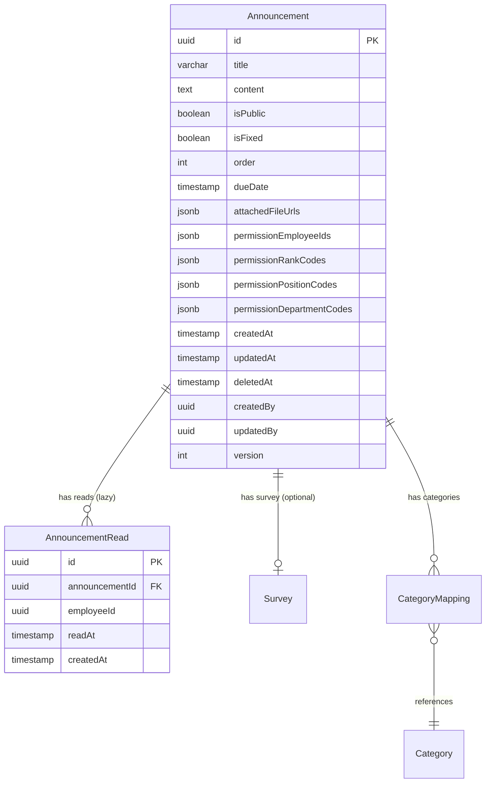

---

## 3. Command 흐름

### 3.1 공지사항 생성 (CreateAnnouncement)

**전체 흐름 다이어그램**:

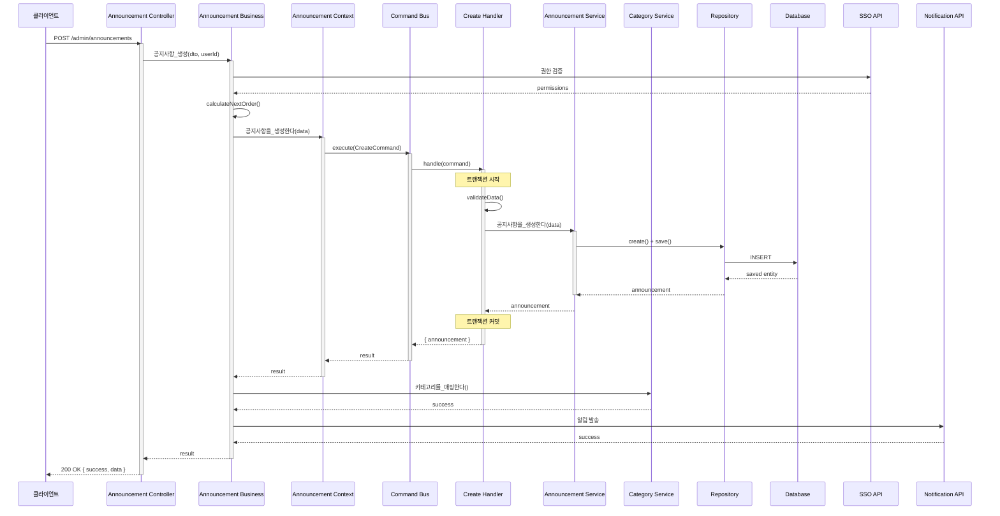

**핵심 로직**:

```typescript
// 1. Controller
@Post()
async create(@Body() dto: CreateAnnouncementDto, @CurrentUser() user) {
  return await this.announcementBusinessService.공지사항_생성(dto, user.id);
}

// 2. Business Service
async 공지사항_생성(dto: CreateAnnouncementDto, userId: string) {
  // 권한 검증 (SSO)
  await this.validatePermissions(userId);

  // 순서 계산
  const order = await this.calculateNextOrder();

  // Context 호출
  const result = await this.announcementContextService.공지사항을_생성한다({
    ...dto,
    order,
    createdBy: userId,
  });

  // 카테고리 매핑
  if (dto.categoryIds?.length > 0) {
    await this.categoryService.카테고리를_매핑한다(
      result.announcement.id,
      dto.categoryIds,
    );
  }

  // 알림 발송 (Notification API)
  await this.sendNotification(result.announcement);

  return result;
}

// 3. Command Handler
@CommandHandler(CreateAnnouncementCommand)
async execute(command: CreateAnnouncementCommand) {
  // 검증
  this.validateData(command.data);

  // 생성
  const announcement = await this.announcementService.공지사항을_생성한다(
    command.data,
  );

  return { announcement };
}

// 4. Domain Service
async 공지사항을_생성한다(data: Partial<Announcement>) {
  const announcement = this.announcementRepository.create(data);
  return await this.announcementRepository.save(announcement);
}
```

### 3.2 공지사항 수정 (UpdateAnnouncement)

**흐름 다이어그램**:

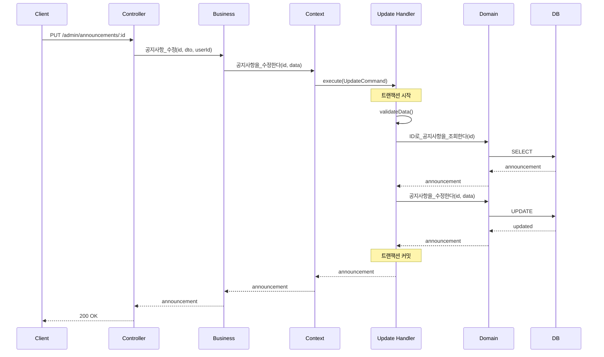

### 3.3 순서 일괄 변경 (UpdateAnnouncementBatchOrder)

**흐름 다이어그램**:

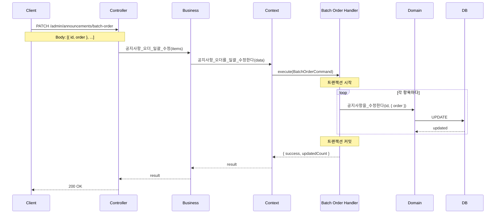

**핵심 로직**:

```typescript
@CommandHandler(UpdateAnnouncementBatchOrderCommand)
async execute(command: UpdateAnnouncementBatchOrderCommand) {
  let updatedCount = 0;

  for (const item of command.data.items) {
    await this.announcementService.공지사항을_수정한다(item.id, {
      order: item.order,
    });
    updatedCount++;
  }

  return { success: true, updatedCount };
}
```

### 3.4 공지사항 삭제 (DeleteAnnouncement)

**흐름 다이어그램**:

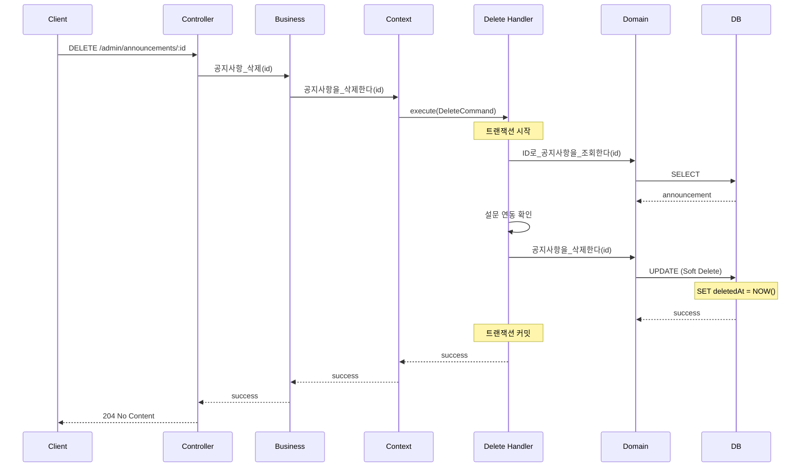

**핵심 로직**:

```typescript
@CommandHandler(DeleteAnnouncementCommand)
async execute(command: DeleteAnnouncementCommand) {
  // 존재 확인
  const announcement = await this.announcementService.ID로_공지사항을_조회한다(
    command.id,
  );

  // 설문 연동 확인
  if (announcement.survey) {
    throw new BadRequestException(
      '설문이 연동된 공지사항은 삭제할 수 없습니다',
    );
  }

  // Soft Delete
  await this.announcementService.공지사항을_삭제한다(command.id);

  return { success: true };
}
```

---

## 4. Query 흐름

### 4.1 공지사항 목록 조회 (GetAnnouncementList)

**흐름 다이어그램**:

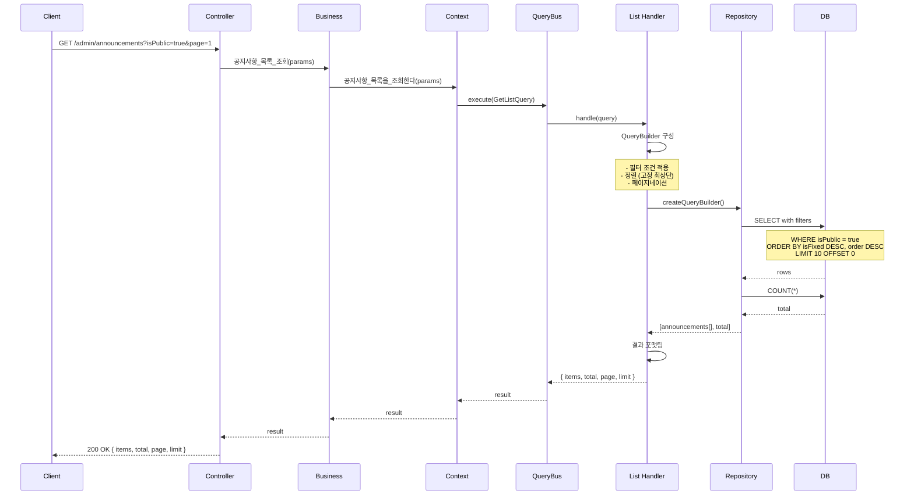

**핵심 로직**:

```typescript
@QueryHandler(GetAnnouncementListQuery)
async execute(query: GetAnnouncementListQuery) {
  const queryBuilder = this.repository.createQueryBuilder('announcement');

  // 필터 조건
  if (query.isPublic !== undefined) {
    queryBuilder.where('announcement.isPublic = :isPublic', { 
      isPublic: query.isPublic 
    });
  }

  if (query.isFixed !== undefined) {
    queryBuilder.andWhere('announcement.isFixed = :isFixed', { 
      isFixed: query.isFixed 
    });
  }

  // 정렬 (고정 공지 최상단)
  queryBuilder.orderBy('announcement.isFixed', 'DESC');

  if (query.orderBy === 'order') {
    queryBuilder.addOrderBy('announcement.order', 'DESC');
  } else {
    queryBuilder.addOrderBy('announcement.createdAt', 'DESC');
  }

  // 페이지네이션
  const skip = (query.page - 1) * query.limit;
  queryBuilder.skip(skip).take(query.limit);

  const [items, total] = await queryBuilder.getManyAndCount();

  return { items, total, page: query.page, limit: query.limit };
}
```

**쿼리 최적화**:
- ✅ 필요한 컬럼만 선택 (select 절 명시)
- ✅ 인덱스 활용 (isPublic, isFixed, order)
- ✅ 페이지네이션으로 데이터 제한
- ✅ 카테고리 등 관계는 필요시에만 join

### 4.2 공지사항 상세 조회 (GetAnnouncementDetail)

**흐름 다이어그램**:

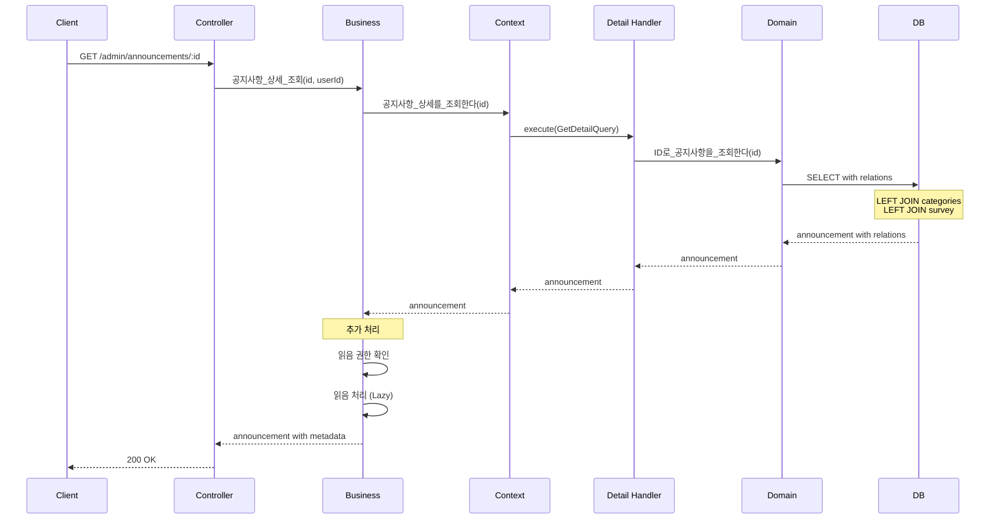

**핵심 로직**:

```typescript
// Query Handler
@QueryHandler(GetAnnouncementDetailQuery)
async execute(query: GetAnnouncementDetailQuery) {
  const announcement = await this.repository.findOne({
    where: { id: query.id },
    relations: ['categoryMappings', 'categoryMappings.category', 'survey'],
  });

  if (!announcement) {
    throw new NotFoundException('공지사항을 찾을 수 없습니다');
  }

  return announcement;
}

// Business Service
async 공지사항_상세_조회(id: string, userId: string) {
  const announcement = await this.contextService.공지사항_상세를_조회한다(id);

  // 권한 확인
  const hasPermission = await this.checkReadPermission(announcement, userId);
  if (!hasPermission) {
    throw new ForbiddenException('조회 권한이 없습니다');
  }

  // 읽음 처리 (Lazy Creation)
  await this.markAsRead(id, userId);

  return announcement;
}
```

---

## 5. 주요 비즈니스 로직

### 5.1 읽음 처리 (Lazy Creation Pattern)

**개념**:
- 직원이 공지사항을 읽을 때만 `AnnouncementRead` 레코드 생성
- N명의 직원이 있어도 읽은 사람만큼만 레코드 생성
- 확장성 대폭 향상

**흐름**:

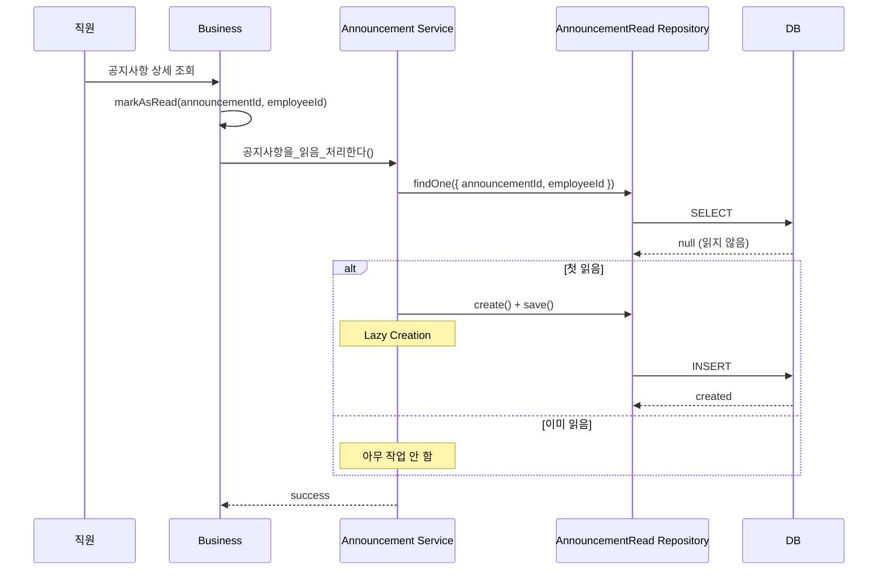

**코드 구현**:

```typescript
// Domain Service
async 공지사항을_읽음_처리한다(
  announcementId: string,
  employeeId: string,
): Promise<void> {
  // 기존 읽음 레코드 확인
  const existingRead = await this.readRepository.findOne({
    where: { announcementId, employeeId },
  });

  // Lazy Creation: 읽지 않았을 때만 생성
  if (!existingRead) {
    const read = this.readRepository.create({
      announcementId,
      employeeId,
      readAt: new Date(),
    });
    await this.readRepository.save(read);
  }
}
```

**장점**:
- ✅ 확장성: 1000명 직원 중 10명만 읽으면 10개 레코드만 생성
- ✅ 성능: 배치 처리 불필요
- ✅ 비용: 스토리지 절약

### 5.2 권한 관리

**권한 필터 구조**:

```typescript
interface AnnouncementPermission {
  permissionEmployeeIds?: string[];      // 특정 직원
  permissionRankCodes?: string[];        // 직급 (사원, 대리, 과장, ...)
  permissionPositionCodes?: string[];    // 직책 (팀장, 본부장, ...)
  permissionDepartmentCodes?: string[];  // 부서 (개발팀, 영업팀, ...)
}
```

**권한 확인 로직**:

```mermaid
flowchart TD
    Start[권한 확인 시작] --> CheckEmployee{특정 직원 ID<br/>목록 있음?}
    
    CheckEmployee -->|Yes| InEmployeeList{userId가<br/>목록에 있음?}
    CheckEmployee -->|No| CheckRank
    
    InEmployeeList -->|Yes| Allow[접근 허용]
    InEmployeeList -->|No| Deny[접근 거부]
    
    CheckRank{직급 목록<br/>있음?} -->|Yes| GetUserInfo[SSO에서 사용자 정보 조회]
    CheckRank -->|No| CheckPosition
    
    GetUserInfo --> InRankList{사용자 직급이<br/>목록에 있음?}
    InRankList -->|Yes| Allow
    InRankList -->|No| Deny
    
    CheckPosition{직책 목록<br/>있음?} -->|Yes| InPositionList{사용자 직책이<br/>목록에 있음?}
    CheckPosition -->|No| CheckDept
    
    InPositionList -->|Yes| Allow
    InPositionList -->|No| Deny
    
    CheckDept{부서 목록<br/>있음?} -->|Yes| InDeptList{사용자 부서가<br/>목록에 있음?}
    CheckDept -->|No| AllowAll[모든 직원 허용]
    
    InDeptList -->|Yes| Allow
    InDeptList -->|No| Deny
```

**코드 구현**:

```typescript
async checkReadPermission(
  announcement: Announcement,
  userId: string,
): Promise<boolean> {
  // 1. 특정 직원 목록 체크
  if (announcement.permissionEmployeeIds?.length > 0) {
    return announcement.permissionEmployeeIds.includes(userId);
  }

  // 2. SSO에서 사용자 정보 조회
  const userInfo = await this.ssoService.getUserInfo(userId);

  // 3. 직급 체크
  if (announcement.permissionRankCodes?.length > 0) {
    if (!announcement.permissionRankCodes.includes(userInfo.rankCode)) {
      return false;
    }
  }

  // 4. 직책 체크
  if (announcement.permissionPositionCodes?.length > 0) {
    if (!announcement.permissionPositionCodes.includes(userInfo.positionCode)) {
      return false;
    }
  }

  // 5. 부서 체크
  if (announcement.permissionDepartmentCodes?.length > 0) {
    if (!announcement.permissionDepartmentCodes.includes(userInfo.departmentCode)) {
      return false;
    }
  }

  // 모든 조건을 통과하거나 권한 필터가 없으면 허용
  return true;
}
```

### 5.3 알림 발송 연동

**흐름**:

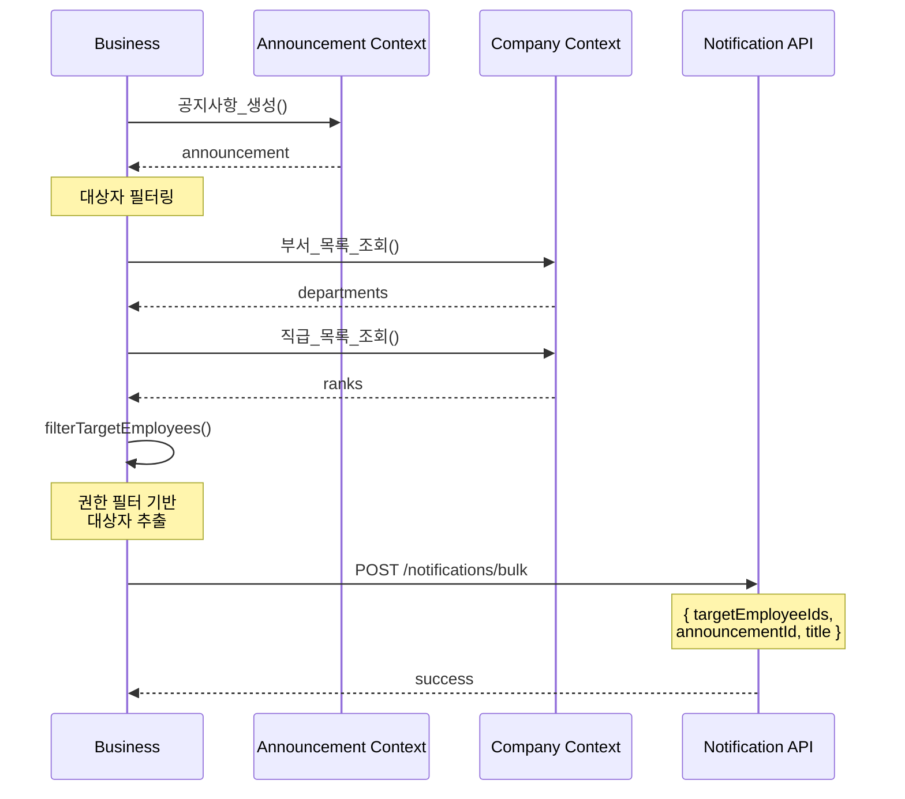

**대상자 필터링 코드**:

```typescript
async filterTargetEmployees(announcement: Announcement): Promise<string[]> {
  // 특정 직원 지정
  if (announcement.permissionEmployeeIds?.length > 0) {
    return announcement.permissionEmployeeIds;
  }

  let targetIds: string[] = [];

  // 부서 필터
  if (announcement.permissionDepartmentCodes?.length > 0) {
    const depts = await this.companyContextService.부서_목록_조회();
    const targetDepts = depts.filter(d =>
      announcement.permissionDepartmentCodes.includes(d.code)
    );
    targetIds = targetDepts.flatMap(d => d.employeeIds);
  }

  // 직급 필터 (교집합)
  if (announcement.permissionRankCodes?.length > 0) {
    const ranks = await this.companyContextService.직급_목록_조회();
    const targetRanks = ranks.filter(r =>
      announcement.permissionRankCodes.includes(r.code)
    );
    const rankEmployeeIds = targetRanks.flatMap(r => r.employeeIds);

    if (targetIds.length > 0) {
      targetIds = targetIds.filter(id => rankEmployeeIds.includes(id));
    } else {
      targetIds = rankEmployeeIds;
    }
  }

  return targetIds;
}
```

---

## 6. 연관 Context

### 6.1 Survey Context 연동

**관계**: Announcement (1) ↔ (0..1) Survey

**흐름**:

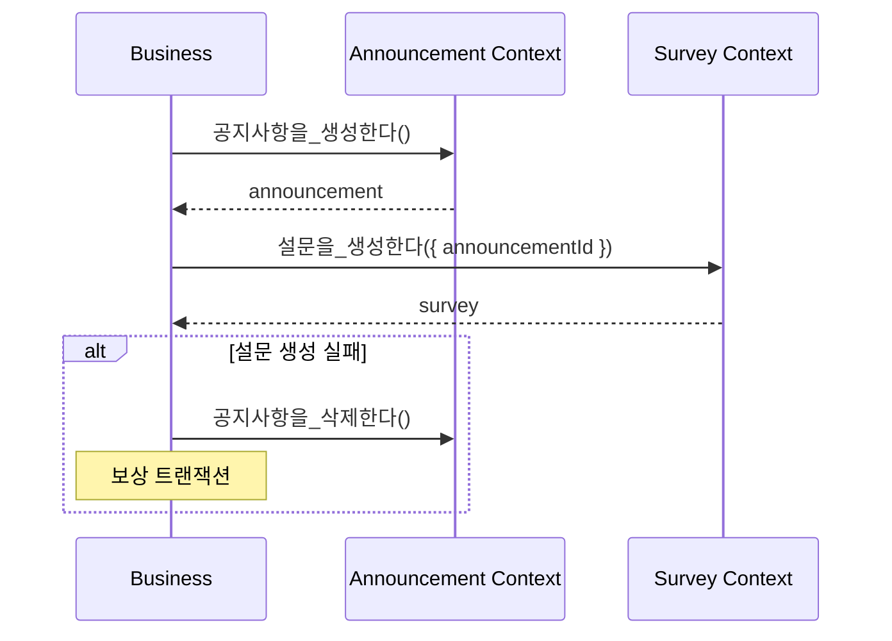

**제약 조건**:
- 공지사항 삭제 시 설문이 연동되어 있으면 삭제 불가
- 설문의 마감일은 공지사항의 마감일과 동일

### 6.2 Category Service 연동

**관계**: Announcement (N) ↔ (M) Category

**흐름**:

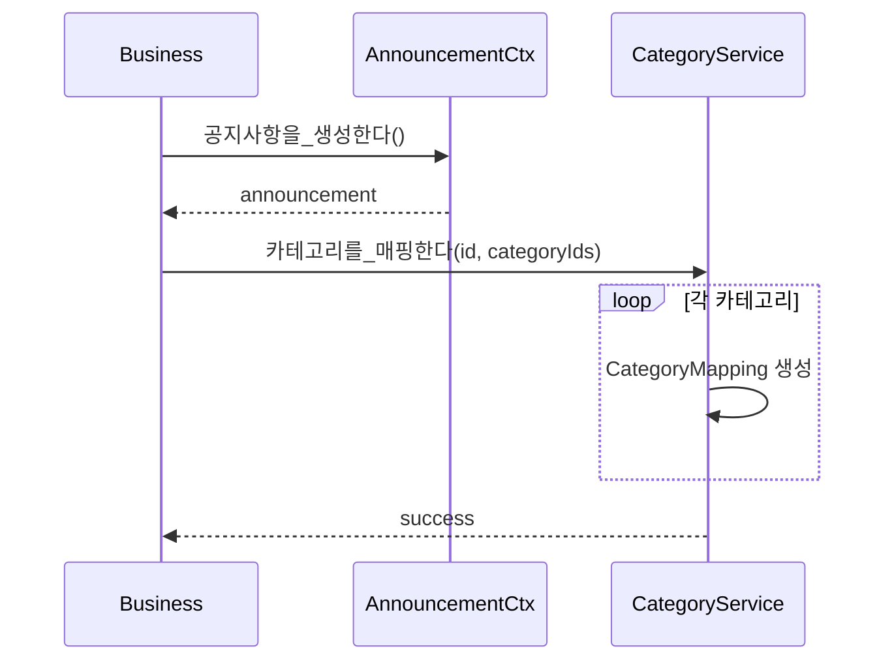

### 6.3 Company Context 연동

**목적**: 조직 정보 조회 (권한 검증, 알림 대상자 필터링)

**API**:
- `부서_목록_조회()` - 부서 및 소속 직원 목록
- `직급_목록_조회()` - 직급 및 해당 직원 목록
- `직책_목록_조회()` - 직책 및 해당 직원 목록

---

## 7. 성능 최적화

### 7.1 인덱스 전략

```sql
-- 조회 성능 최적화
CREATE INDEX idx_announcements_public_fixed ON announcements(is_public, is_fixed, "order");
CREATE INDEX idx_announcements_created_at ON announcements(created_at);
CREATE INDEX idx_announcement_reads_composite ON announcement_reads(announcement_id, employee_id);
```

### 7.2 캐싱 전략

**대상**:
- 공지사항 목록 (공개, 고정 기준)
- 카테고리 매핑

**TTL**: 5분

```typescript
async execute(query: GetAnnouncementListQuery) {
  const cacheKey = `announcements:list:${JSON.stringify(query)}`;
  
  const cached = await this.cacheManager.get(cacheKey);
  if (cached) return cached;

  const result = await this.queryFromDatabase(query);
  await this.cacheManager.set(cacheKey, result, { ttl: 300 });

  return result;
}
```

### 7.3 N+1 문제 방지

```typescript
// ❌ N+1 발생
const announcements = await this.repository.find();
for (const announcement of announcements) {
  announcement.categories; // 각 공지마다 별도 쿼리
}

// ✅ 해결: relations 사용
const announcements = await this.repository.find({
  relations: ['categoryMappings', 'categoryMappings.category'],
});
```

---

**문서 생성일**: 2026년 1월 14일  
**버전**: v1.0
