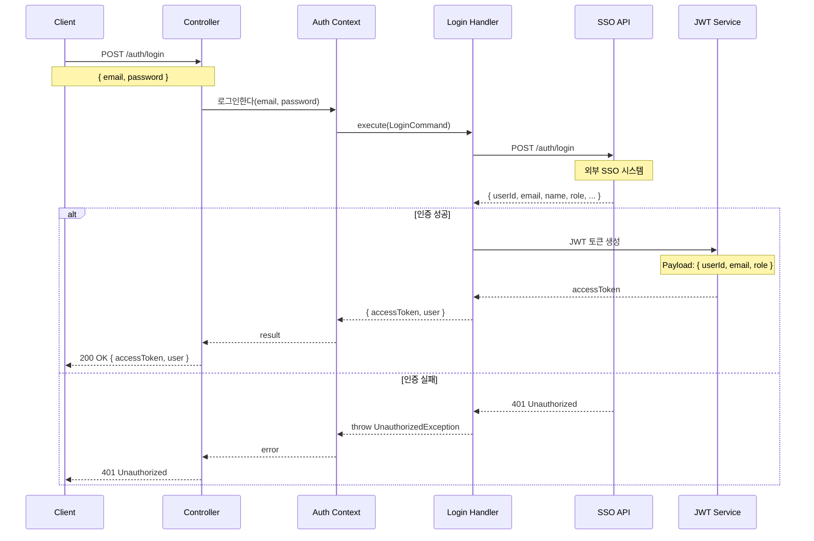
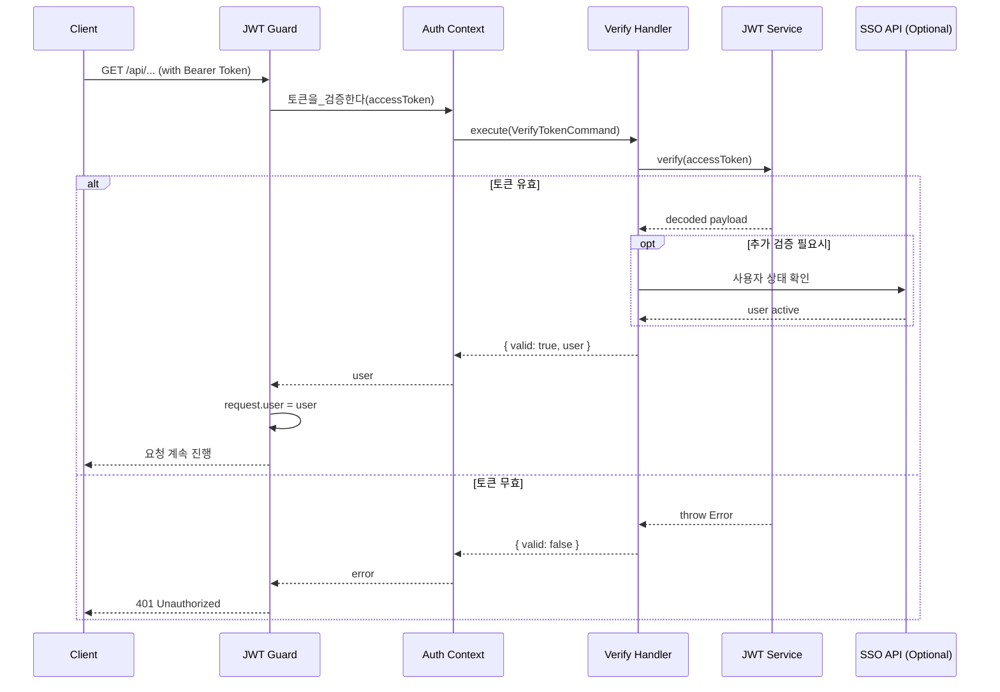

# Auth Context 데이터 흐름

## 📋 목차

1. [개요](#1-개요)
2. [흐름 다이어그램](#2-흐름-다이어그램)
3. [주요 비즈니스 로직](#3-주요-비즈니스-로직)

---

## 1. 개요

### 1.1 책임

**Auth Context**는 인증 및 인가를 담당합니다.

**주요 기능**:
- SSO (Single Sign-On) 로그인
- JWT 토큰 발급
- 토큰 검증
- 사용자 정보 조회

### 1.2 특징

- **외부 SSO 연동**: 자체 사용자 DB 없음
- **JWT 기반**: Access Token 발급
- **Stateless**: 세션 저장 안 함
- **Guard 통합**: NestJS Guard로 보호

---

## 2. 흐름 다이어그램

### 2.1 로그인 (Login)



**핵심 로직**:

```typescript
@CommandHandler(LoginCommand)
export class LoginHandler {
  constructor(
    private readonly configService: ConfigService,
    private readonly jwtService: JwtService,
  ) {}

  async execute(command: LoginCommand): Promise<LoginResult> {
    const ssoUrl = this.configService.get('SSO_BASE_URL');

    // 1. SSO 인증
    const response = await axios.post(`${ssoUrl}/auth/login`, {
      email: command.email,
      password: command.password,
    });

    const userData = response.data;

    // 2. JWT 토큰 생성
    const payload = {
      userId: userData.id,
      email: userData.email,
      name: userData.name,
      role: userData.role,
      rankCode: userData.rankCode,
      positionCode: userData.positionCode,
      departmentCode: userData.departmentCode,
    };

    const accessToken = this.jwtService.sign(payload, {
      expiresIn: '8h',
    });

    return {
      accessToken,
      user: payload,
    };
  }
}
```

### 2.2 토큰 검증 (VerifyToken)



**핵심 로직**:

```typescript
@CommandHandler(VerifyTokenCommand)
export class VerifyTokenHandler {
  constructor(
    private readonly jwtService: JwtService,
    private readonly configService: ConfigService,
  ) {}

  async execute(command: VerifyTokenCommand): Promise<VerifyTokenResult> {
    try {
      // JWT 검증
      const decoded = this.jwtService.verify(command.accessToken);

      // (선택적) SSO에서 사용자 상태 확인
      if (this.configService.get('VERIFY_WITH_SSO')) {
        await this.verifySongUserStatus(decoded.userId);
      }

      return {
        valid: true,
        user: {
          userId: decoded.userId,
          email: decoded.email,
          name: decoded.name,
          role: decoded.role,
          rankCode: decoded.rankCode,
          positionCode: decoded.positionCode,
          departmentCode: decoded.departmentCode,
        },
      };
    } catch (error) {
      return {
        valid: false,
        error: error.message,
      };
    }
  }

  private async verifyUserStatus(userId: string): Promise<void> {
    const ssoUrl = this.configService.get('SSO_BASE_URL');
    const response = await axios.get(`${ssoUrl}/users/${userId}`);

    if (!response.data.isActive) {
      throw new UnauthorizedException('사용자 계정이 비활성화되었습니다');
    }
  }
}
```

---

## 3. 주요 비즈니스 로직

### 3.1 JWT Guard 구현

```typescript
@Injectable()
export class JwtAuthGuard implements CanActivate {
  constructor(private readonly authContextService: AuthContextService) {}

  async canActivate(context: ExecutionContext): Promise<boolean> {
    const request = context.switchToHttp().getRequest();
    
    // Authorization 헤더에서 토큰 추출
    const authHeader = request.headers.authorization;
    if (!authHeader) {
      throw new UnauthorizedException('토큰이 없습니다');
    }

    const [type, token] = authHeader.split(' ');
    if (type !== 'Bearer') {
      throw new UnauthorizedException('Bearer 토큰이 아닙니다');
    }

    // 토큰 검증
    const result = await this.authContextService.토큰을_검증한다(token);

    if (!result.valid) {
      throw new UnauthorizedException('유효하지 않은 토큰입니다');
    }

    // request 객체에 사용자 정보 저장
    request.user = result.user;

    return true;
  }
}
```

### 3.2 CurrentUser 데코레이터

```typescript
export const CurrentUser = createParamDecorator(
  (data: unknown, ctx: ExecutionContext) => {
    const request = ctx.switchToHttp().getRequest();
    return request.user;
  },
);

// 사용 예시
@Get('profile')
async getProfile(@CurrentUser() user: AuthenticatedUser) {
  return user;
}
```

### 3.3 Role 기반 권한 검증

```typescript
export enum UserRole {
  ADMIN = 'admin',
  USER = 'user',
  GUEST = 'guest',
}

@Injectable()
export class RolesGuard implements CanActivate {
  constructor(private reflector: Reflector) {}

  canActivate(context: ExecutionContext): boolean {
    const requiredRoles = this.reflector.getAllAndOverride<UserRole[]>('roles', [
      context.getHandler(),
      context.getClass(),
    ]);

    if (!requiredRoles) {
      return true; // 권한 제한 없음
    }

    const { user } = context.switchToHttp().getRequest();
    return requiredRoles.some(role => user.role === role);
  }
}

// 사용 예시
@Roles(UserRole.ADMIN)
@Post('announcements')
async create(@Body() dto: CreateAnnouncementDto) {
  // 관리자만 접근 가능
}
```

### 3.4 토큰 Refresh 전략

```typescript
// Refresh Token은 구현되지 않았지만, 필요시 아래와 같이 구현 가능

class RefreshTokenHandler {
  async execute(command: RefreshTokenCommand) {
    // 1. Refresh Token 검증
    const decoded = this.jwtService.verify(command.refreshToken);

    // 2. Redis에서 Refresh Token 확인
    const storedToken = await this.redis.get(`refresh:${decoded.userId}`);
    if (storedToken !== command.refreshToken) {
      throw new UnauthorizedException('유효하지 않은 Refresh Token');
    }

    // 3. 새 Access Token 발급
    const newAccessToken = this.jwtService.sign({
      userId: decoded.userId,
      email: decoded.email,
      role: decoded.role,
    }, {
      expiresIn: '8h',
    });

    return { accessToken: newAccessToken };
  }
}
```

---

## 4. 보안 고려사항

### 4.1 토큰 보안

- ✅ HTTPS 사용 필수
- ✅ HttpOnly 쿠키 사용 (선택적)
- ✅ 짧은 만료 시간 (8시간)
- ✅ Refresh Token 분리 (권장)
- ✅ XSS 방지

### 4.2 비밀번호 보안

- ✅ SSO 시스템에서 관리
- ✅ 본 시스템에서는 비밀번호 저장 안 함
- ✅ HTTPS로 전송

### 4.3 Rate Limiting

```typescript
// 로그인 시도 제한 (권장)
@ThrottlerGuard(10, 60) // 60초에 10회
@Post('login')
async login(@Body() dto: LoginDto) {
  return this.authContextService.로그인한다(dto.email, dto.password);
}
```

---

**문서 생성일**: 2026년 1월 14일  
**버전**: v1.0
