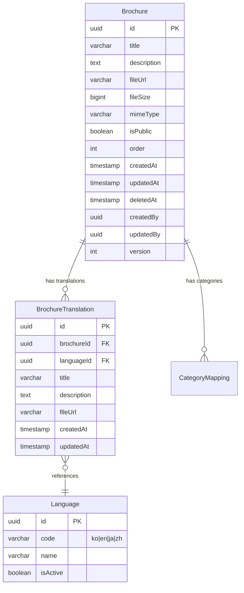
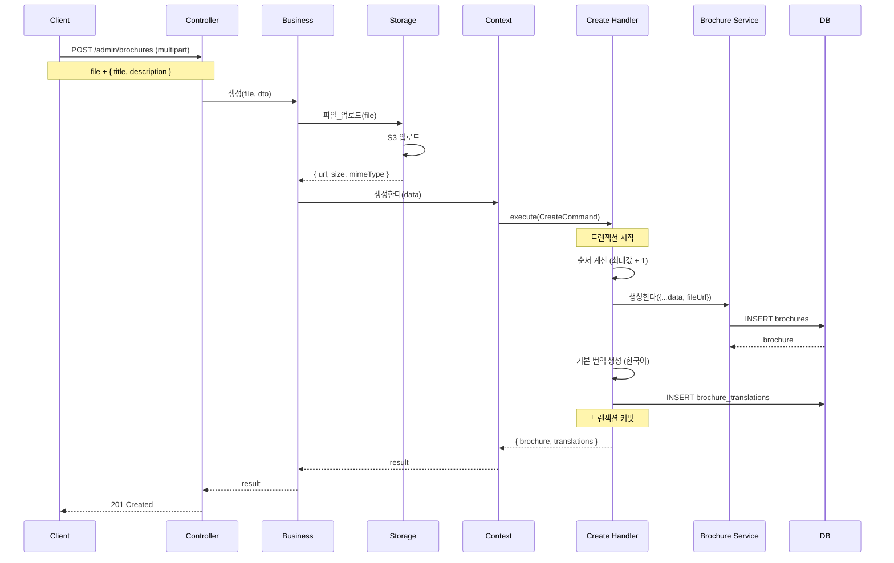
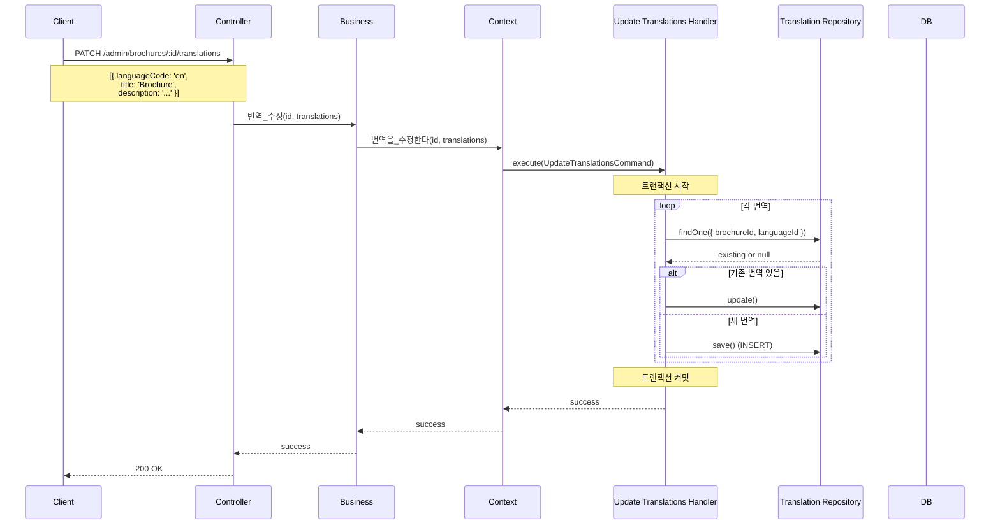
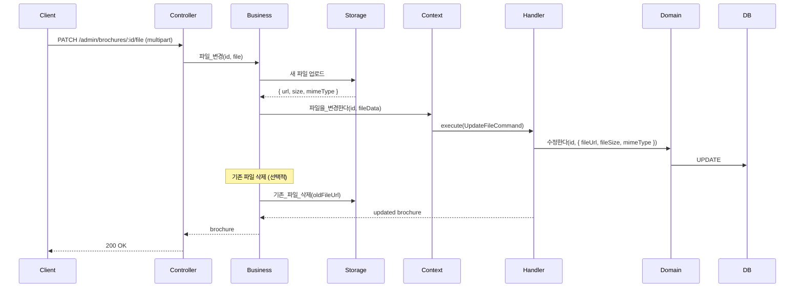
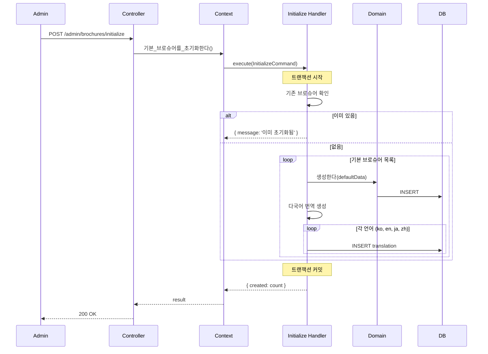
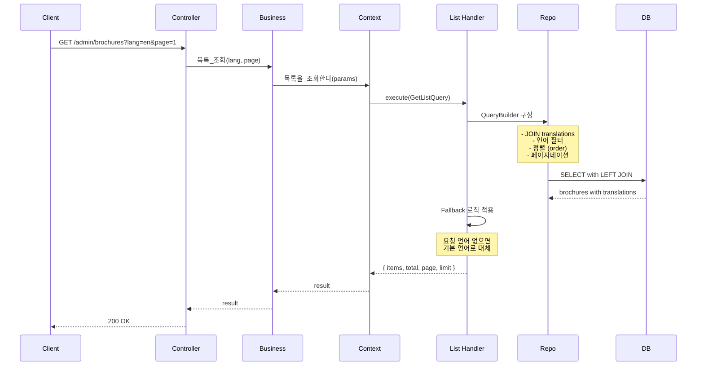
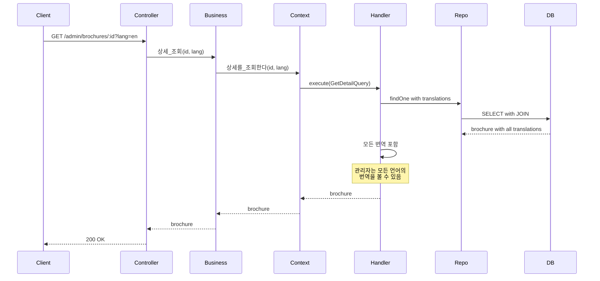
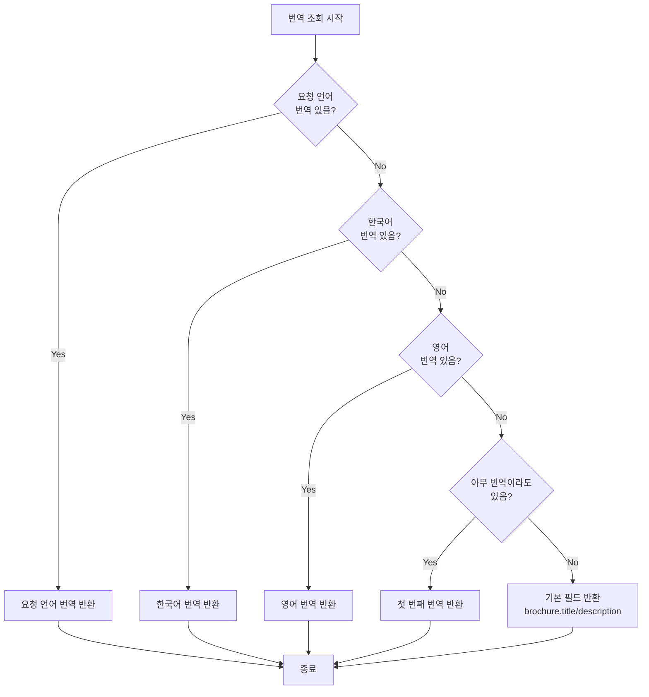
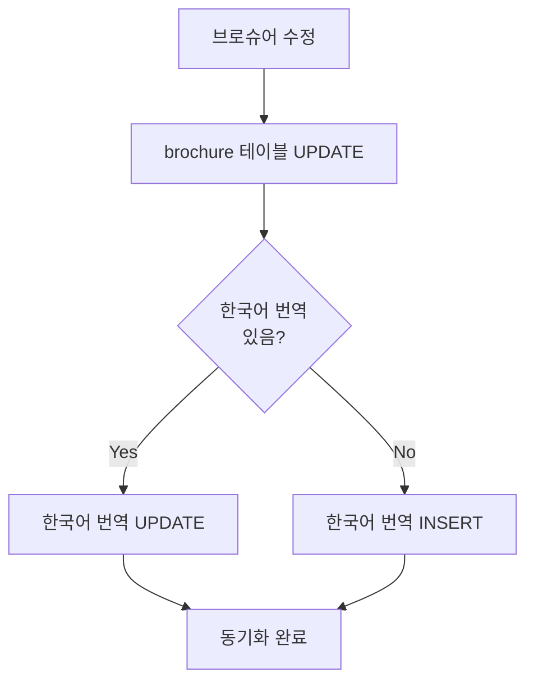
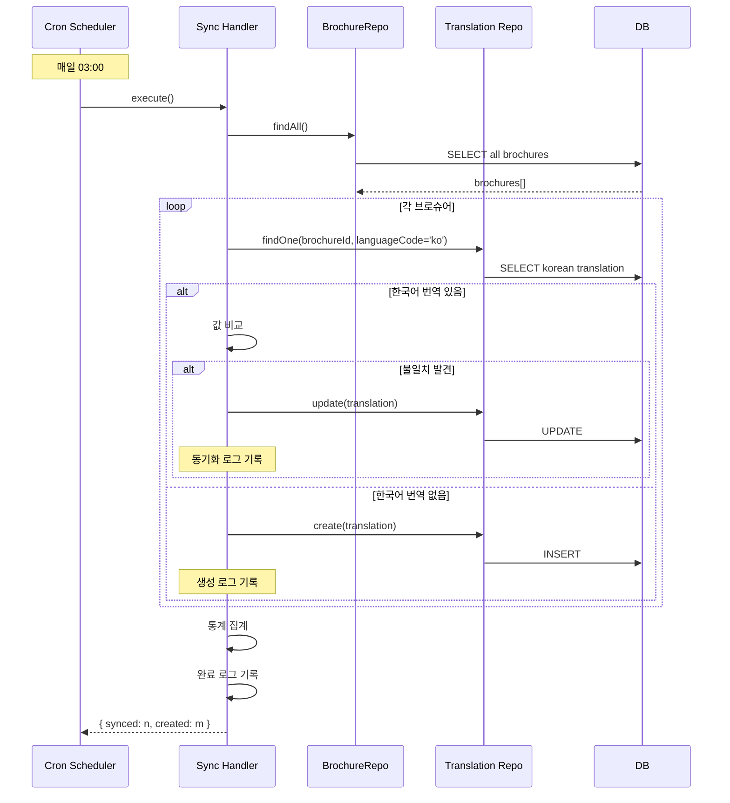

# Brochure Context 데이터 흐름

## 📋 목차

1. [개요](#1-개요)
2. [도메인 모델](#2-도메인-모델)
3. [Command 흐름](#3-command-흐름)
4. [Query 흐름](#4-query-흐름)
5. [주요 비즈니스 로직](#5-주요-비즈니스-로직)
6. [스케줄러](#6-스케줄러)

---

## 1. 개요

### 1.1 책임

**Brochure Context**는 회사 브로슈어 관리를 담당합니다.

**주요 기능**:
- 브로슈어 생성, 수정, 삭제
- 다국어 번역 관리 (한국어, 영어, 일본어, 중국어)
- 파일 업로드 (PDF, PPT 등)
- 공개/비공개 설정
- 순서 관리 (개별/일괄)
- 번역 동기화 스케줄러
- 기본 브로슈어 초기화

### 1.2 관련 엔티티

**Core Domain**:
- `Brochure` - 브로슈어 (Core)
- `BrochureTranslation` - 브로슈어 번역 (Core)

**Common Domain**:
- `Language` - 언어 (Common)
- `Category` - 카테고리 (Common)
- `CategoryMapping` - 카테고리 매핑 (Common)

### 1.3 핸들러 구성

**Commands (8개)**:
- `CreateBrochureHandler` - 브로슈어 생성
- `UpdateBrochureHandler` - 브로슈어 수정
- `UpdateBrochureFileHandler` - 파일 변경
- `UpdateBrochurePublicHandler` - 공개 상태 변경
- `UpdateBrochureBatchOrderHandler` - 순서 일괄 변경
- `UpdateBrochureTranslationsHandler` - 번역 수정
- `DeleteBrochureHandler` - 브로슈어 삭제
- `InitializeDefaultBrochuresHandler` - 기본 브로슈어 초기화

**Queries (2개)**:
- `GetBrochureListHandler` - 목록 조회
- `GetBrochureDetailHandler` - 상세 조회

**Job Handlers (1개)**:
- `SyncBrochureTranslationsHandler` - 번역 동기화 (스케줄러)

---

## 2. 도메인 모델

### 2.1 Brochure Entity

```typescript
@Entity('brochures')
export class Brochure extends BaseEntity {
  @Column({ type: 'varchar', length: 255 })
  title: string; // 기본 제목 (한국어)

  @Column({ type: 'text', nullable: true })
  description: string | null; // 기본 설명 (한국어)

  @Column({ type: 'varchar', length: 512, nullable: true })
  fileUrl: string | null; // 파일 URL (PDF, PPT 등)

  @Column({ type: 'bigint', nullable: true })
  fileSize: number | null;

  @Column({ type: 'varchar', length: 100, nullable: true })
  mimeType: string | null;

  @Column({ type: 'boolean', default: false })
  isPublic: boolean;

  @Column({ type: 'int', default: 0 })
  order: number;

  // 관계
  @OneToMany(() => BrochureTranslation, translation => translation.brochure, {
    cascade: true,
  })
  translations: BrochureTranslation[];
}
```

### 2.2 BrochureTranslation Entity

```typescript
@Entity('brochure_translations')
export class BrochureTranslation extends BaseEntity {
  @Column('uuid')
  brochureId: string;

  @Column('uuid')
  languageId: string;

  @Column({ type: 'varchar', length: 255 })
  title: string;

  @Column({ type: 'text', nullable: true })
  description: string | null;

  @Column({ type: 'varchar', length: 512, nullable: true })
  fileUrl: string | null; // 언어별 파일 (선택적)

  // 관계
  @ManyToOne(() => Brochure, brochure => brochure.translations, {
    onDelete: 'CASCADE',
  })
  brochure: Brochure;

  @ManyToOne(() => Language)
  language: Language;

  // 복합 유니크 제약
  @Unique(['brochureId', 'languageId'])
}
```

### 2.3 다국어 전략

**Fallback 순서**:
1. 요청 언어 (예: 영어)
2. 한국어 (기본 언어)
3. 영어
4. 사용 가능한 첫 번째 번역

**예시**:
```
요청: 일본어(ja)
1. 일본어 번역 있음? → 일본어 반환
2. 없음 → 한국어 번역 있음? → 한국어 반환
3. 없음 → 영어 번역 있음? → 영어 반환
4. 없음 → 아무 번역이나 반환
```

### 2.4 ERD



---

## 3. Command 흐름

### 3.1 브로슈어 생성 (CreateBrochure)

**흐름 다이어그램**:



**기본 번역 생성**:

```typescript
@CommandHandler(CreateBrochureCommand)
async execute(command: CreateBrochureCommand) {
  // 1. 브로슈어 생성
  const brochure = await this.brochureService.생성한다({
    title: command.data.title,
    description: command.data.description,
    fileUrl: command.data.fileUrl,
    fileSize: command.data.fileSize,
    mimeType: command.data.mimeType,
    isPublic: command.data.isPublic ?? false,
    order: await this.calculateNextOrder(),
    createdBy: command.data.createdBy,
  });

  // 2. 기본 번역 생성 (한국어)
  const koreanLanguage = await this.languageService.코드로_언어를_조회한다('ko');
  
  await this.translationRepository.save({
    brochureId: brochure.id,
    languageId: koreanLanguage.id,
    title: command.data.title,
    description: command.data.description,
    fileUrl: command.data.fileUrl,
  });

  return { brochure };
}
```

### 3.2 번역 수정 (UpdateBrochureTranslations)

**흐름 다이어그램**:



**번역 Upsert 로직**:

```typescript
@CommandHandler(UpdateBrochureTranslationsCommand)
async execute(command: UpdateBrochureTranslationsCommand) {
  const brochure = await this.brochureService.ID로_조회한다(command.id);

  for (const trans of command.data.translations) {
    // 언어 조회
    const language = await this.languageService.코드로_언어를_조회한다(
      trans.languageCode,
    );

    // 기존 번역 확인
    const existing = await this.translationRepository.findOne({
      where: {
        brochureId: command.id,
        languageId: language.id,
      },
    });

    if (existing) {
      // Update
      Object.assign(existing, {
        title: trans.title,
        description: trans.description,
        fileUrl: trans.fileUrl || existing.fileUrl,
      });
      await this.translationRepository.save(existing);
    } else {
      // Insert
      await this.translationRepository.save({
        brochureId: command.id,
        languageId: language.id,
        title: trans.title,
        description: trans.description,
        fileUrl: trans.fileUrl,
      });
    }
  }

  return { success: true };
}
```

### 3.3 파일 변경 (UpdateBrochureFile)

**흐름 다이어그램**:



### 3.4 기본 브로슈어 초기화 (InitializeDefaultBrochures)

**목적**: 
- 시스템 초기 설정 시 기본 브로슈어 생성
- 테스트 데이터 생성

**흐름**:



**기본 브로슈어 데이터**:

```typescript
const DEFAULT_BROCHURES = [
  {
    title: '회사 소개서',
    description: '우리 회사에 대한 전반적인 소개',
    order: 1,
    translations: {
      en: { title: 'Company Profile', description: 'Overview of our company' },
      ja: { title: '会社紹介', description: '会社の概要' },
      zh: { title: '公司简介', description: '公司概况' },
    },
  },
  {
    title: '제품 카탈로그',
    description: '주요 제품 라인업',
    order: 2,
    translations: {
      en: { title: 'Product Catalog', description: 'Main product lineup' },
      ja: { title: '製品カタログ', description: '主要製品' },
      zh: { title: '产品目录', description: '主要产品' },
    },
  },
];
```

---

## 4. Query 흐름

### 4.1 브로슈어 목록 조회 (GetBrochureList)

**흐름 다이어그램**:



**다국어 조회 로직**:

```typescript
@QueryHandler(GetBrochureListQuery)
async execute(query: GetBrochureListQuery) {
  // 언어 조회
  const language = await this.languageService.코드로_언어를_조회한다(
    query.languageCode || 'ko',
  );

  // QueryBuilder
  const queryBuilder = this.brochureRepository
    .createQueryBuilder('brochure')
    .leftJoinAndSelect(
      'brochure.translations',
      'translation',
      'translation.languageId = :languageId',
      { languageId: language.id },
    );

  // 필터
  if (query.isPublic !== undefined) {
    queryBuilder.where('brochure.isPublic = :isPublic', { 
      isPublic: query.isPublic 
    });
  }

  // 정렬
  queryBuilder.orderBy('brochure.order', 'DESC');

  // 페이지네이션
  const skip = (query.page - 1) * query.limit;
  queryBuilder.skip(skip).take(query.limit);

  const [items, total] = await queryBuilder.getManyAndCount();

  // Fallback 적용
  const result = items.map(brochure => ({
    ...brochure,
    displayTitle: this.getDisplayTitle(brochure, query.languageCode),
    displayDescription: this.getDisplayDescription(brochure, query.languageCode),
  }));

  return { items: result, total, page: query.page, limit: query.limit };
}

// Fallback 로직
private getDisplayTitle(brochure: Brochure, languageCode: string): string {
  // 1. 요청 언어
  const requestedLang = brochure.translations.find(
    t => t.language.code === languageCode,
  );
  if (requestedLang) return requestedLang.title;

  // 2. 한국어 (기본)
  const korean = brochure.translations.find(t => t.language.code === 'ko');
  if (korean) return korean.title;

  // 3. 영어
  const english = brochure.translations.find(t => t.language.code === 'en');
  if (english) return english.title;

  // 4. 첫 번째 번역
  return brochure.translations[0]?.title || brochure.title;
}
```

### 4.2 브로슈어 상세 조회 (GetBrochureDetail)

**흐름**:



---

## 5. 주요 비즈니스 로직

### 5.1 다국어 Fallback 전략

**전략 흐름**:



**코드 구현**:

```typescript
class BrochureTranslationService {
  async getTranslatedBrochure(
    brochure: Brochure,
    languageCode: string,
  ): Promise<TranslatedBrochure> {
    // 1. 요청 언어
    let translation = brochure.translations.find(
      t => t.language.code === languageCode,
    );

    // 2. Fallback: 한국어
    if (!translation) {
      translation = brochure.translations.find(t => t.language.code === 'ko');
    }

    // 3. Fallback: 영어
    if (!translation) {
      translation = brochure.translations.find(t => t.language.code === 'en');
    }

    // 4. Fallback: 첫 번째 번역
    if (!translation && brochure.translations.length > 0) {
      translation = brochure.translations[0];
    }

    // 5. Fallback: 기본 필드
    return {
      id: brochure.id,
      title: translation?.title || brochure.title,
      description: translation?.description || brochure.description,
      fileUrl: translation?.fileUrl || brochure.fileUrl,
      isPublic: brochure.isPublic,
      order: brochure.order,
      languageCode: translation?.language.code || 'ko',
    };
  }
}
```

### 5.2 번역 동기화 로직

**목적**:
- 브로슈어 기본 필드 변경 시 한국어 번역도 자동 동기화
- 데이터 일관성 유지

**동기화 대상**:
- `brochure.title` ↔ `translation[ko].title`
- `brochure.description` ↔ `translation[ko].description`
- `brochure.fileUrl` ↔ `translation[ko].fileUrl`

**흐름**:



---

## 6. 스케줄러

### 6.1 번역 동기화 스케줄러

**실행 주기**: 매일 새벽 3시

**목적**:
- 브로슈어 기본 필드와 한국어 번역 간 불일치 해소
- 데이터 무결성 보장

**흐름 다이어그램**:



**스케줄러 코드**:

```typescript
import { Cron, CronExpression } from '@nestjs/schedule';

@Injectable()
export class BrochureSyncScheduler {
  private readonly logger = new Logger(BrochureSyncScheduler.name);

  constructor(
    private readonly commandBus: CommandBus,
  ) {}

  @Cron(CronExpression.EVERY_DAY_AT_3AM)
  async syncBrochureTranslations() {
    this.logger.log('브로슈어 번역 동기화 시작');

    try {
      const command = new SyncBrochureTranslationsCommand();
      const result = await this.commandBus.execute(command);

      this.logger.log(
        `브로슈어 번역 동기화 완료 - 동기화: ${result.synced}개, 생성: ${result.created}개`,
      );
    } catch (error) {
      this.logger.error('브로슈어 번역 동기화 실패', error.stack);
    }
  }
}
```

**Handler 코드**:

```typescript
@CommandHandler(SyncBrochureTranslationsCommand)
export class SyncBrochureTranslationsHandler {
  async execute(command: SyncBrochureTranslationsCommand) {
    let syncedCount = 0;
    let createdCount = 0;

    // 모든 브로슈어 조회
    const brochures = await this.brochureRepository.find({
      relations: ['translations', 'translations.language'],
    });

    // 한국어 Language
    const koreanLang = await this.languageRepository.findOne({
      where: { code: 'ko' },
    });

    for (const brochure of brochures) {
      // 한국어 번역 찾기
      const koreanTranslation = brochure.translations.find(
        t => t.languageId === koreanLang.id,
      );

      if (koreanTranslation) {
        // 값 비교 및 동기화
        let needsUpdate = false;

        if (koreanTranslation.title !== brochure.title) {
          koreanTranslation.title = brochure.title;
          needsUpdate = true;
        }

        if (koreanTranslation.description !== brochure.description) {
          koreanTranslation.description = brochure.description;
          needsUpdate = true;
        }

        if (koreanTranslation.fileUrl !== brochure.fileUrl) {
          koreanTranslation.fileUrl = brochure.fileUrl;
          needsUpdate = true;
        }

        if (needsUpdate) {
          await this.translationRepository.save(koreanTranslation);
          syncedCount++;
        }
      } else {
        // 한국어 번역 생성
        await this.translationRepository.save({
          brochureId: brochure.id,
          languageId: koreanLang.id,
          title: brochure.title,
          description: brochure.description,
          fileUrl: brochure.fileUrl,
        });
        createdCount++;
      }
    }

    return { synced: syncedCount, created: createdCount };
  }
}
```

---

## 7. 성능 최적화

### 7.1 번역 조회 최적화

**N+1 문제 방지**:

```typescript
// ❌ N+1 발생
const brochures = await this.repository.find();
for (const brochure of brochures) {
  brochure.translations; // 각 브로슈어마다 별도 쿼리
}

// ✅ 해결: relations 사용
const brochures = await this.repository.find({
  relations: ['translations', 'translations.language'],
});
```

### 7.2 인덱스 전략

```sql
-- 기본 조회
CREATE INDEX idx_brochures_is_public ON brochures(is_public);
CREATE INDEX idx_brochures_order ON brochures("order");

-- 번역 조회
CREATE INDEX idx_brochure_translations_brochure_language 
  ON brochure_translations(brochure_id, language_id);
```

### 7.3 캐싱 전략

**대상**:
- 공개 브로슈어 목록 (언어별)

**TTL**: 10분

**무효화**: 브로슈어 생성/수정/삭제 시

---

**문서 생성일**: 2026년 1월 14일  
**버전**: v1.0
