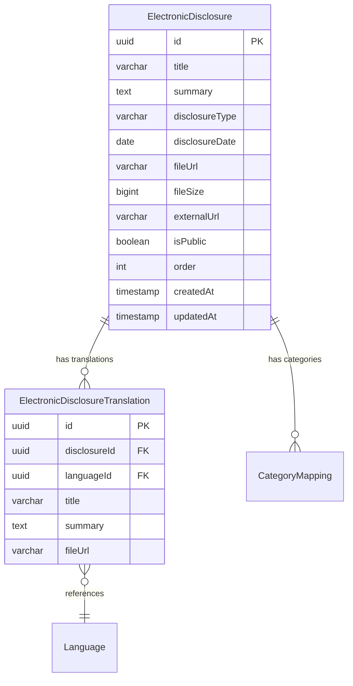
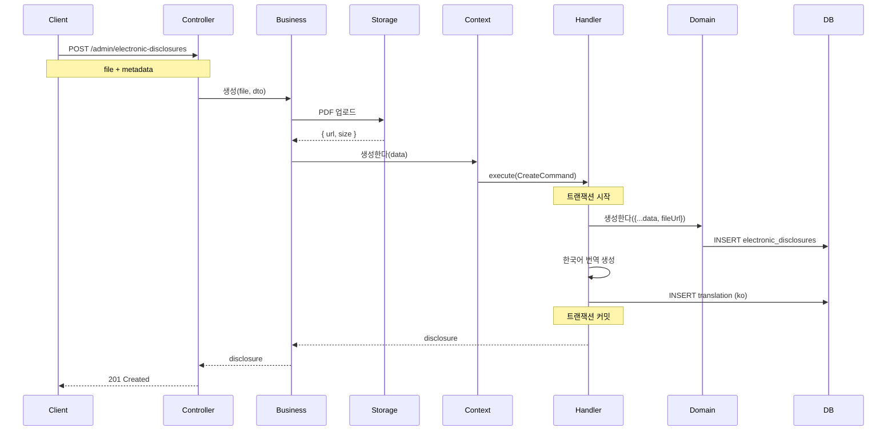
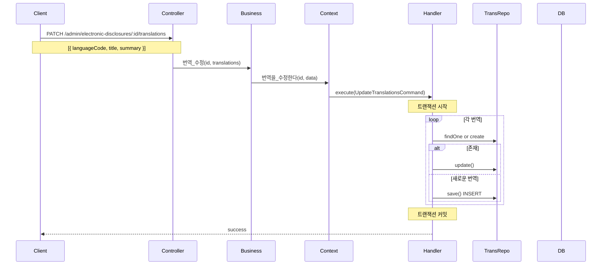
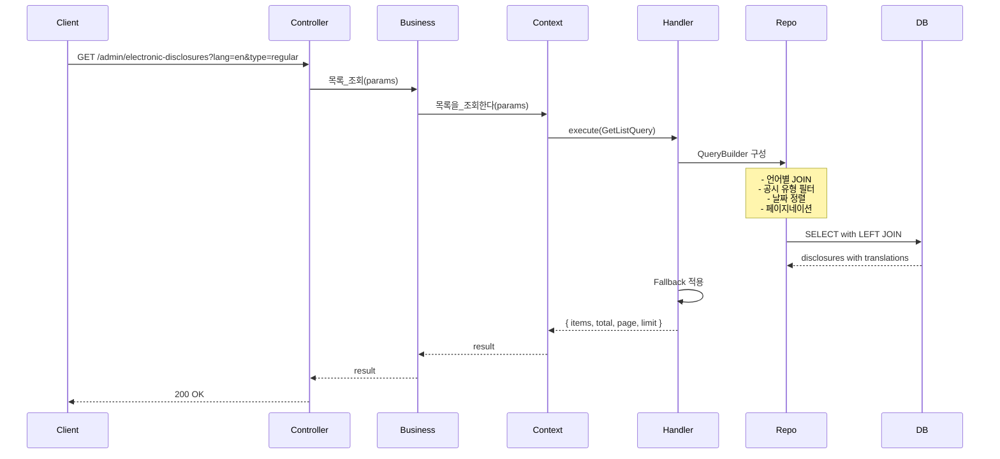
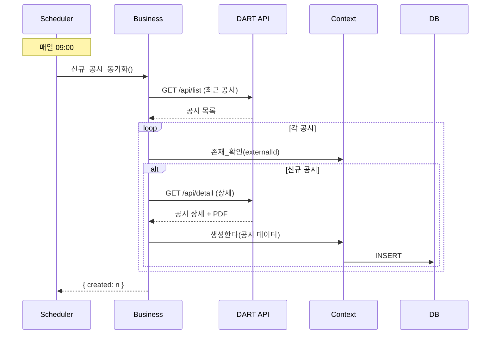

# Electronic Disclosure Context 데이터 흐름

## 📋 목차

1. [개요](#1-개요)
2. [도메인 모델](#2-도메인-모델)
3. [Command 흐름](#3-command-흐름)
4. [Query 흐름](#4-query-흐름)
5. [주요 비즈니스 로직](#5-주요-비즈니스-로직)

---

## 1. 개요

### 1.1 책임

**Electronic Disclosure Context**는 법적 전자공시 문서 관리를 담당합니다.

**주요 기능**:
- 전자공시 문서 생성, 수정, 삭제
- 다국어 번역 관리 (한국어, 영어, 일본어, 중국어)
- PDF 파일 업로드
- 공개/비공개 설정
- 순서 관리
- 공시 유형 분류 (정기공시, 수시공시, 기타공시)
- 공시일자 관리

### 1.2 관련 엔티티

**Core Domain**:
- `ElectronicDisclosure` - 전자공시 (Core)
- `ElectronicDisclosureTranslation` - 전자공시 번역 (Core)

**Common Domain**:
- `Language` - 언어 (Common)
- `Category` - 카테고리 (Common)

### 1.3 핸들러 구성

**Commands (7개)**:
- `CreateElectronicDisclosureHandler` - 전자공시 생성
- `UpdateElectronicDisclosureHandler` - 전자공시 수정
- `UpdateElectronicDisclosureFileHandler` - 파일 변경
- `UpdateElectronicDisclosurePublicHandler` - 공개 상태 변경
- `UpdateElectronicDisclosureBatchOrderHandler` - 순서 일괄 변경
- `UpdateElectronicDisclosureTranslationsHandler` - 번역 수정
- `DeleteElectronicDisclosureHandler` - 전자공시 삭제

**Queries (2개)**:
- `GetElectronicDisclosureListHandler` - 목록 조회
- `GetElectronicDisclosureDetailHandler` - 상세 조회

---

## 2. 도메인 모델

### 2.1 ElectronicDisclosure Entity

```typescript
@Entity('electronic_disclosures')
export class ElectronicDisclosure extends BaseEntity {
  @Column({ type: 'varchar', length: 255 })
  title: string; // 공시 제목 (한국어 기본)

  @Column({ type: 'text', nullable: true })
  summary: string | null; // 요약

  @Column({ type: 'varchar', length: 50 })
  disclosureType: string; // 공시 유형 (정기, 수시, 기타)

  @Column({ type: 'date' })
  disclosureDate: Date; // 공시일자

  @Column({ type: 'varchar', length: 512, nullable: true })
  fileUrl: string | null; // PDF 파일 URL

  @Column({ type: 'bigint', nullable: true })
  fileSize: number | null;

  @Column({ type: 'varchar', length: 200, nullable: true })
  externalUrl: string | null; // 외부 공시 시스템 링크 (DART 등)

  @Column({ type: 'boolean', default: false })
  isPublic: boolean;

  @Column({ type: 'int', default: 0 })
  order: number;

  // 관계
  @OneToMany(() => ElectronicDisclosureTranslation, translation => translation.disclosure, {
    cascade: true,
  })
  translations: ElectronicDisclosureTranslation[];
}
```

### 2.2 ElectronicDisclosureTranslation Entity

```typescript
@Entity('electronic_disclosure_translations')
export class ElectronicDisclosureTranslation extends BaseEntity {
  @Column('uuid')
  disclosureId: string;

  @Column('uuid')
  languageId: string;

  @Column({ type: 'varchar', length: 255 })
  title: string;

  @Column({ type: 'text', nullable: true })
  summary: string | null;

  @Column({ type: 'varchar', length: 512, nullable: true })
  fileUrl: string | null; // 언어별 PDF (선택적)

  // 관계
  @ManyToOne(() => ElectronicDisclosure, disclosure => disclosure.translations, {
    onDelete: 'CASCADE',
  })
  disclosure: ElectronicDisclosure;

  @ManyToOne(() => Language)
  language: Language;

  @Unique(['disclosureId', 'languageId'])
}
```

### 2.3 공시 유형

```typescript
enum DisclosureType {
  REGULAR = 'regular',           // 정기공시 (분기보고서, 사업보고서)
  OCCASIONAL = 'occasional',     // 수시공시 (주요사항보고서)
  OTHER = 'other',               // 기타공시
}
```

### 2.4 ERD



---

## 3. Command 흐름

### 3.1 전자공시 생성 (CreateElectronicDisclosure)

**흐름 다이어그램**:



**핵심 로직**:

```typescript
@CommandHandler(CreateElectronicDisclosureCommand)
async execute(command: CreateElectronicDisclosureCommand) {
  // 1. 전자공시 생성
  const disclosure = await this.disclosureService.생성한다({
    title: command.data.title,
    summary: command.data.summary,
    disclosureType: command.data.disclosureType,
    disclosureDate: command.data.disclosureDate,
    fileUrl: command.data.fileUrl,
    fileSize: command.data.fileSize,
    externalUrl: command.data.externalUrl,
    isPublic: command.data.isPublic ?? false,
    order: await this.calculateNextOrder(),
    createdBy: command.data.createdBy,
  });

  // 2. 기본 번역 생성 (한국어)
  const koreanLang = await this.languageService.코드로_언어를_조회한다('ko');
  
  await this.translationRepository.save({
    disclosureId: disclosure.id,
    languageId: koreanLang.id,
    title: command.data.title,
    summary: command.data.summary,
    fileUrl: command.data.fileUrl,
  });

  return { disclosure };
}
```

### 3.2 번역 수정 (UpdateElectronicDisclosureTranslations)

**흐름**:



**Upsert 로직**:

```typescript
async execute(command: UpdateElectronicDisclosureTranslationsCommand) {
  for (const trans of command.data.translations) {
    const language = await this.languageService.코드로_언어를_조회한다(
      trans.languageCode,
    );

    const existing = await this.translationRepository.findOne({
      where: {
        disclosureId: command.id,
        languageId: language.id,
      },
    });

    if (existing) {
      Object.assign(existing, {
        title: trans.title,
        summary: trans.summary,
        fileUrl: trans.fileUrl || existing.fileUrl,
      });
      await this.translationRepository.save(existing);
    } else {
      await this.translationRepository.save({
        disclosureId: command.id,
        languageId: language.id,
        title: trans.title,
        summary: trans.summary,
        fileUrl: trans.fileUrl,
      });
    }
  }

  return { success: true };
}
```

---

## 4. Query 흐름

### 4.1 전자공시 목록 조회 (GetElectronicDisclosureList)

**흐름 다이어그램**:



**쿼리 로직**:

```typescript
@QueryHandler(GetElectronicDisclosureListQuery)
async execute(query: GetElectronicDisclosureListQuery) {
  const language = await this.languageService.코드로_언어를_조회한다(
    query.languageCode || 'ko',
  );

  const queryBuilder = this.disclosureRepository
    .createQueryBuilder('disclosure')
    .leftJoinAndSelect(
      'disclosure.translations',
      'translation',
      'translation.languageId = :languageId',
      { languageId: language.id },
    );

  // 공시 유형 필터
  if (query.disclosureType) {
    queryBuilder.where('disclosure.disclosureType = :type', { 
      type: query.disclosureType 
    });
  }

  // 공개 여부 필터
  if (query.isPublic !== undefined) {
    queryBuilder.andWhere('disclosure.isPublic = :isPublic', { 
      isPublic: query.isPublic 
    });
  }

  // 날짜 범위 필터
  if (query.startDate) {
    queryBuilder.andWhere('disclosure.disclosureDate >= :startDate', {
      startDate: query.startDate,
    });
  }

  if (query.endDate) {
    queryBuilder.andWhere('disclosure.disclosureDate <= :endDate', {
      endDate: query.endDate,
    });
  }

  // 정렬 (최신순)
  queryBuilder.orderBy('disclosure.disclosureDate', 'DESC');
  queryBuilder.addOrderBy('disclosure.order', 'DESC');

  // 페이지네이션
  const skip = (query.page - 1) * query.limit;
  queryBuilder.skip(skip).take(query.limit);

  const [items, total] = await queryBuilder.getManyAndCount();

  return { items, total, page: query.page, limit: query.limit };
}
```

---

## 5. 주요 비즈니스 로직

### 5.1 공시일자 검증

**규칙**:
- 공시일자는 과거 또는 현재만 가능
- 미래 날짜 불가 (예정 공시는 별도 상태로 관리)

```typescript
private validateDisclosureDate(date: Date): void {
  const today = new Date();
  today.setHours(0, 0, 0, 0);

  if (date > today) {
    throw new BadRequestException('공시일자는 미래 날짜일 수 없습니다');
  }
}
```

### 5.2 외부 시스템 연동 (DART)

**DART (Data Analysis, Retrieval and Transfer System)**:
- 금융감독원 전자공시시스템
- 상장사 공시 의무

**연동 흐름**:



**스케줄러 코드**:

```typescript
@Injectable()
export class ElectronicDisclosureSyncScheduler {
  @Cron(CronExpression.EVERY_DAY_AT_9AM)
  async syncFromDart() {
    this.logger.log('DART 공시 동기화 시작');

    try {
      // 1. DART API에서 최근 공시 조회
      const recentDisclosures = await this.dartApiService.getRecentDisclosures({
        startDate: this.getYesterday(),
        endDate: this.getToday(),
      });

      let createdCount = 0;

      for (const dartData of recentDisclosures) {
        // 2. 기존 공시 확인
        const existing = await this.disclosureService.외부ID로_조회한다(
          dartData.rceptNo,
        );

        if (!existing) {
          // 3. 신규 공시 생성
          await this.businessService.DART_공시_생성(dartData);
          createdCount++;
        }
      }

      this.logger.log(`DART 공시 동기화 완료 - 생성: ${createdCount}개`);
    } catch (error) {
      this.logger.error('DART 공시 동기화 실패', error.stack);
    }
  }

  private getYesterday(): string {
    const date = new Date();
    date.setDate(date.getDate() - 1);
    return format(date, 'yyyy-MM-dd');
  }

  private getToday(): string {
    return format(new Date(), 'yyyy-MM-dd');
  }
}
```

### 5.3 공시 유형별 필터링

**비즈니스 규칙**:
- 정기공시: 분기보고서, 사업보고서 등
- 수시공시: 주요사항보고서 (합병, 분할, 자본감소 등)
- 기타공시: 공정공시, 조회공시 등

```typescript
async getDisclosuresByType(
  type: DisclosureType,
  languageCode: string = 'ko',
): Promise<ElectronicDisclosure[]> {
  const language = await this.languageService.코드로_언어를_조회한다(languageCode);

  return await this.disclosureRepository
    .createQueryBuilder('disclosure')
    .leftJoinAndSelect(
      'disclosure.translations',
      'translation',
      'translation.languageId = :languageId',
      { languageId: language.id },
    )
    .where('disclosure.disclosureType = :type', { type })
    .andWhere('disclosure.isPublic = true')
    .orderBy('disclosure.disclosureDate', 'DESC')
    .getMany();
}
```

### 5.4 다국어 Fallback 전략

Brochure Context와 동일한 전략 사용:

```
요청 언어 → 한국어 (기본) → 영어 → 첫 번째 번역
```

```typescript
private getDisplayTitle(
  disclosure: ElectronicDisclosure,
  languageCode: string,
): string {
  // 1. 요청 언어
  const requested = disclosure.translations.find(
    t => t.language.code === languageCode,
  );
  if (requested) return requested.title;

  // 2. 한국어
  const korean = disclosure.translations.find(t => t.language.code === 'ko');
  if (korean) return korean.title;

  // 3. 영어
  const english = disclosure.translations.find(t => t.language.code === 'en');
  if (english) return english.title;

  // 4. 기본 필드
  return disclosure.title;
}
```

---

## 6. 성능 최적화

### 6.1 인덱스 전략

```sql
-- 조회 성능
CREATE INDEX idx_ed_disclosure_date ON electronic_disclosures(disclosure_date DESC);
CREATE INDEX idx_ed_type ON electronic_disclosures(disclosure_type);
CREATE INDEX idx_ed_public ON electronic_disclosures(is_public);

-- 복합 인덱스
CREATE INDEX idx_ed_type_date ON electronic_disclosures(disclosure_type, disclosure_date DESC);

-- 번역 조회
CREATE INDEX idx_ed_trans_disclosure_lang ON electronic_disclosure_translations(disclosure_id, language_id);
```

### 6.2 캐싱 전략

**대상**:
- 공개 공시 목록 (유형별, 언어별)
- 최근 공시 (홈페이지 메인)

**TTL**: 30분

**무효화**: 공시 생성/수정/삭제 시

---

## 7. 법적 고려사항

### 7.1 공시 의무

- 상장사는 법정 공시 의무
- 공시 시한 준수 필요
- 정정공시 처리

### 7.2 감사 추적

```typescript
@Entity('electronic_disclosure_audit_logs')
export class ElectronicDisclosureAuditLog {
  @Column('uuid')
  disclosureId: string;

  @Column()
  action: string; // created, updated, deleted, published

  @Column('jsonb')
  changes: any; // 변경 내역

  @Column()
  performedBy: string;

  @Column()
  performedAt: Date;
}
```

---

**문서 생성일**: 2026년 1월 14일  
**버전**: v1.0
