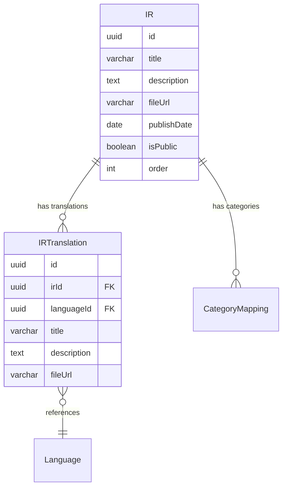
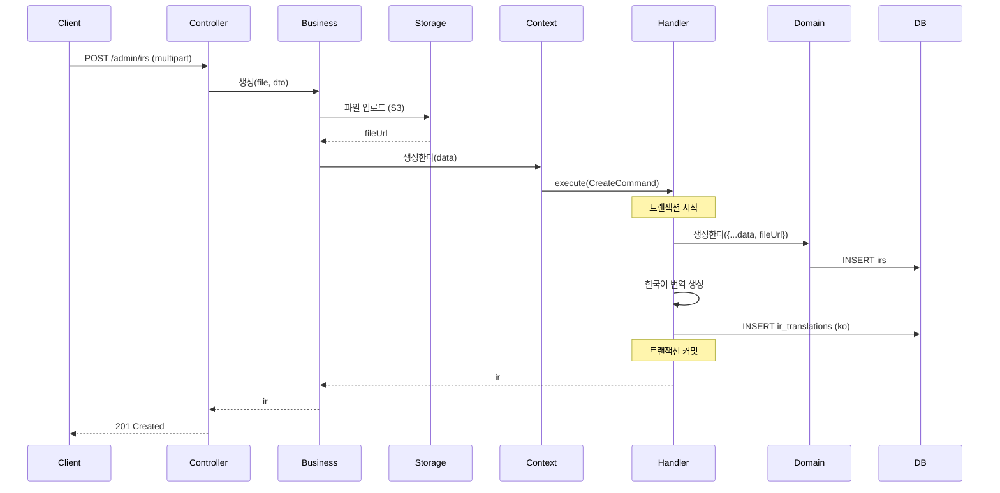
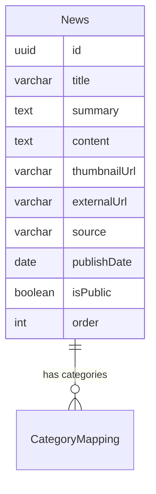
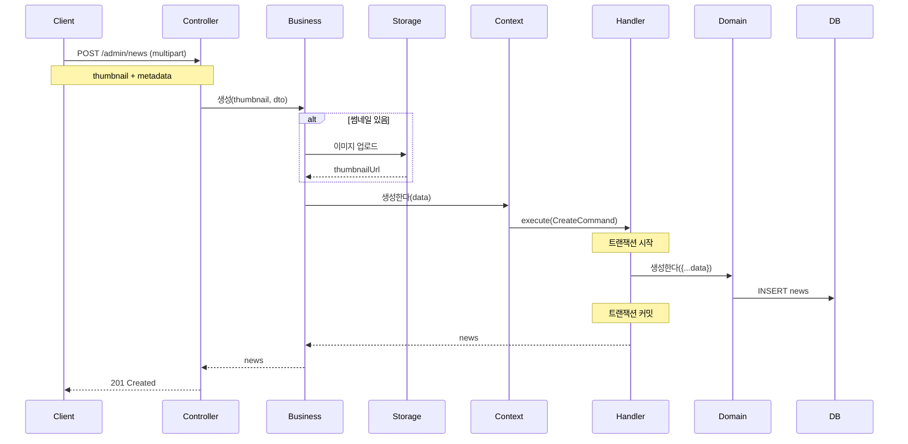

# IR & News Context 데이터 흐름

이 문서는 IR Context와 News Context를 함께 다룹니다. 두 Context는 유사한 패턴을 따릅니다.

## 📋 목차

1. [IR Context](#1-ir-context)
2. [News Context](#2-news-context)
3. [공통 패턴](#3-공통-패턴)

---

## 1. IR Context

### 1.1 개요

**IR Context**는 투자자 관계 (Investor Relations) 자료 관리를 담당합니다.

**주요 기능**:
- IR 자료 생성, 수정, 삭제
- 다국어 번역 관리 (ko/en/ja/zh)
- PDF/PPT 파일 업로드
- 카테고리 분류 (실적 발표, 투자 설명회, 애널리스트 리포트 등)
- 공개/비공개 설정
- 순서 관리

### 1.2 도메인 모델

```typescript
@Entity('irs')
export class IR extends BaseEntity {
  @Column({ type: 'varchar', length: 255 })
  title: string;

  @Column({ type: 'text', nullable: true })
  description: string | null;

  @Column({ type: 'varchar', length: 512, nullable: true })
  fileUrl: string | null;

  @Column({ type: 'bigint', nullable: true })
  fileSize: number | null;

  @Column({ type: 'varchar', length: 100, nullable: true })
  mimeType: string | null;

  @Column({ type: 'date', nullable: true })
  publishDate: Date | null; // 발표일

  @Column({ type: 'boolean', default: false })
  isPublic: boolean;

  @Column({ type: 'int', default: 0 })
  order: number;

  @OneToMany(() => IRTranslation, translation => translation.ir, {
    cascade: true,
  })
  translations: IRTranslation[];
}

@Entity('ir_translations')
export class IRTranslation extends BaseEntity {
  @Column('uuid')
  irId: string;

  @Column('uuid')
  languageId: string;

  @Column({ type: 'varchar', length: 255 })
  title: string;

  @Column({ type: 'text', nullable: true })
  description: string | null;

  @Column({ type: 'varchar', length: 512, nullable: true })
  fileUrl: string | null;

  @ManyToOne(() => IR, ir => ir.translations, {
    onDelete: 'CASCADE',
  })
  ir: IR;

  @ManyToOne(() => Language)
  language: Language;

  @Unique(['irId', 'languageId'])
}
```

### 1.3 ERD



### 1.4 Command 흐름 (IR 생성)



### 1.5 Query 흐름 (IR 목록 조회)

```typescript
@QueryHandler(GetIRListQuery)
async execute(query: GetIRListQuery) {
  const language = await this.languageService.코드로_언어를_조회한다(
    query.languageCode || 'ko',
  );

  const queryBuilder = this.irRepository
    .createQueryBuilder('ir')
    .leftJoinAndSelect(
      'ir.translations',
      'translation',
      'translation.languageId = :languageId',
      { languageId: language.id },
    );

  // 카테고리 필터
  if (query.categoryId) {
    queryBuilder
      .innerJoin('ir.categoryMappings', 'mapping')
      .where('mapping.categoryId = :categoryId', { 
        categoryId: query.categoryId 
      });
  }

  // 공개 여부 필터
  if (query.isPublic !== undefined) {
    queryBuilder.andWhere('ir.isPublic = :isPublic', { 
      isPublic: query.isPublic 
    });
  }

  // 발표일 기준 정렬
  queryBuilder.orderBy('ir.publishDate', 'DESC');
  queryBuilder.addOrderBy('ir.order', 'DESC');

  // 페이지네이션
  const skip = (query.page - 1) * query.limit;
  queryBuilder.skip(skip).take(query.limit);

  const [items, total] = await queryBuilder.getManyAndCount();

  return { items, total, page: query.page, limit: query.limit };
}
```

### 1.6 카테고리 예시

**IR 자료 분류**:
- 실적 발표 (분기별, 연간)
- 투자 설명회 (IR Day)
- 애널리스트 리포트
- 공시 자료
- 사업 보고서
- 기타 IR 자료

---

## 2. News Context

### 2.1 개요

**News Context**는 언론 보도 및 뉴스 관리를 담당합니다.

**주요 기능**:
- 뉴스 기사 생성, 수정, 삭제
- 이미지 업로드 (썸네일)
- 카테고리 분류 (언론사, 주제별)
- 외부 링크 관리
- 공개/비공개 설정
- 순서 관리
- 다국어 지원 없음 (한국어 기본)

### 2.2 도메인 모델

```typescript
@Entity('news')
export class News extends BaseEntity {
  @Column({ type: 'varchar', length: 255 })
  title: string;

  @Column({ type: 'text', nullable: true })
  summary: string | null; // 기사 요약

  @Column({ type: 'text', nullable: true })
  content: string | null; // 전문 (선택적)

  @Column({ type: 'varchar', length: 512, nullable: true })
  thumbnailUrl: string | null; // 썸네일 이미지

  @Column({ type: 'varchar', length: 512, nullable: true })
  externalUrl: string | null; // 외부 기사 링크

  @Column({ type: 'varchar', length: 100, nullable: true })
  source: string | null; // 언론사

  @Column({ type: 'date' })
  publishDate: Date; // 보도일

  @Column({ type: 'boolean', default: false })
  isPublic: boolean;

  @Column({ type: 'int', default: 0 })
  order: number;
}
```

### 2.3 ERD



### 2.4 Command 흐름 (뉴스 생성)



### 2.5 Query 흐름 (뉴스 목록 조회)

```typescript
@QueryHandler(GetNewsListQuery)
async execute(query: GetNewsListQuery) {
  const queryBuilder = this.newsRepository
    .createQueryBuilder('news');

  // 카테고리 필터 (언론사별)
  if (query.categoryId) {
    queryBuilder
      .innerJoin('news.categoryMappings', 'mapping')
      .where('mapping.categoryId = :categoryId', { 
        categoryId: query.categoryId 
      });
  }

  // 언론사 필터
  if (query.source) {
    queryBuilder.andWhere('news.source = :source', { 
      source: query.source 
    });
  }

  // 공개 여부 필터
  if (query.isPublic !== undefined) {
    queryBuilder.andWhere('news.isPublic = :isPublic', { 
      isPublic: query.isPublic 
    });
  }

  // 검색
  if (query.keyword) {
    queryBuilder.andWhere(
      '(news.title LIKE :keyword OR news.summary LIKE :keyword)',
      { keyword: `%${query.keyword}%` },
    );
  }

  // 보도일 기준 정렬
  queryBuilder.orderBy('news.publishDate', 'DESC');
  queryBuilder.addOrderBy('news.order', 'DESC');

  // 페이지네이션
  const skip = (query.page - 1) * query.limit;
  queryBuilder.skip(skip).take(query.limit);

  const [items, total] = await queryBuilder.getManyAndCount();

  return { items, total, page: query.page, limit: query.limit };
}
```

### 2.6 외부 링크 처리

**외부 기사 링크 우선**:
- externalUrl이 있으면 외부 링크로 이동
- 없으면 content 표시

```typescript
async getNewsDisplay(newsId: string): Promise<NewsDisplay> {
  const news = await this.newsRepository.findOne({ where: { id: newsId } });

  if (!news) {
    throw new NotFoundException('뉴스를 찾을 수 없습니다');
  }

  return {
    id: news.id,
    title: news.title,
    summary: news.summary,
    thumbnailUrl: news.thumbnailUrl,
    source: news.source,
    publishDate: news.publishDate,
    // 외부 링크 우선
    linkType: news.externalUrl ? 'external' : 'internal',
    linkUrl: news.externalUrl || `/news/${news.id}`,
    hasFullContent: !!news.content,
  };
}
```

---

## 3. 공통 패턴

### 3.1 파일 업로드 전략

**IR Context**:
- PDF, PPT 업로드
- S3 저장
- 언어별 파일 (선택적)

**News Context**:
- 이미지 (썸네일) 업로드
- 이미지 리사이징 (선택적)
- S3 저장

```typescript
// 공통 파일 업로드 로직
async uploadFile(
  file: Express.Multer.File,
  folder: string, // 'ir' or 'news'
): Promise<{ url: string; size: number }> {
  // 파일 검증
  this.validateFile(file);

  // S3 업로드
  const key = `${folder}/${Date.now()}-${file.originalname}`;
  const url = await this.s3Service.upload(key, file.buffer, file.mimetype);

  return {
    url,
    size: file.size,
  };
}
```

### 3.2 날짜 기반 정렬

**공통 로직**:
- publishDate 기준 최신순 정렬
- order 필드로 2차 정렬

```typescript
queryBuilder
  .orderBy('entity.publishDate', 'DESC')
  .addOrderBy('entity.order', 'DESC');
```

### 3.3 카테고리 필터링

**공통 패턴**:
```typescript
if (query.categoryId) {
  queryBuilder
    .innerJoin('entity.categoryMappings', 'mapping')
    .where('mapping.categoryId = :categoryId', { 
      categoryId: query.categoryId 
    });
}
```

### 3.4 성능 최적화

**인덱스 전략**:
```sql
-- IR
CREATE INDEX idx_ir_publish_date ON irs(publish_date DESC);
CREATE INDEX idx_ir_public ON irs(is_public);
CREATE INDEX idx_ir_order ON irs("order" DESC);

-- News
CREATE INDEX idx_news_publish_date ON news(publish_date DESC);
CREATE INDEX idx_news_public ON news(is_public);
CREATE INDEX idx_news_source ON news(source);
CREATE INDEX idx_news_title_fulltext ON news USING gin(to_tsvector('english', title));
```

### 3.5 캐싱 전략

**공통 캐시 대상**:
- 공개 목록 (카테고리별)
- 최근 항목 (홈페이지 메인)

**TTL**: 10분

---

**문서 생성일**: 2026년 1월 14일  
**버전**: v1.0
