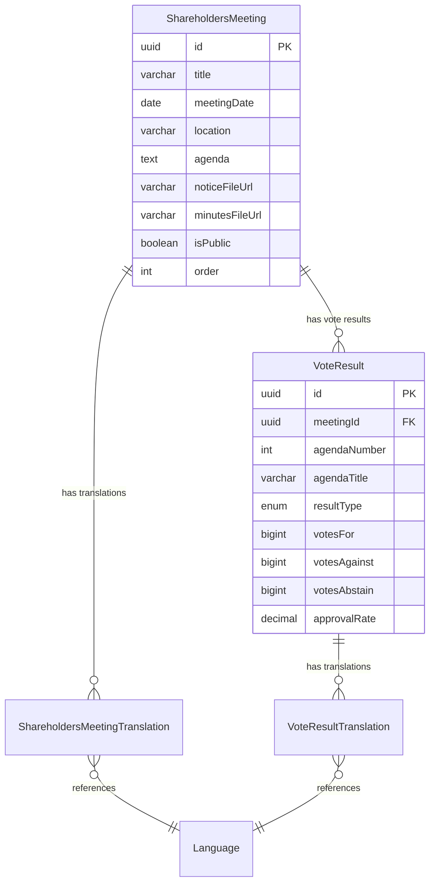
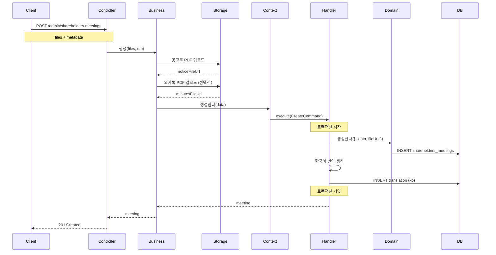
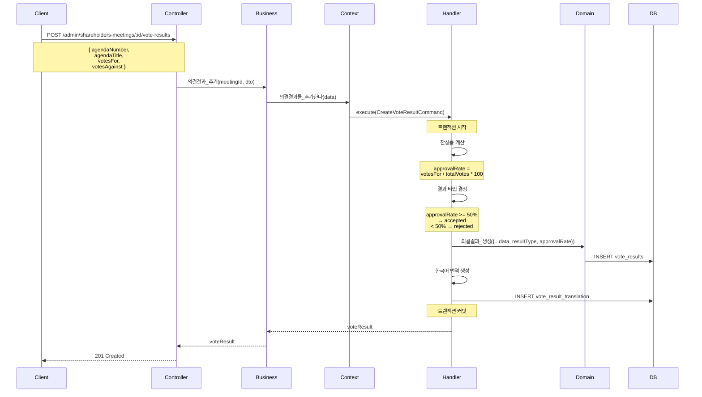
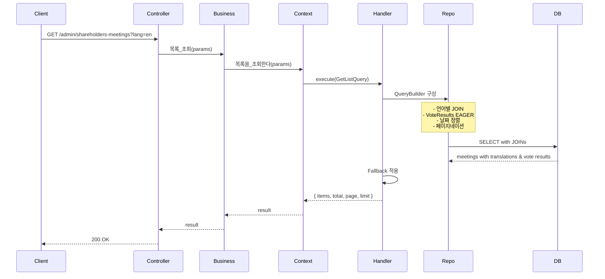

# Shareholders Meeting Context 데이터 흐름

## 📋 목차

1. [개요](#1-개요)
2. [도메인 모델](#2-도메인-모델)
3. [Command 흐름](#3-command-흐름)
4. [Query 흐름](#4-query-흐름)
5. [주요 비즈니스 로직](#5-주요-비즈니스-로직)

---

## 1. 개요

### 1.1 책임

**Shareholders Meeting Context**는 주주총회 및 의결 결과 관리를 담당합니다.

**주요 기능**:
- 주주총회 정보 생성, 수정, 삭제
- 다국어 번역 관리 (한국어, 영어, 일본어, 중국어)
- 의결 결과 (VoteResult) 관리
- 의결 결과 번역 관리
- 총회 일자 관리
- 공개/비공개 설정

### 1.2 관련 엔티티

**Core Domain**:
- `ShareholdersMeeting` - 주주총회 (Core)
- `ShareholdersMeetingTranslation` - 주주총회 번역 (Core)
- `VoteResult` - 의결 결과 (Core)
- `VoteResultTranslation` - 의결 결과 번역 (Core)

**Common Domain**:
- `Language` - 언어 (Common)

### 1.3 핸들러 구성

**Commands (6개)**:
- `CreateShareholdersMeetingHandler` - 주주총회 생성
- `UpdateShareholdersMeetingHandler` - 주주총회 수정
- `UpdateShareholdersMeetingTranslationsHandler` - 번역 수정
- `DeleteShareholdersMeetingHandler` - 주주총회 삭제
- `CreateVoteResultHandler` - 의결 결과 추가
- `UpdateVoteResultHandler` - 의결 결과 수정

**Queries (2개)**:
- `GetShareholdersMeetingListHandler` - 목록 조회
- `GetShareholdersMeetingDetailHandler` - 상세 조회

---

## 2. 도메인 모델

### 2.1 ShareholdersMeeting Entity

```typescript
@Entity('shareholders_meetings')
export class ShareholdersMeeting extends BaseEntity {
  @Column({ type: 'varchar', length: 255 })
  title: string; // 총회 제목 (예: "제10기 정기주주총회")

  @Column({ type: 'date' })
  meetingDate: Date; // 총회 개최일

  @Column({ type: 'varchar', length: 255, nullable: true })
  location: string | null; // 개최 장소

  @Column({ type: 'text', nullable: true })
  agenda: string | null; // 의안 개요

  @Column({ type: 'varchar', length: 512, nullable: true })
  noticeFileUrl: string | null; // 소집 공고문 PDF

  @Column({ type: 'varchar', length: 512, nullable: true })
  minutesFileUrl: string | null; // 의사록 PDF

  @Column({ type: 'boolean', default: false })
  isPublic: boolean;

  @Column({ type: 'int', default: 0 })
  order: number;

  // 관계
  @OneToMany(() => ShareholdersMeetingTranslation, translation => translation.meeting, {
    cascade: true,
  })
  translations: ShareholdersMeetingTranslation[];

  @OneToMany(() => VoteResult, voteResult => voteResult.meeting, {
    cascade: true,
  })
  voteResults: VoteResult[];
}
```

### 2.2 VoteResult Entity

```typescript
@Entity('vote_results')
export class VoteResult extends BaseEntity {
  @Column('uuid')
  meetingId: string;

  @Column({ type: 'int' })
  agendaNumber: number; // 안건 번호 (1, 2, 3, ...)

  @Column({ type: 'varchar', length: 255 })
  agendaTitle: string; // 안건 제목

  @Column({ type: 'enum', enum: VoteResultType })
  resultType: VoteResultType; // accepted | rejected

  @Column({ type: 'bigint', nullable: true })
  votesFor: number | null; // 찬성표 수

  @Column({ type: 'bigint', nullable: true })
  votesAgainst: number | null; // 반대표 수

  @Column({ type: 'bigint', nullable: true })
  votesAbstain: number | null; // 기권표 수

  @Column({ type: 'decimal', precision: 5, scale: 2, nullable: true })
  approvalRate: number | null; // 찬성률 (%)

  // 관계
  @ManyToOne(() => ShareholdersMeeting, meeting => meeting.voteResults, {
    onDelete: 'CASCADE',
  })
  meeting: ShareholdersMeeting;

  @OneToMany(() => VoteResultTranslation, translation => translation.voteResult, {
    cascade: true,
  })
  translations: VoteResultTranslation[];
}
```

### 2.3 의결 결과 타입

```typescript
enum VoteResultType {
  ACCEPTED = 'accepted',   // 가결
  REJECTED = 'rejected',   // 부결
}
```

### 2.4 ERD



---

## 3. Command 흐름

### 3.1 주주총회 생성 (CreateShareholdersMeeting)

**흐름 다이어그램**:



### 3.2 의결 결과 추가 (CreateVoteResult)

**흐름 다이어그램**:



**의결 결과 계산 로직**:

```typescript
@CommandHandler(CreateVoteResultCommand)
async execute(command: CreateVoteResultCommand) {
  const data = command.data;

  // 1. 찬성률 계산
  const totalVotes = data.votesFor + data.votesAgainst + data.votesAbstain;
  const approvalRate = totalVotes > 0 
    ? (data.votesFor / totalVotes) * 100 
    : 0;

  // 2. 결과 타입 결정
  const resultType = approvalRate >= 50 
    ? VoteResultType.ACCEPTED 
    : VoteResultType.REJECTED;

  // 3. 의결 결과 생성
  const voteResult = await this.voteResultService.생성한다({
    meetingId: data.meetingId,
    agendaNumber: data.agendaNumber,
    agendaTitle: data.agendaTitle,
    resultType,
    votesFor: data.votesFor,
    votesAgainst: data.votesAgainst,
    votesAbstain: data.votesAbstain,
    approvalRate: Math.round(approvalRate * 100) / 100, // 소수점 2자리
    createdBy: data.createdBy,
  });

  // 4. 한국어 번역 생성
  const koreanLang = await this.languageService.코드로_언어를_조회한다('ko');
  
  await this.voteResultTranslationRepository.save({
    voteResultId: voteResult.id,
    languageId: koreanLang.id,
    agendaTitle: data.agendaTitle,
  });

  return { voteResult };
}
```

---

## 4. Query 흐름

### 4.1 주주총회 목록 조회 (GetShareholdersMeetingList)

**흐름 다이어그램**:



**쿼리 로직**:

```typescript
@QueryHandler(GetShareholdersMeetingListQuery)
async execute(query: GetShareholdersMeetingListQuery) {
  const language = await this.languageService.코드로_언어를_조회한다(
    query.languageCode || 'ko',
  );

  const queryBuilder = this.meetingRepository
    .createQueryBuilder('meeting')
    .leftJoinAndSelect(
      'meeting.translations',
      'translation',
      'translation.languageId = :languageId',
      { languageId: language.id },
    )
    .leftJoinAndSelect('meeting.voteResults', 'voteResults')
    .leftJoinAndSelect(
      'voteResults.translations',
      'voteResultTranslation',
      'voteResultTranslation.languageId = :languageId',
      { languageId: language.id },
    );

  // 공개 여부 필터
  if (query.isPublic !== undefined) {
    queryBuilder.where('meeting.isPublic = :isPublic', { 
      isPublic: query.isPublic 
    });
  }

  // 날짜 범위 필터
  if (query.year) {
    queryBuilder.andWhere(
      'EXTRACT(YEAR FROM meeting.meetingDate) = :year',
      { year: query.year },
    );
  }

  // 정렬 (최신순)
  queryBuilder.orderBy('meeting.meetingDate', 'DESC');
  queryBuilder.addOrderBy('voteResults.agendaNumber', 'ASC');

  // 페이지네이션
  const skip = (query.page - 1) * query.limit;
  queryBuilder.skip(skip).take(query.limit);

  const [items, total] = await queryBuilder.getManyAndCount();

  return { items, total, page: query.page, limit: query.limit };
}
```

---

## 5. 주요 비즈니스 로직

### 5.1 안건 번호 자동 할당

**규칙**:
- 주주총회 내에서 안건 번호는 1부터 순차적으로 할당
- 기존 안건 삭제 시 번호 재정렬

```typescript
async getNextAgendaNumber(meetingId: string): Promise<number> {
  const maxAgenda = await this.voteResultRepository
    .createQueryBuilder('voteResult')
    .where('voteResult.meetingId = :meetingId', { meetingId })
    .select('MAX(voteResult.agendaNumber)', 'max')
    .getRawOne();

  return (maxAgenda?.max || 0) + 1;
}
```

### 5.2 의결 결과 통계

**집계 데이터**:

```typescript
interface MeetingStatistics {
  totalAgendas: number;           // 총 안건 수
  acceptedCount: number;          // 가결 안건 수
  rejectedCount: number;          // 부결 안건 수
  averageApprovalRate: number;    // 평균 찬성률
  totalVotes: number;             // 총 투표수
}

async getMeetingStatistics(meetingId: string): Promise<MeetingStatistics> {
  const voteResults = await this.voteResultRepository.find({
    where: { meetingId },
  });

  const totalAgendas = voteResults.length;
  const acceptedCount = voteResults.filter(
    v => v.resultType === VoteResultType.ACCEPTED
  ).length;
  const rejectedCount = totalAgendas - acceptedCount;

  const totalApprovalRate = voteResults.reduce(
    (sum, v) => sum + v.approvalRate,
    0,
  );
  const averageApprovalRate = totalAgendas > 0 
    ? totalApprovalRate / totalAgendas 
    : 0;

  const totalVotes = voteResults.reduce(
    (sum, v) => sum + v.votesFor + v.votesAgainst + v.votesAbstain,
    0,
  );

  return {
    totalAgendas,
    acceptedCount,
    rejectedCount,
    averageApprovalRate: Math.round(averageApprovalRate * 100) / 100,
    totalVotes,
  };
}
```

### 5.3 다국어 번역 전략

**2단계 번역**:
1. ShareholdersMeeting 번역
2. VoteResult 번역 (안건별)

```typescript
async createMeetingWithTranslations(
  data: CreateMeetingData,
  translations: MeetingTranslation[],
): Promise<ShareholdersMeeting> {
  // 1. 주주총회 생성
  const meeting = await this.meetingService.생성한다(data);

  // 2. 주주총회 번역 생성
  for (const trans of translations) {
    const language = await this.languageService.코드로_언어를_조회한다(
      trans.languageCode,
    );

    await this.meetingTranslationRepository.save({
      meetingId: meeting.id,
      languageId: language.id,
      title: trans.title,
      agenda: trans.agenda,
      location: trans.location,
    });
  }

  return meeting;
}
```

### 5.4 의사록 자동 생성

**비즈니스 요구사항**:
- 총회 종료 후 의사록 생성
- 의결 결과 포함
- 다국어 지원

```typescript
async generateMinutes(
  meetingId: string,
  languageCode: string = 'ko',
): Promise<string> {
  const meeting = await this.meetingRepository.findOne({
    where: { id: meetingId },
    relations: ['translations', 'voteResults', 'voteResults.translations'],
  });

  const translation = meeting.translations.find(
    t => t.language.code === languageCode,
  );

  // 의사록 템플릿
  let minutes = `
# ${translation?.title || meeting.title}

## 일시
${format(meeting.meetingDate, 'yyyy년 MM월 dd일')}

## 장소
${translation?.location || meeting.location || ''}

## 안건 및 의결 결과

`;

  // 의결 결과 추가
  for (const voteResult of meeting.voteResults) {
    const voteTranslation = voteResult.translations.find(
      t => t.language.code === languageCode,
    );

    minutes += `
### 제${voteResult.agendaNumber}호 의안: ${voteTranslation?.agendaTitle || voteResult.agendaTitle}

- 찬성: ${voteResult.votesFor.toLocaleString()}표
- 반대: ${voteResult.votesAgainst.toLocaleString()}표
- 기권: ${voteResult.votesAbstain.toLocaleString()}표
- 찬성률: ${voteResult.approvalRate}%
- 결과: **${voteResult.resultType === VoteResultType.ACCEPTED ? '가결' : '부결'}**

`;
  }

  return minutes;
}
```

---

## 6. 법적 고려사항

### 6.1 상법 규정

- 주주총회 소집 공고 (14일 전)
- 의사록 작성 의무
- 특별결의 요건 (2/3 이상)

### 6.2 공시 의무

```typescript
// 주주총회 결과 공시 (금융감독원)
async notifyToRegulator(meetingId: string): Promise<void> {
  const meeting = await this.getMeetingWithVoteResults(meetingId);
  
  // DART API 연동
  await this.dartApiService.reportShareholdersMeeting({
    meetingDate: meeting.meetingDate,
    voteResults: meeting.voteResults.map(vr => ({
      agendaNumber: vr.agendaNumber,
      agendaTitle: vr.agendaTitle,
      resultType: vr.resultType,
      approvalRate: vr.approvalRate,
    })),
  });
}
```

---

## 7. 성능 최적화

### 7.1 인덱스 전략

```sql
-- 주주총회 조회
CREATE INDEX idx_sm_meeting_date ON shareholders_meetings(meeting_date DESC);
CREATE INDEX idx_sm_public ON shareholders_meetings(is_public);

-- 의결 결과 조회
CREATE INDEX idx_vr_meeting_agenda ON vote_results(meeting_id, agenda_number);
CREATE INDEX idx_vr_result_type ON vote_results(result_type);
```

### 7.2 번역 Eager Loading

```typescript
// N+1 방지
const meetings = await this.meetingRepository.find({
  relations: [
    'translations',
    'voteResults',
    'voteResults.translations',
  ],
});
```

---

**문서 생성일**: 2026년 1월 14일  
**버전**: v1.0
