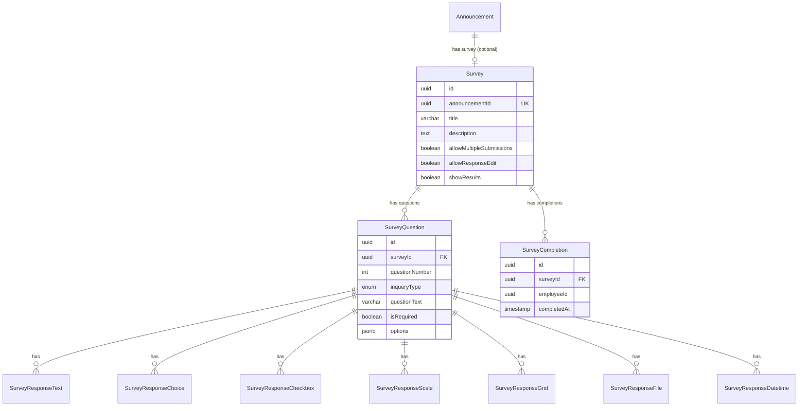
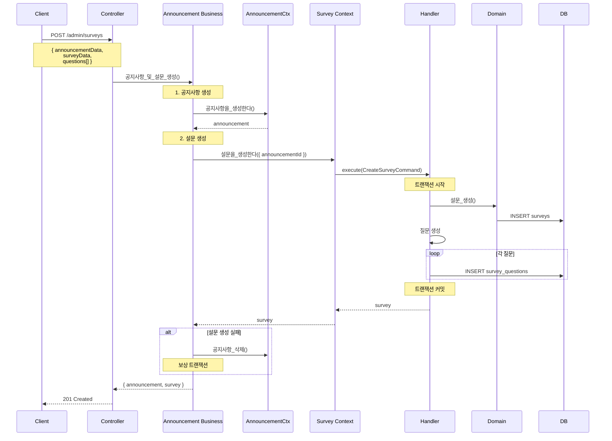
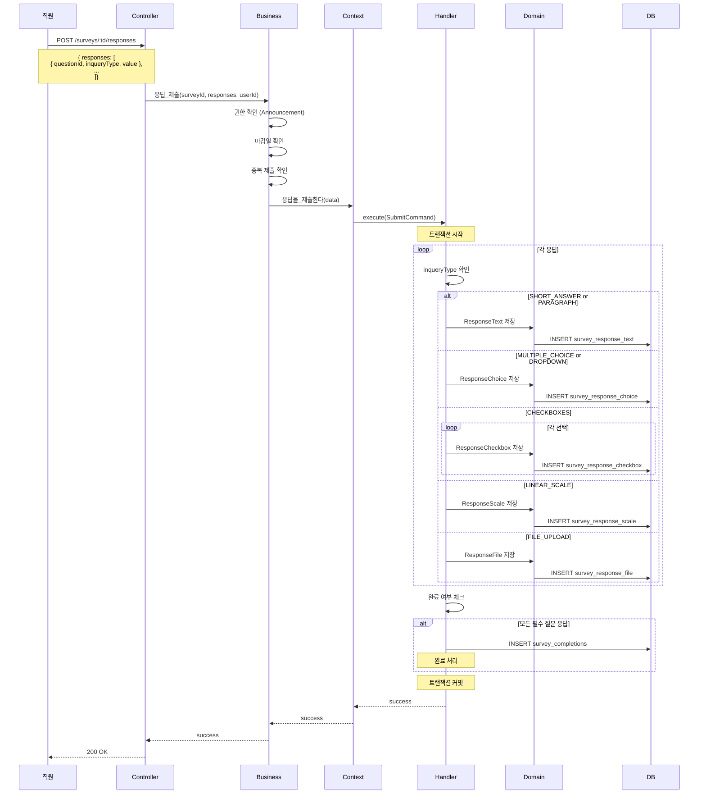
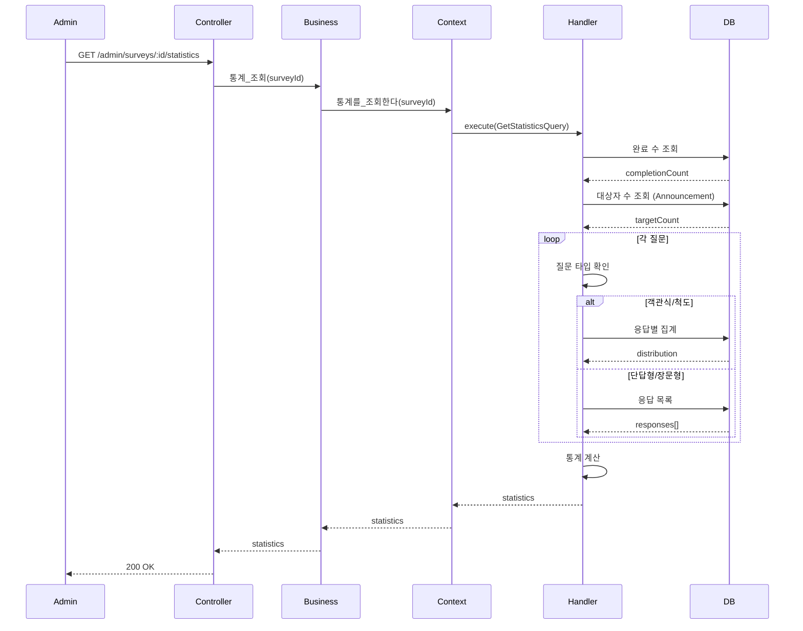

# Survey Context 데이터 흐름

## 📋 목차

1. [개요](#1-개요)
2. [도메인 모델](#2-도메인-모델)
3. [Command 흐름](#3-command-흐름)
4. [Query 흐름](#4-query-흐름)
5. [주요 비즈니스 로직](#5-주요-비즈니스-로직)

---

## 1. 개요

### 1.1 책임

**Survey Context**는 공지사항 연동 설문조사 시스템을 담당합니다.

**주요 기능**:
- 설문 생성, 수정, 삭제 (Announcement 연동 필수)
- 질문 관리 (9가지 타입 지원)
- 응답 수집 (타입별 응답 테이블 분리)
- 완료 여부 추적 (SurveyCompletion)
- 통계 분석
- 마감일 관리 (Announcement와 동일)

### 1.2 관련 엔티티

**Sub Domain**:
- `Survey` - 설문조사 (Sub, Announcement 1:1 연동)
- `SurveyQuestion` - 설문 질문
- `SurveyCompletion` - 완료 추적
- **타입별 응답 테이블 (7개)**:
  - `SurveyResponseText` - 단답형, 장문형
  - `SurveyResponseChoice` - 객관식, 드롭다운
  - `SurveyResponseCheckbox` - 체크박스 (Hard Delete)
  - `SurveyResponseScale` - 선형 척도
  - `SurveyResponseGrid` - 그리드 척도
  - `SurveyResponseFile` - 파일 업로드
  - `SurveyResponseDatetime` - 날짜/시간

**Core Domain**:
- `Announcement` - 공지사항 (Core, 1:1 관계)

### 1.3 핸들러 구성

**Commands (6개)**:
- `CreateSurveyHandler` - 설문 생성
- `UpdateSurveyHandler` - 설문 수정
- `DeleteSurveyHandler` - 설문 삭제
- `SubmitSurveyResponseHandler` - 응답 제출
- `UpdateSurveyResponseHandler` - 응답 수정
- `CompleteSurveyHandler` - 설문 완료 처리

**Queries (4개)**:
- `GetSurveyDetailHandler` - 상세 조회
- `GetSurveyResponsesHandler` - 응답 조회 (통계)
- `GetSurveyCompletionStatusHandler` - 완료 여부 조회
- `GetSurveyStatisticsHandler` - 통계 분석

---

## 2. 도메인 모델

### 2.1 Survey Entity

```typescript
@Entity('surveys')
export class Survey extends BaseEntity {
  @Column('uuid', { unique: true })
  announcementId: string; // 1:1 관계

  @Column({ type: 'varchar', length: 255 })
  title: string;

  @Column({ type: 'text', nullable: true })
  description: string | null;

  @Column({ type: 'boolean', default: false })
  allowMultipleSubmissions: boolean; // 중복 제출 허용

  @Column({ type: 'boolean', default: false })
  allowResponseEdit: boolean; // 응답 수정 허용

  @Column({ type: 'boolean', default: true })
  showResults: boolean; // 결과 공개 여부

  // 관계
  @OneToOne(() => Announcement, { onDelete: 'CASCADE' })
  @JoinColumn({ name: 'announcementId' })
  announcement: Announcement;

  @OneToMany(() => SurveyQuestion, question => question.survey, {
    cascade: true,
  })
  questions: SurveyQuestion[];

  @OneToMany(() => SurveyCompletion, completion => completion.survey)
  completions: SurveyCompletion[];
}
```

### 2.2 SurveyQuestion Entity

```typescript
@Entity('survey_questions')
export class SurveyQuestion extends BaseEntity {
  @Column('uuid')
  surveyId: string;

  @Column({ type: 'int' })
  questionNumber: number; // 질문 순서 (1, 2, 3, ...)

  @Column({ type: 'enum', enum: InqueryType })
  inqueryType: InqueryType;

  @Column({ type: 'varchar', length: 500 })
  questionText: string;

  @Column({ type: 'boolean', default: false })
  isRequired: boolean;

  @Column({ type: 'jsonb', nullable: true })
  options: any; // 질문 타입별 옵션 (선택지, 척도 범위 등)

  @ManyToOne(() => Survey, survey => survey.questions, {
    onDelete: 'CASCADE',
  })
  survey: Survey;
}
```

### 2.3 질문 타입 (InqueryType)

```typescript
enum InqueryType {
  SHORT_ANSWER = 'short_answer',       // 단답형
  PARAGRAPH = 'paragraph',             // 장문형
  MULTIPLE_CHOICE = 'multiple_choice', // 객관식
  DROPDOWN = 'dropdown',               // 드롭다운
  CHECKBOXES = 'checkboxes',           // 체크박스 (다중 선택)
  FILE_UPLOAD = 'file_upload',         // 파일 업로드
  DATETIME = 'datetime',               // 날짜/시간
  LINEAR_SCALE = 'linear_scale',       // 선형 척도 (1-5, 1-10 등)
  GRID_SCALE = 'grid_scale',           // 그리드 척도
}
```

### 2.4 타입별 응답 테이블

```typescript
// 단답형, 장문형
@Entity('survey_response_text')
export class SurveyResponseText extends BaseEntity {
  @Column('uuid')
  questionId: string;

  @Column('uuid')
  employeeId: string;

  @Column({ type: 'text' })
  textValue: string;
}

// 객관식, 드롭다운
@Entity('survey_response_choice')
export class SurveyResponseChoice extends BaseEntity {
  @Column('uuid')
  questionId: string;

  @Column('uuid')
  employeeId: string;

  @Column({ type: 'varchar', length: 500 })
  selectedOption: string;

  @Column({ type: 'int', nullable: true })
  optionIndex: number | null;
}

// 체크박스 (Hard Delete)
@Entity('survey_response_checkbox')
export class SurveyResponseCheckbox {
  @PrimaryColumn('uuid')
  id: string;

  @Column('uuid')
  questionId: string;

  @Column('uuid')
  employeeId: string;

  @Column({ type: 'varchar', length: 500 })
  selectedOption: string;

  @Column({ type: 'int' })
  optionIndex: number;
  
  // Soft Delete 없음 (Hard Delete)
}

// 선형 척도
@Entity('survey_response_scale')
export class SurveyResponseScale extends BaseEntity {
  @Column('uuid')
  questionId: string;

  @Column('uuid')
  employeeId: string;

  @Column({ type: 'int' })
  scaleValue: number; // 1-5, 1-10 등
}

// 파일 업로드
@Entity('survey_response_file')
export class SurveyResponseFile extends BaseEntity {
  @Column('uuid')
  questionId: string;

  @Column('uuid')
  employeeId: string;

  @Column({ type: 'varchar', length: 512 })
  fileUrl: string;

  @Column({ type: 'varchar', length: 255 })
  fileName: string;

  @Column({ type: 'bigint' })
  fileSize: number;
}
```

### 2.5 SurveyCompletion Entity

```typescript
@Entity('survey_completions')
export class SurveyCompletion extends BaseEntity {
  @Column('uuid')
  surveyId: string;

  @Column('uuid')
  employeeId: string;

  @Column({ type: 'timestamp' })
  completedAt: Date;

  @ManyToOne(() => Survey, survey => survey.completions, {
    onDelete: 'CASCADE',
  })
  survey: Survey;

  @Unique(['surveyId', 'employeeId']) // 중복 제출 방지
}
```

### 2.6 ERD



---

## 3. Command 흐름

### 3.1 설문 생성 (CreateSurvey)

**흐름 다이어그램**:



**핵심 로직**:

```typescript
// Business Service - 보상 트랜잭션
async 공지사항_및_설문_생성(
  announcementDto: CreateAnnouncementDto,
  surveyDto: CreateSurveyDto,
  userId: string,
) {
  // 1. 공지사항 생성
  const announcement = await this.announcementContextService.공지사항을_생성한다({
    ...announcementDto,
    createdBy: userId,
  });

  try {
    // 2. 설문 생성
    const survey = await this.surveyContextService.설문을_생성한다({
      ...surveyDto,
      announcementId: announcement.announcement.id,
      createdBy: userId,
    });

    return { announcement, survey };
  } catch (error) {
    // 설문 생성 실패 시 공지사항 삭제 (보상 트랜잭션)
    await this.announcementContextService.공지사항을_삭제한다(
      announcement.announcement.id,
    );
    throw error;
  }
}
```

### 3.2 응답 제출 (SubmitSurveyResponse)

**흐름 다이어그램**:



**타입별 응답 저장 로직**:

```typescript
@CommandHandler(SubmitSurveyResponseCommand)
async execute(command: SubmitSurveyResponseCommand) {
  const { surveyId, employeeId, responses } = command.data;

  // 설문 조회
  const survey = await this.surveyService.ID로_조회한다(surveyId);

  // 질문 조회
  const questions = await this.questionRepository.find({
    where: { surveyId },
  });

  // 각 응답 저장
  for (const response of responses) {
    const question = questions.find(q => q.id === response.questionId);
    
    if (!question) {
      throw new NotFoundException(`질문을 찾을 수 없습니다: ${response.questionId}`);
    }

    // 타입별 응답 테이블에 저장
    await this.saveResponseByType(question, employeeId, response.value);
  }

  // 완료 여부 확인
  const isComplete = this.checkAllRequiredQuestionsAnswered(
    questions,
    responses,
  );

  if (isComplete) {
    await this.completionRepository.save({
      surveyId,
      employeeId,
      completedAt: new Date(),
    });
  }

  return { success: true, completed: isComplete };
}

private async saveResponseByType(
  question: SurveyQuestion,
  employeeId: string,
  value: any,
): Promise<void> {
  switch (question.inqueryType) {
    case InqueryType.SHORT_ANSWER:
    case InqueryType.PARAGRAPH:
      await this.responseTextRepository.save({
        questionId: question.id,
        employeeId,
        textValue: value,
      });
      break;

    case InqueryType.MULTIPLE_CHOICE:
    case InqueryType.DROPDOWN:
      await this.responseChoiceRepository.save({
        questionId: question.id,
        employeeId,
        selectedOption: value.option,
        optionIndex: value.index,
      });
      break;

    case InqueryType.CHECKBOXES:
      // 기존 체크박스 응답 삭제 (Hard Delete)
      await this.responseCheckboxRepository.delete({
        questionId: question.id,
        employeeId,
      });
      
      // 새 선택 저장
      for (const option of value) {
        await this.responseCheckboxRepository.save({
          questionId: question.id,
          employeeId,
          selectedOption: option.option,
          optionIndex: option.index,
        });
      }
      break;

    case InqueryType.LINEAR_SCALE:
      await this.responseScaleRepository.save({
        questionId: question.id,
        employeeId,
        scaleValue: value,
      });
      break;

    case InqueryType.FILE_UPLOAD:
      await this.responseFileRepository.save({
        questionId: question.id,
        employeeId,
        fileUrl: value.url,
        fileName: value.name,
        fileSize: value.size,
      });
      break;

    case InqueryType.DATETIME:
      await this.responseDatetimeRepository.save({
        questionId: question.id,
        employeeId,
        datetimeValue: new Date(value),
      });
      break;

    default:
      throw new BadRequestException(`지원하지 않는 질문 타입: ${question.inqueryType}`);
  }
}
```

---

## 4. Query 흐름

### 4.1 설문 통계 조회 (GetSurveyStatistics)

**흐름 다이어그램**:



**통계 계산 로직**:

```typescript
@QueryHandler(GetSurveyStatisticsQuery)
async execute(query: GetSurveyStatisticsQuery) {
  const survey = await this.surveyRepository.findOne({
    where: { id: query.surveyId },
    relations: ['questions', 'completions', 'announcement'],
  });

  // 1. 기본 통계
  const completionCount = survey.completions.length;
  const targetCount = await this.getTargetEmployeeCount(survey.announcement);
  const completionRate = targetCount > 0 
    ? (completionCount / targetCount) * 100 
    : 0;

  // 2. 질문별 통계
  const questionStatistics = await Promise.all(
    survey.questions.map(q => this.calculateQuestionStatistics(q))
  );

  return {
    surveyId: survey.id,
    title: survey.title,
    completionCount,
    targetCount,
    completionRate: Math.round(completionRate * 100) / 100,
    questions: questionStatistics,
  };
}

private async calculateQuestionStatistics(
  question: SurveyQuestion,
): Promise<QuestionStatistics> {
  switch (question.inqueryType) {
    case InqueryType.MULTIPLE_CHOICE:
    case InqueryType.DROPDOWN:
      return await this.calculateChoiceStatistics(question);

    case InqueryType.LINEAR_SCALE:
      return await this.calculateScaleStatistics(question);

    case InqueryType.CHECKBOXES:
      return await this.calculateCheckboxStatistics(question);

    default:
      return {
        questionId: question.id,
        questionText: question.questionText,
        responseCount: await this.getResponseCount(question),
      };
  }
}

private async calculateChoiceStatistics(
  question: SurveyQuestion,
): Promise<ChoiceStatistics> {
  const responses = await this.responseChoiceRepository.find({
    where: { questionId: question.id },
  });

  // 선택지별 집계
  const distribution = {};
  for (const response of responses) {
    const option = response.selectedOption;
    distribution[option] = (distribution[option] || 0) + 1;
  }

  return {
    questionId: question.id,
    questionText: question.questionText,
    responseCount: responses.length,
    distribution,
  };
}

private async calculateScaleStatistics(
  question: SurveyQuestion,
): Promise<ScaleStatistics> {
  const responses = await this.responseScaleRepository.find({
    where: { questionId: question.id },
  });

  const values = responses.map(r => r.scaleValue);
  const sum = values.reduce((a, b) => a + b, 0);
  const average = values.length > 0 ? sum / values.length : 0;

  // 분포
  const distribution = {};
  for (const value of values) {
    distribution[value] = (distribution[value] || 0) + 1;
  }

  return {
    questionId: question.id,
    questionText: question.questionText,
    responseCount: values.length,
    average: Math.round(average * 100) / 100,
    distribution,
  };
}
```

---

## 5. 주요 비즈니스 로직

### 5.1 타입별 응답 테이블 분리 전략

**목적**:
- 통계 쿼리 성능 10배 이상 향상
- 타입 안전성 보장
- 질문 타입별 최적화

**장점**:
```
단일 테이블:
SELECT * FROM survey_responses 
WHERE question_id = ? AND inquery_type = 'multiple_choice'
→ 전체 테이블 스캔 (느림)

분리 테이블:
SELECT * FROM survey_response_choice WHERE question_id = ?
→ 작은 테이블, 빠른 인덱스 조회 (빠름)
```

### 5.2 체크박스 Hard Delete 전략

**이유**:
- 체크박스는 선택 취소 시 레코드 완전 삭제
- Soft Delete 불필요 (이력 관리 안 함)
- 저장 공간 절약

```typescript
// 체크박스 응답 업데이트
async updateCheckboxResponse(
  questionId: string,
  employeeId: string,
  selectedOptions: string[],
): Promise<void> {
  // 기존 응답 Hard Delete
  await this.responseCheckboxRepository.delete({
    questionId,
    employeeId,
  });

  // 새 선택 저장
  for (const option of selectedOptions) {
    await this.responseCheckboxRepository.save({
      questionId,
      employeeId,
      selectedOption: option,
    });
  }
}
```

### 5.3 완료 여부 추적

**비즈니스 규칙**:
- 모든 필수 질문에 응답해야 완료
- 완료 시 SurveyCompletion 레코드 생성
- 중복 제출 설정에 따라 재제출 허용

```typescript
private checkAllRequiredQuestionsAnswered(
  questions: SurveyQuestion[],
  responses: SubmittedResponse[],
): boolean {
  const requiredQuestions = questions.filter(q => q.isRequired);
  const respondedQuestionIds = responses.map(r => r.questionId);

  return requiredQuestions.every(q => 
    respondedQuestionIds.includes(q.id)
  );
}

async markAsComplete(surveyId: string, employeeId: string): Promise<void> {
  // 중복 확인
  const existing = await this.completionRepository.findOne({
    where: { surveyId, employeeId },
  });

  if (existing) {
    throw new ConflictException('이미 완료한 설문입니다');
  }

  await this.completionRepository.save({
    surveyId,
    employeeId,
    completedAt: new Date(),
  });
}
```

### 5.4 마감일 검증

**Announcement의 마감일 기준**:

```typescript
async validateSurveyDeadline(surveyId: string): Promise<void> {
  const survey = await this.surveyRepository.findOne({
    where: { id: surveyId },
    relations: ['announcement'],
  });

  if (!survey.announcement.dueDate) {
    return; // 마감일 없음
  }

  const now = new Date();
  if (now > survey.announcement.dueDate) {
    throw new BadRequestException('설문 마감일이 지났습니다');
  }
}
```

### 5.5 응답 수정 처리

**allowResponseEdit 설정에 따라**:

```typescript
async updateResponse(
  surveyId: string,
  employeeId: string,
  questionId: string,
  newValue: any,
): Promise<void> {
  // 설문 설정 확인
  const survey = await this.surveyRepository.findOne({
    where: { id: surveyId },
  });

  if (!survey.allowResponseEdit) {
    throw new ForbiddenException('응답 수정이 허용되지 않습니다');
  }

  // 완료 여부 확인
  const completion = await this.completionRepository.findOne({
    where: { surveyId, employeeId },
  });

  if (completion) {
    throw new BadRequestException('완료된 설문은 수정할 수 없습니다');
  }

  // 응답 수정
  const question = await this.questionRepository.findOne({
    where: { id: questionId },
  });

  await this.saveResponseByType(question, employeeId, newValue);
}
```

---

## 6. 성능 최적화

### 6.1 타입별 응답 테이블 인덱스

```sql
-- 각 응답 테이블에 복합 인덱스
CREATE INDEX idx_survey_response_text_q_e 
  ON survey_response_text(question_id, employee_id);

CREATE INDEX idx_survey_response_choice_q_e 
  ON survey_response_choice(question_id, employee_id);

CREATE INDEX idx_survey_response_checkbox_q_e 
  ON survey_response_checkbox(question_id, employee_id);

CREATE INDEX idx_survey_response_scale_q_e 
  ON survey_response_scale(question_id, employee_id);

-- 통계 쿼리 최적화
CREATE INDEX idx_survey_response_choice_option 
  ON survey_response_choice(question_id, selected_option);

CREATE INDEX idx_survey_response_scale_value 
  ON survey_response_scale(question_id, scale_value);
```

### 6.2 통계 쿼리 최적화

**분리 전략의 성능 이점**:

```sql
-- ❌ 단일 테이블 (느림)
SELECT selected_option, COUNT(*) 
FROM survey_responses 
WHERE question_id = ? AND inquery_type = 'multiple_choice'
GROUP BY selected_option;
-- 전체 테이블 스캔 필요

-- ✅ 분리 테이블 (빠름)
SELECT selected_option, COUNT(*) 
FROM survey_response_choice 
WHERE question_id = ?
GROUP BY selected_option;
-- 작은 테이블, 인덱스 활용
```

### 6.3 N+1 문제 방지

```typescript
// ❌ N+1 발생
const survey = await this.surveyRepository.findOne({ where: { id } });
for (const question of survey.questions) {
  question.responses; // 각 질문마다 별도 쿼리
}

// ✅ 해결: 배치 조회
const survey = await this.surveyRepository.findOne({ where: { id } });
const questionIds = survey.questions.map(q => q.id);

// 한 번에 모든 응답 조회
const allResponses = await this.getAllResponsesByQuestionIds(questionIds);
```

---

## 7. 비즈니스 규칙

### 7.1 설문 제약 조건

1. **Announcement 필수**: 모든 설문은 공지사항에 연동되어야 함
2. **마감일 동기화**: 설문 마감일 = 공지사항 마감일
3. **권한 상속**: 설문 권한 = 공지사항 권한
4. **완료 추적**: 필수 질문 모두 응답 시 완료 처리

### 7.2 응답 제약 조건

1. **필수 질문**: isRequired = true인 질문은 반드시 응답
2. **중복 제출**: allowMultipleSubmissions 설정에 따라 제어
3. **응답 수정**: allowResponseEdit 설정에 따라 제어
4. **완료 후 수정 불가**: SurveyCompletion 생성 후 수정 불가

### 7.3 삭제 제약 조건

```typescript
async 설문을_삭제한다(surveyId: string): Promise<void> {
  const survey = await this.surveyRepository.findOne({
    where: { id: surveyId },
    relations: ['completions'],
  });

  // 응답이 있는 설문은 삭제 불가
  if (survey.completions.length > 0) {
    throw new BadRequestException(
      '응답이 있는 설문은 삭제할 수 없습니다. 공지사항과 함께 비공개 처리하세요.',
    );
  }

  await this.surveyRepository.softDelete(surveyId);
}
```

---

**문서 생성일**: 2026년 1월 14일  
**버전**: v1.0
