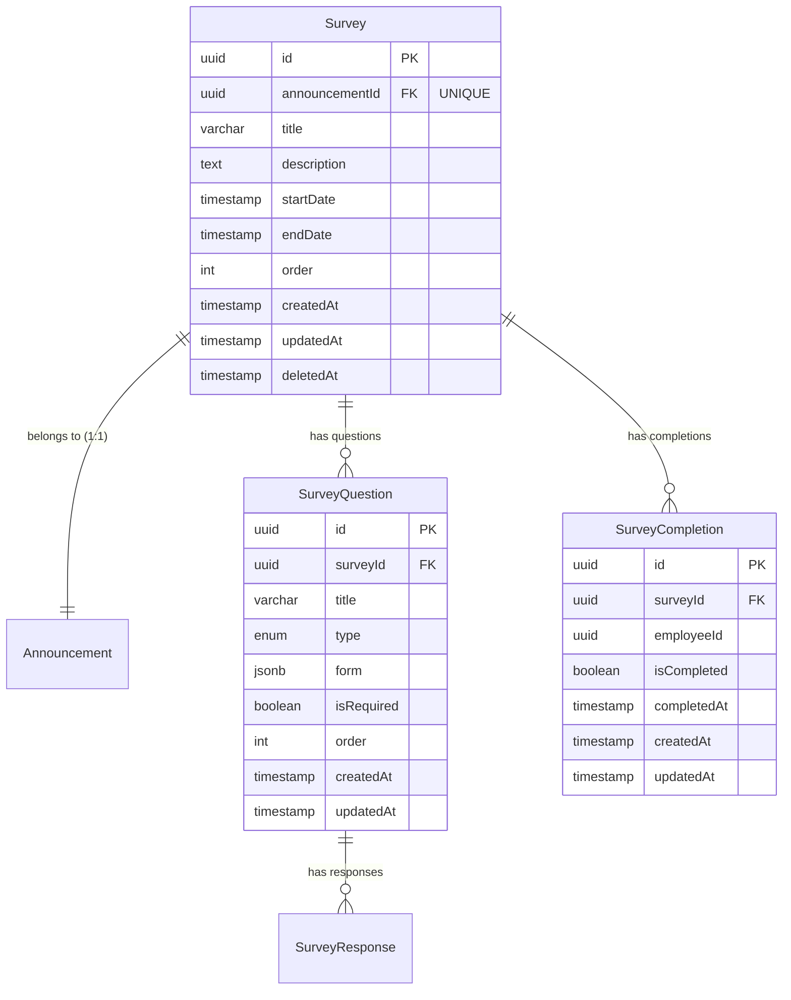
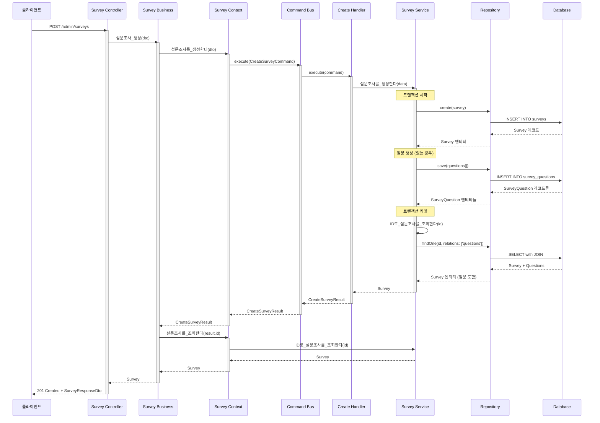
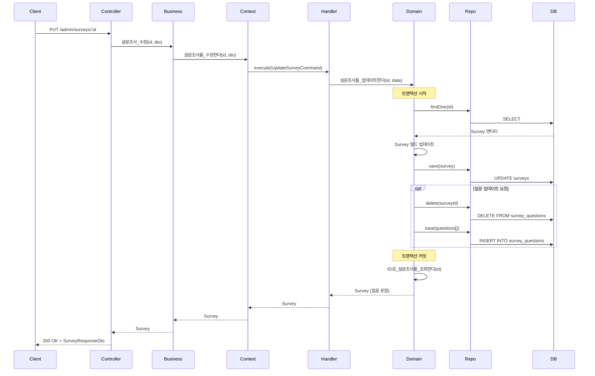
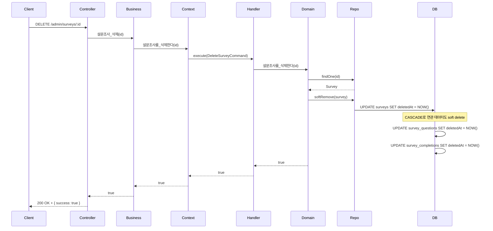
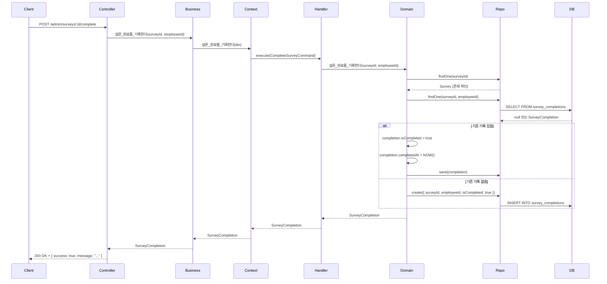
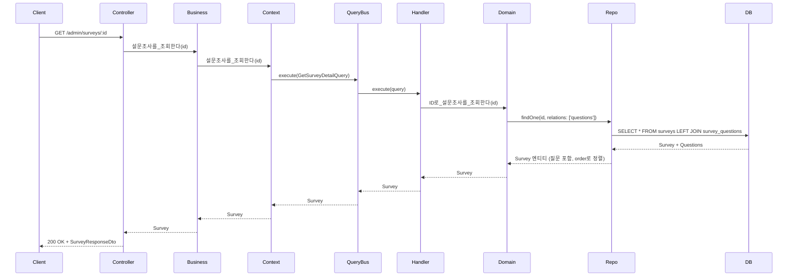
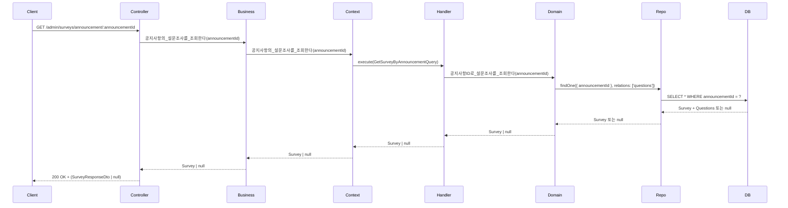
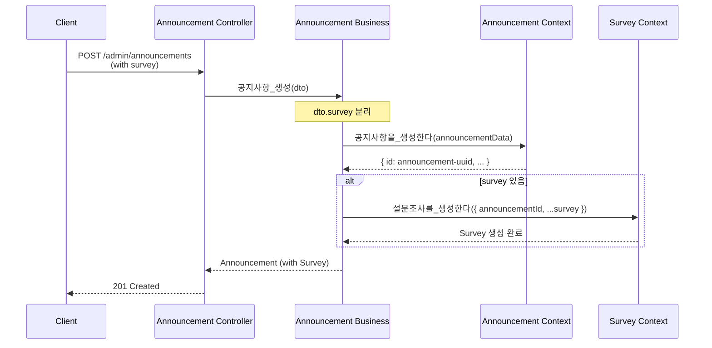

# Survey Context 데이터 흐름

## 📋 목차

1. [개요](#1-개요)
2. [도메인 모델](#2-도메인-모델)
3. [Command 흐름](#3-command-흐름)
4. [Query 흐름](#4-query-흐름)
5. [주요 비즈니스 로직](#5-주요-비즈니스-로직)
6. [연관 Context](#6-연관-context)

---

## 1. 개요

### 1.1 책임

**Survey Context**는 공지사항 연동 설문조사 관리를 담당합니다.

**주요 기능**:
- 설문조사 생성, 수정, 삭제
- 설문 질문 관리 (다양한 질문 타입 지원)
- 설문 응답 수집 및 완료 기록
- 설문 통계 조회
- 공지사항과 1:1 연동

**질문 타입**:
- `SHORT_ANSWER` - 단답형
- `PARAGRAPH` - 장문형
- `MULTIPLE_CHOICE` - 객관식 (단일 선택)
- `DROPDOWN` - 드롭다운
- `CHECKBOXES` - 체크박스 (다중 선택)
- `FILE_UPLOAD` - 파일 업로드
- `DATETIME` - 날짜/시간
- `LINEAR_SCALE` - 선형 척도 (1-10)
- `GRID_SCALE` - 그리드 척도

### 1.2 관련 엔티티

**Sub Domain**:
- `Survey` - 설문조사 (Sub)
- `SurveyQuestion` - 설문 질문 (Sub)
- `SurveyCompletion` - 설문 완료 기록 (Sub)
- `SurveyResponse*` - 설문 응답 (타입별, Sub)

**관계**:
- `Survey` ↔ `Announcement` (1:1, Announcement에 종속)
- `Survey` → `SurveyQuestion` (1:N)
- `Survey` → `SurveyCompletion` (1:N)

### 1.3 핸들러 구성

**Commands (4개)**:
- `CreateSurveyHandler` - 설문조사 생성
- `UpdateSurveyHandler` - 설문조사 수정
- `DeleteSurveyHandler` - 설문조사 삭제
- `CompleteSurveyHandler` - 설문 완료 기록

**Queries (3개)**:
- `GetSurveyListHandler` - 설문조사 목록 조회
- `GetSurveyDetailHandler` - 설문조사 상세 조회
- `GetSurveyByAnnouncementHandler` - 공지사항의 설문조사 조회

---

## 2. 도메인 모델

### 2.1 Survey Entity

```typescript
@Entity('surveys')
export class Survey extends BaseEntity {
  // 공지사항 연동 (FK, 유니크)
  @Column({ type: 'uuid', unique: true })
  announcementId: string;

  @OneToOne(() => Announcement, { onDelete: 'CASCADE' })
  @JoinColumn({ name: 'announcementId' })
  announcement: Announcement;

  // 설문 정보
  @Column({ type: 'varchar', length: 500 })
  title: string;

  @Column({ type: 'text', nullable: true })
  description: string | null;

  @Column({ type: 'timestamp', nullable: true })
  startDate: Date | null;

  @Column({ type: 'timestamp', nullable: true })
  endDate: Date | null;

  @Column({ type: 'int', default: 0 })
  order: number;

  // 관계
  @OneToMany(() => SurveyQuestion, question => question.survey, { cascade: true })
  questions: SurveyQuestion[];

  @OneToMany(() => SurveyCompletion, completion => completion.survey)
  completions: SurveyCompletion[];
}
```

**특징**:
- **공지사항 종속**: announcementId가 FK이며 유니크 제약
- **CASCADE 삭제**: 공지사항 삭제 시 설문조사도 함께 삭제
- **질문 CASCADE**: 설문조사 삭제 시 질문도 함께 삭제

### 2.2 SurveyQuestion Entity

```typescript
@Entity('survey_questions')
export class SurveyQuestion extends BaseEntity {
  @Column({ type: 'uuid' })
  surveyId: string;

  @ManyToOne(() => Survey, survey => survey.questions, { onDelete: 'CASCADE' })
  @JoinColumn({ name: 'surveyId' })
  survey: Survey;

  @Column({ type: 'varchar', length: 1000 })
  title: string;

  @Column({ type: 'enum', enum: InqueryType })
  type: InqueryType;

  // 질문 타입별 옵션 (JSONB)
  @Column({ type: 'jsonb', nullable: true })
  form: {
    options?: string[];           // multiple_choice, dropdown, checkboxes
    minScale?: number;            // linear_scale
    maxScale?: number;            // linear_scale
    rows?: string[];              // grid_scale
    columns?: string[];           // grid_scale
    allowedFileTypes?: string[];  // file_upload
    maxFileSize?: number;         // file_upload
  } | null;

  @Column({ type: 'boolean', default: false })
  isRequired: boolean;

  @Column({ type: 'int', default: 0 })
  order: number;
}
```

**특징**:
- **동적 폼 데이터**: `form` 필드에 질문 타입별 옵션 저장 (JSONB)
- **정렬 순서**: `order` 필드로 질문 표시 순서 관리
- **필수 응답**: `isRequired` 플래그로 필수 질문 표시

### 2.3 SurveyCompletion Entity

```typescript
@Entity('survey_completions')
export class SurveyCompletion extends BaseEntity {
  @Column({ type: 'uuid' })
  surveyId: string;

  @ManyToOne(() => Survey, survey => survey.completions, { onDelete: 'CASCADE' })
  @JoinColumn({ name: 'surveyId' })
  survey: Survey;

  @Column({ type: 'uuid' })
  employeeId: string; // 외부 SSO 직원 ID

  @Column({ type: 'boolean', default: false })
  isCompleted: boolean;

  @Column({ type: 'timestamp', nullable: true })
  completedAt: Date | null;
}
```

**특징**:
- **완료 추적**: 각 직원의 설문 완료 여부 기록
- **시간 기록**: 완료 시점 타임스탬프
- **미답변자 필터링**: isCompleted=false인 레코드로 미답변자 파악

### 2.4 ERD



---

## 3. Command 흐름

### 3.1 설문조사 생성 (CreateSurvey)

**전체 흐름 다이어그램**:



**상세 설명**:

1. **Controller Layer**
   - DTO 검증 (CreateSurveyDto)
   - 날짜 문자열을 Date 객체로 변환
   - Business Service 호출

2. **Business Layer**
   - Context Service 호출
   - 생성 후 상세 정보 재조회

3. **Context Layer**
   - Command 객체 생성
   - CommandBus를 통해 Handler 실행

4. **Handler**
   - 도메인 서비스 호출
   - 결과를 CreateSurveyResult로 변환

5. **Domain Service**
   - **트랜잭션 시작**
   - Survey 엔티티 생성 및 저장
   - SurveyQuestion 엔티티들 생성 및 저장
   - **트랜잭션 커밋**
   - 질문 포함하여 재조회 후 반환

**데이터 흐름 예시**:

```typescript
// 1. 클라이언트 요청
POST /admin/surveys
{
  "announcementId": "announcement-uuid",
  "title": "2024년 직원 만족도 조사",
  "description": "우리 회사의 발전을 위한 소중한 의견을 들려주세요.",
  "startDate": "2024-01-01T00:00:00Z",
  "endDate": "2024-12-31T23:59:59Z",
  "questions": [
    {
      "title": "회사에 만족하시나요?",
      "type": "LINEAR_SCALE",
      "form": { "minScale": 1, "maxScale": 10 },
      "isRequired": true,
      "order": 0
    },
    {
      "title": "개선이 필요한 부분은?",
      "type": "CHECKBOXES",
      "form": { 
        "options": ["복지", "업무 환경", "커뮤니케이션", "기타"] 
      },
      "isRequired": true,
      "order": 1
    }
  ]
}

// 2. Domain Service 처리
// 트랜잭션 내에서:
// - Survey 생성: { id, announcementId, title, ... }
// - Question 1 생성: { id, surveyId, title: "회사에 만족하시나요?", type: "LINEAR_SCALE", ... }
// - Question 2 생성: { id, surveyId, title: "개선이 필요한 부분은?", type: "CHECKBOXES", ... }

// 3. 응답
{
  "id": "survey-uuid",
  "announcementId": "announcement-uuid",
  "title": "2024년 직원 만족도 조사",
  "description": "우리 회사의 발전을 위한 소중한 의견을 들려주세요.",
  "startDate": "2024-01-01T00:00:00.000Z",
  "endDate": "2024-12-31T23:59:59.000Z",
  "order": 0,
  "questions": [
    {
      "id": "question-1-uuid",
      "title": "회사에 만족하시나요?",
      "type": "LINEAR_SCALE",
      "form": { "minScale": 1, "maxScale": 10 },
      "isRequired": true,
      "order": 0
    },
    {
      "id": "question-2-uuid",
      "title": "개선이 필요한 부분은?",
      "type": "CHECKBOXES",
      "form": { "options": ["복지", "업무 환경", "커뮤니케이션", "기타"] },
      "isRequired": true,
      "order": 1
    }
  ],
  "createdAt": "2024-01-01T00:00:00.000Z",
  "updatedAt": "2024-01-01T00:00:00.000Z"
}
```

### 3.2 설문조사 수정 (UpdateSurvey)

**흐름 다이어그램**:



**특징**:
- 질문 수정 시 **전체 교체 방식** 사용
  - 기존 질문 모두 삭제 → 새 질문 생성
  - 간단하고 일관성 보장
- 트랜잭션으로 원자성 보장

### 3.3 설문조사 삭제 (DeleteSurvey)



**특징**:
- **Soft Delete** 사용
- CASCADE 설정으로 질문, 완료 기록도 함께 삭제

### 3.4 설문 완료 기록 (CompleteSurvey)



---

## 4. Query 흐름

### 4.1 설문조사 상세 조회 (GetSurveyDetail)



**특징**:
- **Eager Loading**: 질문을 함께 조회 (`relations: ['questions']`)
- **정렬**: 질문은 `order` 필드로 자동 정렬

### 4.2 공지사항의 설문조사 조회 (GetSurveyByAnnouncement)



**특징**:
- 설문조사가 없을 수 있음 → `null` 반환 가능
- 공지사항 상세 조회 시 함께 호출됨

---

## 5. 주요 비즈니스 로직

### 5.1 트랜잭션 관리

설문조사 생성/수정 시 **트랜잭션**으로 원자성 보장:

```typescript
async 설문조사를_생성한다(data) {
  const queryRunner = this.surveyRepository.manager.connection.createQueryRunner();
  await queryRunner.connect();
  await queryRunner.startTransaction();

  try {
    // 1. Survey 생성
    const survey = await queryRunner.manager.save(Survey, surveyData);

    // 2. Questions 생성 (있는 경우)
    if (questions && questions.length > 0) {
      await queryRunner.manager.save(SurveyQuestion, questionsData);
    }

    await queryRunner.commitTransaction();
    return survey;
  } catch (error) {
    await queryRunner.rollbackTransaction();
    throw error;
  } finally {
    await queryRunner.release();
  }
}
```

### 5.2 질문 전체 교체 방식

설문조사 수정 시 질문은 **전체 교체** 방식:

```typescript
async 설문조사를_업데이트한다(id, data) {
  // ...트랜잭션 시작...

  // 기존 질문 모두 삭제
  await queryRunner.manager.delete(SurveyQuestion, { surveyId: id });

  // 새 질문 생성
  if (data.questions && data.questions.length > 0) {
    await queryRunner.manager.save(SurveyQuestion, newQuestions);
  }

  // ...트랜잭션 커밋...
}
```

**장점**:
- 간단하고 일관성 보장
- 부분 수정 복잡도 제거

**단점**:
- ID 변경 (응답 데이터와 연결 끊김)
- 해결책: 응답은 questionId가 아닌 질문 순서/제목으로 매칭

### 5.3 완료 기록 (Upsert 패턴)

```typescript
async 설문_완료를_기록한다(surveyId, employeeId) {
  // 기존 기록 확인
  let completion = await this.completionRepository.findOne({
    where: { surveyId, employeeId },
  });

  if (completion) {
    // 있으면 업데이트
    completion.isCompleted = true;
    completion.completedAt = new Date();
  } else {
    // 없으면 생성
    completion = this.completionRepository.create({
      surveyId,
      employeeId,
      isCompleted: true,
      completedAt: new Date(),
    });
  }

  return await this.completionRepository.save(completion);
}
```

---

## 6. 연관 Context

### 6.1 Announcement Context와의 관계

Survey는 **Announcement에 종속**되어 관리됩니다:

```typescript
// Announcement 생성 시 Survey 함께 생성
async 공지사항을_생성한다(data) {
  // 1. 공지사항 생성
  const announcement = await announcementContext.공지사항을_생성한다(data);

  // 2. 설문조사 생성 (있는 경우)
  if (data.survey) {
    await surveyContext.설문조사를_생성한다({
      announcementId: announcement.id,
      ...data.survey,
    });
  }

  return announcement;
}

// Announcement 수정 시 Survey 처리
async 공지사항을_수정한다(id, data) {
  // 1. 공지사항 수정
  await announcementContext.공지사항을_수정한다(id, data);

  // 2. 설문조사 처리
  if (data.survey !== undefined) {
    const existingSurvey = await surveyContext.공지사항의_설문조사를_조회한다(id);

    if (data.survey === null) {
      // 삭제
      if (existingSurvey) {
        await surveyContext.설문조사를_삭제한다(existingSurvey.id);
      }
    } else if (existingSurvey) {
      // 수정
      await surveyContext.설문조사를_수정한다(existingSurvey.id, data.survey);
    } else {
      // 생성
      await surveyContext.설문조사를_생성한다({
        announcementId: id,
        ...data.survey,
      });
    }
  }
}
```

**연동 흐름**:



### 6.2 알림 연동

**미답변자 알림**:

```typescript
// AnnouncementBusinessService
async 공지사항에_포함된_직원중_미답변자들에게_알림을보낸다(announcementId) {
  // 1. 공지사항 조회
  const announcement = await this.announcementContext.공지사항을_조회한다(announcementId);

  // 2. 설문조사 조회
  const survey = await this.surveyRepository.findOne({ where: { announcementId } });
  if (!survey) {
    throw new BadRequestException('설문이 없는 공지사항');
  }

  // 3. 대상 직원 추출
  const targetEmployees = await this.공지사항_대상_직원_목록을_추출한다(announcement);

  // 4. 미답변자 필터링
  const completions = await this.surveyCompletionRepository.find({
    where: { surveyId: survey.id, isCompleted: true },
  });
  const completedIds = new Set(completions.map(c => c.employeeId));
  const unansweredEmployees = targetEmployees.filter(id => !completedIds.has(id));

  // 5. 알림 전송
  await this.알림을_전송한다({
    title: `설문 미답변 알림: ${announcement.title}`,
    content: '아직 응답하지 않으신 설문이 있습니다.',
    employeeNumbers: unansweredEmployees,
  });
}
```

---

## 7. API 엔드포인트 요약

### 7.1 관리자 API

| Method | Endpoint | 설명 | Handler |
|--------|----------|------|---------|
| GET | `/admin/surveys` | 설문조사 목록 조회 | GetSurveyListHandler |
| GET | `/admin/surveys/:id` | 설문조사 상세 조회 | GetSurveyDetailHandler |
| GET | `/admin/surveys/announcement/:announcementId` | 공지사항의 설문조사 조회 | GetSurveyByAnnouncementHandler |
| POST | `/admin/surveys` | 설문조사 생성 | CreateSurveyHandler |
| PUT | `/admin/surveys/:id` | 설문조사 수정 | UpdateSurveyHandler |
| DELETE | `/admin/surveys/:id` | 설문조사 삭제 | DeleteSurveyHandler |
| POST | `/admin/surveys/:id/complete` | 설문 완료 기록 | CompleteSurveyHandler |

---

## 8. 테스트 시나리오

### 8.1 설문조사 생성 테스트

```typescript
describe('설문조사 생성', () => {
  it('질문이 포함된 설문조사를 생성한다', async () => {
    const dto = {
      announcementId: 'ann-uuid',
      title: '만족도 조사',
      questions: [
        {
          title: '만족도를 평가해주세요',
          type: InqueryType.LINEAR_SCALE,
          form: { minScale: 1, maxScale: 10 },
          isRequired: true,
          order: 0,
        },
      ],
    };

    const result = await service.설문조사를_생성한다(dto);

    expect(result.id).toBeDefined();
    expect(result.questions).toHaveLength(1);
    expect(result.questions[0].type).toBe(InqueryType.LINEAR_SCALE);
  });

  it('질문이 없는 설문조사를 생성한다', async () => {
    const dto = {
      announcementId: 'ann-uuid',
      title: '설문 예고',
      description: '곧 설문이 시작됩니다',
      questions: [],
    };

    const result = await service.설문조사를_생성한다(dto);

    expect(result.questions).toHaveLength(0);
  });
});
```

### 8.2 설문조사 수정 테스트

```typescript
describe('설문조사 수정', () => {
  it('질문을 전체 교체한다', async () => {
    // Given: 질문 2개가 있는 설문조사
    const survey = await create설문조사({ questionsCount: 2 });

    // When: 질문 3개로 수정
    const dto = {
      questions: [
        { title: '새 질문 1', type: InqueryType.SHORT_ANSWER, isRequired: true, order: 0 },
        { title: '새 질문 2', type: InqueryType.PARAGRAPH, isRequired: false, order: 1 },
        { title: '새 질문 3', type: InqueryType.MULTIPLE_CHOICE, isRequired: true, order: 2 },
      ],
    };
    const result = await service.설문조사를_업데이트한다(survey.id, dto);

    // Then: 질문이 3개로 교체됨
    expect(result.questions).toHaveLength(3);
    expect(result.questions[0].title).toBe('새 질문 1');
  });
});
```

---

## 9. 성능 고려사항

### 9.1 N+1 문제 방지

질문 조회 시 **Eager Loading** 사용:

```typescript
// ❌ N+1 문제 발생
const surveys = await repo.find();
for (const survey of surveys) {
  const questions = await questionRepo.find({ where: { surveyId: survey.id } });
}

// ✅ Eager Loading
const surveys = await repo.find({ relations: ['questions'] });
```

### 9.2 인덱스

```sql
-- announcementId 유니크 인덱스 (1:1 보장)
CREATE UNIQUE INDEX uk_survey_announcement_id ON surveys(announcementId);

-- 질문 조회 최적화
CREATE INDEX idx_survey_question_survey_id ON survey_questions(surveyId);
CREATE INDEX idx_survey_question_order ON survey_questions(order);

-- 완료 기록 조회 최적화
CREATE INDEX idx_survey_completion_survey_id ON survey_completions(surveyId);
CREATE INDEX idx_survey_completion_employee_id ON survey_completions(employeeId);
CREATE INDEX idx_survey_completion_completed ON survey_completions(isCompleted);
```

---

## 10. 향후 확장 가능성

### 10.1 응답 수집 기능

현재는 완료 기록만 관리하지만, 향후 실제 응답 데이터 수집 기능 추가 가능:

```typescript
// SurveyResponse 엔티티 (타입별)
@Entity('survey_responses_text')
export class SurveyResponseText {
  @Column() questionId: string;
  @Column() employeeId: string;
  @Column() textAnswer: string;
}

@Entity('survey_responses_choice')
export class SurveyResponseChoice {
  @Column() questionId: string;
  @Column() employeeId: string;
  @Column() selectedOption: string;
}
```

### 10.2 통계 기능

```typescript
// 설문 통계 조회
async 설문_통계를_조회한다(surveyId: string) {
  // 완료율
  const totalTarget = await this.get대상자수(surveyId);
  const completedCount = await this.completionRepo.count({ surveyId, isCompleted: true });
  const completionRate = (completedCount / totalTarget) * 100;

  // 질문별 응답 통계
  const questionStats = await this.get질문별_응답_통계(surveyId);

  return { completionRate, questionStats };
}
```

---

**문서 작성일**: 2024-01-15  
**작성자**: AI Assistant  
**버전**: 1.0.0
