# Wiki Context 데이터 흐름

## 📋 목차

1. [개요](#1-개요)
2. [도메인 모델](#2-도메인-모델)
3. [Command 흐름](#3-command-흐름)
4. [Query 흐름](#4-query-흐름)
5. [주요 비즈니스 로직](#5-주요-비즈니스-로직)
6. [성능 최적화](#6-성능-최적화)

---

## 1. 개요

### 1.1 책임

**Wiki Context**는 문서/파일 관리 시스템을 담당합니다.

**주요 기능**:
- 계층 구조 폴더/파일 관리
- 파일 업로드 및 버전 관리
- 경로 이동 (드래그 앤 드롭)
- 공개/비공개 설정
- 복잡한 권한 관리 (읽기/쓰기/삭제)
- 권한 무효화 추적 (SSO 연동)
- 폴더 구조 조회 (Closure Table)
- 검색 기능

### 1.2 관련 엔티티

**Sub Domain**:
- `WikiFileSystem` - 폴더/파일 (Sub)
- `WikiFileSystemClosure` - 계층 구조 최적화 (Closure Table)
- `WikiPermissionLog` - 권한 무효화 추적 로그

### 1.3 핸들러 구성

**Commands (8개)**:
- `CreateFolderHandler` - 폴더 생성
- `CreateFileHandler` - 파일 생성
- `UpdateWikiHandler` - 이름/설명 수정
- `UpdateWikiFileHandler` - 파일 변경
- `UpdateWikiPathHandler` - 경로 이동
- `UpdateWikiPublicHandler` - 공개 상태 변경
- `DeleteWikiHandler` - 파일/폴더 삭제 (하위 포함)
- `DeleteFolderOnlyHandler` - 폴더만 삭제 (하위 유지)

**Queries (5개)**:
- `GetFolderStructureHandler` - 전체 폴더 구조 조회
- `GetFolderChildrenHandler` - 특정 폴더의 직접 자식 조회
- `GetWikiDetailHandler` - 파일/폴더 상세 조회
- `GetWikiBreadcrumbHandler` - 경로 breadcrumb 조회
- `SearchWikiHandler` - 파일/폴더 검색

---

## 2. 도메인 모델

### 2.1 WikiFileSystem Entity

```typescript
@Entity('wiki_file_systems')
export class WikiFileSystem extends BaseEntity {
  @Column({ type: 'enum', enum: WikiFileSystemType })
  type: WikiFileSystemType; // 'folder' | 'file'

  @Column({ type: 'varchar', length: 255 })
  name: string;

  @Column({ type: 'text', nullable: true })
  description: string | null;

  @Column({ type: 'uuid', nullable: true })
  parentId: string | null; // 부모 폴더 ID (null = 루트)

  @Column({ type: 'int', default: 0 })
  depth: number; // 계층 깊이 (0 = 루트)

  @Column({ type: 'boolean', default: false })
  isPublic: boolean;

  // 파일 전용 필드
  @Column({ type: 'varchar', length: 512, nullable: true })
  fileUrl: string | null;

  @Column({ type: 'bigint', nullable: true })
  fileSize: number | null;

  @Column({ type: 'varchar', length: 100, nullable: true })
  mimeType: string | null;

  @Column({ type: 'int', default: 1 })
  version: number;

  // 권한 관리 (JSONB)
  @Column({ type: 'jsonb', nullable: true })
  readPermissionEmployeeIds: string[] | null;

  @Column({ type: 'jsonb', nullable: true })
  readPermissionRankCodes: string[] | null;

  @Column({ type: 'jsonb', nullable: true })
  readPermissionPositionCodes: string[] | null;

  @Column({ type: 'jsonb', nullable: true })
  readPermissionDepartmentCodes: string[] | null;

  @Column({ type: 'jsonb', nullable: true })
  writePermissionEmployeeIds: string[] | null;

  @Column({ type: 'jsonb', nullable: true })
  writePermissionRankCodes: string[] | null;

  @Column({ type: 'jsonb', nullable: true })
  writePermissionPositionCodes: string[] | null;

  @Column({ type: 'jsonb', nullable: true })
  writePermissionDepartmentCodes: string[] | null;

  @Column({ type: 'jsonb', nullable: true })
  deletePermissionEmployeeIds: string[] | null;

  @Column({ type: 'jsonb', nullable: true })
  deletePermissionRankCodes: string[] | null;

  @Column({ type: 'jsonb', nullable: true })
  deletePermissionPositionCodes: string[] | null;

  @Column({ type: 'jsonb', nullable: true })
  deletePermissionDepartmentCodes: string[] | null;

  // 자기 참조 관계
  @ManyToOne(() => WikiFileSystem, wiki => wiki.children)
  parent: WikiFileSystem;

  @OneToMany(() => WikiFileSystem, wiki => wiki.parent)
  children: WikiFileSystem[];

  // Closure Table
  @OneToMany(() => WikiFileSystemClosure, closure => closure.ancestor)
  descendants: WikiFileSystemClosure[];

  @OneToMany(() => WikiFileSystemClosure, closure => closure.descendant)
  ancestors: WikiFileSystemClosure[];

  // 권한 로그
  @OneToMany(() => WikiPermissionLog, log => log.wiki)
  permissionLogs: WikiPermissionLog[];
}
```

### 2.2 WikiFileSystemClosure Entity (Closure Table)

```typescript
@Entity('wiki_file_system_closures')
export class WikiFileSystemClosure {
  @PrimaryColumn('uuid')
  ancestorId: string; // 조상 노드 ID

  @PrimaryColumn('uuid')
  descendantId: string; // 자손 노드 ID

  @Column('int')
  depth: number; // 0=자기자신, 1=직접자식, 2=손자...

  @ManyToOne(() => WikiFileSystem, wiki => wiki.descendants)
  @JoinColumn({ name: 'ancestorId' })
  ancestor: WikiFileSystem;

  @ManyToOne(() => WikiFileSystem, wiki => wiki.ancestors)
  @JoinColumn({ name: 'descendantId' })
  descendant: WikiFileSystem;
}
```

**Closure Table 개념**:
- 모든 조상-자손 관계를 미리 저장
- 재귀 쿼리 불필요
- 조회 성능 극대화

**예시**:
```
폴더 구조:
Root (id=1)
└── FolderA (id=2)
    └── FolderB (id=3)
        └── File1 (id=4)

Closure Table:
ancestorId | descendantId | depth
-----------|--------------|------
1          | 1            | 0     (자기자신)
1          | 2            | 1     (직접자식)
1          | 3            | 2     (손자)
1          | 4            | 3     (증손자)
2          | 2            | 0
2          | 3            | 1
2          | 4            | 2
3          | 3            | 0
3          | 4            | 1
4          | 4            | 0
```

### 2.3 WikiPermissionLog Entity

```typescript
@Entity('wiki_permission_logs')
export class WikiPermissionLog extends BaseEntity {
  @Column('uuid')
  wikiId: string;

  @Column({ type: 'enum', enum: WikiPermissionAction })
  action: WikiPermissionAction; // detected | removed | notified | resolved

  @Column({ type: 'varchar', length: 50 })
  permissionType: string; // 'readRank', 'writeDepartment', ...

  @Column({ type: 'varchar', length: 100 })
  removedCode: string; // 제거된 코드 (예: 'RANK_001')

  @Column({ type: 'text', nullable: true })
  reason: string | null;

  @Column({ type: 'jsonb', nullable: true })
  snapshotBefore: any; // 변경 전 권한 설정

  @Column({ type: 'jsonb', nullable: true })
  snapshotAfter: any; // 변경 후 권한 설정

  @ManyToOne(() => WikiFileSystem, wiki => wiki.permissionLogs)
  wiki: WikiFileSystem;
}
```

**목적**:
- SSO 시스템에서 부서/직급/직책 코드가 삭제되었을 때 추적
- 권한 무효화 이력 관리
- 감지 → 제거 → 통보 → 해결 프로세스 추적

### 2.4 ERD

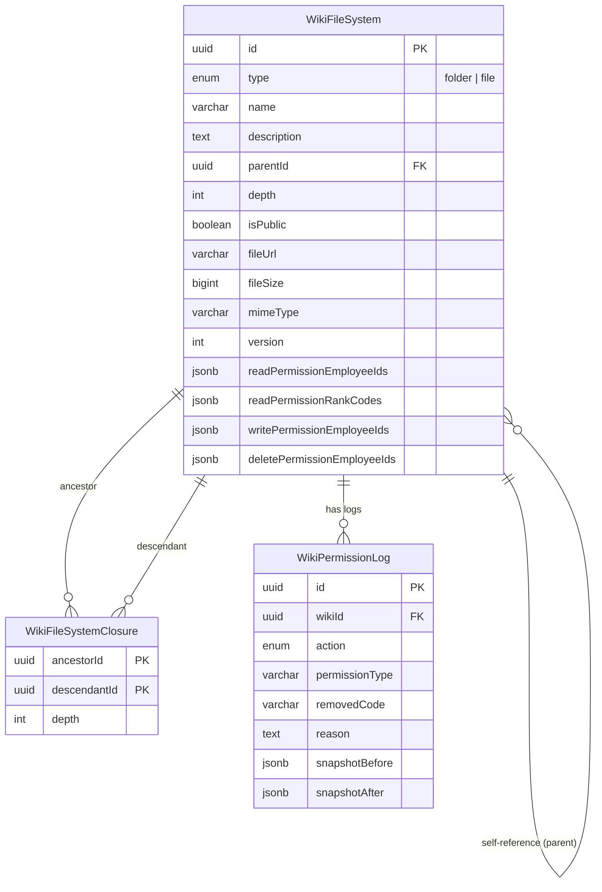

---

## 3. Command 흐름

### 3.1 폴더 생성 (CreateFolder)

**흐름 다이어그램**:

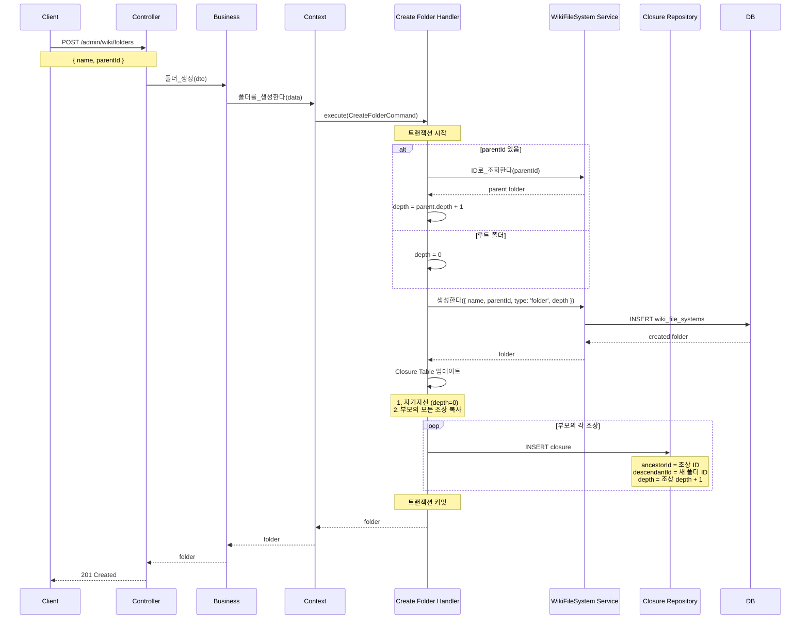

**Closure Table 업데이트 로직**:

```typescript
@CommandHandler(CreateFolderCommand)
async execute(command: CreateFolderCommand) {
  // 1. 폴더 생성
  const folder = await this.wikiService.생성한다({
    name: command.data.name,
    parentId: command.data.parentId,
    type: WikiFileSystemType.FOLDER,
    depth: command.data.parentId ? parent.depth + 1 : 0,
    createdBy: command.data.createdBy,
  });

  // 2. Closure Table 업데이트
  // 자기자신
  await this.closureRepository.save({
    ancestorId: folder.id,
    descendantId: folder.id,
    depth: 0,
  });

  // 부모가 있으면 부모의 모든 조상을 복사
  if (command.data.parentId) {
    const parentClosures = await this.closureRepository.find({
      where: { descendantId: command.data.parentId },
    });

    for (const closure of parentClosures) {
      await this.closureRepository.save({
        ancestorId: closure.ancestorId,
        descendantId: folder.id,
        depth: closure.depth + 1,
      });
    }
  }

  return { folder };
}
```

### 3.2 파일 업로드 (CreateFile)

**흐름 다이어그램**:

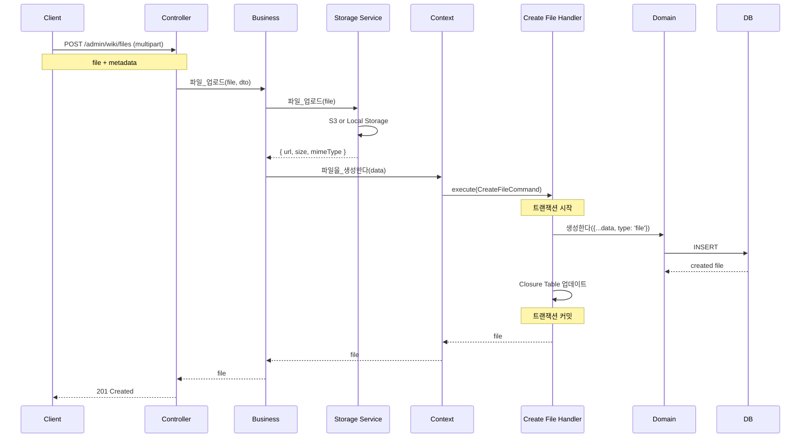

**핵심 로직**:

```typescript
// Business Service
async 파일_업로드(file: Express.Multer.File, dto: CreateFileDto, userId: string) {
  // 1. 파일 검증
  this.validateFile(file);

  // 2. Storage에 업로드 (S3 or Local)
  const uploadResult = await this.storageService.파일_업로드(file);

  // 3. Wiki 레코드 생성
  const result = await this.wikiContextService.파일을_생성한다({
    name: dto.name,
    parentId: dto.parentId,
    fileUrl: uploadResult.url,
    fileSize: uploadResult.size,
    mimeType: uploadResult.mimeType,
    version: 1,
    createdBy: userId,
  });

  return result;
}

private validateFile(file: Express.Multer.File) {
  const MAX_FILE_SIZE = 50 * 1024 * 1024; // 50MB
  const ALLOWED_MIME_TYPES = [
    'application/pdf',
    'image/jpeg',
    'image/png',
    'application/msword',
    // ...
  ];

  if (file.size > MAX_FILE_SIZE) {
    throw new BadRequestException('파일 크기는 50MB를 초과할 수 없습니다');
  }

  if (!ALLOWED_MIME_TYPES.includes(file.mimetype)) {
    throw new BadRequestException('지원하지 않는 파일 형식입니다');
  }
}
```

### 3.3 경로 이동 (UpdateWikiPath)

**흐름 다이어그램**:

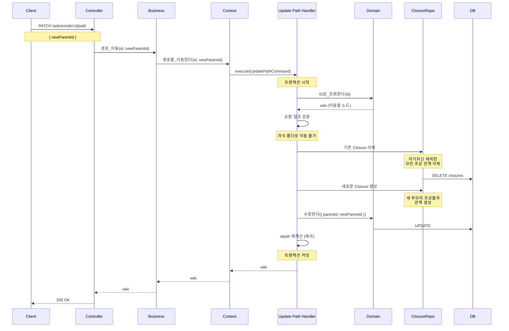

**순환 참조 검증**:

```typescript
async validateNoCircularReference(wikiId: string, newParentId: string) {
  // 새 부모가 이동할 노드의 자손인지 확인
  const isDescendant = await this.closureRepository.findOne({
    where: {
      ancestorId: wikiId,
      descendantId: newParentId,
    },
  });

  if (isDescendant) {
    throw new BadRequestException('하위 폴더로 이동할 수 없습니다');
  }
}
```

**Closure Table 재구성**:

```typescript
async updateClosureTable(wikiId: string, newParentId: string) {
  // 1. 기존 관계 삭제 (자기자신 제외)
  await this.closureRepository.delete({
    descendantId: wikiId,
    depth: Not(0),
  });

  // 2. 새 부모의 조상들과 관계 생성
  if (newParentId) {
    const parentClosures = await this.closureRepository.find({
      where: { descendantId: newParentId },
    });

    for (const closure of parentClosures) {
      await this.closureRepository.save({
        ancestorId: closure.ancestorId,
        descendantId: wikiId,
        depth: closure.depth + 1,
      });
    }
  }

  // 3. 하위 노드들의 Closure도 재구성 (재귀)
  const children = await this.wikiRepository.find({ where: { parentId: wikiId } });
  for (const child of children) {
    await this.updateClosureTable(child.id, wikiId);
  }
}
```

### 3.4 삭제 (DeleteWiki)

**흐름 다이어그램**:

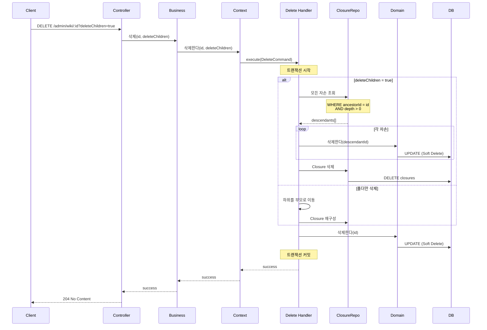

**하위 포함 삭제**:

```typescript
async deleteWithChildren(wikiId: string) {
  // 1. 모든 자손 조회 (Closure Table 활용)
  const closures = await this.closureRepository.find({
    where: {
      ancestorId: wikiId,
      depth: Not(0), // 자기자신 제외
    },
  });

  const descendantIds = closures.map(c => c.descendantId);

  // 2. 모든 자손 삭제 (Soft Delete)
  for (const descendantId of descendantIds) {
    await this.wikiRepository.softDelete(descendantId);
  }

  // 3. 자기자신 삭제
  await this.wikiRepository.softDelete(wikiId);

  // 4. Closure 레코드 삭제
  await this.closureRepository.delete({
    ancestorId: In([wikiId, ...descendantIds]),
  });
}
```

---

## 4. Query 흐름

### 4.1 폴더 구조 조회 (GetFolderStructure)

**흐름 다이어그램**:

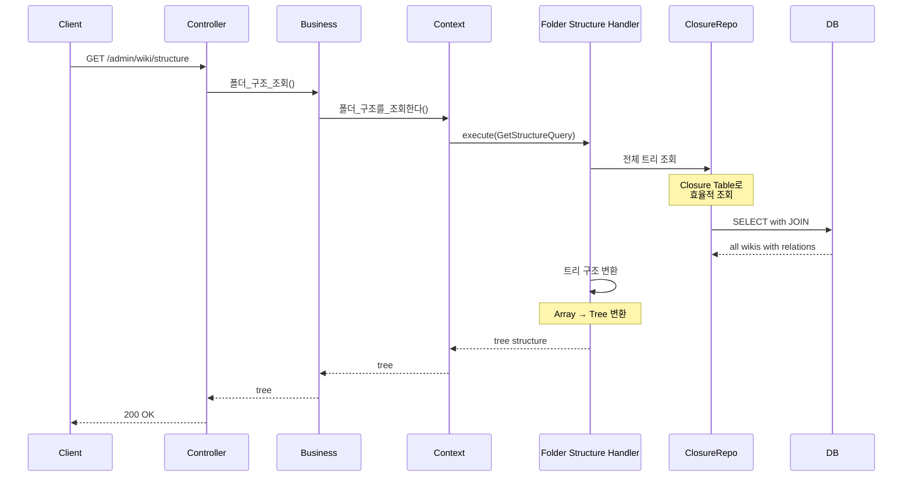

**핵심 로직 (Closure Table 활용)**:

```typescript
@QueryHandler(GetFolderStructureQuery)
async execute(query: GetFolderStructureQuery) {
  // 1. 루트 노드들 조회 (parentId = null)
  const roots = await this.wikiRepository.find({
    where: { parentId: IsNull(), type: WikiFileSystemType.FOLDER },
    order: { name: 'ASC' },
  });

  // 2. 각 루트의 하위 트리 구축 (Closure Table 활용)
  const trees = await Promise.all(
    roots.map(root => this.buildTree(root.id))
  );

  return trees;
}

private async buildTree(rootId: string): Promise<WikiTreeNode> {
  // Closure Table로 모든 자손 한 번에 조회
  const closures = await this.closureRepository
    .createQueryBuilder('closure')
    .leftJoinAndSelect('closure.descendant', 'wiki')
    .where('closure.ancestorId = :rootId', { rootId })
    .orderBy('closure.depth', 'ASC')
    .addOrderBy('wiki.name', 'ASC')
    .getMany();

  // Array를 Tree 구조로 변환
  return this.arrayToTree(closures);
}
```

**성능 비교**:

```typescript
// ❌ 재귀 쿼리 (N+1 문제)
async buildTreeRecursive(parentId: string) {
  const children = await this.wikiRepository.find({ where: { parentId } });
  for (const child of children) {
    child.children = await this.buildTreeRecursive(child.id); // N+1!
  }
  return children;
}

// ✅ Closure Table (단일 쿼리)
async buildTreeWithClosure(rootId: string) {
  return await this.closureRepository
    .createQueryBuilder('closure')
    .leftJoinAndSelect('closure.descendant', 'wiki')
    .where('closure.ancestorId = :rootId', { rootId })
    .getMany(); // 1 query!
}
```

### 4.2 폴더 자식 조회 (GetFolderChildren)

**흐름 다이어그램**:

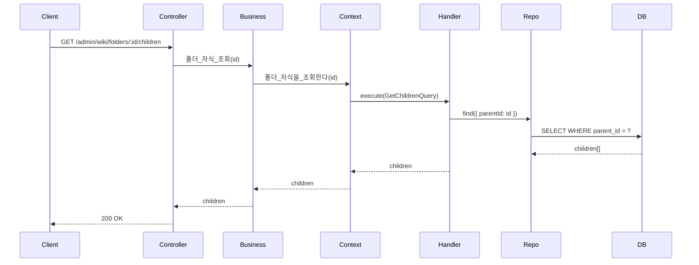

### 4.3 Breadcrumb 조회 (GetWikiBreadcrumb)

**흐름 다이어그램**:

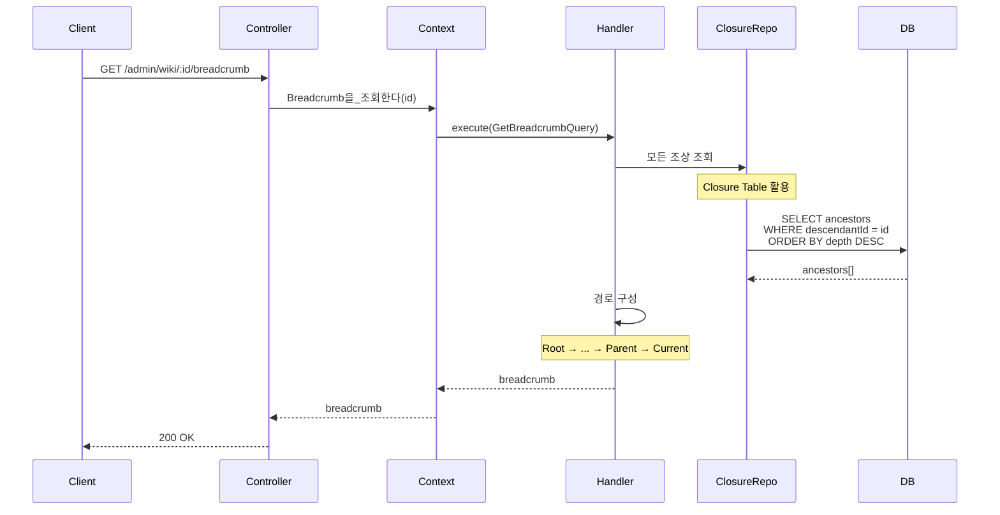

**핵심 로직**:

```typescript
@QueryHandler(GetWikiBreadcrumbQuery)
async execute(query: GetWikiBreadcrumbQuery) {
  // Closure Table로 모든 조상 조회 (단일 쿼리)
  const closures = await this.closureRepository
    .createQueryBuilder('closure')
    .leftJoinAndSelect('closure.ancestor', 'wiki')
    .where('closure.descendantId = :id', { id: query.id })
    .orderBy('closure.depth', 'DESC') // 루트부터 정렬
    .getMany();

  // Breadcrumb 구성
  const breadcrumb = closures.map(closure => ({
    id: closure.ancestor.id,
    name: closure.ancestor.name,
    type: closure.ancestor.type,
  }));

  return breadcrumb;
}
```

**결과 예시**:

```json
[
  { "id": "1", "name": "루트", "type": "folder" },
  { "id": "2", "name": "개발팀", "type": "folder" },
  { "id": "3", "name": "백엔드", "type": "folder" },
  { "id": "4", "name": "API 문서.pdf", "type": "file" }
]
```

### 4.4 검색 (SearchWiki)

**흐름 다이어그램**:

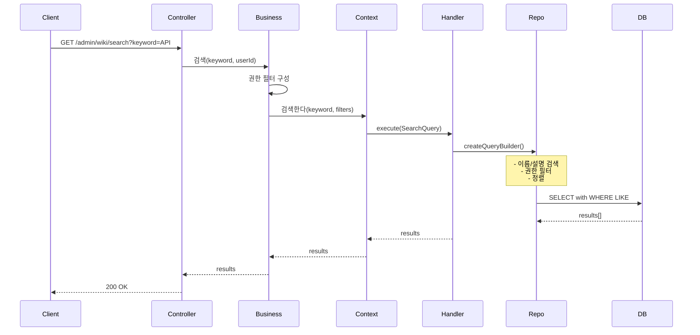

**검색 쿼리**:

```typescript
@QueryHandler(SearchWikiQuery)
async execute(query: SearchWikiQuery) {
  const queryBuilder = this.repository
    .createQueryBuilder('wiki')
    .where('wiki.name LIKE :keyword', { keyword: `%${query.keyword}%` })
    .orWhere('wiki.description LIKE :keyword', { keyword: `%${query.keyword}%` });

  // 권한 필터 (읽기 권한이 있는 것만)
  if (query.userId) {
    // TODO: 권한 필터 적용
  }

  // 정렬
  queryBuilder
    .orderBy('wiki.type', 'ASC') // 폴더 우선
    .addOrderBy('wiki.name', 'ASC');

  const results = await queryBuilder.getMany();

  return results;
}
```

---

## 5. 주요 비즈니스 로직

### 5.1 3단계 권한 관리 (Read/Write/Delete)

**권한 구조**:

```typescript
interface WikiPermissions {
  read: {
    employeeIds?: string[];
    rankCodes?: string[];
    positionCodes?: string[];
    departmentCodes?: string[];
  };
  write: {
    employeeIds?: string[];
    rankCodes?: string[];
    positionCodes?: string[];
    departmentCodes?: string[];
  };
  delete: {
    employeeIds?: string[];
    rankCodes?: string[];
    positionCodes?: string[];
    departmentCodes?: string[];
  };
}
```

**권한 확인 흐름**:

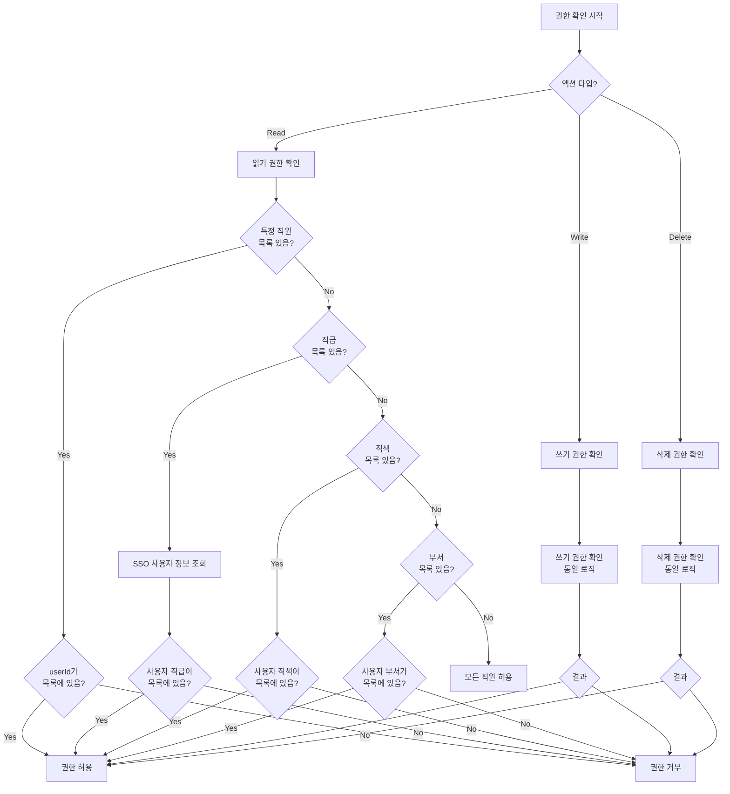

**코드 구현**:

```typescript
async checkPermission(
  wiki: WikiFileSystem,
  userId: string,
  action: 'read' | 'write' | 'delete',
): Promise<boolean> {
  const prefix = action;

  // 1. 특정 직원 체크
  const employeeIds = wiki[`${prefix}PermissionEmployeeIds`];
  if (employeeIds?.length > 0) {
    return employeeIds.includes(userId);
  }

  // 2. SSO 사용자 정보 조회
  const userInfo = await this.ssoService.getUserInfo(userId);

  // 3. 직급 체크
  const rankCodes = wiki[`${prefix}PermissionRankCodes`];
  if (rankCodes?.length > 0) {
    if (!rankCodes.includes(userInfo.rankCode)) {
      return false;
    }
  }

  // 4. 직책 체크
  const positionCodes = wiki[`${prefix}PermissionPositionCodes`];
  if (positionCodes?.length > 0) {
    if (!positionCodes.includes(userInfo.positionCode)) {
      return false;
    }
  }

  // 5. 부서 체크
  const departmentCodes = wiki[`${prefix}PermissionDepartmentCodes`];
  if (departmentCodes?.length > 0) {
    if (!departmentCodes.includes(userInfo.departmentCode)) {
      return false;
    }
  }

  // 모든 조건 통과 또는 권한 필터 없음
  return true;
}
```

### 5.2 권한 무효화 추적 (WikiPermissionLog)

**시나리오**:
1. Wiki에 "개발팀" 읽기 권한 설정
2. SSO 시스템에서 "개발팀" 부서 코드 삭제
3. 자동 감지 및 권한 제거
4. 관리자에게 통보
5. 관리자가 수동 해결

**흐름**:

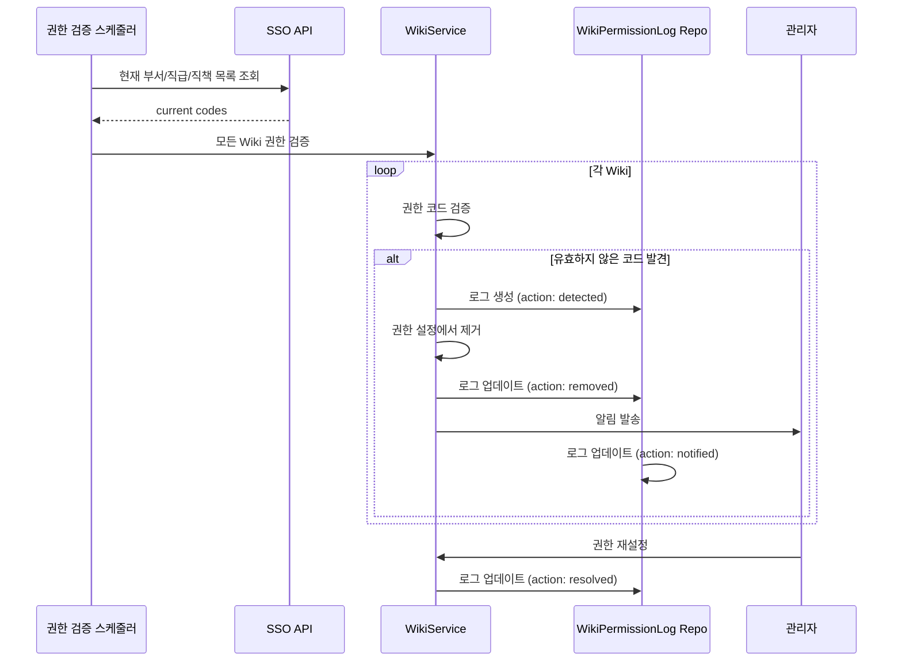

**코드 구현**:

```typescript
// 스케줄러 (매일 실행)
@Cron('0 2 * * *') // 매일 새벽 2시
async validateAllWikiPermissions() {
  // 1. SSO에서 현재 유효한 코드 조회
  const validCodes = await this.ssoService.getValidCodes();

  // 2. 모든 Wiki 검증
  const wikis = await this.wikiRepository.find();

  for (const wiki of wikis) {
    await this.validateWikiPermissions(wiki, validCodes);
  }
}

async validateWikiPermissions(
  wiki: WikiFileSystem,
  validCodes: ValidCodes,
) {
  const permissionTypes = [
    'readPermissionRankCodes',
    'readPermissionPositionCodes',
    'readPermissionDepartmentCodes',
    'writePermissionRankCodes',
    // ...
  ];

  for (const permType of permissionTypes) {
    const codes = wiki[permType] || [];
    const invalidCodes = codes.filter(
      code => !this.isValidCode(code, permType, validCodes)
    );

    if (invalidCodes.length > 0) {
      // 로그 생성
      for (const invalidCode of invalidCodes) {
        await this.logPermissionChange(
          wiki.id,
          permType,
          invalidCode,
          WikiPermissionAction.DETECTED,
          wiki[permType],
        );

        // 권한에서 제거
        wiki[permType] = codes.filter(c => c !== invalidCode);
        
        await this.logPermissionChange(
          wiki.id,
          permType,
          invalidCode,
          WikiPermissionAction.REMOVED,
          wiki[permType],
        );
      }

      await this.wikiRepository.save(wiki);

      // 관리자 알림
      await this.notifyAdmin(wiki, invalidCodes);
      
      await this.logPermissionChange(
        wiki.id,
        permType,
        invalidCodes[0],
        WikiPermissionAction.NOTIFIED,
        null,
      );
    }
  }
}

async logPermissionChange(
  wikiId: string,
  permissionType: string,
  removedCode: string,
  action: WikiPermissionAction,
  snapshot: any,
) {
  await this.permissionLogRepository.save({
    wikiId,
    permissionType,
    removedCode,
    action,
    snapshotBefore: snapshot,
    snapshotAfter: action === WikiPermissionAction.REMOVED ? snapshot : null,
    reason: '외부 시스템 코드 변경',
  });
}
```

### 5.3 파일 버전 관리

**버전 업데이트 흐름**:

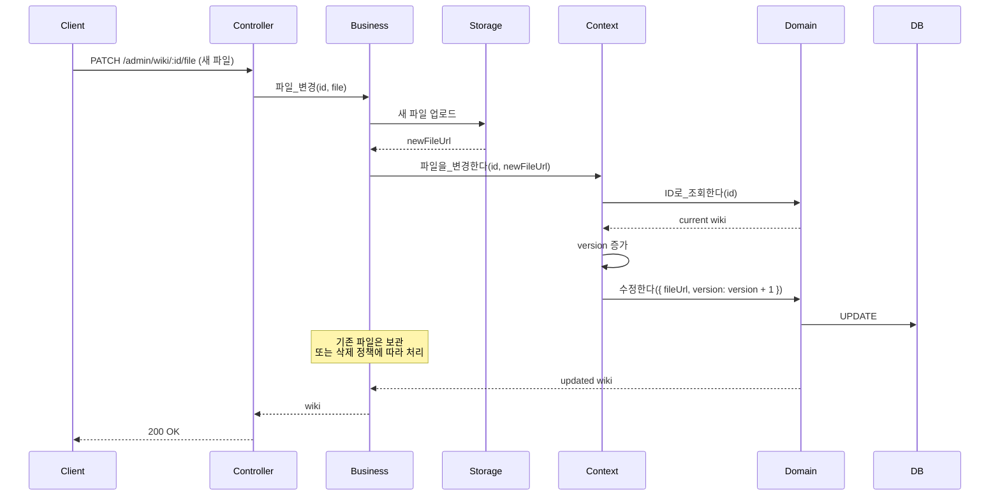

---

## 6. 성능 최적화

### 6.1 Closure Table 장점

**조회 성능 비교**:

| 작업 | 재귀 쿼리 | Closure Table |
|------|----------|---------------|
| 전체 하위 조회 | O(N) queries | O(1) query |
| 경로 조회 | O(depth) queries | O(1) query |
| 깊이 계산 | O(N) queries | O(1) 저장됨 |

**저장 공간**:
- 추가 공간: O(N²) (최악의 경우)
- 실제로는 트리 구조라 O(N log N) 정도
- 조회 성능 향상으로 상쇄

### 6.2 인덱스 전략

```sql
-- 기본 조회
CREATE INDEX idx_wiki_parent ON wiki_file_systems(parent_id);
CREATE INDEX idx_wiki_type ON wiki_file_systems(type);
CREATE INDEX idx_wiki_name ON wiki_file_systems(name);

-- Closure Table
CREATE INDEX idx_closure_ancestor ON wiki_file_system_closures(ancestor_id, depth);
CREATE INDEX idx_closure_descendant ON wiki_file_system_closures(descendant_id, depth);

-- 검색
CREATE INDEX idx_wiki_name_fulltext ON wiki_file_systems USING gin(to_tsvector('english', name));
CREATE INDEX idx_wiki_desc_fulltext ON wiki_file_systems USING gin(to_tsvector('english', description));
```

### 6.3 캐싱 전략

**대상**:
- 폴더 구조 (전체 트리)
- 사용자별 권한 정보 (SSO)

**TTL**: 
- 폴더 구조: 10분
- 권한 정보: 5분

**무효화**:
- 폴더/파일 생성/수정/삭제 시 캐시 무효화
- SSO 정보 변경 시 권한 캐시 무효화

---

**문서 생성일**: 2026년 1월 14일  
**버전**: v1.0
