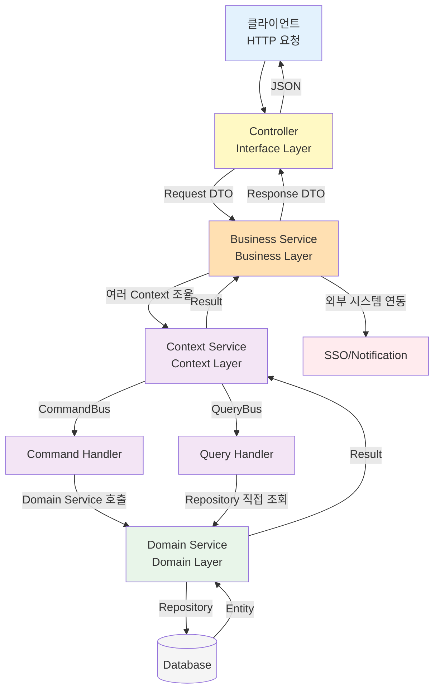
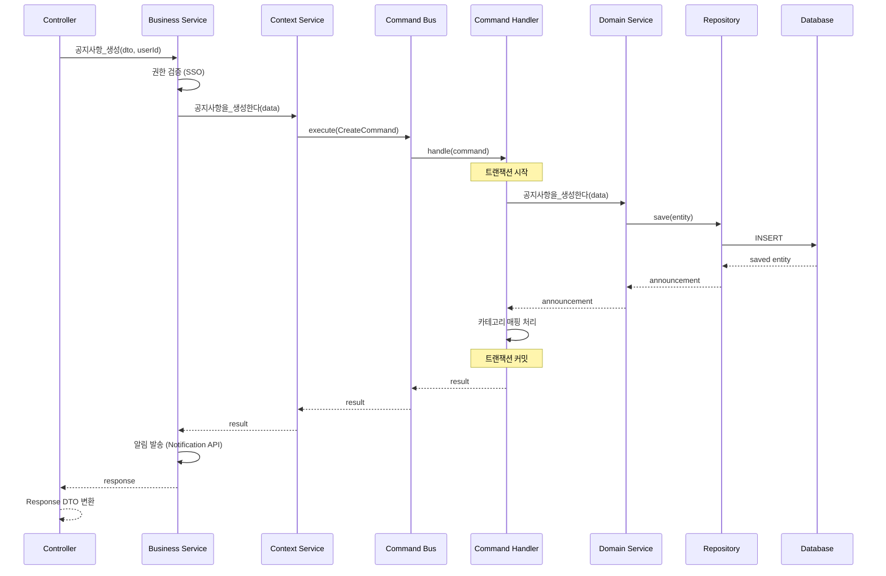
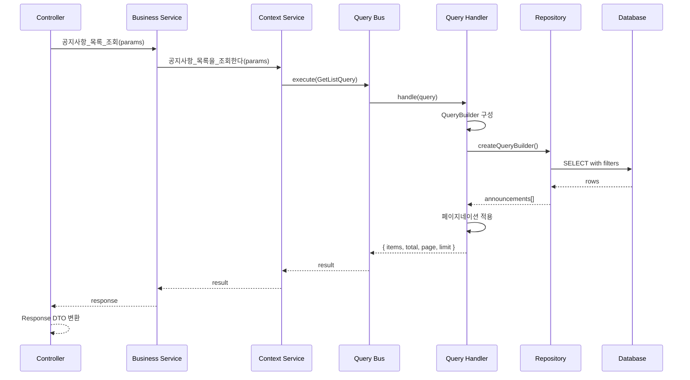
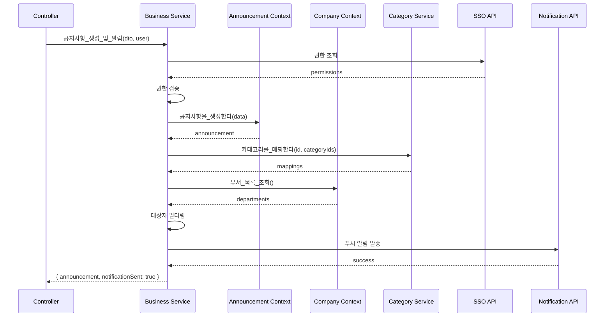
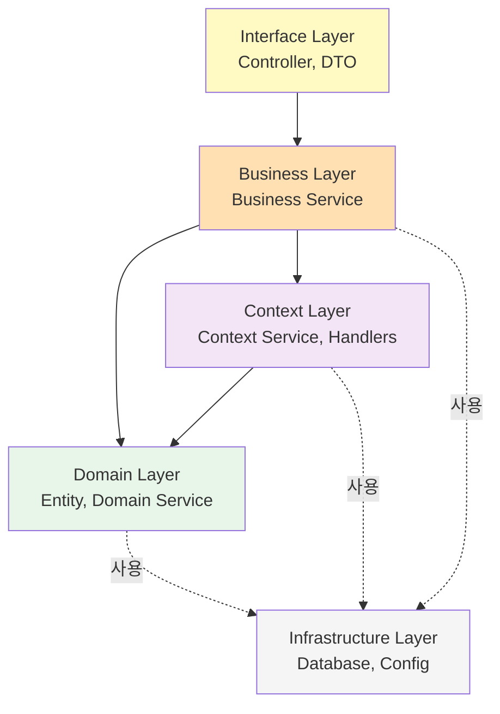
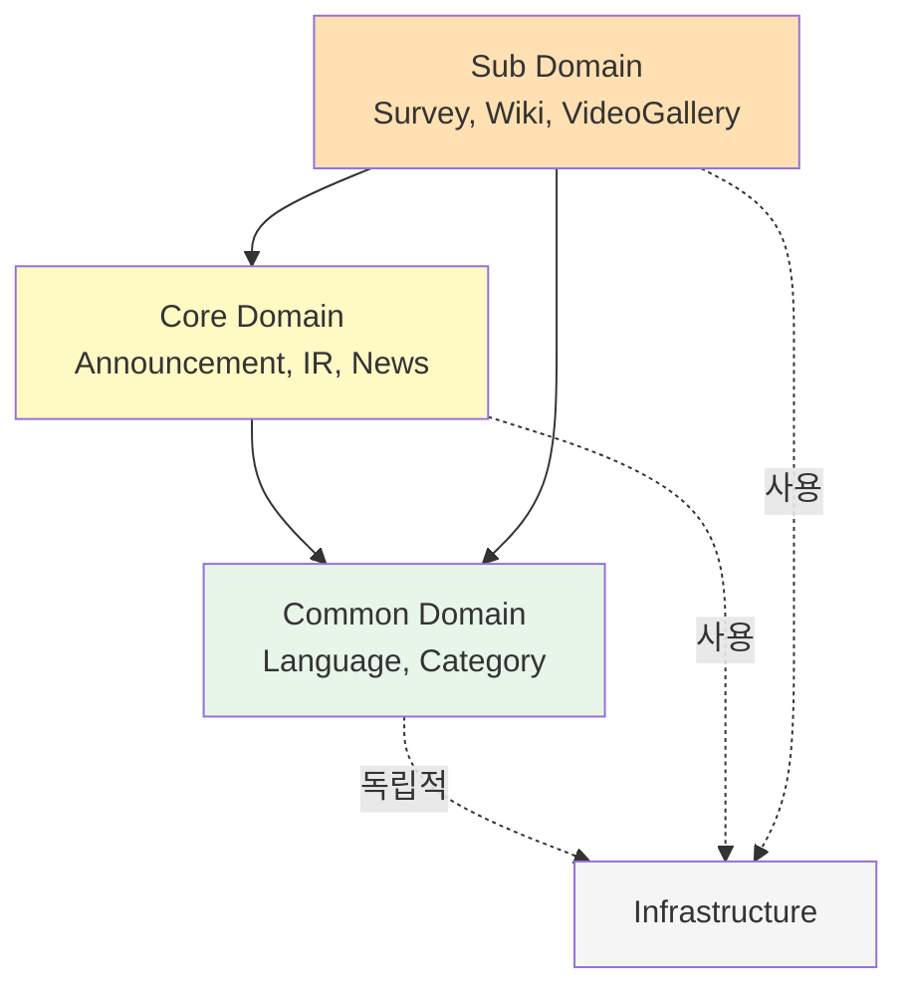

# 데이터 상태 흐름 설계 문서

## 📋 목차

1. [아키텍처 개요](#1-아키텍처-개요)
2. [레이어 구조 및 책임](#2-레이어-구조-및-책임)
3. [데이터 흐름](#3-데이터-흐름)
4. [데이터 변환 규칙](#4-데이터-변환-규칙)
5. [의존성 규칙](#5-의존성-규칙)
6. [주요 패턴 및 원칙](#6-주요-패턴-및-원칙)
7. [실전 예제](#7-실전-예제)
8. [트랜잭션 및 에러 처리](#8-트랜잭션-및-에러-처리)
9. [베스트 프랙티스](#9-베스트-프랙티스)

---

## 1. 아키텍처 개요

### 1.1 아키텍처 스타일

본 프로젝트는 다음 아키텍처 패턴을 조합하여 사용합니다:

- **Layered Architecture** (계층형 아키텍처)
- **Domain-Driven Design (DDD)** (도메인 주도 설계)
- **CQRS Pattern** (Command Query Responsibility Segregation)

### 1.2 핵심 원칙

1. **단방향 의존성**: 상위 레이어는 하위 레이어에만 의존
2. **관심사 분리**: 각 레이어는 명확한 책임을 가짐
3. **도메인 중심**: 비즈니스 로직은 도메인에 집중
4. **테스트 용이성**: 각 레이어를 독립적으로 테스트 가능

### 1.3 레이어 구성

```
┌─────────────────────────────────────┐
│      Interface Layer                │  ← HTTP 요청/응답 처리
│      (src/interface/)               │
└─────────────────────────────────────┘
              ↓
┌─────────────────────────────────────┐
│      Business Layer                 │  ← 비즈니스 로직 오케스트레이션
│      (src/business/)                │
└─────────────────────────────────────┘
              ↓
┌─────────────────────────────────────┐
│      Context Layer                  │  ← CQRS 패턴, 상태 관리
│      (src/context/)                 │
└─────────────────────────────────────┘
              ↓
┌─────────────────────────────────────┐
│      Domain Layer                   │  ← 엔티티, 도메인 로직
│      (src/domain/)                  │
└─────────────────────────────────────┘
              ↓
┌─────────────────────────────────────┐
│      Infrastructure Layer           │  ← DB, 외부 서비스
│      (libs/, Database)              │
└─────────────────────────────────────┘
```

---

## 2. 레이어 구조 및 책임

### 2.1 Interface Layer (인터페이스 계층)

**위치**: `src/interface/`

**책임**:
- HTTP 요청 수신 및 응답 반환
- 요청 데이터 검증 (Validation)
- DTO 변환 (Request → DTO, Entity → Response)
- 인증/인가 처리 (Guard, Decorator)
- API 문서화 (Swagger)

**구성 요소**:
- **Controller**: REST API 엔드포인트 정의
- **Request DTO**: 요청 데이터 구조
- **Response DTO**: 응답 데이터 구조
- **Decorator**: 인증, 권한 검증

**의존성**: Business Layer에만 의존

**예시**:
```typescript
@Controller('admin/announcements')
export class AnnouncementController {
  constructor(
    private readonly announcementBusinessService: AnnouncementBusinessService,
  ) {}

  @Post()
  async create(@Body() dto: CreateAnnouncementDto, @CurrentUser() user) {
    return await this.announcementBusinessService.공지사항_생성(dto, user.id);
  }

  @Get()
  async getList(@Query() params: GetListQueryDto) {
    return await this.announcementBusinessService.공지사항_목록_조회(params);
  }
}
```

**특징**:
- ✅ HTTP 관련 로직만 포함
- ✅ 비즈니스 로직 없음
- ✅ Business Service 호출만 수행
- ❌ Domain Layer 직접 접근 금지

---

### 2.2 Business Layer (비즈니스 계층)

**위치**: `src/business/`

**책임**:
- 비즈니스 로직 오케스트레이션
- 여러 Context Service 간 조율
- 외부 시스템 연동 (SSO, Notification API 등)
- 복잡한 비즈니스 규칙 처리
- 트랜잭션 범위 결정

**구성 요소**:
- **Business Service**: 비즈니스 로직 조율
- **Business Module**: 의존성 주입 설정

**의존성**: Context Layer, Domain Layer, 외부 서비스

**예시**:
```typescript
@Injectable()
export class AnnouncementBusinessService {
  constructor(
    private readonly announcementContextService: AnnouncementContextService,
    private readonly companyContextService: CompanyContextService,
    private readonly categoryService: CategoryService,
    private readonly configService: ConfigService,
  ) {}

  async 공지사항_생성(dto: CreateAnnouncementDto, userId: string) {
    // 1. 권한 검증 (외부 SSO 시스템)
    await this.validatePermissions(userId);
    
    // 2. 공지사항 생성 (Context 호출)
    const result = await this.announcementContextService.공지사항을_생성한다({
      ...dto,
      createdBy: userId,
    });
    
    // 3. 카테고리 매핑
    if (dto.categoryIds?.length > 0) {
      await this.categoryService.카테고리를_매핑한다(
        result.announcement.id,
        dto.categoryIds,
      );
    }
    
    // 4. 알림 발송 (외부 Notification API)
    await this.sendNotification(result.announcement);
    
    return result;
  }

  async 공지사항_목록_조회(params: GetListParams) {
    // Context Service 단순 호출
    return await this.announcementContextService.공지사항_목록을_조회한다(params);
  }
}
```

**특징**:
- ✅ 여러 Context를 조합
- ✅ 외부 시스템 연동
- ✅ 복잡한 비즈니스 규칙 처리
- ❌ 데이터베이스 직접 접근 금지

---

### 2.3 Context Layer (컨텍스트 계층)

**위치**: `src/context/`

**책임**:
- CQRS 패턴 구현 (Command/Query 분리)
- 단일 도메인의 상태 관리
- 트랜잭션 관리
- 데이터 영속성
- 도메인 이벤트 발행

**구성 요소**:
- **Context Service**: Command/Query 버스 호출
- **Command Handler**: 상태 변경 처리 (Create, Update, Delete)
- **Query Handler**: 상태 조회 처리 (Get, List, Search)
- **Interface**: DTO 타입 정의

**구조**:
```
context/
├── announcement-context/
│   ├── announcement-context.service.ts      # Context Service
│   ├── announcement-context.module.ts
│   ├── handlers/
│   │   ├── commands/
│   │   │   ├── create-announcement.handler.ts
│   │   │   ├── update-announcement.handler.ts
│   │   │   └── delete-announcement.handler.ts
│   │   ├── queries/
│   │   │   ├── get-announcement-list.handler.ts
│   │   │   └── get-announcement-detail.handler.ts
│   │   └── index.ts
│   └── interfaces/
│       └── announcement-context.interface.ts
```

**Context Service 예시**:
```typescript
@Injectable()
export class AnnouncementContextService {
  constructor(
    private readonly commandBus: CommandBus,
    private readonly queryBus: QueryBus,
  ) {}

  async 공지사항을_생성한다(data: CreateAnnouncementDto) {
    const command = new CreateAnnouncementCommand(data);
    return await this.commandBus.execute(command);
  }

  async 공지사항_목록을_조회한다(params: GetListParams) {
    const query = new GetAnnouncementListQuery(
      params.isPublic,
      params.isFixed,
      params.orderBy,
      params.page,
      params.limit,
    );
    return await this.queryBus.execute(query);
  }
}
```

**Command Handler 예시**:
```typescript
@CommandHandler(CreateAnnouncementCommand)
export class CreateAnnouncementHandler 
  implements ICommandHandler<CreateAnnouncementCommand> {
  
  constructor(
    private readonly announcementService: AnnouncementService,
    private readonly categoryService: CategoryService,
  ) {}

  async execute(command: CreateAnnouncementCommand) {
    // 1. 도메인 서비스 호출
    const announcement = await this.announcementService.공지사항을_생성한다(
      command.data,
    );

    // 2. 연관 엔티티 처리
    if (command.data.categoryIds) {
      await this.categoryService.카테고리를_매핑한다(
        announcement.id,
        command.data.categoryIds,
      );
    }

    return { announcement };
  }
}
```

**Query Handler 예시**:
```typescript
@QueryHandler(GetAnnouncementListQuery)
export class GetAnnouncementListHandler 
  implements IQueryHandler<GetAnnouncementListQuery> {
  
  constructor(
    @InjectRepository(Announcement)
    private readonly announcementRepository: Repository<Announcement>,
  ) {}

  async execute(query: GetAnnouncementListQuery) {
    const queryBuilder = this.announcementRepository.createQueryBuilder('announcement');

    // 필터 조건
    if (query.isPublic !== undefined) {
      queryBuilder.where('announcement.isPublic = :isPublic', { 
        isPublic: query.isPublic 
      });
    }

    // 정렬
    queryBuilder
      .orderBy('announcement.isFixed', 'DESC')
      .addOrderBy('announcement.order', 'DESC');

    // 페이지네이션
    const skip = (query.page - 1) * query.limit;
    queryBuilder.skip(skip).take(query.limit);

    const [items, total] = await queryBuilder.getManyAndCount();

    return { items, total, page: query.page, limit: query.limit };
  }
}
```

**특징**:
- ✅ CQRS 패턴으로 읽기/쓰기 분리
- ✅ Command는 트랜잭션 보장
- ✅ Query는 읽기 전용, 최적화 가능
- ❌ 다른 Context 직접 호출 금지 (Business Layer에서 조율)

---

### 2.4 Domain Layer (도메인 계층)

**위치**: `src/domain/`

**책임**:
- 엔티티 정의 (Entity, Value Object)
- 도메인 로직 (Domain Service)
- 비즈니스 규칙 검증
- 타입 정의 (Enum, Types)

**하위 도메인 분류**:

1. **Common Domain** (`src/domain/common/`)
   - 시스템 전반 공유 엔티티
   - Language, Category, CategoryMapping
   - 다른 도메인에 의존하지 않음

2. **Core Domain** (`src/domain/core/`)
   - 핵심 비즈니스 엔티티
   - Announcement, IR, ElectronicDisclosure, Brochure, News, ShareholdersMeeting
   - Common Domain에만 의존

3. **Sub Domain** (`src/domain/sub/`)
   - 부가 기능 엔티티
   - Survey, WikiFileSystem, EducationManagement, MainPopup, VideoGallery, LumirStory
   - Common, Core Domain에 의존 가능

**구조**:
```
domain/
├── common/
│   ├── language/
│   │   ├── language.entity.ts
│   │   ├── language.service.ts
│   │   └── language.module.ts
│   └── category/
│       ├── category.entity.ts
│       ├── category.service.ts
│       └── category.module.ts
├── core/
│   └── announcement/
│       ├── announcement.entity.ts
│       ├── announcement-read.entity.ts
│       ├── announcement.service.ts
│       └── announcement.module.ts
└── sub/
    └── survey/
        ├── survey.entity.ts
        ├── survey-question.entity.ts
        ├── survey.service.ts
        └── survey.module.ts
```

**Domain Service 예시**:
```typescript
@Injectable()
export class AnnouncementService {
  constructor(
    @InjectRepository(Announcement)
    private readonly announcementRepository: Repository<Announcement>,
    @InjectRepository(AnnouncementRead)
    private readonly readRepository: Repository<AnnouncementRead>,
  ) {}

  async 공지사항을_생성한다(data: Partial<Announcement>): Promise<Announcement> {
    const announcement = this.announcementRepository.create(data);
    return await this.announcementRepository.save(announcement);
  }

  async ID로_공지사항을_조회한다(id: string): Promise<Announcement> {
    const announcement = await this.announcementRepository.findOne({
      where: { id },
    });

    if (!announcement) {
      throw new NotFoundException('공지사항을 찾을 수 없습니다');
    }

    return announcement;
  }

  async 공지사항을_수정한다(
    id: string, 
    data: Partial<Announcement>
  ): Promise<Announcement> {
    const announcement = await this.ID로_공지사항을_조회한다(id);
    Object.assign(announcement, data);
    return await this.announcementRepository.save(announcement);
  }
}
```

**특징**:
- ✅ 엔티티 중심 설계
- ✅ Repository 패턴 사용
- ✅ 도메인 로직 캡슐화
- ❌ 외부 시스템 연동 금지
- ❌ 다른 도메인 직접 참조 제한 (의존성 규칙 준수)

---

## 3. 데이터 흐름

### 3.1 전체 레이어 흐름



### 3.2 Command 흐름 (상태 변경)

상태를 변경하는 작업 (Create, Update, Delete)의 흐름입니다.



**핵심 포인트**:
1. **검증**: Business Layer에서 외부 시스템 검증
2. **트랜잭션**: Command Handler에서 트랜잭션 관리
3. **부가 작업**: Business Layer에서 알림 등 부가 작업 처리
4. **변환**: Controller에서 Response DTO로 변환

### 3.3 Query 흐름 (상태 조회)

상태를 조회하는 작업 (Get, List, Search)의 흐름입니다.



**핵심 포인트**:
1. **읽기 전용**: Query Handler는 데이터 수정 없음
2. **직접 조회**: Repository를 직접 사용하여 최적화
3. **단순 흐름**: Business Layer는 단순 전달 역할
4. **변환**: Controller에서 Response DTO로 변환

### 3.4 복잡한 비즈니스 로직 흐름

여러 Context를 조합하는 복잡한 비즈니스 로직의 예시입니다.



**핵심 포인트**:
1. **오케스트레이션**: Business Layer에서 여러 서비스 조율
2. **외부 연동**: SSO, Notification API 등 외부 시스템 호출
3. **복잡한 규칙**: Business Layer에서 비즈니스 규칙 적용

---

## 4. 데이터 변환 규칙

### 4.1 요청 흐름 (Client → Database)

데이터가 클라이언트에서 데이터베이스로 흐르는 과정에서의 변환 단계입니다.

```
HTTP Request Body
    ↓ (Controller - Validation)
Request DTO (class-validator)
    ↓ (Business Layer - Enrichment)
Context Interface DTO (with metadata)
    ↓ (Command Handler - Domain Logic)
Domain Entity / Partial Entity
    ↓ (Repository - TypeORM)
Database Record (SQL)
```

**단계별 예시: 공지사항 생성**

**1단계: HTTP Request**
```json
POST /admin/announcements
Content-Type: application/json

{
  "title": "2024년 신년 인사",
  "content": "새해 복 많이 받으세요",
  "isPublic": true,
  "isFixed": false,
  "categoryIds": ["uuid-1", "uuid-2"]
}
```

**2단계: Request DTO (Interface Layer)**
```typescript
// 검증 규칙 포함
export class CreateAnnouncementDto {
  @IsString()
  @IsNotEmpty()
  title: string;

  @IsString()
  @IsNotEmpty()
  content: string;

  @IsBoolean()
  @IsOptional()
  isPublic?: boolean;

  @IsBoolean()
  @IsOptional()
  isFixed?: boolean;

  @IsArray()
  @IsUUID('4', { each: true })
  @IsOptional()
  categoryIds?: string[];
}
```

**3단계: Context Interface DTO (Business → Context)**
```typescript
// 추가 메타데이터 포함
interface CreateAnnouncementDto {
  title: string;
  content: string;
  isPublic: boolean;
  isFixed: boolean;
  categoryIds?: string[];
  createdBy: string;      // 추가: 인증된 사용자 ID
  order: number;          // 추가: 자동 계산된 순서
}
```

**4단계: Domain Entity (Context Handler → Domain)**
```typescript
// 엔티티 생성
const announcement = new Announcement();
announcement.title = data.title;
announcement.content = data.content;
announcement.isPublic = data.isPublic;
announcement.isFixed = data.isFixed;
announcement.createdBy = data.createdBy;
announcement.order = data.order;
// id, createdAt, updatedAt은 자동 생성
```

**5단계: Database Record (Repository → DB)**
```sql
INSERT INTO announcements (
  id, 
  title, 
  content, 
  is_public, 
  is_fixed, 
  "order",
  created_by, 
  created_at, 
  updated_at,
  version
) VALUES (
  'uuid-generated',
  '2024년 신년 인사',
  '새해 복 많이 받으세요',
  true,
  false,
  1,
  'user-uuid',
  NOW(),
  NOW(),
  1
);
```

### 4.2 응답 흐름 (Database → Client)

데이터가 데이터베이스에서 클라이언트로 흐르는 과정에서의 변환 단계입니다.

```
Database Record (SQL)
    ↓ (Repository - TypeORM)
Domain Entity
    ↓ (Query Handler / Domain Service)
Entity / Result Object
    ↓ (Business Layer - Enrichment)
Enhanced Entity / Result
    ↓ (Controller - Transformation)
Response DTO
    ↓ (NestJS Serialization)
HTTP Response JSON
```

**단계별 예시: 공지사항 조회**

**1단계: Database Query**
```sql
SELECT 
  id, title, content, is_public, is_fixed, 
  created_at, updated_at, created_by
FROM announcements
WHERE is_public = true
ORDER BY is_fixed DESC, "order" DESC
LIMIT 10 OFFSET 0;
```

**2단계: Domain Entity (Repository → Query Handler)**
```typescript
// TypeORM이 자동 매핑
const announcements: Announcement[] = [
  {
    id: 'uuid-1',
    title: '2024년 신년 인사',
    content: '새해 복 많이 받으세요',
    isPublic: true,
    isFixed: false,
    order: 1,
    createdAt: new Date('2024-01-01'),
    updatedAt: new Date('2024-01-01'),
    createdBy: 'user-uuid',
    // ... other fields
  },
  // ...
];
```

**3단계: Result Object (Query Handler → Context)**
```typescript
// 페이지네이션 메타데이터 포함
const result = {
  items: announcements,
  total: 100,
  page: 1,
  limit: 10,
};
```

**4단계: Enhanced Result (Context → Business)**
```typescript
// Business Layer에서 추가 정보 부여 (선택적)
const enhanced = {
  ...result,
  // 필요시 추가 데이터 조합
};
```

**5단계: Response DTO (Business → Controller)**
```typescript
// Controller에서 명시적 변환 (선택적)
export class AnnouncementResponseDto {
  id: string;
  title: string;
  content: string;
  isPublic: boolean;
  isFixed: boolean;
  createdAt: Date;
  
  // 민감한 정보 제외
  // createdBy, updatedBy는 반환하지 않음
}
```

**6단계: HTTP Response**
```json
HTTP/1.1 200 OK
Content-Type: application/json

{
  "items": [
    {
      "id": "uuid-1",
      "title": "2024년 신년 인사",
      "content": "새해 복 많이 받으세요",
      "isPublic": true,
      "isFixed": false,
      "createdAt": "2024-01-01T00:00:00.000Z"
    }
  ],
  "total": 100,
  "page": 1,
  "limit": 10
}
```

### 4.3 변환 규칙 요약

| 레이어 | 입력 타입 | 출력 타입 | 변환 책임 |
|--------|----------|----------|----------|
| **Controller** | HTTP Body | Request DTO | class-validator 검증 |
| **Business** | Request DTO | Context DTO | 메타데이터 추가 (userId 등) |
| **Context Handler** | Context DTO | Entity | 도메인 로직 적용 |
| **Domain Service** | Entity Data | Entity | Repository 호출 |
| **Repository** | Entity | DB Record | TypeORM 자동 변환 |

**역방향 (응답)**

| 레이어 | 입력 타입 | 출력 타입 | 변환 책임 |
|--------|----------|----------|----------|
| **Repository** | DB Record | Entity | TypeORM 자동 변환 |
| **Domain Service** | Entity | Entity | 그대로 반환 |
| **Context Handler** | Entity | Result Object | 페이지네이션 등 메타데이터 추가 |
| **Business** | Result Object | Enhanced Result | 추가 정보 조합 (선택적) |
| **Controller** | Enhanced Result | Response DTO | 민감 정보 제거 (선택적) |

---

## 5. 의존성 규칙

### 5.1 레이어 간 의존성

**의존성 방향**: 상위 → 하위 (단방향)



**의존성 매트릭스**

| 레이어 | Interface | Business | Context | Domain | Infrastructure |
|--------|-----------|----------|---------|--------|----------------|
| **Interface** | - | ✅ | ❌ | ❌ | ✅ |
| **Business** | ❌ | - | ✅ | ✅ | ✅ |
| **Context** | ❌ | ❌ | - | ✅ | ✅ |
| **Domain** | ❌ | ❌ | ❌ | - | ✅ |
| **Infrastructure** | ❌ | ❌ | ❌ | ❌ | - |

**설명**:
- ✅ 허용: 해당 레이어를 import하고 사용 가능
- ❌ 금지: 해당 레이어를 import 불가

### 5.2 도메인 간 의존성

Domain Layer 내부의 하위 도메인 간 의존성 규칙입니다.



**도메인 의존성 규칙**

| 도메인 | 의존 가능 | 의존 불가 | 이유 |
|--------|----------|----------|------|
| **Common** | Infrastructure만 | Core, Sub | 공통 모듈의 독립성 보장 |
| **Core** | Common, Infrastructure | Sub | 핵심 도메인의 안정성 유지 |
| **Sub** | Common, Core, Infrastructure | - | 부가 도메인은 모든 도메인 활용 가능 |

**올바른 의존성 예시**

```typescript
// ✅ Core Domain → Common Domain
// shareholders-meeting.entity.ts
import { Language } from '@domain/common/language/language.entity';
import { Category } from '@domain/common/category/category.entity';

@Entity()
export class ShareholdersMeeting {
  @ManyToOne(() => Language)
  language: Language;
}
```

```typescript
// ✅ Sub Domain → Core Domain
// survey.entity.ts
import { Announcement } from '@domain/core/announcement/announcement.entity';

@Entity()
export class Survey {
  @OneToOne(() => Announcement)
  announcement: Announcement;
}
```

**잘못된 의존성 예시**

```typescript
// ❌ Common Domain → Core Domain (불가능!)
// category.entity.ts
import { Announcement } from '@domain/core/announcement/announcement.entity'; // ❌

@Entity()
export class Category {
  // Common은 Core를 참조할 수 없음!
}
```

```typescript
// ❌ Core Domain → Sub Domain (불가능!)
// announcement.entity.ts
import { Survey } from '@domain/sub/survey/survey.entity'; // ❌

@Entity()
export class Announcement {
  // Core는 Sub를 참조할 수 없음!
  // Survey가 Announcement를 참조해야 함 (역방향)
}
```

### 5.3 Context 간 의존성

**원칙**: Context는 다른 Context를 직접 호출하지 않습니다.

❌ **잘못된 방법**: Context Service 간 직접 호출
```typescript
// ❌ announcement-context.service.ts
@Injectable()
export class AnnouncementContextService {
  constructor(
    private readonly surveyContextService: SurveyContextService, // ❌
  ) {}

  async 공지사항을_생성한다(data: CreateAnnouncementDto) {
    const announcement = await this.create(data);
    
    // Context가 다른 Context를 직접 호출 - 잘못됨!
    await this.surveyContextService.설문을_생성한다(surveyData); // ❌
    
    return announcement;
  }
}
```

✅ **올바른 방법**: Business Layer에서 조율
```typescript
// ✅ announcement-business.service.ts
@Injectable()
export class AnnouncementBusinessService {
  constructor(
    private readonly announcementContextService: AnnouncementContextService,
    private readonly surveyContextService: SurveyContextService,
  ) {}

  async 공지사항_및_설문_생성(announcementData, surveyData) {
    // 1. 공지사항 생성
    const announcement = await this.announcementContextService.공지사항을_생성한다(
      announcementData,
    );

    // 2. 설문 생성 (별도 Context)
    const survey = await this.surveyContextService.설문을_생성한다({
      ...surveyData,
      announcementId: announcement.id,
    });

    return { announcement, survey };
  }
}
```

---

## 6. 주요 패턴 및 원칙

### 6.1 CQRS 패턴 (Command Query Responsibility Segregation)

**개념**: 읽기(Query)와 쓰기(Command) 책임을 분리합니다.

**Command (명령)**
- **목적**: 상태 변경 (Create, Update, Delete)
- **특징**:
  - 트랜잭션 보장
  - 비즈니스 규칙 검증
  - 부작용(Side Effect) 허용
  - 반환값: 성공 여부 또는 생성된 엔티티
  - 도메인 이벤트 발행 가능

**Query (조회)**
- **목적**: 상태 조회 (Get, List, Search)
- **특징**:
  - 읽기 전용
  - 데이터 수정 없음
  - 성능 최적화 가능
  - 반환값: 조회된 데이터
  - 캐싱 적용 가능

**Command Handler 구조**
```typescript
export class CreateAnnouncementCommand {
  constructor(public readonly data: CreateAnnouncementDto) {}
}

@CommandHandler(CreateAnnouncementCommand)
export class CreateAnnouncementHandler 
  implements ICommandHandler<CreateAnnouncementCommand> {
  
  constructor(
    private readonly announcementService: AnnouncementService,
  ) {}

  @Transactional() // 트랜잭션 보장
  async execute(command: CreateAnnouncementCommand): Promise<CreateAnnouncementResult> {
    // 1. 비즈니스 규칙 검증
    this.validate(command.data);

    // 2. 엔티티 생성
    const announcement = await this.announcementService.공지사항을_생성한다(
      command.data,
    );

    // 3. 연관 엔티티 처리
    // ...

    // 4. 도메인 이벤트 발행 (선택적)
    // this.eventBus.publish(new AnnouncementCreatedEvent(announcement));

    return { announcement };
  }

  private validate(data: CreateAnnouncementDto): void {
    // 비즈니스 규칙 검증
    if (!data.title || data.title.length < 3) {
      throw new BadRequestException('제목은 3자 이상이어야 합니다');
    }
  }
}
```

**Query Handler 구조**
```typescript
export class GetAnnouncementListQuery {
  constructor(
    public readonly isPublic?: boolean,
    public readonly isFixed?: boolean,
    public readonly orderBy: 'order' | 'createdAt' = 'order',
    public readonly page: number = 1,
    public readonly limit: number = 10,
  ) {}
}

@QueryHandler(GetAnnouncementListQuery)
export class GetAnnouncementListHandler 
  implements IQueryHandler<GetAnnouncementListQuery> {
  
  constructor(
    @InjectRepository(Announcement)
    private readonly repository: Repository<Announcement>,
  ) {}

  async execute(query: GetAnnouncementListQuery): Promise<AnnouncementListResult> {
    // Repository 직접 조회 (Domain Service 거치지 않음)
    const queryBuilder = this.repository.createQueryBuilder('announcement');

    // 필터 조건
    if (query.isPublic !== undefined) {
      queryBuilder.where('announcement.isPublic = :isPublic', { 
        isPublic: query.isPublic 
      });
    }

    // 정렬
    queryBuilder.orderBy('announcement.isFixed', 'DESC');
    
    if (query.orderBy === 'order') {
      queryBuilder.addOrderBy('announcement.order', 'DESC');
    } else {
      queryBuilder.addOrderBy('announcement.createdAt', 'DESC');
    }

    // 페이지네이션
    const skip = (query.page - 1) * query.limit;
    queryBuilder.skip(skip).take(query.limit);

    const [items, total] = await queryBuilder.getManyAndCount();

    return { items, total, page: query.page, limit: query.limit };
  }
}
```

**CQRS의 장점**:
1. **성능 최적화**: Query는 읽기 최적화, Command는 쓰기 최적화
2. **확장성**: 읽기/쓰기를 독립적으로 확장 가능
3. **유지보수성**: 책임이 명확히 분리됨
4. **테스트 용이성**: 각각 독립적으로 테스트 가능

### 6.2 Repository 패턴

**개념**: 데이터 접근 로직을 추상화합니다.

**특징**:
- TypeORM Repository 활용
- 엔티티 중심의 데이터 접근
- Soft Delete 기본 적용
- 트랜잭션 지원

**Domain Service에서 Repository 사용**
```typescript
@Injectable()
export class AnnouncementService {
  constructor(
    @InjectRepository(Announcement)
    private readonly announcementRepository: Repository<Announcement>,
  ) {}

  async 공지사항을_생성한다(data: Partial<Announcement>): Promise<Announcement> {
    const announcement = this.announcementRepository.create(data);
    return await this.announcementRepository.save(announcement);
  }

  async ID로_공지사항을_조회한다(id: string): Promise<Announcement> {
    return await this.announcementRepository.findOne({ where: { id } });
  }

  async 공지사항을_수정한다(
    id: string,
    data: Partial<Announcement>,
  ): Promise<Announcement> {
    await this.announcementRepository.update(id, data);
    return await this.ID로_공지사항을_조회한다(id);
  }

  async 공지사항을_삭제한다(id: string): Promise<void> {
    // Soft Delete
    await this.announcementRepository.softDelete(id);
  }
}
```

### 6.3 Domain Service 패턴

**개념**: 엔티티에 속하지 않는 도메인 로직을 관리합니다.

**책임**:
- 엔티티 생성, 수정, 삭제
- 도메인 규칙 검증
- Repository 호출
- 단일 엔티티 중심 로직

**특징**:
- ✅ Repository 직접 주입
- ✅ 단일 책임 원칙 (SRP)
- ✅ 도메인 로직 캡슐화
- ❌ 다른 Domain Service 호출 최소화
- ❌ 외부 시스템 연동 금지

```typescript
@Injectable()
export class AnnouncementService {
  constructor(
    @InjectRepository(Announcement)
    private readonly announcementRepository: Repository<Announcement>,
    @InjectRepository(AnnouncementRead)
    private readonly readRepository: Repository<AnnouncementRead>,
  ) {}

  // 엔티티 생성
  async 공지사항을_생성한다(data: Partial<Announcement>): Promise<Announcement> {
    const announcement = this.announcementRepository.create(data);
    return await this.announcementRepository.save(announcement);
  }

  // 도메인 규칙 검증
  async 공지사항을_읽음_처리한다(
    announcementId: string,
    employeeId: string,
  ): Promise<void> {
    // Lazy Creation 패턴: 읽을 때만 레코드 생성
    const existingRead = await this.readRepository.findOne({
      where: { announcementId, employeeId },
    });

    if (!existingRead) {
      const read = this.readRepository.create({
        announcementId,
        employeeId,
        readAt: new Date(),
      });
      await this.readRepository.save(read);
    }
  }

  // 비즈니스 규칙 검증
  async 공지사항_마감일을_검증한다(announcement: Announcement): void {
    if (announcement.dueDate && announcement.dueDate < new Date()) {
      throw new BadRequestException('마감일이 지난 공지사항입니다');
    }
  }
}
```

### 6.4 DTO 패턴

**개념**: 레이어 간 데이터 전송 객체를 명확히 정의합니다.

**종류**:

1. **Request DTO** (Interface Layer)
   - 클라이언트 요청 데이터 구조
   - class-validator로 검증
   - Swagger 문서화

2. **Context Interface DTO** (Context Layer)
   - Context 간 데이터 전송 구조
   - 타입 정의 (interface 또는 type)

3. **Response DTO** (Interface Layer)
   - 클라이언트 응답 데이터 구조
   - 민감한 정보 제외
   - Swagger 문서화

**Request DTO 예시**
```typescript
// src/interface/common/dto/announcement/create-announcement.dto.ts
import { IsString, IsNotEmpty, IsBoolean, IsOptional, IsArray, IsUUID } from 'class-validator';
import { ApiProperty } from '@nestjs/swagger';

export class CreateAnnouncementDto {
  @ApiProperty({ description: '공지사항 제목' })
  @IsString()
  @IsNotEmpty()
  title: string;

  @ApiProperty({ description: '공지사항 내용' })
  @IsString()
  @IsNotEmpty()
  content: string;

  @ApiProperty({ description: '공개 여부', required: false })
  @IsBoolean()
  @IsOptional()
  isPublic?: boolean;

  @ApiProperty({ description: '카테고리 ID 목록', required: false })
  @IsArray()
  @IsUUID('4', { each: true })
  @IsOptional()
  categoryIds?: string[];
}
```

**Context Interface DTO 예시**
```typescript
// src/context/announcement-context/interfaces/announcement-context.interface.ts
export interface CreateAnnouncementDto {
  title: string;
  content: string;
  isPublic: boolean;
  isFixed: boolean;
  categoryIds?: string[];
  permissionEmployeeIds?: string[];
  permissionRankCodes?: string[];
  permissionDepartmentCodes?: string[];
  dueDate?: Date;
  createdBy: string;
}

export interface CreateAnnouncementResult {
  announcement: Announcement;
  categoryIds?: string[];
}
```

**Response DTO 예시**
```typescript
// src/interface/common/dto/announcement/announcement-response.dto.ts
import { ApiProperty } from '@nestjs/swagger';

export class AnnouncementResponseDto {
  @ApiProperty({ description: 'ID' })
  id: string;

  @ApiProperty({ description: '제목' })
  title: string;

  @ApiProperty({ description: '내용' })
  content: string;

  @ApiProperty({ description: '공개 여부' })
  isPublic: boolean;

  @ApiProperty({ description: '고정 여부' })
  isFixed: boolean;

  @ApiProperty({ description: '생성일시' })
  createdAt: Date;

  // 민감한 정보는 제외
  // createdBy, updatedBy 등
}

export class AnnouncementListResponseDto {
  @ApiProperty({ type: [AnnouncementResponseDto] })
  items: AnnouncementResponseDto[];

  @ApiProperty({ description: '전체 개수' })
  total: number;

  @ApiProperty({ description: '현재 페이지' })
  page: number;

  @ApiProperty({ description: '페이지 크기' })
  limit: number;
}
```

### 6.5 함수 네이밍 컨벤션

본 프로젝트는 **한글 함수명**을 사용합니다 (Context, Domain, Business Layer).

**규칙**:
- "~한다" 형태로 끝남
- 명확한 동사 사용
- 일관된 표현

**예시**:
```typescript
// ✅ 올바른 예시
async 공지사항을_생성한다(data: CreateDto): Promise<Announcement>
async 공지사항_목록을_조회한다(params: GetListParams): Promise<List>
async 공지사항을_수정한다(id: string, data: UpdateDto): Promise<Announcement>
async 공지사항을_삭제한다(id: string): Promise<void>
async ID로_공지사항을_조회한다(id: string): Promise<Announcement>

// ❌ 잘못된 예시
async createAnnouncement() // 영어 사용
async 공지사항생성() // "~한다" 누락
async get공지사항List() // 혼용
```

---

## 7. 실전 예제

### 7.1 예제 1: 공지사항 생성 (Command)

**요구사항**:
- 관리자가 공지사항을 생성한다
- 카테고리를 지정할 수 있다
- 생성 후 알림을 발송한다

**전체 코드 흐름**:

**1단계: Controller (Interface Layer)**
```typescript
// src/interface/admin/announcement/announcement.controller.ts
@Controller('admin/announcements')
export class AnnouncementController {
  constructor(
    private readonly announcementBusinessService: AnnouncementBusinessService,
  ) {}

  @Post()
  @ApiOperation({ summary: '공지사항 생성' })
  async create(
    @Body() dto: CreateAnnouncementDto,
    @CurrentUser() user: AuthenticatedUser,
  ) {
    const result = await this.announcementBusinessService.공지사항_생성(
      dto,
      user.id,
    );
    
    return {
      success: true,
      data: result,
    };
  }
}
```

**2단계: Business Service (Business Layer)**
```typescript
// src/business/announcement-business/announcement-business.service.ts
@Injectable()
export class AnnouncementBusinessService {
  constructor(
    private readonly announcementContextService: AnnouncementContextService,
    private readonly categoryService: CategoryService,
    private readonly configService: ConfigService,
  ) {}

  async 공지사항_생성(
    dto: CreateAnnouncementDto,
    userId: string,
  ): Promise<CreateAnnouncementResult> {
    // 1. 권한 검증 (외부 SSO API)
    await this.validatePermissions(userId);

    // 2. 순서 계산
    const order = await this.calculateNextOrder();

    // 3. 공지사항 생성 (Context 호출)
    const result = await this.announcementContextService.공지사항을_생성한다({
      ...dto,
      order,
      createdBy: userId,
    });

    // 4. 카테고리 매핑
    if (dto.categoryIds && dto.categoryIds.length > 0) {
      await this.categoryService.카테고리를_매핑한다(
        result.announcement.id,
        dto.categoryIds,
      );
    }

    // 5. 알림 발송 (외부 Notification API)
    await this.sendNotification(result.announcement);

    return result;
  }

  private async validatePermissions(userId: string): Promise<void> {
    // SSO API 호출하여 권한 검증
    const hasPermission = await this.checkPermission(userId, 'announcement:create');
    if (!hasPermission) {
      throw new ForbiddenException('공지사항 생성 권한이 없습니다');
    }
  }

  private async calculateNextOrder(): Promise<number> {
    // 현재 최대 order 값 + 1
    const maxOrder = await this.announcementContextService.최대_순서를_조회한다();
    return maxOrder + 1;
  }

  private async sendNotification(announcement: Announcement): Promise<void> {
    // Notification API 호출
    const notificationUrl = this.configService.get<string>('NOTIFICATION_API_URL');
    await axios.post(`${notificationUrl}/notifications`, {
      type: 'announcement',
      targetId: announcement.id,
      title: announcement.title,
    });
  }
}
```

**3단계: Context Service (Context Layer)**
```typescript
// src/context/announcement-context/announcement-context.service.ts
@Injectable()
export class AnnouncementContextService {
  constructor(
    private readonly commandBus: CommandBus,
    private readonly queryBus: QueryBus,
  ) {}

  async 공지사항을_생성한다(
    data: CreateAnnouncementDto,
  ): Promise<CreateAnnouncementResult> {
    const command = new CreateAnnouncementCommand(data);
    return await this.commandBus.execute(command);
  }

  async 최대_순서를_조회한다(): Promise<number> {
    const query = new GetMaxOrderQuery();
    return await this.queryBus.execute(query);
  }
}
```

**4단계: Command Handler (Context Layer)**
```typescript
// src/context/announcement-context/handlers/commands/create-announcement.handler.ts
export class CreateAnnouncementCommand {
  constructor(public readonly data: CreateAnnouncementDto) {}
}

@CommandHandler(CreateAnnouncementCommand)
export class CreateAnnouncementHandler 
  implements ICommandHandler<CreateAnnouncementCommand> {
  
  constructor(
    private readonly announcementService: AnnouncementService,
  ) {}

  async execute(
    command: CreateAnnouncementCommand,
  ): Promise<CreateAnnouncementResult> {
    // 비즈니스 규칙 검증
    this.validateData(command.data);

    // 도메인 서비스 호출
    const announcement = await this.announcementService.공지사항을_생성한다({
      title: command.data.title,
      content: command.data.content,
      isPublic: command.data.isPublic ?? false,
      isFixed: command.data.isFixed ?? false,
      order: command.data.order,
      permissionEmployeeIds: command.data.permissionEmployeeIds,
      permissionRankCodes: command.data.permissionRankCodes,
      permissionDepartmentCodes: command.data.permissionDepartmentCodes,
      dueDate: command.data.dueDate,
      createdBy: command.data.createdBy,
    });

    return { announcement };
  }

  private validateData(data: CreateAnnouncementDto): void {
    if (!data.title || data.title.length < 3) {
      throw new BadRequestException('제목은 3자 이상이어야 합니다');
    }

    if (data.dueDate && data.dueDate < new Date()) {
      throw new BadRequestException('마감일은 현재 시간 이후여야 합니다');
    }
  }
}
```

**5단계: Domain Service (Domain Layer)**
```typescript
// src/domain/core/announcement/announcement.service.ts
@Injectable()
export class AnnouncementService {
  private readonly logger = new Logger(AnnouncementService.name);

  constructor(
    @InjectRepository(Announcement)
    private readonly announcementRepository: Repository<Announcement>,
  ) {}

  async 공지사항을_생성한다(
    data: Partial<Announcement>,
  ): Promise<Announcement> {
    this.logger.log(`공지사항 생성 시작 - 제목: ${data.title}`);

    const announcement = this.announcementRepository.create(data);
    const saved = await this.announcementRepository.save(announcement);

    this.logger.log(`공지사항 생성 완료 - ID: ${saved.id}`);
    
    return saved;
  }
}
```

### 7.2 예제 2: 공지사항 목록 조회 (Query)

**요구사항**:
- 공개/비공개 필터링
- 고정 여부 필터링
- 페이지네이션
- 정렬 (고정 공지 최상단, 순서/생성일)

**전체 코드 흐름**:

**1단계: Controller (Interface Layer)**
```typescript
// src/interface/admin/announcement/announcement.controller.ts
@Controller('admin/announcements')
export class AnnouncementController {
  constructor(
    private readonly announcementBusinessService: AnnouncementBusinessService,
  ) {}

  @Get()
  @ApiOperation({ summary: '공지사항 목록 조회' })
  @ApiQuery({ name: 'isPublic', required: false })
  @ApiQuery({ name: 'isFixed', required: false })
  @ApiQuery({ name: 'orderBy', required: false, enum: ['order', 'createdAt'] })
  @ApiQuery({ name: 'page', required: false })
  @ApiQuery({ name: 'limit', required: false })
  async getList(@Query() params: GetAnnouncementListQueryDto) {
    const result = await this.announcementBusinessService.공지사항_목록_조회(
      params,
    );

    return {
      success: true,
      data: result,
    };
  }
}
```

**2단계: Business Service (Business Layer)**
```typescript
// src/business/announcement-business/announcement-business.service.ts
@Injectable()
export class AnnouncementBusinessService {
  constructor(
    private readonly announcementContextService: AnnouncementContextService,
  ) {}

  async 공지사항_목록_조회(
    params: GetAnnouncementListParams,
  ): Promise<AnnouncementListResult> {
    // Context Service 단순 호출
    return await this.announcementContextService.공지사항_목록을_조회한다(params);
  }
}
```

**3단계: Context Service (Context Layer)**
```typescript
// src/context/announcement-context/announcement-context.service.ts
@Injectable()
export class AnnouncementContextService {
  constructor(
    private readonly queryBus: QueryBus,
  ) {}

  async 공지사항_목록을_조회한다(
    params: GetAnnouncementListParams,
  ): Promise<AnnouncementListResult> {
    const query = new GetAnnouncementListQuery(
      params.isPublic,
      params.isFixed,
      params.orderBy ?? 'order',
      params.page ?? 1,
      params.limit ?? 10,
    );
    
    return await this.queryBus.execute(query);
  }
}
```

**4단계: Query Handler (Context Layer)**
```typescript
// src/context/announcement-context/handlers/queries/get-announcement-list.handler.ts
export class GetAnnouncementListQuery {
  constructor(
    public readonly isPublic?: boolean,
    public readonly isFixed?: boolean,
    public readonly orderBy: 'order' | 'createdAt' = 'order',
    public readonly page: number = 1,
    public readonly limit: number = 10,
  ) {}
}

@QueryHandler(GetAnnouncementListQuery)
export class GetAnnouncementListHandler 
  implements IQueryHandler<GetAnnouncementListQuery> {
  
  private readonly logger = new Logger(GetAnnouncementListHandler.name);

  constructor(
    @InjectRepository(Announcement)
    private readonly announcementRepository: Repository<Announcement>,
  ) {}

  async execute(
    query: GetAnnouncementListQuery,
  ): Promise<AnnouncementListResult> {
    this.logger.debug(
      `공지사항 목록 조회 - 공개: ${query.isPublic}, 고정: ${query.isFixed}, ` +
      `정렬: ${query.orderBy}, 페이지: ${query.page}, 제한: ${query.limit}`,
    );

    // QueryBuilder 구성
    const queryBuilder = this.announcementRepository
      .createQueryBuilder('announcement');

    // 필터 조건
    if (query.isPublic !== undefined) {
      queryBuilder.where('announcement.isPublic = :isPublic', { 
        isPublic: query.isPublic 
      });
    }

    if (query.isFixed !== undefined) {
      if (query.isPublic !== undefined) {
        queryBuilder.andWhere('announcement.isFixed = :isFixed', { 
          isFixed: query.isFixed 
        });
      } else {
        queryBuilder.where('announcement.isFixed = :isFixed', { 
          isFixed: query.isFixed 
        });
      }
    }

    // 정렬 (고정 공지 항상 최상단)
    queryBuilder.orderBy('announcement.isFixed', 'DESC');

    if (query.orderBy === 'order') {
      queryBuilder.addOrderBy('announcement.order', 'DESC');
    } else {
      queryBuilder.addOrderBy('announcement.createdAt', 'DESC');
    }

    // 페이지네이션
    const skip = (query.page - 1) * query.limit;
    queryBuilder.skip(skip).take(query.limit);

    // 실행
    const [items, total] = await queryBuilder.getManyAndCount();

    return {
      items,
      total,
      page: query.page,
      limit: query.limit,
    };
  }
}
```

### 7.3 예제 3: 복잡한 비즈니스 로직 (여러 Context 조합)

**요구사항**:
- 공지사항 생성
- 설문 연동
- 대상자 필터링 (부서, 직급)
- 푸시 알림 발송

**Business Service에서 여러 Context 조율**:
```typescript
// src/business/announcement-business/announcement-business.service.ts
@Injectable()
export class AnnouncementBusinessService {
  constructor(
    private readonly announcementContextService: AnnouncementContextService,
    private readonly surveyContextService: SurveyContextService,
    private readonly companyContextService: CompanyContextService,
    private readonly categoryService: CategoryService,
    private readonly configService: ConfigService,
  ) {}

  async 공지사항_및_설문_생성(
    announcementDto: CreateAnnouncementDto,
    surveyDto: CreateSurveyDto,
    userId: string,
  ): Promise<CreateAnnouncementWithSurveyResult> {
    // 1. 권한 검증
    await this.validatePermissions(userId);

    // 2. 공지사항 생성
    const announcementResult = await this.announcementContextService.공지사항을_생성한다({
      ...announcementDto,
      createdBy: userId,
    });

    const announcement = announcementResult.announcement;

    try {
      // 3. 설문 생성 (공지사항 연동)
      const survey = await this.surveyContextService.설문을_생성한다({
        ...surveyDto,
        announcementId: announcement.id,
        createdBy: userId,
      });

      // 4. 대상자 필터링
      const targets = await this.filterTargetEmployees(
        announcementDto.permissionDepartmentCodes,
        announcementDto.permissionRankCodes,
      );

      // 5. 푸시 알림 발송
      await this.sendPushNotifications(
        announcement,
        survey,
        targets,
      );

      return {
        announcement,
        survey,
        notificationsSent: targets.length,
      };
    } catch (error) {
      // 설문 생성 실패 시 공지사항도 롤백 (보상 트랜잭션)
      await this.announcementContextService.공지사항을_삭제한다(announcement.id);
      throw error;
    }
  }

  private async filterTargetEmployees(
    departmentCodes?: string[],
    rankCodes?: string[],
  ): Promise<string[]> {
    // 1. 조직 정보 조회 (Company Context)
    const departments = await this.companyContextService.부서_목록_조회();
    const ranks = await this.companyContextService.직급_목록_조회();

    // 2. 필터링 로직
    let targetEmployeeIds: string[] = [];

    if (departmentCodes && departmentCodes.length > 0) {
      const targetDepts = departments.filter(d => 
        departmentCodes.includes(d.code)
      );
      targetEmployeeIds = targetDepts.flatMap(d => d.employeeIds);
    }

    if (rankCodes && rankCodes.length > 0) {
      const targetRanks = ranks.filter(r => 
        rankCodes.includes(r.code)
      );
      const rankEmployeeIds = targetRanks.flatMap(r => r.employeeIds);
      
      if (targetEmployeeIds.length > 0) {
        // 교집합
        targetEmployeeIds = targetEmployeeIds.filter(id =>
          rankEmployeeIds.includes(id)
        );
      } else {
        targetEmployeeIds = rankEmployeeIds;
      }
    }

    return targetEmployeeIds;
  }

  private async sendPushNotifications(
    announcement: Announcement,
    survey: Survey,
    targetEmployeeIds: string[],
  ): Promise<void> {
    const notificationUrl = this.configService.get<string>('NOTIFICATION_API_URL');
    
    await axios.post(`${notificationUrl}/notifications/bulk`, {
      type: 'announcement_with_survey',
      targetEmployeeIds,
      data: {
        announcementId: announcement.id,
        surveyId: survey.id,
        title: announcement.title,
        dueDate: announcement.dueDate,
      },
    });
  }
}
```

---

## 8. 트랜잭션 및 에러 처리

### 8.1 트랜잭션 관리

**트랜잭션 범위**: Command Handler에서 관리

**기본 원칙**:
1. Command Handler가 트랜잭션 시작점
2. 여러 Repository 작업을 하나의 트랜잭션으로 묶음
3. Business Layer는 트랜잭션 관리하지 않음 (Context 조율만)

**트랜잭션 적용 방법**:

**방법 1: @Transactional 데코레이터**
```typescript
import { Transactional } from 'typeorm-transactional';

@CommandHandler(CreateAnnouncementCommand)
export class CreateAnnouncementHandler {
  constructor(
    private readonly announcementService: AnnouncementService,
    private readonly categoryService: CategoryService,
  ) {}

  @Transactional()
  async execute(command: CreateAnnouncementCommand) {
    // 1. 공지사항 생성
    const announcement = await this.announcementService.공지사항을_생성한다(
      command.data,
    );

    // 2. 카테고리 매핑
    if (command.data.categoryIds) {
      await this.categoryService.카테고리를_매핑한다(
        announcement.id,
        command.data.categoryIds,
      );
    }

    // 둘 다 성공하거나 둘 다 롤백
    return { announcement };
  }
}
```

**방법 2: QueryRunner 사용 (수동)**
```typescript
@CommandHandler(CreateAnnouncementCommand)
export class CreateAnnouncementHandler {
  constructor(
    private readonly dataSource: DataSource,
    private readonly announcementService: AnnouncementService,
  ) {}

  async execute(command: CreateAnnouncementCommand) {
    const queryRunner = this.dataSource.createQueryRunner();
    await queryRunner.connect();
    await queryRunner.startTransaction();

    try {
      // 트랜잭션 내 작업
      const announcement = await this.announcementService.공지사항을_생성한다(
        command.data,
      );

      await this.categoryService.카테고리를_매핑한다(
        announcement.id,
        command.data.categoryIds,
      );

      await queryRunner.commitTransaction();
      return { announcement };
    } catch (error) {
      await queryRunner.rollbackTransaction();
      throw error;
    } finally {
      await queryRunner.release();
    }
  }
}
```

**트랜잭션 경계 예시**:
```
┌─────────────────────────────────────┐
│      Business Layer                 │  ← 트랜잭션 없음
│                                     │
│  Context A 호출 (트랜잭션 1) ───────┼──┐
│  Context B 호출 (트랜잭션 2) ───────┼──┼──> 각각 독립적인 트랜잭션
└─────────────────────────────────────┘  │
                                         │
┌─────────────────────────────────────┐  │
│      Context Layer                  │  │
│                                     │  │
│  ┌─────────────────────────────┐   │ <┘
│  │  Command Handler            │   │
│  │  @Transactional()           │   │ ← 트랜잭션 시작/종료
│  │                             │   │
│  │  Domain Service 1 호출      │   │
│  │  Domain Service 2 호출      │   │
│  └─────────────────────────────┘   │
└─────────────────────────────────────┘
```

### 8.2 에러 처리 전략

**레이어별 에러 처리 책임**:

| 레이어 | 에러 타입 | 책임 |
|--------|----------|------|
| **Controller** | HTTP Exception | HTTP 상태 코드 반환 |
| **Business** | Business Exception | 비즈니스 규칙 위반 |
| **Context Handler** | Domain Exception | 도메인 규칙 위반 |
| **Domain Service** | Not Found, Conflict | 엔티티 상태 관련 |

**에러 계층 구조**:
```
Exception (최상위)
  ├─ HttpException (NestJS 기본)
  │   ├─ BadRequestException (400)
  │   ├─ UnauthorizedException (401)
  │   ├─ ForbiddenException (403)
  │   ├─ NotFoundException (404)
  │   ├─ ConflictException (409)
  │   └─ InternalServerErrorException (500)
  │
  └─ Custom Business Exception
      ├─ PermissionDeniedException
      ├─ DuplicateEntityException
      └─ InvalidStateException
```

**Domain Layer 에러 예시**:
```typescript
// src/domain/core/announcement/announcement.service.ts
@Injectable()
export class AnnouncementService {
  async ID로_공지사항을_조회한다(id: string): Promise<Announcement> {
    const announcement = await this.announcementRepository.findOne({
      where: { id },
    });

    if (!announcement) {
      throw new NotFoundException(`공지사항을 찾을 수 없습니다: ${id}`);
    }

    return announcement;
  }

  async 공지사항을_수정한다(
    id: string,
    data: Partial<Announcement>,
  ): Promise<Announcement> {
    const announcement = await this.ID로_공지사항을_조회한다(id);

    // 도메인 규칙 검증
    if (announcement.deletedAt) {
      throw new ConflictException('삭제된 공지사항은 수정할 수 없습니다');
    }

    Object.assign(announcement, data);
    return await this.announcementRepository.save(announcement);
  }
}
```

**Context Handler 에러 예시**:
```typescript
@CommandHandler(UpdateAnnouncementCommand)
export class UpdateAnnouncementHandler {
  async execute(command: UpdateAnnouncementCommand) {
    // 비즈니스 규칙 검증
    if (command.data.dueDate && command.data.dueDate < new Date()) {
      throw new BadRequestException('마감일은 현재 시간 이후여야 합니다');
    }

    const announcement = await this.announcementService.ID로_공지사항을_조회한다(
      command.id,
    );

    return await this.announcementService.공지사항을_수정한다(
      command.id,
      command.data,
    );
  }
}
```

**Business Layer 에러 예시**:
```typescript
@Injectable()
export class AnnouncementBusinessService {
  async 공지사항_생성(dto: CreateAnnouncementDto, userId: string) {
    // 권한 검증
    const hasPermission = await this.checkPermission(userId, 'announcement:create');
    if (!hasPermission) {
      throw new ForbiddenException('공지사항 생성 권한이 없습니다');
    }

    try {
      return await this.announcementContextService.공지사항을_생성한다({
        ...dto,
        createdBy: userId,
      });
    } catch (error) {
      // 외부 시스템 에러 처리
      if (error.code === 'EXTERNAL_API_ERROR') {
        throw new InternalServerErrorException(
          '외부 시스템 연동 중 오류가 발생했습니다',
        );
      }
      throw error;
    }
  }
}
```

**Controller 에러 처리**:
```typescript
@Controller('admin/announcements')
export class AnnouncementController {
  @Post()
  async create(@Body() dto: CreateAnnouncementDto, @CurrentUser() user) {
    try {
      const result = await this.announcementBusinessService.공지사항_생성(
        dto,
        user.id,
      );

      return {
        success: true,
        data: result,
      };
    } catch (error) {
      // NestJS가 자동으로 HttpException을 처리
      // 필요시 추가 로깅
      this.logger.error(`공지사항 생성 실패: ${error.message}`, error.stack);
      throw error;
    }
  }
}
```

### 8.3 보상 트랜잭션 (Compensating Transaction)

여러 Context를 조합할 때, 한 Context는 성공했지만 다른 Context가 실패하는 경우 보상 트랜잭션을 사용합니다.

```typescript
@Injectable()
export class AnnouncementBusinessService {
  async 공지사항_및_설문_생성(
    announcementDto: CreateAnnouncementDto,
    surveyDto: CreateSurveyDto,
    userId: string,
  ) {
    // 1. 공지사항 생성 (트랜잭션 1)
    const announcement = await this.announcementContextService.공지사항을_생성한다({
      ...announcementDto,
      createdBy: userId,
    });

    try {
      // 2. 설문 생성 (트랜잭션 2)
      const survey = await this.surveyContextService.설문을_생성한다({
        ...surveyDto,
        announcementId: announcement.announcement.id,
        createdBy: userId,
      });

      return { announcement, survey };
    } catch (error) {
      // 설문 생성 실패 시 공지사항 삭제 (보상 트랜잭션)
      try {
        await this.announcementContextService.공지사항을_삭제한다(
          announcement.announcement.id,
        );
      } catch (rollbackError) {
        // 보상 트랜잭션 실패 시 로깅 및 알림
        this.logger.error(
          `보상 트랜잭션 실패: 공지사항 ID ${announcement.announcement.id}`,
          rollbackError.stack,
        );
      }

      throw new InternalServerErrorException(
        '공지사항 및 설문 생성 중 오류가 발생했습니다',
      );
    }
  }
}
```

---

## 9. 베스트 프랙티스

### 9.1 레이어별 체크리스트

**Interface Layer (Controller)**
- ✅ HTTP 요청/응답만 처리
- ✅ Request DTO 검증 (class-validator)
- ✅ 인증/인가 처리 (Guard, Decorator)
- ✅ Swagger 문서화
- ❌ 비즈니스 로직 포함 금지
- ❌ Domain Layer 직접 접근 금지
- ❌ Repository 직접 주입 금지

**Business Layer**
- ✅ 여러 Context 조율
- ✅ 외부 시스템 연동
- ✅ 복잡한 비즈니스 규칙 처리
- ✅ 보상 트랜잭션 관리
- ❌ 트랜잭션 직접 관리 금지
- ❌ Repository 직접 주입 금지
- ❌ Entity 생성/수정 로직 포함 금지

**Context Layer (Handler)**
- ✅ CQRS 패턴 준수
- ✅ Command는 트랜잭션 보장
- ✅ Query는 읽기 전용
- ✅ Domain Service 호출
- ❌ 다른 Context Service 직접 호출 금지
- ❌ 외부 시스템 연동 금지
- ❌ HTTP 관련 로직 포함 금지

**Domain Layer (Service)**
- ✅ 엔티티 중심 설계
- ✅ Repository 직접 주입
- ✅ 도메인 규칙 검증
- ✅ 단일 책임 원칙
- ❌ 다른 Domain Service 과도하게 호출 금지
- ❌ 외부 시스템 연동 금지
- ❌ HTTP 관련 로직 포함 금지

### 9.2 네이밍 컨벤션

**파일명**
- `kebab-case.ts` 사용
- 예: `announcement-context.service.ts`

**클래스명**
- `PascalCase` 사용
- 예: `AnnouncementContextService`

**함수명 (Context, Business, Domain Layer)**
- **한글** 사용, "~한다" 형태
- 예: `공지사항을_생성한다()`, `공지사항_목록을_조회한다()`

**함수명 (Interface Layer)**
- 영어 사용 (HTTP 메서드와 일치)
- 예: `create()`, `getList()`, `update()`, `delete()`

**변수명**
- `camelCase` 사용
- 예: `announcementId`, `userId`

**상수명**
- `UPPER_SNAKE_CASE` 사용
- 예: `MAX_FILE_SIZE`, `DEFAULT_PAGE_SIZE`

### 9.3 코드 구조화

**모듈 구조**
```
feature-name/
├── feature-name.controller.ts       # Interface Layer
├── feature-name.module.ts           # Module 정의
├── dto/
│   ├── request-dto.ts              # Request DTO
│   └── response-dto.ts             # Response DTO
```

```
business/
└── feature-business/
    ├── feature-business.service.ts  # Business Service
    └── feature-business.module.ts   # Module 정의
```

```
context/
└── feature-context/
    ├── feature-context.service.ts   # Context Service
    ├── feature-context.module.ts    # Module 정의
    ├── handlers/
    │   ├── commands/
    │   │   ├── create-feature.handler.ts
    │   │   └── update-feature.handler.ts
    │   ├── queries/
    │   │   ├── get-feature-list.handler.ts
    │   │   └── get-feature-detail.handler.ts
    │   └── index.ts                # Handler 통합 export
    └── interfaces/
        └── feature-context.interface.ts
```

```
domain/
└── core/
    └── feature/
        ├── feature.entity.ts        # Entity
        ├── feature.service.ts       # Domain Service
        └── feature.module.ts        # Module 정의
```

### 9.4 테스트 전략

**Unit Test (단위 테스트)**
- Domain Service 테스트
- Command/Query Handler 테스트
- Repository Mock 사용

```typescript
describe('AnnouncementService', () => {
  let service: AnnouncementService;
  let repository: MockType<Repository<Announcement>>;

  beforeEach(async () => {
    const module = await Test.createTestingModule({
      providers: [
        AnnouncementService,
        {
          provide: getRepositoryToken(Announcement),
          useValue: createMockRepository(),
        },
      ],
    }).compile();

    service = module.get(AnnouncementService);
    repository = module.get(getRepositoryToken(Announcement));
  });

  it('공지사항을_생성한다', async () => {
    const data = { title: 'Test', content: 'Content' };
    repository.save.mockResolvedValue({ id: '1', ...data });

    const result = await service.공지사항을_생성한다(data);

    expect(result.id).toBe('1');
    expect(repository.save).toHaveBeenCalledWith(data);
  });
});
```

**Integration Test (통합 테스트)**
- Business Service 테스트
- 여러 Context 조합 테스트
- 실제 DB 또는 Test Container 사용

**E2E Test (종단 간 테스트)**
- Controller 테스트
- 전체 레이어 통합 테스트
- API 요청/응답 테스트

### 9.5 성능 최적화

**Query 최적화**
- Query Handler에서 필요한 컬럼만 선택
- Join 최소화
- 인덱스 활용
- 페이지네이션 적용

```typescript
@QueryHandler(GetAnnouncementListQuery)
export class GetAnnouncementListHandler {
  async execute(query: GetAnnouncementListQuery) {
    const queryBuilder = this.repository
      .createQueryBuilder('announcement')
      .select([
        'announcement.id',
        'announcement.title',
        'announcement.isPublic',
        'announcement.createdAt',
      ]) // 필요한 컬럼만 선택
      .where('announcement.isPublic = :isPublic', { isPublic: true })
      .orderBy('announcement.createdAt', 'DESC')
      .skip((query.page - 1) * query.limit)
      .take(query.limit);

    return await queryBuilder.getManyAndCount();
  }
}
```

**캐싱 전략**
- Query Handler 결과 캐싱
- Redis 활용
- TTL 설정

```typescript
@QueryHandler(GetAnnouncementListQuery)
export class GetAnnouncementListHandler {
  constructor(
    @InjectRepository(Announcement)
    private readonly repository: Repository<Announcement>,
    private readonly cacheManager: Cache,
  ) {}

  async execute(query: GetAnnouncementListQuery) {
    const cacheKey = `announcements:list:${JSON.stringify(query)}`;
    
    // 캐시 조회
    const cached = await this.cacheManager.get(cacheKey);
    if (cached) {
      return cached;
    }

    // DB 조회
    const result = await this.queryFromDatabase(query);

    // 캐시 저장 (5분 TTL)
    await this.cacheManager.set(cacheKey, result, { ttl: 300 });

    return result;
  }
}
```

**Lazy Loading vs Eager Loading**
- 기본은 Lazy Loading
- 필요시 명시적으로 Eager Loading
- N+1 문제 주의

```typescript
// Lazy Loading (기본)
const announcement = await this.repository.findOne({ where: { id } });
// announcement.categories는 로드되지 않음

// Eager Loading (명시적)
const announcement = await this.repository.findOne({
  where: { id },
  relations: ['categories', 'createdByUser'], // 필요한 관계만 로드
});
```

### 9.6 보안

**입력 검증**
- class-validator 활용
- DTO에서 모든 입력 검증
- SQL Injection 방지 (TypeORM 사용)

**인증/인가**
- JWT 토큰 검증
- Guard로 인증 처리
- 권한 기반 접근 제어

**민감 정보 보호**
- Response DTO에서 민감 정보 제외
- 로그에 민감 정보 출력 금지
- 환경 변수로 설정 관리

---

## 10. 참고 자료

### 관련 문서
- [ER 다이어그램](../erd/er-diagram.md)
- [Domain Layer README](../../src/domain/README.md)
- [멀티랭귀지 전략](.cursor/multilingual-strategy.mdc)
- [Wiki 권한 전략](.cursor/wiki-permission-strategy.mdc)

### 외부 참고
- [NestJS Documentation](https://docs.nestjs.com/)
- [TypeORM Documentation](https://typeorm.io/)
- [Domain-Driven Design](https://martinfowler.com/bliki/DomainDrivenDesign.html)
- [CQRS Pattern](https://martinfowler.com/bliki/CQRS.html)

---

**문서 생성일**: 2026년 1월 14일  
**버전**: v1.0  
**작성자**: Development Team
