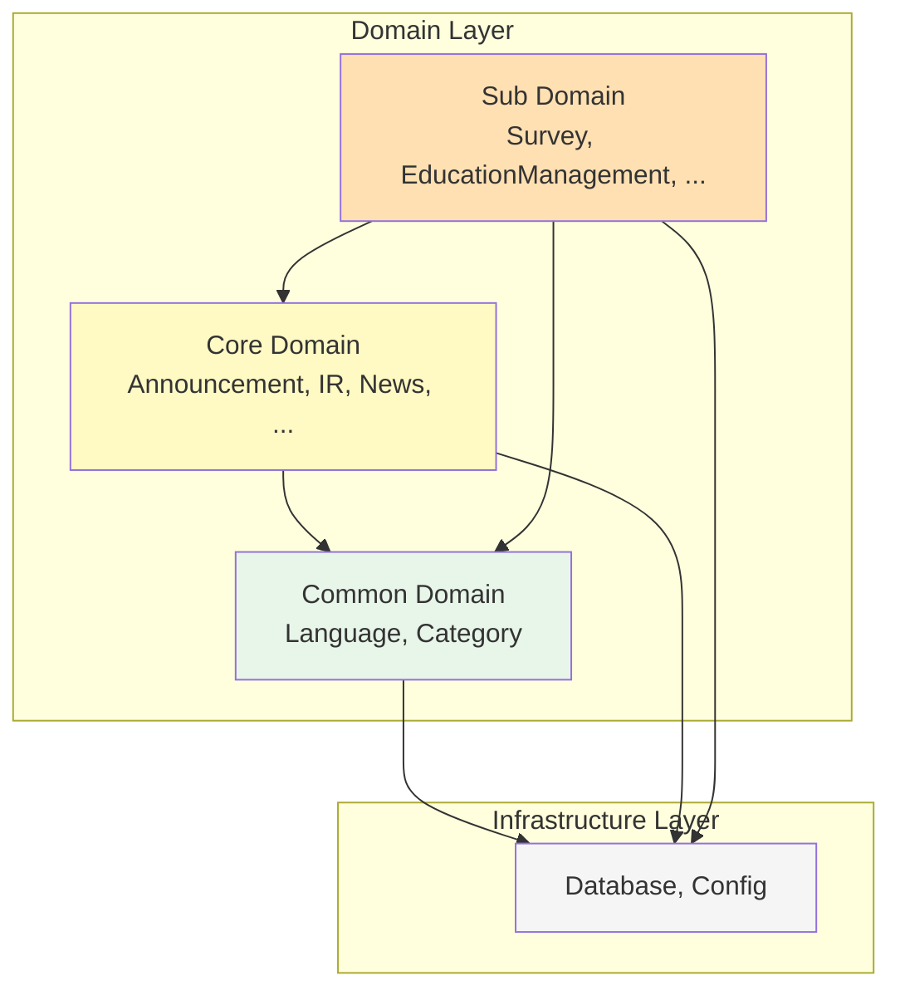

# Domain Layer (도메인 계층)

## 📋 개요

Domain Layer는 비즈니스 로직과 엔티티를 관리하는 핵심 계층입니다.
Domain-Driven Design(DDD) 원칙에 따라 **Common**, **Core**, **Sub** 도메인으로 구분됩니다.

## 🏗️ 도메인 구조

```
domain/
├── common/          # 공통 도메인 - 시스템 전반 공유 엔티티
│   ├── entities/
│   ├── enums/
│   ├── index.ts
│   └── README.md
├── core/            # 핵심 도메인 - 핵심 비즈니스 로직
│   ├── entities/
│   ├── enums/
│   ├── index.ts
│   └── README.md
├── sub/             # 부가 도메인 - 부가 지원 기능
│   ├── entities/
│   ├── enums/
│   ├── index.ts
│   └── README.md
├── index.ts         # 도메인 전체 내보내기
└── README.md        # 이 파일
```

## 🎯 도메인 분류

### 1️⃣ Common Domain (공통 도메인)

**책임**: 시스템 전반에서 공유되는 공통 엔티티

**포함 엔티티**:
- **Language** - 다국어 지원 (ko, en, ja, zh)
- **Category** - 통합 카테고리 관리
- **CategoryMapping** - 엔티티-카테고리 다대다 관계

**특징**:
- ✅ 다른 도메인에 의존하지 않음 (독립적)
- ✅ 모든 도메인에서 참조 가능
- ✅ 높은 재사용성

📖 **상세 문서**: [common/README.md](./common/README.md)

---

### 2️⃣ Core Domain (핵심 비즈니스 도메인)

**책임**: 회사의 핵심 비즈니스 기능

**포함 엔티티**:
- **ShareholdersMeeting** ✨ - 주주총회 정보 (다국어)
  - VoteResult - 의결 결과 (다국어)
- **ElectronicDisclosure** ✨ - 전자공시 (다국어)
- **IR** ✨ - 투자자 정보 (다국어)
- **Brochure** ✨ - 브로슈어 (다국어)
- **News** - 언론 보도
- **Announcement** - 내부 공지사항
  - AnnouncementRead - 읽음 표시 (Lazy Creation)

**특징**:
- ✅ Common Domain 의존
- ❌ Sub Domain 의존 불가
- ✅ 다국어 지원 엔티티 다수
- ✅ Lazy Creation 패턴 적용 (Announcement)

📖 **상세 문서**: [core/README.md](./core/README.md)

---

### 3️⃣ Sub Domain (부가 기능 도메인)

**책임**: 핵심 비즈니스를 지원하는 부가 기능

**포함 엔티티**:
- **MainPopup** ✨ - 메인 팝업 (다국어)
- **LumirStory** - 회사 스토리
- **VideoGallery** - 비디오 콘텐츠
- **Survey** - 설문조사 시스템 (Announcement 연동)
  - SurveyQuestion - 질문 관리
  - SurveyResponse* - 타입별 응답 테이블 7개
  - SurveyCompletion - 완료 추적
- **EducationManagement** - 교육 관리
  - Attendee - 수강자 정보
- **WikiFileSystem** - 문서/파일 관리 (계층 구조)
  - WikiFileSystemClosure - Closure Table
  - WikiPermissionLog - 권한 무효화 추적

**특징**:
- ✅ Common Domain 의존
- ✅ Core Domain 의존 (Survey → Announcement)
- ✅ 타입별 응답 테이블 분리 (Survey)
- ✅ Closure Table 패턴 (WikiFileSystem)

📖 **상세 문서**: [sub/README.md](./sub/README.md)

---

## 🔗 도메인 간 의존성 규칙



### 의존성 원칙

| 도메인 | 의존 가능 | 의존 불가 |
|--------|----------|----------|
| **Common** | Infrastructure | Core, Sub |
| **Core** | Common, Infrastructure | Sub |
| **Sub** | Common, Core, Infrastructure | - |

### 예시 코드

#### ✅ 올바른 의존성

```typescript
// Core Domain → Common Domain
// shareholders-meeting.entity.ts
import { Language } from '@domain/common';
import { Category } from '@domain/common';

@Entity()
export class ShareholdersMeeting {
  @ManyToOne(() => Language)
  language: Language;
}
```

```typescript
// Sub Domain → Core Domain
// survey.entity.ts
import { Announcement } from '@domain/core';

@Entity()
export class Survey {
  @OneToOne(() => Announcement)
  announcement: Announcement;
}
```

#### ❌ 잘못된 의존성

```typescript
// Common Domain → Core Domain (불가능!)
// category.entity.ts
import { Announcement } from '@domain/core'; // ❌

@Entity()
export class Category {
  // Common은 Core를 참조할 수 없음!
}
```

```typescript
// Core Domain → Sub Domain (불가능!)
// announcement.entity.ts
import { Survey } from '@domain/sub'; // ❌

@Entity()
export class Announcement {
  // Core는 Sub를 참조할 수 없음!
  // Survey가 Announcement를 참조해야 함 (역방향)
}
```

---

## 📊 도메인별 엔티티 개수

| 도메인 | 엔티티 수 | 다국어 지원 | 비고 |
|--------|----------|------------|------|
| **Common** | 3개 | - | Language, Category, CategoryMapping |
| **Core** | 12개 | 5개 | ShareholdersMeeting, IR, Brochure 등 |
| **Sub** | 18개 | 1개 | Survey 관련 8개, WikiFileSystem 관련 3개 |
| **전체** | **33개** | **6개** | - |

---

## ✅ 주요 설계 패턴

### 1. 다국어 지원 (Translation Pattern)
- **번역 테이블**: 언어별 콘텐츠를 별도 테이블로 관리
- **Fallback 전략**: 요청 언어 → 한국어(기본) → 영어 → 첫 번째 사용 가능한 번역
- **지원 엔티티**: MainPopup, ShareholdersMeeting, VoteResult, ElectronicDisclosure, IR, Brochure

```typescript
@Entity()
export class ShareholdersMeeting {
  @OneToMany(() => ShareholdersMeetingTranslation)
  translations: ShareholdersMeetingTranslation[];
}

@Entity()
export class ShareholdersMeetingTranslation {
  @ManyToOne(() => ShareholdersMeeting)
  shareholdersMeeting: ShareholdersMeeting;
  
  @ManyToOne(() => Language)
  language: Language;
  
  @Column()
  title: string;
  
  @Column('text')
  content: string;
}
```

### 2. Lazy Creation Pattern
- **AnnouncementRead**: 직원이 읽을 때만 레코드 생성
- **장점**: 확장성 대폭 향상, 배치 처리 불필요

```typescript
// 읽음 처리 시점에만 레코드 생성
const read = await this.announcementReadRepository.findOne({
  where: { announcementId, employeeId }
});

if (!read) {
  await this.announcementReadRepository.save({
    announcementId,
    employeeId,
    readAt: new Date()
  });
}
```

### 3. Closure Table Pattern
- **WikiFileSystemClosure**: 조상-자손 관계 미리 저장
- **장점**: 재귀 쿼리 불필요, 조회 성능 극대화

```typescript
@Entity()
export class WikiFileSystemClosure {
  @PrimaryColumn('uuid')
  ancestor: string; // 조상 노드 ID
  
  @PrimaryColumn('uuid')
  descendant: string; // 자손 노드 ID
  
  @Column('int')
  depth: number; // 0=자기자신, 1=직접자식, 2=손자...
}
```

### 4. 타입별 응답 테이블 분리 (Survey)
- **7개 응답 테이블**: 질문 타입별 최적화
- **장점**: 통계 쿼리 성능 10배 이상 향상, 타입 안전성 보장

```typescript
// 질문 타입에 따라 적절한 응답 테이블 사용
SurveyResponseText         // 단답형, 장문형
SurveyResponseChoice       // 객관식, 드롭다운
SurveyResponseCheckbox     // 체크박스
SurveyResponseScale        // 선형 척도
SurveyResponseGrid         // 그리드 척도
SurveyResponseFile         // 파일 업로드
SurveyResponseDatetime     // 날짜/시간
```

### 5. 통합 카테고리 관리
- **단일 Category 테이블**: 모든 도메인의 카테고리를 하나로 관리
- **CategoryMapping**: 엔티티-카테고리 간 다대다 관계

```typescript
@Entity()
export class Category {
  @Column({
    type: 'enum',
    enum: CategoryEntityType
  })
  entityType: CategoryEntityType; // announcement, news, survey, ...
}

@Entity()
export class CategoryMapping {
  @Column('uuid')
  entityId: string; // 다형성: 어떤 엔티티든 참조 가능
  
  @ManyToOne(() => Category)
  category: Category;
}
```

---

## 🔒 공통 필드 (Base Entity)

모든 엔티티는 다음 공통 필드를 포함합니다:

```typescript
export abstract class BaseEntity {
  @PrimaryGeneratedColumn('uuid')
  id: string;

  @CreateDateColumn()
  createdAt: Date;

  @UpdateDateColumn()
  updatedAt: Date;

  @DeleteDateColumn({ nullable: true })
  deletedAt: Date | null; // Soft Delete

  @Column('uuid', { nullable: true })
  createdBy: string | null; // 외부 시스템 직원 ID (SSO)

  @Column('uuid', { nullable: true })
  updatedBy: string | null; // 외부 시스템 직원 ID (SSO)

  @VersionColumn()
  version: number; // Optimistic Locking
}
```

**특징**:
- **Soft Delete**: `deletedAt` 필드로 논리 삭제
- **Optimistic Locking**: `version` 필드로 동시성 제어
- **Audit Fields**: 생성자/수정자 추적 (외부 SSO 연동)

---

## 📝 Enum 타입 요약

### Common Domain
- **LanguageCode**: ko, en, ja, zh
- **CategoryEntityType**: announcement, main_popup, shareholders_meeting, ...

### Core Domain
- **ContentStatus**: draft, approved, under_review, rejected, opened
- **VoteResultType**: accepted, rejected

### Sub Domain
- **InqueryType**: short_answer, paragraph, multiple_choice, ...
- **EducationStatus**: scheduled, in_progress, completed, cancelled, postponed
- **AttendeeStatus**: pending, in_progress, completed, overdue
- **WikiFileSystemType**: folder, file
- **WikiPermissionAction**: detected, removed, notified, resolved

---

## 🚀 사용 예시

### 1. 엔티티 가져오기

```typescript
// Common Domain
import { Language, Category, CategoryMapping } from '@domain/common';

// Core Domain
import { 
  Announcement, 
  AnnouncementRead,
  ShareholdersMeeting,
  VoteResult,
  IR,
  News
} from '@domain/core';

// Sub Domain
import { 
  Survey, 
  SurveyQuestion,
  EducationManagement,
  WikiFileSystem 
} from '@domain/sub';
```

### 2. Enum 가져오기

```typescript
// Common
import { LanguageCode, CategoryEntityType } from '@domain/common';

// Core
import { ContentStatus, VoteResultType } from '@domain/core';

// Sub
import { InqueryType, EducationStatus } from '@domain/sub';
```

### 3. 도메인 전체 가져오기

```typescript
import { 
  CommonDomain,
  CoreDomain,
  SubDomain 
} from '@domain';
```

---

## 📚 참고 문서

- **[ER 다이어그램](../../docs/erd/er-diagram.md)** - 전체 시스템 ERD
- **[엔티티 상세](../../docs/erd/er-diagram-entities.md)** - 각 엔티티별 상세 정보
- **[데이터베이스 구현](../../docs/erd/er-diagram-database.md)** - JSONB 구조, 인덱스, 제약조건

---

**문서 생성일**: 2026년 1월 8일  
**버전**: v1.0
