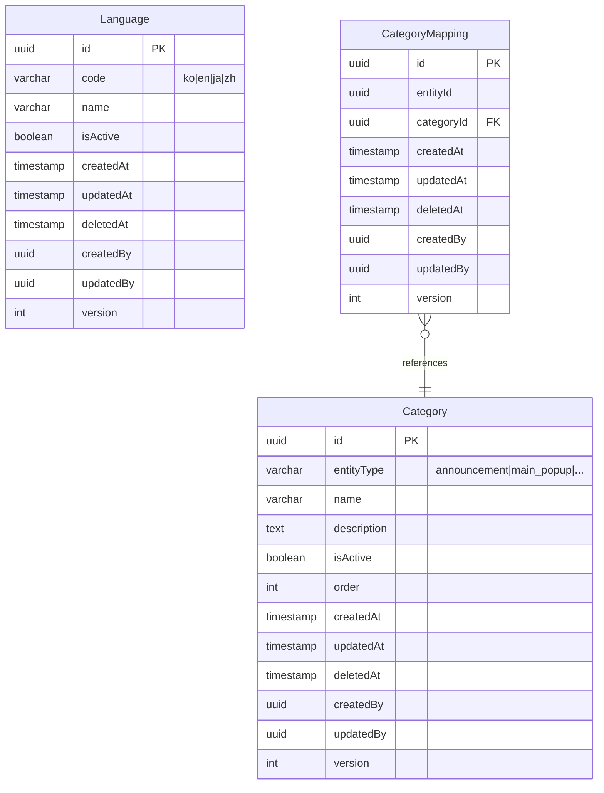

# Common Domain (공통 도메인)

## 📋 개요

시스템 전반에서 공유되는 공통 엔티티를 관리합니다. 
다른 도메인(Core, Sub)에서 참조할 수 있지만, Common Domain은 다른 도메인을 참조할 수 없습니다.

## 🎯 책임

- 다국어 지원 (Language)
- 통합 카테고리 관리 (Category, CategoryMapping)
- 시스템 전반의 공통 기능 제공

## 📦 포함된 엔티티

### 1. Language (언어 관리)
- 다국어 지원을 위한 언어 정보
- 지원 언어: 한국어(ko), 영어(en), 일본어(ja), 중국어(zh)

### 2. Category (카테고리)
- 모든 도메인에서 공유하는 통합 카테고리
- `entityType` 필드로 도메인 구분
- 지원 엔티티: announcement, main_popup, shareholders_meeting, electronic_disclosure, ir, brochure, lumir_story, video_gallery, news, education_management

### 3. CategoryMapping (카테고리 매핑)
- 엔티티와 카테고리 간 다대다 관계 관리
- 정규화된 구조로 유연한 카테고리 할당

## 🔗 의존성

### 외부 의존성
- Infrastructure Layer (Database, Config)

### 의존 받는 도메인
- ✅ Core Domain
- ✅ Sub Domain

## 📊 Enum 타입

### LanguageCode
```typescript
enum LanguageCode {
  KOREAN = 'ko',    // 한국어
  ENGLISH = 'en',   // 영어
  JAPANESE = 'ja',  // 일본어
  CHINESE = 'zh'    // 중국어
}
```

### CategoryEntityType
```typescript
enum CategoryEntityType {
  ANNOUNCEMENT = 'announcement',
  MAIN_POPUP = 'main_popup',
  SHAREHOLDERS_MEETING = 'shareholders_meeting',
  ELECTRONIC_DISCLOSURE = 'electronic_disclosure',
  IR = 'ir',
  BROCHURE = 'brochure',
  LUMIR_STORY = 'lumir_story',
  VIDEO_GALLERY = 'video_gallery',
  NEWS = 'news',
  EDUCATION_MANAGEMENT = 'education_management'
}
```

## 📐 ERD



## 🏗️ 디렉토리 구조

```
common/
├── entities/              # 엔티티 정의
│   ├── language.entity.ts
│   ├── category.entity.ts
│   └── category-mapping.entity.ts
├── enums/                 # Enum 타입
│   ├── language-code.enum.ts
│   └── category-entity-type.enum.ts
├── index.ts              # 공통 도메인 내보내기
└── README.md             # 이 파일
```

## 📝 사용 예시

### 다국어 지원
```typescript
// Core Domain에서 Language 참조
@ManyToOne(() => Language)
languageId: Language;
```

### 카테고리 매핑
```typescript
// Core/Sub Domain 엔티티에서 CategoryMapping 사용
@OneToMany(() => CategoryMapping, mapping => mapping.entityId)
categoryMappings: CategoryMapping[];
```

## ✅ 주요 특징

1. **도메인 독립성**: 다른 도메인에 의존하지 않음
2. **재사용성**: 모든 도메인에서 활용 가능
3. **통합 관리**: 단일 Category 테이블로 모든 카테고리 관리
4. **확장성**: 새로운 엔티티 타입 추가 용이

---

**문서 생성일**: 2026년 1월 8일
