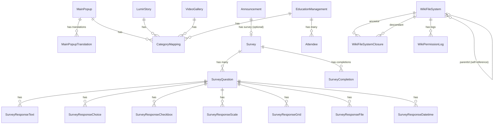

# Sub Domain (부가 기능 도메인)

## 📋 개요

핵심 비즈니스를 지원하는 부가 기능을 담당하는 도메인입니다.
메인 팝업, 회사 스토리, 비디오 갤러리, 설문조사, 교육 관리, 위키 파일 시스템 등을 관리합니다.

## 🎯 책임

- 사용자 경험 향상 (MainPopup, LumirStory, VideoGallery)
- 내부 커뮤니케이션 강화 (Survey)
- 교육 및 지식 관리 (EducationManagement, WikiFileSystem)

## 📦 포함된 엔티티

### 1. MainPopup (메인 팝업)
- 메인 페이지 팝업 관리
- **다국어 지원**: ✅ (MainPopupTranslation)

### 2. LumirStory (루미르 스토리)
- 회사 스토리 및 콘텐츠
- **다국어 지원**: ❌

### 3. VideoGallery (비디오 갤러리)
- 비디오 콘텐츠 관리
- **다국어 지원**: ❌

### 4. Survey (설문조사)
- 공지사항 연동 설문조사 시스템
- **다국어 지원**: ❌
- **의존성**: Announcement (Core Domain)
- **관련 엔티티**: 
  - SurveyQuestion (설문 질문)
  - SurveyResponse* (타입별 응답 테이블 7개)
  - SurveyCompletion (완료 여부 추적)

#### SurveyQuestion (설문 질문)
- 질문 타입별 동적 폼 관리
- **지원 타입**: 단답형, 장문형, 객관식, 드롭다운, 체크박스, 파일 업로드, 날짜/시간, 선형 척도, 그리드 척도

#### 타입별 응답 테이블
- **SurveyResponseText**: 단답형, 장문형
- **SurveyResponseChoice**: 객관식, 드롭다운
- **SurveyResponseCheckbox**: 체크박스 (다중 선택, Hard Delete)
- **SurveyResponseScale**: 선형 척도
- **SurveyResponseGrid**: 그리드 척도
- **SurveyResponseFile**: 파일 업로드
- **SurveyResponseDatetime**: 날짜/시간

#### SurveyCompletion (설문 완료 추적)
- 직원별 설문 완료 여부 관리

### 5. EducationManagement (교육 관리)
- 직원 교육 및 수강 관리
- **다국어 지원**: ❌
- **관련 엔티티**: Attendee (수강자)

#### Attendee (수강자)
- 교육별 수강자 정보 및 완료 상태

### 6. WikiFileSystem (위키 파일 시스템)
- 문서 및 파일 관리 (계층 구조)
- **다국어 지원**: ❌
- **관련 엔티티**: 
  - WikiFileSystemClosure (계층 구조 최적화)
  - WikiPermissionLog (권한 무효화 추적)

#### WikiFileSystemClosure (Closure Table)
- 조상-자손 관계 미리 저장 (조회 성능 최적화)
- 재귀 쿼리 불필요

#### WikiPermissionLog (권한 로그)
- 외부 시스템(SSO) 부서/직급/직책 코드 제거 시 이력 추적

## 🔗 의존성

### 내부 의존성
- ✅ Common Domain (Language, Category, CategoryMapping)
- ✅ Core Domain (Announcement - Survey가 의존)

### 외부 의존성
- Infrastructure Layer (Database, Config)

### 의존 받는 도메인
- ❌ 없음 (최상위 도메인)

## 📊 Enum 타입

### InqueryType (설문 질문 타입)
```typescript
enum InqueryType {
  SHORT_ANSWER = 'short_answer',       // 단답형
  PARAGRAPH = 'paragraph',             // 장문형
  MULTIPLE_CHOICE = 'multiple_choice', // 객관식
  DROPDOWN = 'dropdown',               // 드롭다운
  CHECKBOXES = 'checkboxes',           // 체크박스
  FILE_UPLOAD = 'file_upload',         // 파일 업로드
  DATETIME = 'datetime',               // 날짜/시간
  LINEAR_SCALE = 'linear_scale',       // 선형 척도
  GRID_SCALE = 'grid_scale'            // 그리드 척도
}
```

### EducationStatus (교육 상태)
```typescript
enum EducationStatus {
  SCHEDULED = 'scheduled',       // 예정됨
  IN_PROGRESS = 'in_progress',   // 진행 중
  COMPLETED = 'completed',       // 완료됨
  CANCELLED = 'cancelled',       // 취소됨
  POSTPONED = 'postponed'        // 연기됨
}
```

### AttendeeStatus (수강 상태)
```typescript
enum AttendeeStatus {
  PENDING = 'pending',         // 대기중
  IN_PROGRESS = 'in_progress', // 진행중
  COMPLETED = 'completed',     // 완료
  OVERDUE = 'overdue'          // 기한 초과
}
```

### WikiFileSystemType (파일 시스템 타입)
```typescript
enum WikiFileSystemType {
  FOLDER = 'folder',  // 폴더
  FILE = 'file'       // 파일
}
```

### WikiPermissionAction (권한 로그 액션)
```typescript
enum WikiPermissionAction {
  DETECTED = 'detected',   // 감지됨
  REMOVED = 'removed',     // 자동 제거됨
  NOTIFIED = 'notified',   // 관리자 통보됨
  RESOLVED = 'resolved'    // 수동 해결됨
}
```

## 📐 ERD 요약



## 🏗️ 디렉토리 구조

```
sub/
├── entities/                                    # 엔티티 정의
│   ├── main-popup/
│   │   ├── main-popup.entity.ts
│   │   └── main-popup-translation.entity.ts
│   ├── lumir-story/
│   │   └── lumir-story.entity.ts
│   ├── video-gallery/
│   │   └── video-gallery.entity.ts
│   ├── survey/
│   │   ├── survey.entity.ts
│   │   ├── survey-question.entity.ts
│   │   ├── survey-completion.entity.ts
│   │   └── responses/
│   │       ├── survey-response-text.entity.ts
│   │       ├── survey-response-choice.entity.ts
│   │       ├── survey-response-checkbox.entity.ts
│   │       ├── survey-response-scale.entity.ts
│   │       ├── survey-response-grid.entity.ts
│   │       ├── survey-response-file.entity.ts
│   │       └── survey-response-datetime.entity.ts
│   ├── education-management/
│   │   ├── education-management.entity.ts
│   │   └── attendee.entity.ts
│   └── wiki-file-system/
│       ├── wiki-file-system.entity.ts
│       ├── wiki-file-system-closure.entity.ts
│       └── wiki-permission-log.entity.ts
├── enums/                                       # Enum 타입
│   ├── inquery-type.enum.ts
│   ├── education-status.enum.ts
│   ├── attendee-status.enum.ts
│   ├── wiki-file-system-type.enum.ts
│   └── wiki-permission-action.enum.ts
├── index.ts                                    # 부가 도메인 내보내기
└── README.md                                   # 이 파일
```

## ✅ 주요 특징

### 1. Survey - Announcement 통합
- **의존성**: Survey는 Announcement에 종속
- **상태 관리**: Announcement의 상태를 따름
- **권한 관리**: Announcement의 권한 설정 사용
- **마감일**: Announcement의 마감일 기준으로 제출 제어

### 2. 타입별 설문 응답 테이블 분리
- **7개 응답 테이블**: 질문 타입별 최적화
- **장점**: 통계 쿼리 성능 10배 이상 향상, 타입 안전성 보장
- **Hard Delete**: SurveyResponseCheckbox는 선택 취소 시 레코드 완전 삭제

### 3. WikiFileSystem 계층 구조
- **Closure Table**: 조상-자손 관계 미리 저장
- **depth 필드**: 계층 깊이 캐싱
- **성능 최적화**: 재귀 쿼리 불필요, 조회 성능 극대화
- **자기 참조**: parentId를 통한 트리 구조

### 4. WikiPermissionLog
- **권한 무효화 추적**: SSO 시스템 코드 변경 시 이력 관리
- **스냅샷 보관**: 권한 설정 변경 전/후 비교 가능
- **문제 해결 추적**: 감지 → 제거 → 통보 → 해결 프로세스

### 5. 공통 필드
- **Soft Delete**: `deletedAt` 필드로 논리 삭제 (WikiFileSystemClosure, SurveyResponseCheckbox 제외)
- **Optimistic Locking**: `version` 필드로 동시성 제어
- **Audit Fields**: `createdAt`, `updatedAt`, `createdBy`, `updatedBy`
- **Order Field**: 정렬 순서 관리

## 📝 의존성 규칙

```
✅ Sub Domain → Core Domain (O) - Survey가 Announcement 의존
✅ Sub Domain → Common Domain (O)
❌ Sub Domain ← Core Domain (X)
```

### 예시
```typescript
// ✅ 올바른 의존성 (Sub → Core)
import { Announcement } from '@domain/core';

// ✅ 올바른 의존성 (Sub → Common)
import { Language } from '@domain/common';
import { Category } from '@domain/common';

// ❌ 잘못된 의존성 (Core → Sub)
// announcement.entity.ts에서
import { Survey } from '@domain/sub'; // 불가능!
```

---

**문서 생성일**: 2026년 1월 8일
